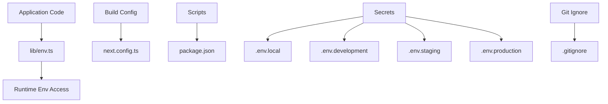
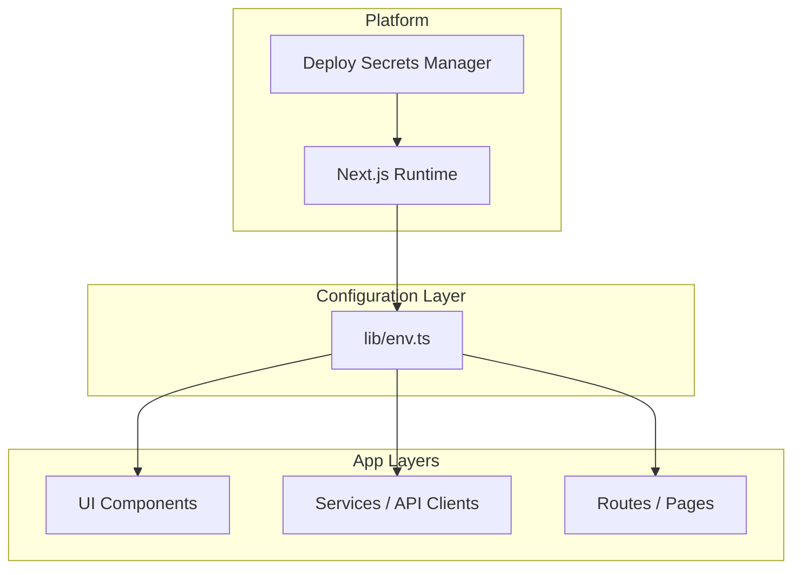
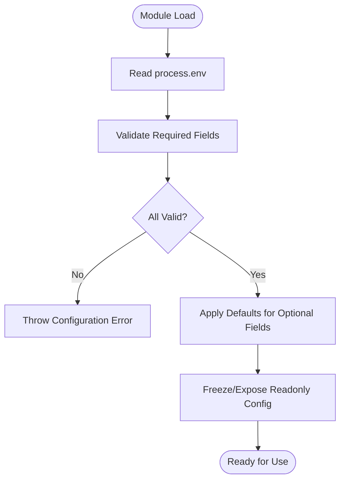
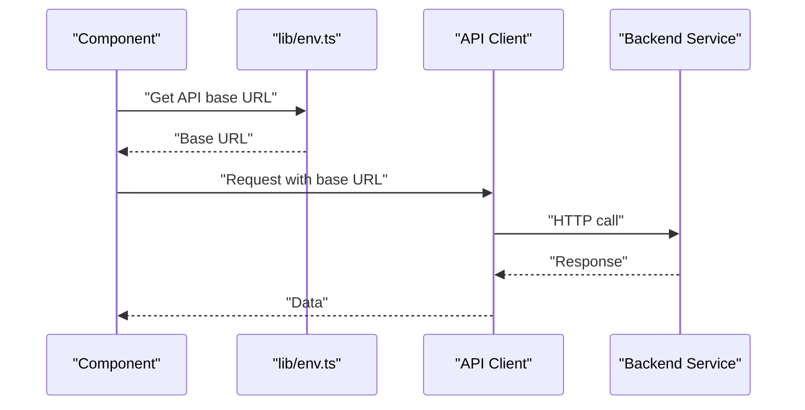
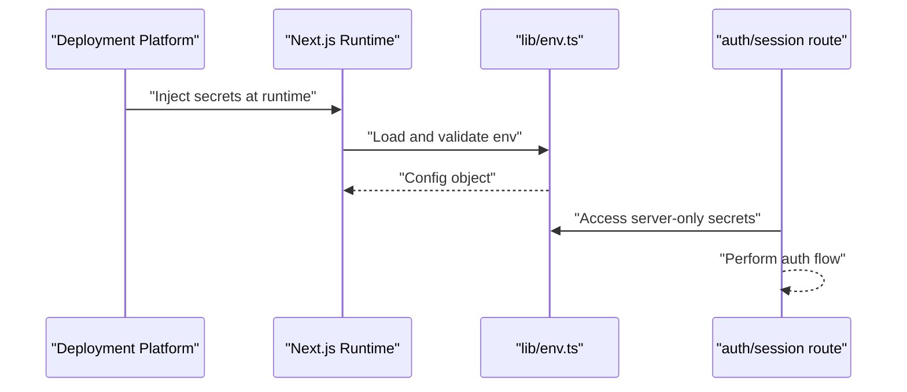
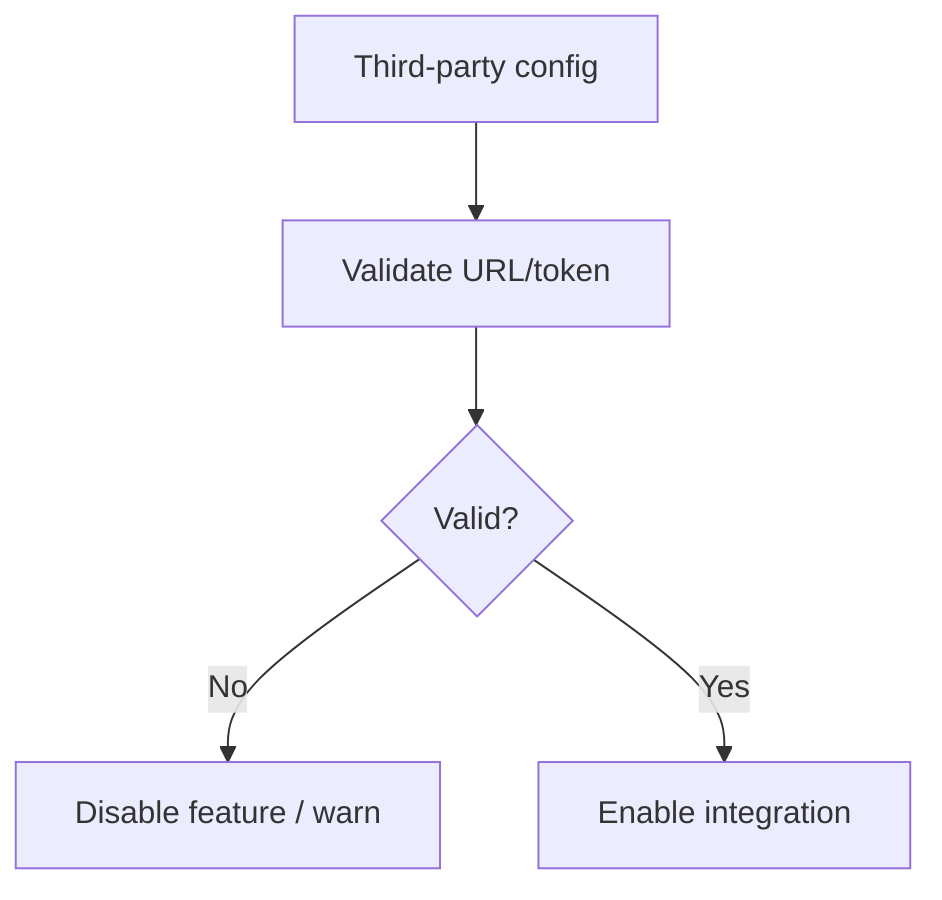
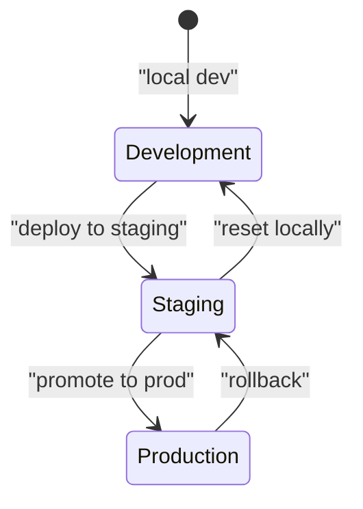
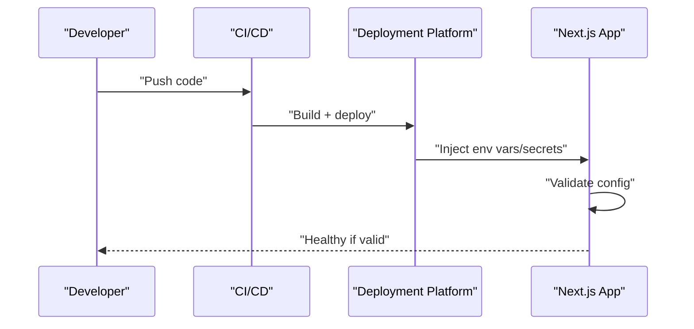
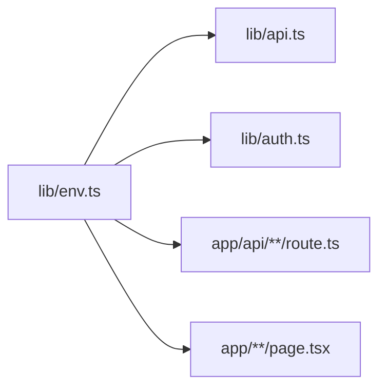

# Environment Management

<cite>
**Referenced Files in This Document**
- [env.ts](file://lib/env.ts)
- [next.config.ts](file://next.config.ts)
- [package.json](file://package.json)
- [.gitignore](file://.gitignore)
</cite>

## Table of Contents
1. [Introduction](#introduction)
2. [Project Structure](#project-structure)
3. [Core Components](#core-components)
4. [Architecture Overview](#architecture-overview)
5. [Detailed Component Analysis](#detailed-component-analysis)
6. [Dependency Analysis](#dependency-analysis)
7. [Performance Considerations](#performance-considerations)
8. [Troubleshooting Guide](#troubleshooting-guide)
9. [Conclusion](#conclusion)

## Introduction

This document provides comprehensive guidance for managing environment variables and configuration in the Automex frontend application. It explains how to organize, validate, and securely handle environment-specific settings across development, staging, and production environments. The focus is on type safety, validation, default values, API endpoint configuration, authentication secrets, third-party credentials, and deployment-time injection.

## Project Structure

Environment-related files are organized under lib/env.ts for centralized configuration, with build-time and runtime configuration managed via Next.js conventions and package scripts.

[No sources needed since this diagram shows conceptual workflow, not actual code structure]

**Section sources**
- [env.ts](file://lib/env.ts)
- [next.config.ts](file://next.config.ts)
- [package.json](file://package.json)
- [.gitignore](file://.gitignore)

## Core Components

- Centralized environment configuration module:
  - Provides typed accessors for all required and optional environment variables.
  - Validates presence and types at startup or first access.
  - Supplies safe defaults for non-sensitive options.
  - Exposes a single source of truth for API endpoints, feature flags, and third-party service URLs.

- Build-time vs runtime configuration:
  - Runtime-only variables (e.g., secrets) should be injected at deploy time and never baked into the client bundle.
  - Client-accessible variables must be explicitly exposed via Next.js public env pattern.

- Environment switching:
  - Use environment names (development, staging, production) to select appropriate base URLs, keys, and toggles.
  - Prefer container orchestration or platform secret managers to inject correct .env.* content per environment.

Security best practices:
- Never commit secrets to version control; ensure .env* files are ignored.
- Validate required variables early and fail fast with clear messages.
- Avoid logging sensitive values.
- Rotate secrets regularly and limit exposure scope.

**Section sources**
- [env.ts](file://lib/env.ts)
- [next.config.ts](file://next.config.ts)
- [package.json](file://package.json)
- [.gitignore](file://.gitignore)

## Architecture Overview

The configuration architecture centers on a single module that reads process.env, validates inputs, and exposes strongly-typed getters. Other modules import from this module rather than accessing process.env directly.

[No sources needed since this diagram shows conceptual workflow, not actual code structure]

## Detailed Component Analysis

### Centralized Configuration Module (lib/env.ts)

Responsibilities:
- Define an interface describing all expected environment variables.
- Provide a function to load and validate environment variables.
- Export typed getters for use throughout the app.
- Supply sensible defaults for non-secret fields.
- Throw descriptive errors when required variables are missing or invalid.

Recommended design patterns:
- Single responsibility: only environment loading/validation lives here.
- Fail-fast: surface configuration errors immediately during initialization.
- Type safety: leverage TypeScript interfaces and runtime checks to guarantee correctness.
- Immutability: expose readonly objects or getters to prevent accidental mutation.

Example responsibilities mapped to code locations:
- Interface definitions and default values: [env.ts](file://lib/env.ts)
- Validation logic and error handling: [env.ts](file://lib/env.ts)
- Public exports consumed by other modules: [env.ts](file://lib/env.ts)

[No sources needed since this diagram shows conceptual workflow, not actual code structure]

**Section sources**
- [env.ts](file://lib/env.ts)

### API Endpoint Configuration

Guidelines:
- Maintain a single base URL per environment.
- Keep paths relative to the base URL where possible.
- For SSR-safe usage, prefer server-side fetching or API routes that proxy to backend services.
- Ensure client-only calls do not leak secrets.

Implementation pointers:
- Base URL selection by environment: [env.ts](file://lib/env.ts)
- Usage in API clients/services: [api.ts](file://lib/api.ts)

**Section sources**
- [env.ts](file://lib/env.ts)
- [api.ts](file://lib/api.ts)

### Authentication Secrets Management

Guidelines:
- Store secrets (tokens, private keys, OAuth client secrets) exclusively in runtime secrets.
- Do not prefix secrets with NEXT_PUBLIC_; they must remain server-only.
- Validate presence and format at startup.
- Rotate secrets without redeploying the entire app if supported by your platform.

Implementation pointers:
- Secret validation and exposure to server-only code: [env.ts](file://lib/env.ts)
- Server route usage of secrets: [route.ts](file://app/api/auth/session/route.ts)

**Section sources**
- [env.ts](file://lib/env.ts)
- [route.ts](file://app/api/auth/session/route.ts)

### Third-Party Service Credentials

Guidelines:
- Group related credentials (e.g., analytics, email, payments) under consistent prefixes.
- Validate formats (URLs, IDs, tokens).
- Provide fallbacks or feature flags to disable integrations gracefully in local dev.

Implementation pointers:
- Credential validation and defaults: [env.ts](file://lib/env.ts)
- Feature flag usage in components/pages: [page.tsx](file://app/[locale]/(routes)/services/page.tsx), [page.tsx](file://app/[locale]/(routes)/about/page.tsx)

[No sources needed since this diagram shows conceptual workflow, not actual code structure]

**Section sources**
- [env.ts](file://lib/env.ts)
- [page.tsx](file://app/[locale]/(routes)/services/page.tsx)
- [page.tsx](file://app/[locale]/(routes)/about/page.tsx)

### Environment-Specific Configuration Strategy

Recommendations:
- Use separate .env files per environment (.env.development, .env.staging, .env.production).
- Keep .env.local for developer overrides; ensure it is gitignored.
- Select environment via platform configuration or CI/CD variables.
- Centralize environment name resolution in the configuration module.

Implementation pointers:
- Environment detection and selection: [env.ts](file://lib/env.ts)
- Build-time/public variables (if any): [next.config.ts](file://next.config.ts)

[No sources needed since this diagram shows conceptual workflow, not actual code structure]

**Section sources**
- [env.ts](file://lib/env.ts)
- [next.config.ts](file://next.config.ts)

### Deployment-Time Configuration Injection

Guidelines:
- Inject secrets via platform secret managers (e.g., Vercel, Docker, Kubernetes).
- Avoid baking secrets into images or artifacts.
- Validate configuration before serving traffic.

Implementation pointers:
- Runtime-only variables and validation: [env.ts](file://lib/env.ts)
- Scripts to run pre-deploy checks: [package.json](file://package.json)

[No sources needed since this diagram shows conceptual workflow, not actual code structure]

**Section sources**
- [env.ts](file://lib/env.ts)
- [package.json](file://package.json)

## Dependency Analysis

The configuration module is a leaf dependency: many parts of the app depend on it, but it depends only on the runtime environment.

**Section sources**
- [env.ts](file://lib/env.ts)
- [api.ts](file://lib/api.ts)
- [auth.ts](file://lib/auth.ts)
- [route.ts](file://app/api/auth/session/route.ts)
- [page.tsx](file://app/[locale]/(routes)/services/page.tsx)

## Performance Considerations

- Keep configuration small and immutable to avoid unnecessary re-renders.
- Avoid heavy computations in the configuration module; defer to lazy initialization if needed.
- Minimize network calls during startup; rely on validated local configuration.
- Use environment-specific builds only when necessary; prefer runtime toggles for features.

[No sources needed since this section provides general guidance]

## Troubleshooting Guide

Common issues and resolutions:
- Missing required variables:
  - Symptom: Application fails to start or throws configuration errors.
  - Action: Verify all required variables are present in the active environment.
  - Reference: [env.ts](file://lib/env.ts)

- Accidentally exposing secrets to the client:
  - Symptom: Secrets appear in browser devtools.
  - Action: Remove NEXT_PUBLIC_ prefix from secrets; move them to server-only code.
  - Reference: [env.ts](file://lib/env.ts), [route.ts](file://app/api/auth/session/route.ts)

- Incorrect base URL or endpoints:
  - Symptom: Network requests go to wrong host.
  - Action: Confirm environment selection and base URL configuration.
  - Reference: [env.ts](file://lib/env.ts), [api.ts](file://lib/api.ts)

- Local overrides not taking effect:
  - Symptom: .env.local changes ignored.
  - Action: Restart dev server; ensure .env.local is loaded and not gitignored incorrectly.
  - Reference: [.gitignore](file://.gitignore)

**Section sources**
- [env.ts](file://lib/env.ts)
- [api.ts](file://lib/api.ts)
- [route.ts](file://app/api/auth/session/route.ts)
- [.gitignore](file://.gitignore)

## Conclusion

A robust environment strategy hinges on centralization, strong typing, strict validation, and secure handling of secrets. By isolating configuration in a dedicated module, enforcing environment-specific behavior, and injecting secrets at deploy time, the application remains secure, predictable, and easy to operate across development, staging, and production.

[No sources needed since this section summarizes without analyzing specific files]