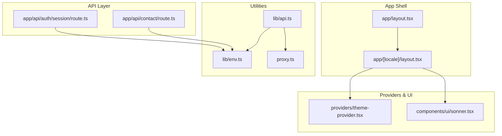
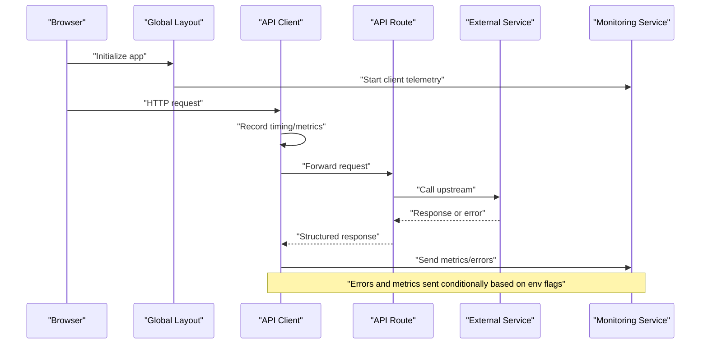
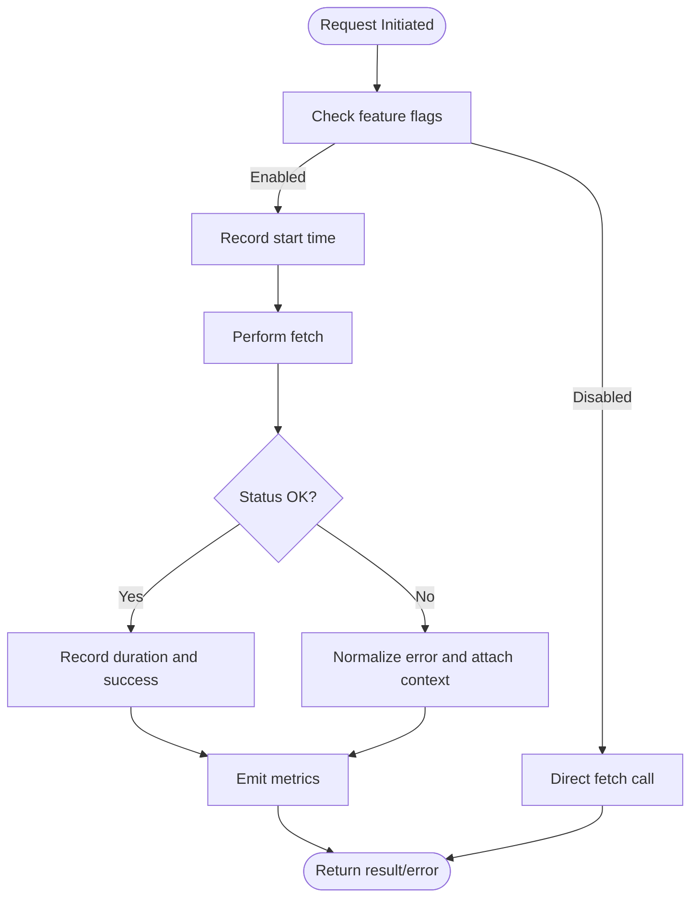
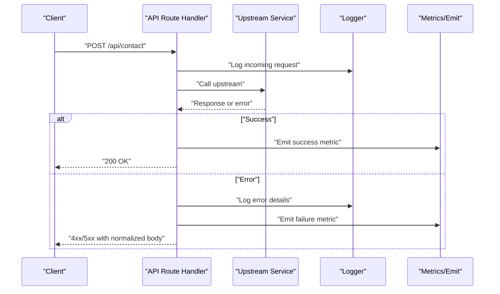
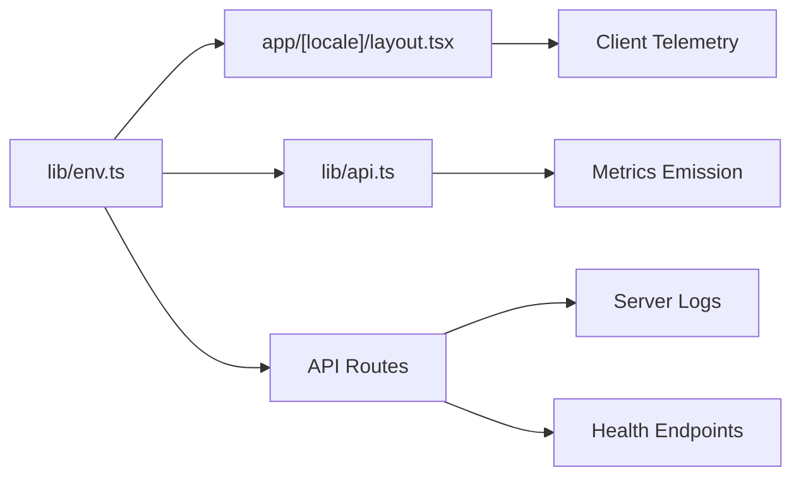

# Monitoring and Production Health

<cite>
**Referenced Files in This Document**
- [package.json](file://package.json)
- [next.config.ts](file://next.config.ts)
- [app/layout.tsx](file://app/layout.tsx)
- [app/[locale]/layout.tsx](file://app/[locale]/layout.tsx)
- [app/api/auth/session/route.ts](file://app/api/auth/session/route.ts)
- [app/api/contact/route.ts](file://app/api/contact/route.ts)
- [lib/env.ts](file://lib/env.ts)
- [lib/api.ts](file://lib/api.ts)
- [providers/theme-provider.tsx](file://providers/theme-provider.tsx)
- [components/ui/sonner.tsx](file://components/ui/sonner.tsx)
- [proxy.ts](file://proxy.ts)
</cite>

## Table of Contents
1. [Introduction](#introduction)
2. [Project Structure](#project-structure)
3. [Core Components](#core-components)
4. [Architecture Overview](#architecture-overview)
5. [Detailed Component Analysis](#detailed-component-analysis)
6. [Dependency Analysis](#dependency-analysis)
7. [Performance Considerations](#performance-considerations)
8. [Troubleshooting Guide](#troubleshooting-guide)
9. [Conclusion](#conclusion)
10. [Appendices](#appendices)

## Introduction
This document provides a comprehensive guide to production monitoring, error tracking, and health checks for the project. It covers logging strategies, error boundaries, user experience monitoring, API endpoint monitoring, performance metrics collection, resource utilization tracking, integration with external services (Sentry, LogRocket, or custom), health check endpoints, graceful degradation patterns, alerting configuration, debugging techniques, log aggregation, incident response procedures, and examples of dashboards and automated health verification.

The guidance is tailored to this Next.js application’s structure and existing runtime utilities, ensuring practical, actionable recommendations that align with current code organization and dependencies.

## Project Structure
The repository follows a feature-based layout under app/, shared components under components/, environment and utility modules under lib/, and provider setup under providers/. Monitoring-related concerns are best addressed by:
- Centralizing environment configuration for service credentials and flags
- Instrumenting global layouts for client-side telemetry
- Adding robust error handling around API routes
- Implementing lightweight health endpoints
- Integrating third-party SDKs via environment-driven toggles

**Diagram sources**
- [app/layout.tsx](file://app/layout.tsx)
- [app/[locale]/layout.tsx](file://app/[locale]/layout.tsx)
- [app/api/auth/session/route.ts](file://app/api/auth/session/route.ts)
- [app/api/contact/route.ts](file://app/api/contact/route.ts)
- [lib/env.ts](file://lib/env.ts)
- [lib/api.ts](file://lib/api.ts)
- [proxy.ts](file://proxy.ts)
- [providers/theme-provider.tsx](file://providers/theme-provider.tsx)
- [components/ui/sonner.tsx](file://components/ui/sonner.tsx)

**Section sources**
- [package.json](file://package.json)
- [next.config.ts](file://next.config.ts)
- [app/layout.tsx](file://app/layout.tsx)
- [app/[locale]/layout.tsx](file://app/[locale]/layout.tsx)
- [app/api/auth/session/route.ts](file://app/api/auth/session/route.ts)
- [app/api/contact/route.ts](file://app/api/contact/route.ts)
- [lib/env.ts](file://lib/env.ts)
- [lib/api.ts](file://lib/api.ts)
- [providers/theme-provider.tsx](file://providers/theme-provider.tsx)
- [components/ui/sonner.tsx](file://components/ui/sonner.tsx)
- [proxy.ts](file://proxy.ts)

## Core Components
- Environment configuration: Centralize all monitoring-related keys (e.g., Sentry DSN, LogRocket ID, feature flags) to enable/disable integrations per environment.
- Global layout instrumentation: Initialize client-side telemetry once at app shell level to capture unhandled errors and navigation events.
- API route resilience: Wrap request handlers with try/catch blocks, structured logging, and standardized error responses.
- Client-side UX feedback: Use toast notifications for non-fatal errors and degraded states.
- Health endpoints: Provide simple GET endpoints for liveness/readiness probes.

Key implementation touchpoints:
- Environment variables and feature flags: [lib/env.ts](file://lib/env.ts)
- API client wrapper for consistent error handling and metrics: [lib/api.ts](file://lib/api.ts)
- API routes for session and contact: [app/api/auth/session/route.ts](file://app/api/auth/session/route.ts), [app/api/contact/route.ts](file://app/api/contact/route.ts)
- App shell where global initialization occurs: [app/layout.tsx](file://app/layout.tsx), [app/[locale]/layout.tsx](file://app/[locale]/layout.tsx)
- UI feedback layer: [components/ui/sonner.tsx](file://components/ui/sonner.tsx)
- Provider bootstrap: [providers/theme-provider.tsx](file://providers/theme-provider.tsx)

**Section sources**
- [lib/env.ts](file://lib/env.ts)
- [lib/api.ts](file://lib/api.ts)
- [app/api/auth/session/route.ts](file://app/api/auth/session/route.ts)
- [app/api/contact/route.ts](file://app/api/contact/route.ts)
- [app/layout.tsx](file://app/layout.tsx)
- [app/[locale]/layout.tsx](file://app/[locale]/layout.tsx)
- [components/ui/sonner.tsx](file://components/ui/sonner.tsx)
- [providers/theme-provider.tsx](file://providers/theme-provider.tsx)

## Architecture Overview
The monitoring architecture spans client and server layers:
- Client-side: Error boundary and global error handler capture JS exceptions; navigation and interaction events are tracked; network requests are instrumented via the API client.
- Server-side: API routes emit structured logs and metrics; health endpoints expose readiness/liveness; proxy layer can be used for routing and observability.

**Diagram sources**
- [app/[locale]/layout.tsx](file://app/[locale]/layout.tsx)
- [lib/api.ts](file://lib/api.ts)
- [app/api/auth/session/route.ts](file://app/api/auth/session/route.ts)
- [app/api/contact/route.ts](file://app/api/contact/route.ts)
- [lib/env.ts](file://lib/env.ts)

## Detailed Component Analysis

### Environment Configuration and Feature Flags
- Purpose: Centralize monitoring credentials and toggles to control behavior across environments.
- Recommendations:
  - Add keys for Sentry DSN, LogRocket ID, custom backend endpoints, and boolean flags like ENABLE_ERROR_TRACKING, ENABLE_PERF_METRICS, ENABLE_HEALTH_ENDPOINTS.
  - Validate presence of required keys at startup and fail fast in production if critical ones are missing.
  - Expose typed getters to avoid accidental misuse.

Implementation anchors:
- [lib/env.ts](file://lib/env.ts)

**Section sources**
- [lib/env.ts](file://lib/env.ts)

### Global Layout Telemetry Initialization
- Purpose: Bootstrap client-side monitoring once per app lifecycle.
- Responsibilities:
  - Initialize error tracking SDK if enabled.
  - Set up navigation and interaction event listeners.
  - Configure default tags (locale, user context when available).
  - Ensure no-op behavior when disabled.

Implementation anchors:
- [app/[locale]/layout.tsx](file://app/[locale]/layout.tsx)
- [app/layout.tsx](file://app/layout.tsx)

**Section sources**
- [app/[locale]/layout.tsx](file://app/[locale]/layout.tsx)
- [app/layout.tsx](file://app/layout.tsx)

### API Client Instrumentation
- Purpose: Standardize HTTP calls with built-in error handling, retries, timeouts, and metrics emission.
- Responsibilities:
  - Attach request/response timing and status codes.
  - Capture and normalize errors before sending to monitoring services.
  - Respect environment flags to avoid noisy logs in development.
  - Integrate with proxy configuration when needed.

Implementation anchors:
- [lib/api.ts](file://lib/api.ts)
- [proxy.ts](file://proxy.ts)

**Diagram sources**
- [lib/api.ts](file://lib/api.ts)
- [lib/env.ts](file://lib/env.ts)

**Section sources**
- [lib/api.ts](file://lib/api.ts)
- [proxy.ts](file://proxy.ts)
- [lib/env.ts](file://lib/env.ts)

### API Route Resilience and Structured Logging
- Purpose: Ensure server-side handlers are observable and resilient.
- Responsibilities:
  - Wrap each route with try/catch and return standardized JSON errors.
  - Log request metadata (method, path, user id if available) and outcomes.
  - Avoid leaking sensitive data into logs.
  - Integrate with centralized logging pipeline.

Implementation anchors:
- [app/api/auth/session/route.ts](file://app/api/auth/session/route.ts)
- [app/api/contact/route.ts](file://app/api/contact/route.ts)

**Diagram sources**
- [app/api/contact/route.ts](file://app/api/contact/route.ts)
- [app/api/auth/session/route.ts](file://app/api/auth/session/route.ts)

**Section sources**
- [app/api/contact/route.ts](file://app/api/contact/route.ts)
- [app/api/auth/session/route.ts](file://app/api/auth/session/route.ts)

### User Experience Feedback and Non-Fatal Errors
- Purpose: Improve perceived reliability by surfacing actionable messages without crashing the app.
- Responsibilities:
  - Show toast notifications for recoverable errors.
  - Provide retry options where appropriate.
  - Keep messages concise and localized.

Implementation anchors:
- [components/ui/sonner.tsx](file://components/ui/sonner.tsx)
- [providers/theme-provider.tsx](file://providers/theme-provider.tsx)

**Section sources**
- [components/ui/sonner.tsx](file://components/ui/sonner.tsx)
- [providers/theme-provider.tsx](file://providers/theme-provider.tsx)

### Health Check Endpoints
- Purpose: Enable load balancers and orchestrators to probe liveness and readiness.
- Recommendations:
  - Create /healthz for liveness (process is alive).
  - Create /ready for readiness (dependencies healthy).
  - Return minimal payloads with clear status codes.
  - Guard with environment flags to disable in dev if desired.

Implementation anchors:
- [app/api/auth/session/route.ts](file://app/api/auth/session/route.ts)
- [app/api/contact/route.ts](file://app/api/contact/route.ts)
- [lib/env.ts](file://lib/env.ts)

Note: Add new route files under app/api/health/ for dedicated health endpoints following the same pattern as existing routes.

**Section sources**
- [lib/env.ts](file://lib/env.ts)
- [app/api/auth/session/route.ts](file://app/api/auth/session/route.ts)
- [app/api/contact/route.ts](file://app/api/contact/route.ts)

## Dependency Analysis
Monitoring depends on environment configuration and optional third-party SDKs. The diagram below shows how core modules interact with monitoring concerns.

**Diagram sources**
- [lib/env.ts](file://lib/env.ts)
- [app/[locale]/layout.tsx](file://app/[locale]/layout.tsx)
- [lib/api.ts](file://lib/api.ts)
- [app/api/auth/session/route.ts](file://app/api/auth/session/route.ts)
- [app/api/contact/route.ts](file://app/api/contact/route.ts)

**Section sources**
- [lib/env.ts](file://lib/env.ts)
- [app/[locale]/layout.tsx](file://app/[locale]/layout.tsx)
- [lib/api.ts](file://lib/api.ts)
- [app/api/auth/session/route.ts](file://app/api/auth/session/route.ts)
- [app/api/contact/route.ts](file://app/api/contact/route.ts)

## Performance Considerations
- Sampling: For high-volume metrics, sample events (e.g., only 10% of successful requests) to reduce overhead.
- Batching: Batch metrics and logs to minimize network calls.
- Asynchronous emission: Send telemetry asynchronously to avoid blocking critical paths.
- Minimal payloads: Include only essential fields (trace IDs, user IDs, locale, endpoint).
- Graceful fallbacks: If monitoring services are down, degrade gracefully without impacting core functionality.

[No sources needed since this section provides general guidance]

## Troubleshooting Guide
- Verify environment variables: Ensure monitoring credentials exist and are correct in the target environment.
- Check feature flags: Confirm ENABLE_* flags are set appropriately.
- Inspect client console: Look for initialization warnings from monitoring SDKs.
- Review server logs: Correlate request IDs with upstream failures.
- Test health endpoints: Validate /healthz and /ready return expected statuses.
- Reproduce with reduced scope: Disable non-essential features to isolate issues.

**Section sources**
- [lib/env.ts](file://lib/env.ts)
- [app/api/auth/session/route.ts](file://app/api/auth/session/route.ts)
- [app/api/contact/route.ts](file://app/api/contact/route.ts)

## Conclusion
By centralizing configuration, instrumenting the app shell and API client, standardizing route error handling, and exposing health endpoints, the application becomes observable, resilient, and easier to debug in production. Integrating with established services like Sentry and LogRocket, alongside custom metrics and logs, enables proactive detection and rapid incident response.

[No sources needed since this section summarizes without analyzing specific files]

## Appendices

### A. Integration Examples

#### Sentry (JavaScript SDK)
- Initialize in global layout when flag is enabled.
- Set environment and release version from config.
- Capture unhandled errors and navigation breadcrumbs.

References:
- [app/[locale]/layout.tsx](file://app/[locale]/layout.tsx)
- [lib/env.ts](file://lib/env.ts)

#### LogRocket
- Initialize in global layout with project ID from config.
- Optionally mask sensitive inputs and record sessions for problematic flows.

References:
- [app/[locale]/layout.tsx](file://app/[locale]/layout.tsx)
- [lib/env.ts](file://lib/env.ts)

#### Custom Metrics Endpoint
- POST to internal metrics collector from API client after request completion.
- Include trace ID, endpoint, method, status, duration, and locale.

References:
- [lib/api.ts](file://lib/api.ts)
- [lib/env.ts](file://lib/env.ts)

### B. Alerting Configuration
- Define thresholds for error rates, latency percentiles, and health check failures.
- Route alerts to Slack, PagerDuty, or email based on severity.
- Include runbooks linking to troubleshooting steps.

[No sources needed since this section provides general guidance]

### C. Automated Health Verification
- Cron job or CI step periodically hits /healthz and /ready.
- Fail builds or deployments if health checks do not pass.
- Report results to dashboard or chat channel.

[No sources needed since this section provides general guidance]

### D. Dashboard Examples
- Error rate over time by endpoint and locale.
- P95/P99 latency for key API routes.
- Health check uptime and last-success timestamps.
- Top error stacks and affected users.

[No sources needed since this section provides general guidance]