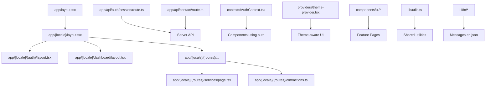
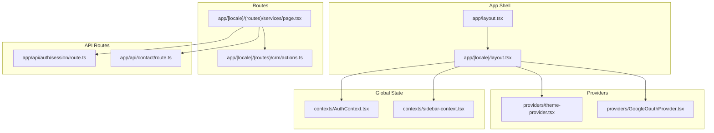
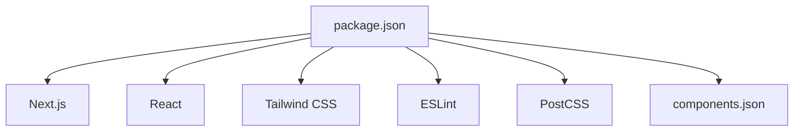

# Coding Standards and Guidelines

<cite>
**Referenced Files in This Document**
- [tsconfig.json](file://tsconfig.json)
- [eslint.config.mjs](file://eslint.config.mjs)
- [tailwind.config.ts](file://tailwind.config.ts)
- [postcss.config.mjs](file://postcss.config.mjs)
- [next.config.ts](file://next.config.ts)
- [package.json](file://package.json)
- [components.json](file://components.json)
- [app/layout.tsx](file://app/layout.tsx)
- [app/[locale]/layout.tsx](file://app/[locale]/layout.tsx)
- [app/[locale]/(auth)/layout.tsx](file://app/[locale]/(auth)/layout.tsx)
- [app/[locale]/dashboard/layout.tsx](file://app/[locale]/dashboard/layout.tsx)
- [app/[locale]/(routes)/services/page.tsx](file://app/[locale]/(routes)/services/page.tsx)
- [app/[locale]/(routes)/crm/actions.ts](file://app/[locale]/(routes)/crm/actions.ts)
- [app/api/auth/session/route.ts](file://app/api/auth/session/route.ts)
- [app/api/contact/route.ts](file://app/api/contact/route.ts)
- [contexts/AuthContext.tsx](file://contexts/AuthContext.tsx)
- [contexts/sidebar-context.tsx](file://contexts/sidebar-context.tsx)
- [providers/theme-provider.tsx](file://providers/theme-provider.tsx)
- [providers/GoogleOauthProvider.tsx](file://providers/GoogleOauthProvider.tsx)
- [lib/utils.ts](file://lib/utils.ts)
- [lib/env.ts](file://lib/env.ts)
- [lib/locale.ts](file://lib/locale.ts)
- [i18n/request.ts](file://i18n/request.ts)
- [i18n/routing.ts](file://i18n/routing.ts)
- [messages/en.json](file://messages/en.json)
- [components/ui/button.tsx](file://components/ui/button.tsx)
- [components/shared/index.ts](file://components/shared/index.ts)
- [app/[locale]/_components/Header/Header.tsx](file://app/[locale]/_components/Header/Header.tsx)
- [app/[locale]/_components/HomeHero/HomeHero.tsx](file://app/[locale]/_components/HomeHero/HomeHero.tsx)
- [app/[locale]/(auth)/_components/AuthFormField.tsx](file://app/[locale]/(auth)/_components/AuthFormField.tsx)
- [app/[locale]/dashboard/_components/Sidebar/Sidebar.tsx](file://app/[locale]/dashboard/_components/Sidebar/Sidebar.tsx)
</cite>

## Table of Contents
1. [Introduction](#introduction)
2. [Project Structure](#project-structure)
3. [Core Components](#core-components)
4. [Architecture Overview](#architecture-overview)
5. [Detailed Component Analysis](#detailed-component-analysis)
6. [Dependency Analysis](#dependency-analysis)
7. [Performance Considerations](#performance-considerations)
8. [Troubleshooting Guide](#troubleshooting-guide)
9. [Conclusion](#conclusion)
10. [Appendices](#appendices)

## Introduction
This document defines the coding standards and guidelines for the Automex frontend project. It covers TypeScript configuration, ESLint rules, code formatting, component naming conventions, file organization patterns, import/export standards, Tailwind CSS usage, responsive design approaches, React component structure, hooks usage, state management patterns, error handling, logging practices, and commenting standards. The goal is to ensure maintainable, readable, and consistent code across the team.

## Project Structure
The project follows a Next.js App Router layout with feature-based grouping and shared UI components:
- app/: Application routes, layouts, and page-level logic
  - [locale]/: Internationalized route groups
    - (auth)/: Authentication-related pages and components
    - (routes)/: Public-facing routes and CRM features
    - dashboard/: Authenticated dashboard routes
  - api/: Server-side API routes
- components/: Reusable UI and shared components
  - ui/: Primitive UI components
  - shared/: Feature-agnostic shared components
- contexts/: Global React contexts
- providers/: Provider components for theme and third-party integrations
- lib/: Utilities, environment variables, locale helpers, and API clients
- i18n/: Request-time locale resolution and routing helpers
- messages/: Translation files per language
- config/: Configuration objects for reusable sections
- public/: Static assets

**Diagram sources**
- [app/layout.tsx](file://app/layout.tsx)
- [app/[locale]/layout.tsx](file://app/[locale]/layout.tsx)
- [app/[locale]/(auth)/layout.tsx](file://app/[locale]/(auth)/layout.tsx)
- [app/[locale]/dashboard/layout.tsx](file://app/[locale]/dashboard/layout.tsx)
- [app/[locale]/(routes)/services/page.tsx](file://app/[locale]/(routes)/services/page.tsx)
- [app/[locale]/(routes)/crm/actions.ts](file://app/[locale]/(routes)/crm/actions.ts)
- [app/api/auth/session/route.ts](file://app/api/auth/session/route.ts)
- [app/api/contact/route.ts](file://app/api/contact/route.ts)
- [contexts/AuthContext.tsx](file://contexts/AuthContext.tsx)
- [providers/theme-provider.tsx](file://providers/theme-provider.tsx)
- [components/ui/button.tsx](file://components/ui/button.tsx)
- [lib/utils.ts](file://lib/utils.ts)
- [i18n/request.ts](file://i18n/request.ts)
- [i18n/routing.ts](file://i18n/routing.ts)
- [messages/en.json](file://messages/en.json)

**Section sources**
- [app/layout.tsx](file://app/layout.tsx)
- [app/[locale]/layout.tsx](file://app/[locale]/layout.tsx)
- [app/[locale]/(auth)/layout.tsx](file://app/[locale]/(auth)/layout.tsx)
- [app/[locale]/dashboard/layout.tsx](file://app/[locale]/dashboard/layout.tsx)
- [app/[locale]/(routes)/services/page.tsx](file://app/[locale]/(routes)/services/page.tsx)
- [app/[locale]/(routes)/crm/actions.ts](file://app/[locale]/(routes)/crm/actions.ts)
- [app/api/auth/session/route.ts](file://app/api/auth/session/route.ts)
- [app/api/contact/route.ts](file://app/api/contact/route.ts)
- [contexts/AuthContext.tsx](file://contexts/AuthContext.tsx)
- [providers/theme-provider.tsx](file://providers/theme-provider.tsx)
- [components/ui/button.tsx](file://components/ui/button.tsx)
- [lib/utils.ts](file://lib/utils.ts)
- [i18n/request.ts](file://i18n/request.ts)
- [i18n/routing.ts](file://i18n/routing.ts)
- [messages/en.json](file://messages/en.json)

## Core Components
- UI primitives live under components/ui and are designed to be composable and theme-aware.
- Shared feature-agnostic components live under components/shared and are re-exported via an index barrel for clean imports.
- Page-level client components are colocated near their routes under app/[locale]/.../_components to keep related logic close to usage.

Guidelines:
- Prefer small, single-responsibility components.
- Use composition over inheritance; avoid deep nesting.
- Keep UI components free of business logic; delegate to hooks or server actions.

**Section sources**
- [components/ui/button.tsx](file://components/ui/button.tsx)
- [components/shared/index.ts](file://components/shared/index.ts)
- [app/[locale]/_components/Header/Header.tsx](file://app/[locale]/_components/Header/Header.tsx)
- [app/[locale]/_components/HomeHero/HomeHero.tsx](file://app/[locale]/_components/HomeHero/HomeHero.tsx)

## Architecture Overview
The application uses Next.js App Router with internationalization, context-based global state, and provider-driven theming. Server routes handle authentication sessions and contact submissions. Client components consume contexts and providers for behavior like auth state and theme toggling.

**Diagram sources**
- [app/layout.tsx](file://app/layout.tsx)
- [app/[locale]/layout.tsx](file://app/[locale]/layout.tsx)
- [providers/theme-provider.tsx](file://providers/theme-provider.tsx)
- [providers/GoogleOauthProvider.tsx](file://providers/GoogleOauthProvider.tsx)
- [contexts/AuthContext.tsx](file://contexts/AuthContext.tsx)
- [contexts/sidebar-context.tsx](file://contexts/sidebar-context.tsx)
- [app/[locale]/(routes)/services/page.tsx](file://app/[locale]/(routes)/services/page.tsx)
- [app/[locale]/(routes)/crm/actions.ts](file://app/[locale]/(routes)/crm/actions.ts)
- [app/api/auth/session/route.ts](file://app/api/auth/session/route.ts)
- [app/api/contact/route.ts](file://app/api/contact/route.ts)

## Detailed Component Analysis

### TypeScript Configuration
- Strict mode enabled for type safety.
- Path aliases configured for cleaner imports.
- JSX support and module resolution aligned with Next.js.
- Separate tsconfig for tests if applicable.

Standards:
- Enable strict null checks and no implicit any.
- Use path aliases consistently for internal modules.
- Avoid type assertions unless necessary; prefer narrowing.

**Section sources**
- [tsconfig.json](file://tsconfig.json)

### ESLint Rules
- Centralized ESLint configuration for consistent linting.
- Recommended rules for React, Next.js, and TypeScript.
- Enforce import ordering and unused variable detection.

Standards:
- Follow the configured rule set without local overrides unless justified.
- Resolve lint errors before committing.
- Use auto-fix where safe.

**Section sources**
- [eslint.config.mjs](file://eslint.config.mjs)

### Code Formatting
- Use Prettier-compatible settings aligned with ESLint.
- Consistent indentation, quotes, semicolons, and trailing commas.
- Run formatter on save or pre-commit hook.

Standards:
- Do not manually format; rely on tooling.
- Keep lines within configured width.

**Section sources**
- [eslint.config.mjs](file://eslint.config.mjs)

### Tailwind CSS Usage Patterns
- Tailwind configuration centralizes theme tokens and plugin setup.
- PostCSS pipeline integrates Tailwind with Next.js.
- Utility-first styling with semantic class composition.

Standards:
- Prefer Tailwind utilities over custom CSS when possible.
- Extract repeated patterns into components or variants.
- Use dark mode classes provided by the theme provider.

**Section sources**
- [tailwind.config.ts](file://tailwind.config.ts)
- [postcss.config.mjs](file://postcss.config.mjs)

### Class Naming Strategies
- Use descriptive utility combinations that reflect intent.
- Group related utilities logically; avoid overly long chains by extracting into components.
- Maintain consistency across similar UI elements.

**Section sources**
- [components/ui/button.tsx](file://components/ui/button.tsx)
- [app/[locale]/_components/Header/Header.tsx](file://app/[locale]/_components/Header/Header.tsx)

### Responsive Design Approaches
- Mobile-first approach with Tailwind breakpoints.
- Use container queries where appropriate for component-level responsiveness.
- Test common breakpoints across devices.

**Section sources**
- [tailwind.config.ts](file://tailwind.config.ts)
- [app/[locale]/_components/HomeHero/HomeHero.tsx](file://app/[locale]/_components/HomeHero/HomeHero.tsx)

### Import/Export Standards
- Prefer named exports for components and utilities.
- Use barrel exports for shared packages to simplify imports.
- Organize imports: external libraries, internal modules, styles.

**Section sources**
- [components/shared/index.ts](file://components/shared/index.ts)
- [lib/utils.ts](file://lib/utils.ts)

### React Component Structure
- Functional components with explicit prop types.
- Co-locate small helper functions and constants near the component.
- Keep side effects in hooks or server actions.

Examples:
- Header component demonstrates layout composition and Tailwind usage.
- HomeHero showcases complex UI with animations and responsive behavior.

**Section sources**
- [app/[locale]/_components/Header/Header.tsx](file://app/[locale]/_components/Header/Header.tsx)
- [app/[locale]/_components/HomeHero/HomeHero.tsx](file://app/[locale]/_components/HomeHero/HomeHero.tsx)

### Hook Usage Patterns
- Encapsulate reusable logic in custom hooks.
- Keep hooks pure and focused on a single responsibility.
- Memoize expensive computations and derived state.

Examples:
- Form submission hook pattern used in CRM forms.
- Sidebar context hook for navigation state.

**Section sources**
- [app/[locale]/(routes)/crm/actions.ts](file://app/[locale]/(routes)/crm/actions.ts)
- [contexts/sidebar-context.tsx](file://contexts/sidebar-context.tsx)

### State Management Patterns
- Use React Context for low-frequency global state (theme, sidebar).
- Prefer local state for component-specific data.
- For server state, use Next.js server actions and cache strategies.

Examples:
- AuthContext provides user session state.
- Theme provider manages theme toggling.

**Section sources**
- [contexts/AuthContext.tsx](file://contexts/AuthContext.tsx)
- [providers/theme-provider.tsx](file://providers/theme-provider.tsx)

### Error Handling Conventions
- Validate inputs early and return structured errors.
- Surface user-friendly messages while preserving technical details for logs.
- Handle network failures gracefully with retries or fallbacks.

Examples:
- API routes validate payloads and return standardized responses.
- Client components catch errors from server actions and display notifications.

**Section sources**
- [app/api/auth/session/route.ts](file://app/api/auth/session/route.ts)
- [app/api/contact/route.ts](file://app/api/contact/route.ts)
- [app/[locale]/(auth)/_components/AuthFormField.tsx](file://app/[locale]/(auth)/_components/AuthFormField.tsx)

### Logging Practices
- Log contextual information for debugging without exposing secrets.
- Use consistent log levels and formats.
- Avoid excessive logging in hot paths.

**Section sources**
- [app/api/auth/session/route.ts](file://app/api/auth/session/route.ts)
- [app/api/contact/route.ts](file://app/api/contact/route.ts)

### Code Commenting Standards
- Write self-documenting code; add comments only when necessary.
- Use JSDoc for public APIs and complex logic.
- Keep comments up-to-date with changes.

**Section sources**
- [lib/utils.ts](file://lib/utils.ts)
- [components/shared/index.ts](file://components/shared/index.ts)

## Dependency Analysis
Key dependencies include Next.js, React, Tailwind CSS, and various UI and utility libraries. The package manifest defines versions and scripts for development and production.

**Diagram sources**
- [package.json](file://package.json)
- [components.json](file://components.json)

**Section sources**
- [package.json](file://package.json)
- [components.json](file://components.json)

## Performance Considerations
- Leverage Next.js caching and server components where possible.
- Minimize client-side state; prefer server state and revalidation.
- Optimize images and static assets; use proper formats and sizes.
- Avoid unnecessary re-renders by memoizing components and hooks.

[No sources needed since this section provides general guidance]

## Troubleshooting Guide
Common issues and resolutions:
- Build errors due to missing environment variables: verify env configuration and runtime availability.
- Tailwind classes not applied: ensure PostCSS and Tailwind are correctly configured and paths are included.
- ESLint conflicts: align editor settings with project ESLint configuration.
- Route or API failures: check server route responses and client-side error handling.

**Section sources**
- [next.config.ts](file://next.config.ts)
- [postcss.config.mjs](file://postcss.config.mjs)
- [eslint.config.mjs](file://eslint.config.mjs)
- [app/api/auth/session/route.ts](file://app/api/auth/session/route.ts)
- [app/api/contact/route.ts](file://app/api/contact/route.ts)

## Conclusion
Adhering to these coding standards ensures consistency, readability, and maintainability across the Automex frontend. By following the outlined TypeScript, ESLint, Tailwind, and React patterns, teams can collaborate effectively and deliver high-quality features with confidence.

[No sources needed since this section summarizes without analyzing specific files]

## Appendices

### Internationalization Setup
- Request-time locale resolution and routing helpers define supported locales and URL structures.
- Messages are organized per language and loaded based on the active locale.

**Section sources**
- [i18n/request.ts](file://i18n/request.ts)
- [i18n/routing.ts](file://i18n/routing.ts)
- [messages/en.json](file://messages/en.json)

### Environment Variables
- Centralized environment access with validation and defaults.
- Ensure sensitive values are not exposed to the client.

**Section sources**
- [lib/env.ts](file://lib/env.ts)

### Locale Helpers
- Utilities for locale detection and formatting.
- Integrate with Next.js routing for seamless translations.

**Section sources**
- [lib/locale.ts](file://lib/locale.ts)

### Dashboard Layout and Navigation
- Dashboard layout encapsulates header and sidebar components.
- Sidebar context drives navigation state and collapsible behavior.

**Section sources**
- [app/[locale]/dashboard/layout.tsx](file://app/[locale]/dashboard/layout.tsx)
- [app/[locale]/dashboard/_components/Sidebar/Sidebar.tsx](file://app/[locale]/dashboard/_components/Sidebar/Sidebar.tsx)
- [contexts/sidebar-context.tsx](file://contexts/sidebar-context.tsx)