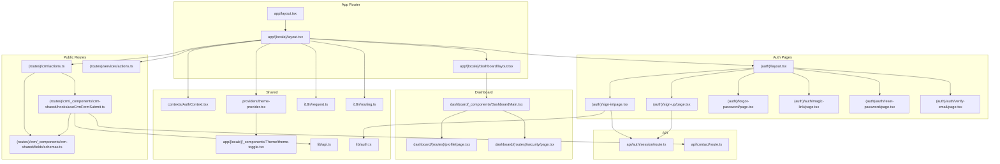
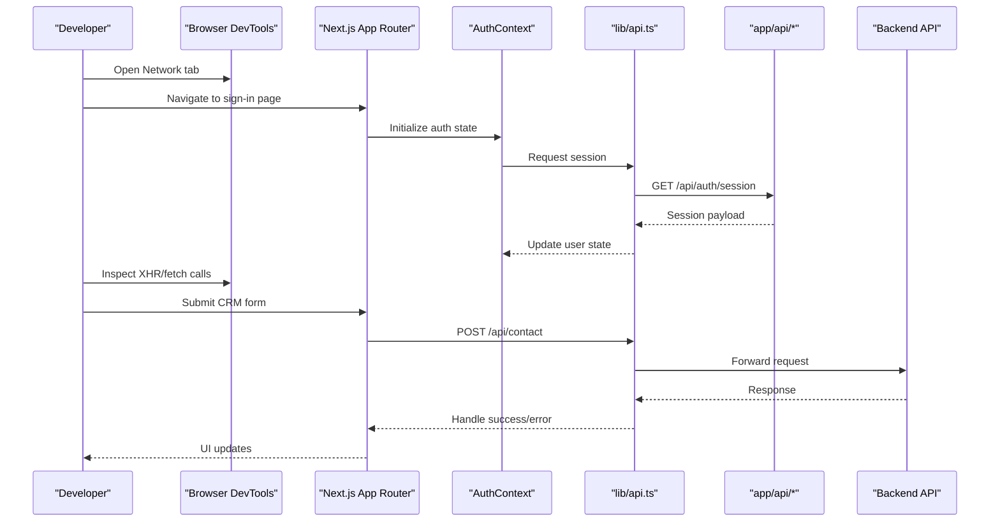
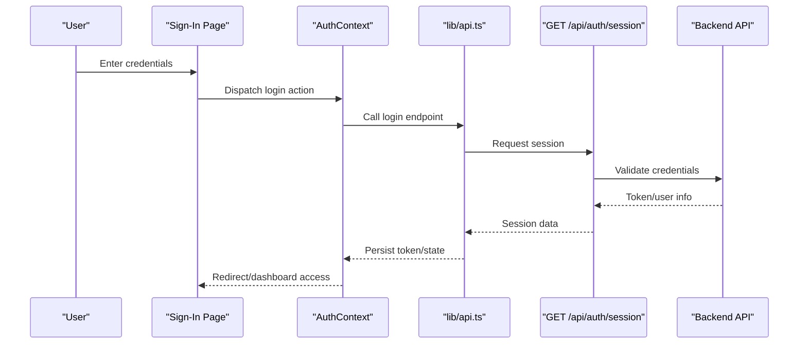
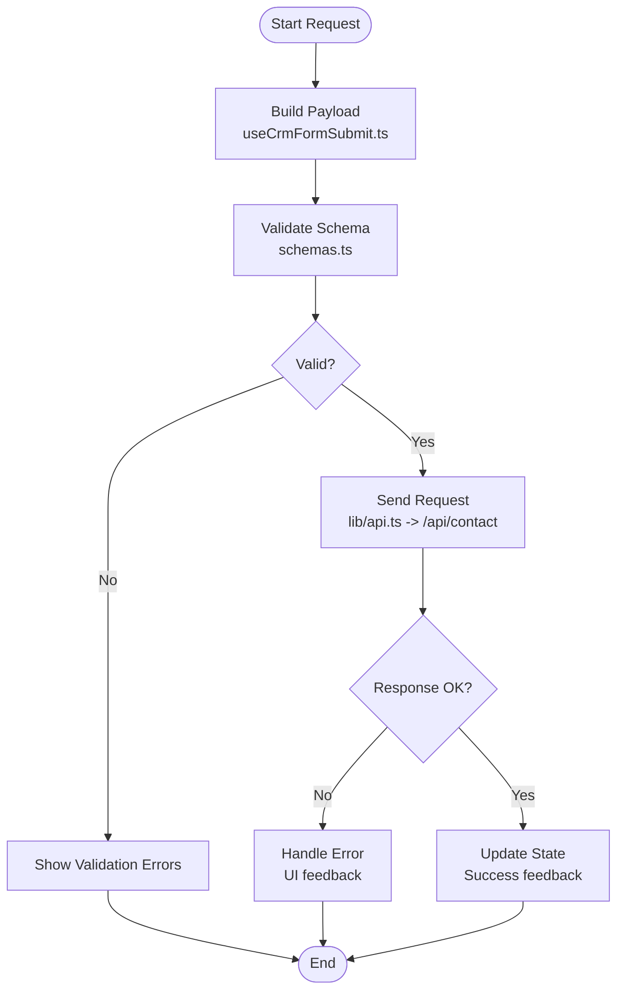
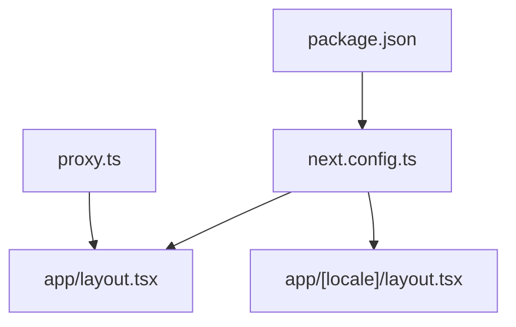

# Debugging and Performance Profiling

<cite>
**Referenced Files in This Document**
- [README.md](file://README.md)
- [package.json](file://package.json)
- [next.config.ts](file://next.config.ts)
- [proxy.ts](file://proxy.ts)
- [app/layout.tsx](file://app/layout.tsx)
- [app/[locale]/layout.tsx](file://app/[locale]/layout.tsx)
- [app/[locale]/dashboard/layout.tsx](file://app/[locale]/dashboard/layout.tsx)
- [app/api/auth/session/route.ts](file://app/api/auth/session/route.ts)
- [app/api/contact/route.ts](file://app/api/contact/route.ts)
- [lib/api.ts](file://lib/api.ts)
- [lib/auth.ts](file://lib/auth.ts)
- [contexts/AuthContext.tsx](file://contexts/AuthContext.tsx)
- [providers/theme-provider.tsx](file://providers/theme-provider.tsx)
- [app/[locale]/_components/Theme/theme-toggle.tsx](file://app/[locale]/_components/Theme/theme-toggle.tsx)
- [i18n/request.ts](file://i18n/request.ts)
- [i18n/routing.ts](file://i18n/routing.ts)
- [messages/en.json](file://messages/en.json)
- [app/[locale]/(auth)/layout.tsx](file://app/[locale]/(auth)/layout.tsx)
- [app/[locale]/(auth)/sign-in/page.tsx](file://app/[locale]/(auth)/sign-in/page.tsx)
- [app/[locale]/(auth)/sign-up/page.tsx](file://app/[locale]/(auth)/sign-up/page.tsx)
- [app/[locale]/(auth)/forgot-password/page.tsx](file://app/[locale]/(auth)/forgot-password/page.tsx)
- [app/[locale]/(auth)/auth/magic-link/page.tsx](file://app/[locale]/(auth)/auth/magic-link/page.tsx)
- [app/[locale]/(auth)/auth/reset-password/page.tsx](file://app/[locale]/(auth)/auth/reset-password/page.tsx)
- [app/[locale]/(auth)/auth/verify-email/page.tsx](file://app/[locale]/(auth)/auth/verify-email/page.tsx)
- [app/[locale]/(routes)/crm/actions.ts](file://app/[locale]/(routes)/crm/actions.ts)
- [app/[locale]/(routes)/services/actions.ts](file://app/[locale]/(routes)/services/actions.ts)
- [app/[locale]/(routes)/crm/_components/crm-shared/hooks/useCrmFormSubmit.ts](file://app/[locale]/(routes)/crm/_components/crm-shared/hooks/useCrmFormSubmit.ts)
- [app/[locale]/(routes)/crm/_components/crm-shared/fields/schemas.ts](file://app/[locale]/(routes)/crm/_components/crm-shared/fields/schemas.ts)
- [app/[locale]/dashboard/(routes)/profile/page.tsx](file://app/[locale]/dashboard/(routes)/profile/page.tsx)
- [app/[locale]/dashboard/(routes)/security/page.tsx](file://app/[locale]/dashboard/(routes)/security/page.tsx)
- [app/[locale]/dashboard/_components/DashboardMain.tsx](file://app/[locale]/dashboard/_components/DashboardMain.tsx)
</cite>

## Table of Contents
1. Introduction
2. Project Structure
3. Core Components
4. Architecture Overview
5. Detailed Component Analysis
6. Dependency Analysis
7. Performance Considerations
8. Troubleshooting Guide
9. Conclusion
10. Appendices

## Introduction
This guide provides a comprehensive approach to debugging and performance profiling the Automex frontend application built with Next.js. It covers browser developer tools usage, React DevTools integration, Next.js-specific debugging techniques, API request debugging, authentication flow troubleshooting, form validation debugging, performance profiling, bundle analysis, memory leak detection, internationalization (i18n) debugging, theme switching issues, dashboard functionality debugging, logging strategies, error tracking integration, and production debugging techniques.

## Project Structure
The project follows a Next.js App Router structure with:
- Internationalized routes under app/[locale]
- Authentication pages under (auth) route group
- Public routes under (routes) route group
- Dashboard routes under app/[locale]/dashboard
- API routes under app/api
- Shared UI components under components/ui
- Contexts for auth and sidebar state
- Providers for theme and Google OAuth
- i18n configuration and messages
- Centralized API client and auth utilities

**Diagram sources**
- [app/layout.tsx](file://app/layout.tsx)
- [app/[locale]/layout.tsx](file://app/[locale]/layout.tsx)
- [app/[locale]/dashboard/layout.tsx](file://app/[locale]/dashboard/layout.tsx)
- [app/[locale]/(auth)/layout.tsx](file://app/[locale]/(auth)/layout.tsx)
- [app/[locale]/(auth)/sign-in/page.tsx](file://app/[locale]/(auth)/sign-in/page.tsx)
- [app/[locale]/(auth)/sign-up/page.tsx](file://app/[locale]/(auth)/sign-up/page.tsx)
- [app/[locale]/(auth)/forgot-password/page.tsx](file://app/[locale]/(auth)/forgot-password/page.tsx)
- [app/[locale]/(auth)/auth/magic-link/page.tsx](file://app/[locale]/(auth)/auth/magic-link/page.tsx)
- [app/[locale]/(auth)/auth/reset-password/page.tsx](file://app/[locale]/(auth)/auth/reset-password/page.tsx)
- [app/[locale]/(auth)/auth/verify-email/page.tsx](file://app/[locale]/(auth)/auth/verify-email/page.tsx)
- [app/[locale]/(routes)/crm/actions.ts](file://app/[locale]/(routes)/crm/actions.ts)
- [app/[locale]/(routes)/services/actions.ts](file://app/[locale]/(routes)/services/actions.ts)
- [app/[locale]/(routes)/crm/_components/crm-shared/hooks/useCrmFormSubmit.ts](file://app/[locale]/(routes)/crm/_components/crm-shared/hooks/useCrmFormSubmit.ts)
- [app/[locale]/(routes)/crm/_components/crm-shared/fields/schemas.ts](file://app/[locale]/(routes)/crm/_components/crm-shared/fields/schemas.ts)
- [app/[locale]/dashboard/_components/DashboardMain.tsx](file://app/[locale]/dashboard/_components/DashboardMain.tsx)
- [app/[locale]/dashboard/(routes)/profile/page.tsx](file://app/[locale]/dashboard/(routes)/profile/page.tsx)
- [app/[locale]/dashboard/(routes)/security/page.tsx](file://app/[locale]/dashboard/(routes)/security/page.tsx)
- [app/api/auth/session/route.ts](file://app/api/auth/session/route.ts)
- [app/api/contact/route.ts](file://app/api/contact/route.ts)
- [contexts/AuthContext.tsx](file://contexts/AuthContext.tsx)
- [providers/theme-provider.tsx](file://providers/theme-provider.tsx)
- [app/[locale]/_components/Theme/theme-toggle.tsx](file://app/[locale]/_components/Theme/theme-toggle.tsx)
- [i18n/request.ts](file://i18n/request.ts)
- [i18n/routing.ts](file://i18n/routing.ts)
- [lib/api.ts](file://lib/api.ts)
- [lib/auth.ts](file://lib/auth.ts)

**Section sources**
- [README.md](file://README.md)
- [package.json](file://package.json)
- [next.config.ts](file://next.config.ts)

## Core Components
Key areas relevant to debugging and profiling:
- Authentication context and providers
- API client and server routes
- Form submission hooks and schemas
- Theme provider and toggle
- i18n request and routing

These components are central to diagnosing runtime behavior, network requests, state changes, and rendering performance.

**Section sources**
- [contexts/AuthContext.tsx](file://contexts/AuthContext.tsx)
- [lib/api.ts](file://lib/api.ts)
- [lib/auth.ts](file://lib/auth.ts)
- [app/api/auth/session/route.ts](file://app/api/auth/session/route.ts)
- [app/api/contact/route.ts](file://app/api/contact/route.ts)
- [app/[locale]/(routes)/crm/_components/crm-shared/hooks/useCrmFormSubmit.ts](file://app/[locale]/(routes)/crm/_components/crm-shared/hooks/useCrmFormSubmit.ts)
- [app/[locale]/(routes)/crm/_components/crm-shared/fields/schemas.ts](file://app/[locale]/(routes)/crm/_components/crm-shared/fields/schemas.ts)
- [providers/theme-provider.tsx](file://providers/theme-provider.tsx)
- [app/[locale]/_components/Theme/theme-toggle.tsx](file://app/[locale]/_components/Theme/theme-toggle.tsx)
- [i18n/request.ts](file://i18n/request.ts)
- [i18n/routing.ts](file://i18n/routing.ts)

## Architecture Overview
The application uses Next.js App Router with internationalized routes and an internal API layer. Authentication flows interact with session endpoints, while CRM and contact forms submit via server actions or API routes. The theme provider manages global theme state, and i18n is configured per-request.

**Diagram sources**
- [app/[locale]/(auth)/sign-in/page.tsx](file://app/[locale]/(auth)/sign-in/page.tsx)
- [contexts/AuthContext.tsx](file://contexts/AuthContext.tsx)
- [lib/api.ts](file://lib/api.ts)
- [app/api/auth/session/route.ts](file://app/api/auth/session/route.ts)
- [app/api/contact/route.ts](file://app/api/contact/route.ts)
- [app/[locale]/(routes)/crm/_components/crm-shared/hooks/useCrmFormSubmit.ts](file://app/[locale]/(routes)/crm/_components/crm-shared/hooks/useCrmFormSubmit.ts)

## Detailed Component Analysis

### Authentication Flow Debugging
Focus on session retrieval, login/signup flows, and password reset/magic link verification. Use React DevTools to inspect AuthContext state transitions and verify API responses from session endpoints.

**Diagram sources**
- [app/[locale]/(auth)/sign-in/page.tsx](file://app/[locale]/(auth)/sign-in/page.tsx)
- [contexts/AuthContext.tsx](file://contexts/AuthContext.tsx)
- [lib/api.ts](file://lib/api.ts)
- [app/api/auth/session/route.ts](file://app/api/auth/session/route.ts)

**Section sources**
- [app/[locale]/(auth)/layout.tsx](file://app/[locale]/(auth)/layout.tsx)
- [app/[locale]/(auth)/sign-in/page.tsx](file://app/[locale]/(auth)/sign-in/page.tsx)
- [app/[locale]/(auth)/sign-up/page.tsx](file://app/[locale]/(auth)/sign-up/page.tsx)
- [app/[locale]/(auth)/forgot-password/page.tsx](file://app/[locale]/(auth)/forgot-password/page.tsx)
- [app/[locale]/(auth)/auth/magic-link/page.tsx](file://app/[locale]/(auth)/auth/magic-link/page.tsx)
- [app/[locale]/(auth)/auth/reset-password/page.tsx](file://app/[locale]/(auth)/auth/reset-password/page.tsx)
- [app/[locale]/(auth)/auth/verify-email/page.tsx](file://app/[locale]/(auth)/auth/verify-email/page.tsx)
- [app/api/auth/session/route.ts](file://app/api/auth/session/route.ts)
- [lib/auth.ts](file://lib/auth.ts)

### API Request Debugging
Use the Network tab to inspect all fetch/XHR calls. For CRM and contact submissions, validate payloads and responses at both client and server sides. Add console logs around API calls to trace timing and errors.

**Diagram sources**
- [app/[locale]/(routes)/crm/_components/crm-shared/hooks/useCrmFormSubmit.ts](file://app/[locale]/(routes)/crm/_components/crm-shared/hooks/useCrmFormSubmit.ts)
- [app/[locale]/(routes)/crm/_components/crm-shared/fields/schemas.ts](file://app/[locale]/(routes)/crm/_components/crm-shared/fields/schemas.ts)
- [lib/api.ts](file://lib/api.ts)
- [app/api/contact/route.ts](file://app/api/contact/route.ts)

**Section sources**
- [app/[locale]/(routes)/crm/actions.ts](file://app/[locale]/(routes)/crm/actions.ts)
- [app/[locale]/(routes)/services/actions.ts](file://app/[locale]/(routes)/services/actions.ts)
- [app/[locale]/(routes)/crm/_components/crm-shared/hooks/useCrmFormSubmit.ts](file://app/[locale]/(routes)/crm/_components/crm-shared/hooks/useCrmFormSubmit.ts)
- [app/[locale]/(routes)/crm/_components/crm-shared/fields/schemas.ts](file://app/[locale]/(routes)/crm/_components/crm-shared/fields/schemas.ts)
- [app/api/contact/route.ts](file://app/api/contact/route.ts)

### Form Validation Debugging
Inspect schema definitions and hook logic to ensure correct field rules and error propagation. Use React DevTools to observe component re-renders triggered by validation state changes.

**Section sources**
- [app/[locale]/(routes)/crm/_components/crm-shared/fields/schemas.ts](file://app/[locale]/(routes)/crm/_components/crm-shared/fields/schemas.ts)
- [app/[locale]/(routes)/crm/_components/crm-shared/hooks/useCrmFormSubmit.ts](file://app/[locale]/(routes)/crm/_components/crm-shared/hooks/useCrmFormSubmit.ts)

### Theme Switching Debugging
Verify that the theme provider initializes correctly and toggles propagate across components. Check local storage persistence and CSS class application.

**Section sources**
- [providers/theme-provider.tsx](file://providers/theme-provider.tsx)
- [app/[locale]/_components/Theme/theme-toggle.tsx](file://app/[locale]/_components/Theme/theme-toggle.tsx)

### Internationalization (i18n) Debugging
Ensure locale selection persists and messages load correctly. Confirm HTML lang/direction attributes update and routing respects locale prefixes.

**Section sources**
- [i18n/request.ts](file://i18n/request.ts)
- [i18n/routing.ts](file://i18n/routing.ts)
- [messages/en.json](file://messages/en.json)

### Dashboard Functionality Debugging
Monitor layout and main container renders. Verify navigation between profile and security sections without unnecessary re-renders.

**Section sources**
- [app/[locale]/dashboard/layout.tsx](file://app/[locale]/dashboard/layout.tsx)
- [app/[locale]/dashboard/_components/DashboardMain.tsx](file://app/[locale]/dashboard/_components/DashboardMain.tsx)
- [app/[locale]/dashboard/(routes)/profile/page.tsx](file://app/[locale]/dashboard/(routes)/profile/page.tsx)
- [app/[locale]/dashboard/(routes)/security/page.tsx](file://app/[locale]/dashboard/(routes)/security/page.tsx)

## Dependency Analysis
Core dependencies include Next.js, React, Tailwind CSS, and UI primitives. Proxy configuration may be used during development to forward API calls.

**Diagram sources**
- [package.json](file://package.json)
- [next.config.ts](file://next.config.ts)
- [proxy.ts](file://proxy.ts)
- [app/layout.tsx](file://app/layout.tsx)
- [app/[locale]/layout.tsx](file://app/[locale]/layout.tsx)

**Section sources**
- [package.json](file://package.json)
- [next.config.ts](file://next.config.ts)
- [proxy.ts](file://proxy.ts)

## Performance Considerations
- Use React DevTools Profiler to identify expensive re-renders and measure commit times.
- Enable Next.js performance insights and analyze server/client bundles.
- Monitor long tasks and memory snapshots to detect leaks.
- Prefer memoization and code splitting where appropriate.
- Profile network waterfall to optimize critical requests.

[No sources needed since this section provides general guidance]

## Troubleshooting Guide

### Common Development Issues
- API connectivity problems: Verify proxy settings and environment variables; check CORS and route handlers.
- Authentication failures: Inspect session endpoint responses and token handling in the auth context.
- Form submission errors: Validate schema constraints and confirm server-side processing.
- Theme not applying: Ensure provider initialization and CSS class toggling.
- i18n keys missing: Confirm message files exist and locale routing is correct.

**Section sources**
- [proxy.ts](file://proxy.ts)
- [app/api/auth/session/route.ts](file://app/api/auth/session/route.ts)
- [contexts/AuthContext.tsx](file://contexts/AuthContext.tsx)
- [app/[locale]/(routes)/crm/_components/crm-shared/hooks/useCrmFormSubmit.ts](file://app/[locale]/(routes)/crm/_components/crm-shared/hooks/useCrmFormSubmit.ts)
- [providers/theme-provider.tsx](file://providers/theme-provider.tsx)
- [i18n/routing.ts](file://i18n/routing.ts)
- [messages/en.json](file://messages/en.json)

### Logging Strategies
- Add structured logs around API calls and state transitions using console methods.
- Capture request/response metadata (URL, method, status, duration).
- Avoid sensitive data in logs; sanitize tokens and personal information.

**Section sources**
- [lib/api.ts](file://lib/api.ts)
- [contexts/AuthContext.tsx](file://contexts/AuthContext.tsx)

### Error Tracking Integration
- Integrate a monitoring service to capture unhandled exceptions and promise rejections.
- Instrument custom error boundaries for graceful degradation.
- Correlate frontend errors with backend logs using request IDs.

[No sources needed since this section provides general guidance]

### Production Debugging Techniques
- Enable source maps carefully and restrict access to sensitive environments.
- Use performance APIs to collect real-user metrics.
- Monitor network latency and error rates through dashboards.

[No sources needed since this section provides general guidance]

## Conclusion
By leveraging browser developer tools, React DevTools, and Next.js-specific features, you can effectively debug authentication flows, API interactions, form validations, theme switching, and i18n behavior. Combine these with performance profiling, bundle analysis, and memory diagnostics to maintain a responsive and reliable application. Establish robust logging and error tracking to streamline issue resolution in both development and production.

## Appendices

### Browser Developer Tools Usage
- Network: Filter by domain, inspect headers/payloads, replay requests.
- Console: Log statements, stack traces, and custom assertions.
- Sources: Set breakpoints, step through code, evaluate expressions.
- Performance: Record timelines, analyze frames, identify bottlenecks.
- Memory: Take heap snapshots, compare allocations, find leaks.

[No sources needed since this section provides general guidance]

### React DevTools Integration
- Install the extension and enable Profiler mode.
- Use the Components tab to inspect props/state and highlight updates.
- Use the Profiler tab to record interactions and analyze render costs.

[No sources needed since this section provides general guidance]

### Next.js Specific Debugging
- Review next.config.ts for build/runtime flags affecting debugging.
- Use server-side logs for route handlers and middleware.
- Analyze generated bundles and static assets for optimization opportunities.

**Section sources**
- [next.config.ts](file://next.config.ts)