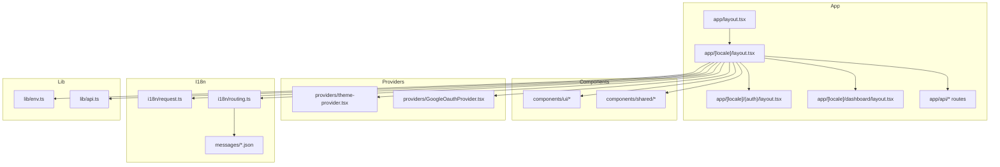
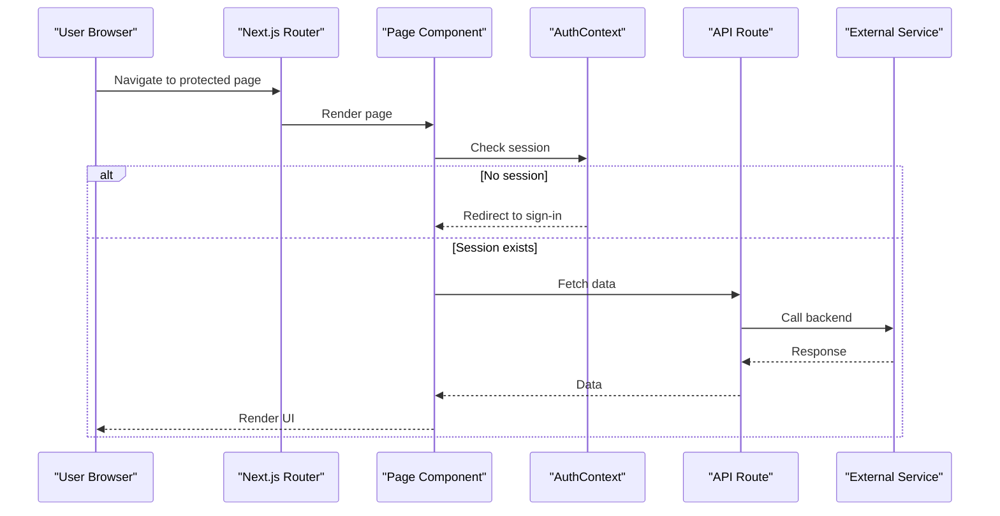
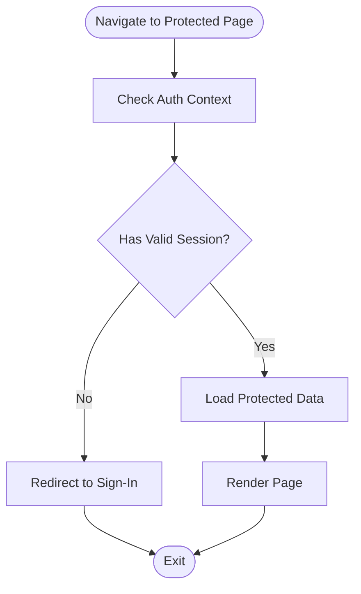
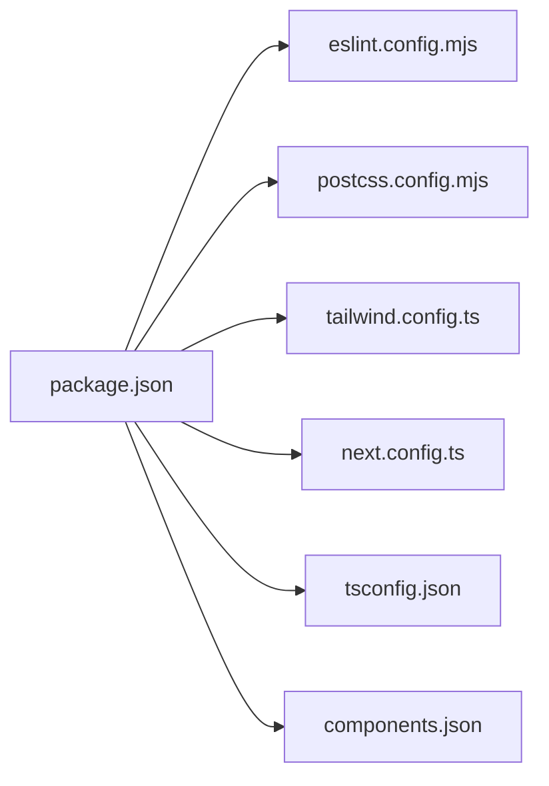

# Developer Guide

<cite>
**Referenced Files in This Document**
- [README.md](file://README.md)
- [package.json](file://package.json)
- [eslint.config.mjs](file://eslint.config.mjs)
- [postcss.config.mjs](file://postcss.config.mjs)
- [tailwind.config.ts](file://tailwind.config.ts)
- [next.config.ts](file://next.config.ts)
- [tsconfig.json](file://tsconfig.json)
- [components.json](file://components.json)
- [proxy.ts](file://proxy.ts)
- [app/layout.tsx](file://app/layout.tsx)
- [app/[locale]/layout.tsx](file://app/[locale]/layout.tsx)
- [i18n/request.ts](file://i18n/request.ts)
- [i18n/routing.ts](file://i18n/routing.ts)
- [lib/env.ts](file://lib/env.ts)
- [lib/api.ts](file://lib/api.ts)
- [contexts/AuthContext.tsx](file://contexts/AuthContext.tsx)
- [providers/theme-provider.tsx](file://providers/theme-provider.tsx)
- [providers/GoogleOauthProvider.tsx](file://providers/GoogleOauthProvider.tsx)
- [app/[locale]/(auth)/layout.tsx](file://app/[locale]/(auth)/layout.tsx)
- [app/[locale]/dashboard/layout.tsx](file://app/[locale]/dashboard/layout.tsx)
- [app/api/auth/session/route.ts](file://app/api/auth/session/route.ts)
- [app/api/contact/route.ts](file://app/api/contact/route.ts)
- [app/[locale]/(routes)/services/page.tsx](file://app/[locale]/(routes)/services/page.tsx)
- [app/[locale]/(routes)/services/actions.ts](file://app/[locale]/(routes)/services/actions.ts)
- [messages/en.json](file://messages/en.json)
</cite>

## Table of Contents
1. Introduction
2. Project Structure
3. Core Components
4. Architecture Overview
5. Detailed Component Analysis
6. Dependency Analysis
7. Performance Considerations
8. Troubleshooting Guide
9. Conclusion
10. Appendices

## Introduction
This Developer Guide provides a comprehensive overview of coding standards, contribution workflow, and development best practices for the project. It explains ESLint configuration, PostCSS setup, code quality tools, Git workflow, branching strategies, pull request process, debugging techniques, performance profiling, testing approaches, and practical examples for adding features and refactoring. It also includes guidance on documentation, translations, and backward compatibility.

## Project Structure
The application is a Next.js app with internationalization, authentication, API routes, shared UI components, and theme management. Key areas:
- App Router pages under app/[locale] with route groups for auth and dashboard
- Shared UI components in components/ui and shared blocks in components/shared
- Internationalization via i18n files and routing helpers
- Environment variables and API client utilities in lib
- Providers for theme and OAuth
- Configuration files for TypeScript, Tailwind, PostCSS, ESLint, and Next.js

**Diagram sources**
- [app/layout.tsx](file://app/layout.tsx)
- [app/[locale]/layout.tsx](file://app/[locale]/layout.tsx)
- [app/[locale]/(auth)/layout.tsx](file://app/[locale]/(auth)/layout.tsx)
- [app/[locale]/dashboard/layout.tsx](file://app/[locale]/dashboard/layout.tsx)
- [app/api/auth/session/route.ts](file://app/api/auth/session/route.ts)
- [app/api/contact/route.ts](file://app/api/contact/route.ts)
- [components/ui/alert-dialog.tsx](file://components/ui/alert-dialog.tsx)
- [components/shared/index.ts](file://components/shared/index.ts)
- [providers/theme-provider.tsx](file://providers/theme-provider.tsx)
- [providers/GoogleOauthProvider.tsx](file://providers/GoogleOauthProvider.tsx)
- [i18n/request.ts](file://i18n/request.ts)
- [i18n/routing.ts](file://i18n/routing.ts)
- [messages/en.json](file://messages/en.json)
- [lib/env.ts](file://lib/env.ts)
- [lib/api.ts](file://lib/api.ts)

**Section sources**
- [README.md](file://README.md)
- [package.json](file://package.json)
- [next.config.ts](file://next.config.ts)
- [tsconfig.json](file://tsconfig.json)

## Core Components
- Authentication context and providers manage user sessions and OAuth flows.
- Theme provider centralizes theme state and toggles.
- API client and environment utilities standardize requests and config access.
- Internationalization routing and message files support multi-language content.

Key responsibilities:
- Auth flow orchestration and session checks
- Theme persistence and SSR-safe updates
- Centralized API calls and error handling
- Locale detection and routing

**Section sources**
- [contexts/AuthContext.tsx](file://contexts/AuthContext.tsx)
- [providers/theme-provider.tsx](file://providers/theme-provider.tsx)
- [providers/GoogleOauthProvider.tsx](file://providers/GoogleOauthProvider.tsx)
- [lib/api.ts](file://lib/api.ts)
- [lib/env.ts](file://lib/env.ts)
- [i18n/request.ts](file://i18n/request.ts)
- [i18n/routing.ts](file://i18n/routing.ts)

## Architecture Overview
High-level architecture:
- Client-side React components consume providers (theme, auth).
- Pages use route groups to enforce layout and access control.
- API routes handle server-side logic and external integrations.
- i18n layer reads locale from URL and loads messages.

**Diagram sources**
- [app/[locale]/(auth)/layout.tsx](file://app/[locale]/(auth)/layout.tsx)
- [app/[locale]/dashboard/layout.tsx](file://app/[locale]/dashboard/layout.tsx)
- [contexts/AuthContext.tsx](file://contexts/AuthContext.tsx)
- [app/api/auth/session/route.ts](file://app/api/auth/session/route.ts)
- [app/api/contact/route.ts](file://app/api/contact/route.ts)

## Detailed Component Analysis

### ESLint Configuration
- The project uses a modern ESLint configuration file.
- Rules are centralized and can be extended or customized per team needs.
- Recommended workflow: run lint locally before committing; integrate CI checks.

Practical tips:
- Add new rules only when necessary and document rationale.
- Prefer auto-fixable rules to maintain consistency.
- Use .eslintignore sparingly; prefer targeted overrides.

**Section sources**
- [eslint.config.mjs](file://eslint.config.mjs)

### PostCSS and Tailwind Setup
- PostCSS is configured to process CSS with Tailwind.
- Tailwind configuration defines themes, plugins, and content paths.
- Ensure all component paths are included in content scanning to avoid missing styles.

Best practices:
- Keep utility classes consistent; avoid ad-hoc CSS when Tailwind covers it.
- Extract reusable patterns into components rather than duplicating classes.
- Validate color tokens and spacing scales across the app.

**Section sources**
- [postcss.config.mjs](file://postcss.config.mjs)
- [tailwind.config.ts](file://tailwind.config.ts)

### Code Quality Tools
- TypeScript is enabled with strict settings for type safety.
- Optional form validation libraries may be used where appropriate.
- Maintain consistent imports and exports; prefer barrel files for shared modules.

Recommendations:
- Enable incremental builds and keep tsconfig aligned with Next.js expectations.
- Use explicit types for props and API responses.
- Run type checks in CI to catch regressions early.

**Section sources**
- [tsconfig.json](file://tsconfig.json)

### Next.js Configuration
- Next.js configuration centralizes build-time options, rewrites, and proxies.
- Proxy configuration helps local development by forwarding API calls.

Guidelines:
- Keep environment-specific settings out of version control.
- Use proxy for local dev against staging endpoints.
- Avoid heavy runtime transforms; prefer build-time optimizations.

**Section sources**
- [next.config.ts](file://next.config.ts)
- [proxy.ts](file://proxy.ts)

### Internationalization (i18n)
- Routing and request helpers determine locale from URL and headers.
- Message files provide translations per language.
- Ensure all user-facing strings are extracted and translated.

Workflow:
- Add new keys to source language first, then add translations.
- Use consistent key naming conventions.
- Test both LTR and RTL layouts if applicable.

**Section sources**
- [i18n/request.ts](file://i18n/request.ts)
- [i18n/routing.ts](file://i18n/routing.ts)
- [messages/en.json](file://messages/en.json)

### Authentication and Session Management
- Auth context manages login state and redirects.
- OAuth provider integrates third-party identity.
- Session API route validates and returns current session info.

Flow:
- On navigation, check session via context.
- If invalid, redirect to sign-in.
- On success, fetch protected resources.

**Diagram sources**
- [contexts/AuthContext.tsx](file://contexts/AuthContext.tsx)
- [providers/GoogleOauthProvider.tsx](file://providers/GoogleOauthProvider.tsx)
- [app/api/auth/session/route.ts](file://app/api/auth/session/route.ts)
- [app/[locale]/(auth)/layout.tsx](file://app/[locale]/(auth)/layout.tsx)

**Section sources**
- [contexts/AuthContext.tsx](file://contexts/AuthContext.tsx)
- [providers/GoogleOauthProvider.tsx](file://providers/GoogleOauthProvider.tsx)
- [app/api/auth/session/route.ts](file://app/api/auth/session/route.ts)
- [app/[locale]/(auth)/layout.tsx](file://app/[locale]/(auth)/layout.tsx)

### API Routes and Server Actions
- API routes handle HTTP endpoints for contact and auth session.
- Server actions encapsulate mutations and data fetching on the server.

Best practices:
- Validate inputs on the server side.
- Return structured JSON responses with clear status codes.
- Centralize error formatting and logging.

**Section sources**
- [app/api/contact/route.ts](file://app/api/contact/route.ts)
- [app/api/auth/session/route.ts](file://app/api/auth/session/route.ts)
- [app/[locale]/(routes)/services/actions.ts](file://app/[locale]/(routes)/services/actions.ts)

### Services Page Example
- Demonstrates how a feature page integrates with API routes and server actions.
- Encourages separation of concerns between UI and data logic.

Steps:
- Define page component and related client components.
- Use server actions for mutations.
- Handle loading and error states consistently.

**Section sources**
- [app/[locale]/(routes)/services/page.tsx](file://app/[locale]/(routes)/services/page.tsx)
- [app/[locale]/(routes)/services/actions.ts](file://app/[locale]/(routes)/services/actions.ts)

## Dependency Analysis
Core dependencies include Next.js, React, TypeScript, Tailwind, PostCSS, and ESLint. Package scripts define development, linting, building, and testing commands.

**Diagram sources**
- [package.json](file://package.json)
- [eslint.config.mjs](file://eslint.config.mjs)
- [postcss.config.mjs](file://postcss.config.mjs)
- [tailwind.config.ts](file://tailwind.config.ts)
- [next.config.ts](file://next.config.ts)
- [tsconfig.json](file://tsconfig.json)
- [components.json](file://components.json)

**Section sources**
- [package.json](file://package.json)

## Performance Considerations
- Prefer static generation and incremental regeneration where possible.
- Minimize client-side JavaScript; move logic to server actions or API routes.
- Use image optimization and lazy loading for heavy assets.
- Profile with browser DevTools and Next.js built-in metrics.

[No sources needed since this section provides general guidance]

## Troubleshooting Guide
Common issues and resolutions:
- Missing environment variables: ensure all required variables are set locally and in CI.
- API connectivity problems: verify proxy configuration and endpoint URLs.
- Styling not applied: confirm Tailwind content paths include new components.
- i18n keys missing: add keys to all message files and validate at build time.
- Auth loops: review session checks and redirect logic in layout and context.

Operational tips:
- Use detailed logs in API routes for server-side errors.
- Normalize error responses and surface user-friendly messages.
- Keep dependency versions aligned with Next.js recommendations.

**Section sources**
- [lib/env.ts](file://lib/env.ts)
- [lib/api.ts](file://lib/api.ts)
- [proxy.ts](file://proxy.ts)
- [app/api/contact/route.ts](file://app/api/contact/route.ts)
- [app/api/auth/session/route.ts](file://app/api/auth/session/route.ts)

## Conclusion
This guide outlines the project’s structure, tooling, and workflows to help contributors write consistent, high-quality code. Follow the recommended processes for linting, styling, authentication, and internationalization. Use the troubleshooting tips to resolve common issues quickly and maintain a smooth development experience.

[No sources needed since this section summarizes without analyzing specific files]

## Appendices

### Coding Standards
- Use TypeScript strictly; avoid any types unless justified.
- Prefer functional components and hooks; keep components small and focused.
- Organize files by feature with colocated tests and styles.
- Use descriptive names and consistent import ordering.

**Section sources**
- [tsconfig.json](file://tsconfig.json)
- [eslint.config.mjs](file://eslint.config.mjs)

### Contribution Workflow
- Create a feature branch from main with a descriptive name.
- Commit changes incrementally with clear messages.
- Open a pull request with a summary, screenshots (if UI), and test notes.
- Address review feedback promptly and keep PRs small.

[No sources needed since this section provides general guidance]

### Pull Request Process
- Ensure lint and type checks pass locally.
- Include relevant documentation updates and translation keys.
- Link related issues and describe impact and risks.

[No sources needed since this section provides general guidance]

### Debugging Techniques
- Use console logs sparingly; prefer structured logging in API routes.
- Inspect network requests and responses in DevTools.
- Validate environment variables and proxy settings.

**Section sources**
- [lib/api.ts](file://lib/api.ts)
- [proxy.ts](file://proxy.ts)

### Performance Profiling Tools
- Use browser Performance tab to identify bottlenecks.
- Leverage Next.js profiling flags during development.
- Monitor bundle size and split points.

[No sources needed since this section provides general guidance]

### Testing Approaches
- Unit test pure functions and utilities.
- Integration test API routes and critical flows.
- Snapshot or visual regression tests for UI components where appropriate.

[No sources needed since this section provides general guidance]

### Adding New Features
- Plan feature scope and update docs/messages accordingly.
- Implement server actions or API routes for mutations.
- Add UI components following existing patterns and accessibility guidelines.
- Update i18n keys and translations.

**Section sources**
- [app/[locale]/(routes)/services/page.tsx](file://app/[locale]/(routes)/services/page.tsx)
- [app/[locale]/(routes)/services/actions.ts](file://app/[locale]/(routes)/services/actions.ts)
- [messages/en.json](file://messages/en.json)

### Refactoring Code
- Extract shared logic into utilities or hooks.
- Consolidate repeated UI patterns into reusable components.
- Keep changes incremental and well-tested.

[No sources needed since this section provides general guidance]

### Maintaining Code Consistency
- Enforce ESLint rules and pre-commit hooks.
- Standardize Tailwind usage and design tokens.
- Review diffs for style drift and naming inconsistencies.

**Section sources**
- [eslint.config.mjs](file://eslint.config.mjs)
- [tailwind.config.ts](file://tailwind.config.ts)

### Writing Documentation
- Keep README updated with setup and usage instructions.
- Document new APIs, components, and configuration options.
- Provide examples and link to relevant code sections.

**Section sources**
- [README.md](file://README.md)

### Updating Translations
- Add keys to the source language file first.
- Translate keys in other languages using consistent terminology.
- Verify rendering in both LTR and RTL contexts.

**Section sources**
- [messages/en.json](file://messages/en.json)
- [i18n/routing.ts](file://i18n/routing.ts)

### Backward Compatibility
- Avoid breaking changes to public APIs and component props.
- Deprecate gradually with migration guides.
- Pin major versions in CI to prevent unexpected upgrades.

[No sources needed since this section provides general guidance]