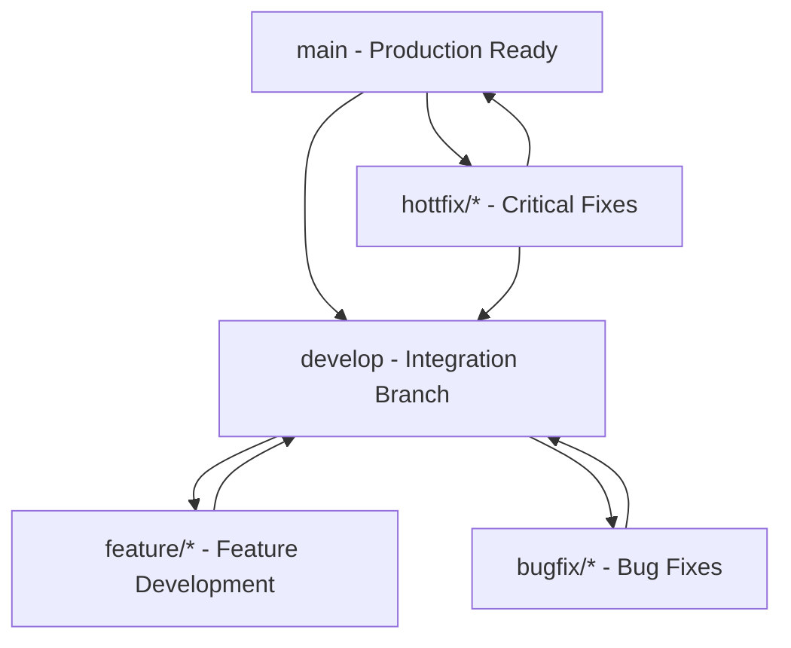
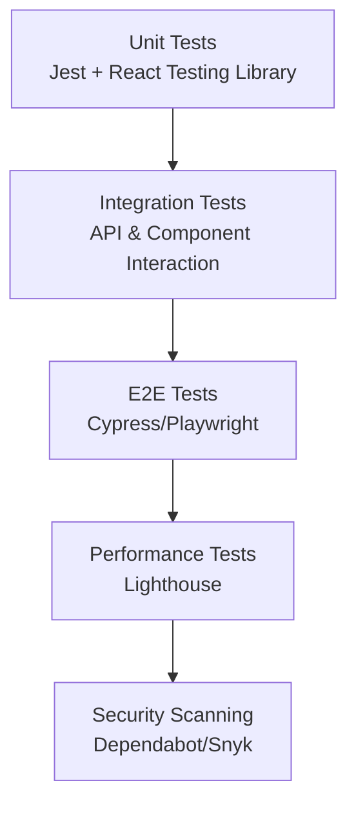
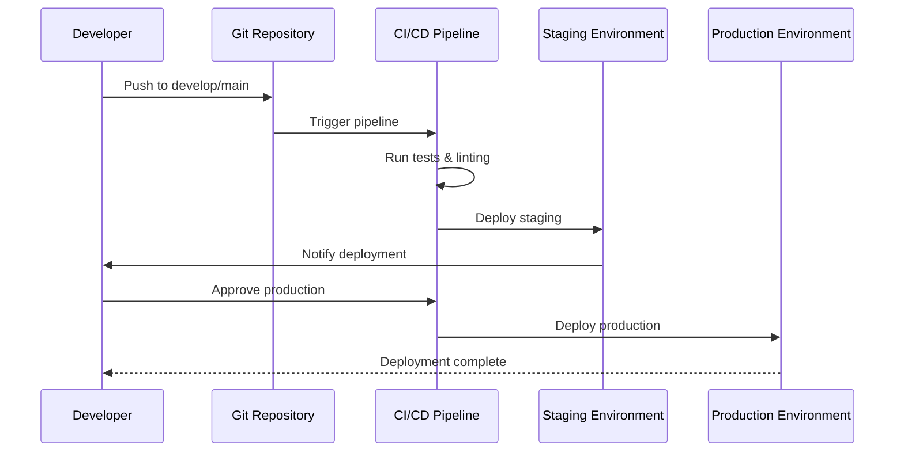

# Development Workflow and Git Process

<cite>
**Referenced Files in This Document**
- [README.md](file://README.md)
- [package.json](file://package.json)
- [.gitignore](file://.gitignore)
- [AGENTS.md](file://AGENTS.md)
- [CLAUDE.md](file://CLAUDE.md)
- [next.config.ts](file://next.config.ts)
- [tsconfig.json](file://tsconfig.json)
- [eslint.config.mjs](file://eslint.config.mjs)
- [tailwind.config.ts](file://tailwind.config.ts)
- [proxy.ts](file://proxy.ts)
</cite>

## Table of Contents
1. [Introduction](#introduction)
2. [Project Structure Overview](#project-structure-overview)
3. [Development Environment Setup](#development-environment-setup)
4. [Branching Strategy](#branching-strategy)
5. [Commit Message Conventions](#commit-message-conventions)
6. [Pull Request Requirements](#pull-request-requirements)
7. [Code Review Process](#code-review-process)
8. [Testing Requirements](#testing-requirements)
9. [Deployment Procedures](#deployment-procedures)
10. [Feature Development Guidelines](#feature-development-guidelines)
11. [Bug Fix and Hotfix Procedures](#bug-fix-and-hotfix-procedures)
12. [Conflict Resolution Strategies](#conflict-resolution-strategies)
13. [Version Control Best Practices](#version-control-best-practices)
14. [Team Collaboration Workflows](#team-collaboration-workflows)
15. [Common Development Tasks](#common-development-tasks)
16. [Troubleshooting Common Git Issues](#troubleshooting-common-git-issues)
17. [Conclusion](#conclusion)

## Introduction

This document outlines the comprehensive development workflow and Git contribution process for the Automex Frontend project. It serves as a guide for all team members to ensure consistent development practices, maintain code quality, and facilitate smooth collaboration across the development team. The workflow is designed for a modern Next.js application with TypeScript, following industry best practices for frontend development.

## Project Structure Overview

The Automex Frontend project follows a feature-based architecture organized within a Next.js 14+ application structure:

```mermaid
graph TB
subgraph "Application Structure"
APP[app/ - Next.js App Router]
COMPONENTS[components/ - Reusable Components]
CONFIG[config/ - Configuration Files]
CONTEXTS[contexts/ - React Contexts]
LIB[lib/ - Utility Libraries]
MESSAGES[messages/ - i18n Translations]
PROVIDERS[providers/ - React Providers]
PUBLIC[public/ - Static Assets]
end
subgraph "App Organization"
ROUTES[(routes)/ - Public Routes]
AUTH(auth)/ - Authentication Routes]
DASHBOARD[dashboard/ - Protected Routes]
API[api/ - Server Actions & API Routes]
end
APP --> ROUTES
APP --> AUTH
APP --> DASHBOARD
APP --> API
APP --> COMPONENTS
APP --> CONFIG
APP --> CONTEXTS
APP --> LIB
APP --> MESSAGES
APP --> PROVIDERS
APP --> PUBLIC
```

**Diagram sources**
- [next.config.ts:1-50](file://next.config.ts#L1-L50)
- [tsconfig.json:1-30](file://tsconfig.json#L1-L30)

**Section sources**
- [next.config.ts:1-100](file://next.config.ts#L1-L100)
- [tsconfig.json:1-50](file://tsconfig.json#L1-L50)

## Development Environment Setup

### Prerequisites
- Node.js 18.x or later
- npm 9.x or later (or yarn/pnpm)
- Git 2.x or later

### Initial Setup
1. Clone the repository:
   ```bash
   git clone <repository-url>
   cd automex-frontend
   ```

2. Install dependencies:
   ```bash
   npm install
   ```

3. Set up environment variables:
   ```bash
   cp .env.example .env.local
   # Configure required environment variables
   ```

4. Start development server:
   ```bash
   npm run dev
   ```

### Environment Configuration
The project uses environment variables for configuration management. Key environment files include:
- `.env.local` - Local development environment
- `.env.production` - Production environment
- `.env.development` - Development-specific settings

**Section sources**
- [package.json:1-50](file://package.json#L1-L50)
- [proxy.ts:1-30](file://proxy.ts#L1-L30)

## Branching Strategy

The project follows a modified Git Flow branching strategy optimized for modern web development:



### Branch Naming Conventions
- **Feature branches**: `feature/description-of-feature`
- **Bug fix branches**: `bugfix/description-of-bug`
- **Hotfix branches**: `hotfix/critical-issue-description`
- **Release branches**: `release/vX.Y.Z`
- **Development branch**: `develop`
- **Production branch**: `main`

### Branch Protection Rules
- `main` and `develop` branches are protected
- Pull requests require at least one approval
- All checks must pass before merging
- Direct pushes to protected branches are disabled

**Section sources**
- [AGENTS.md:1-100](file://AGENTS.md#L1-L100)
- [CLAUDE.md:1-50](file://CLAUDE.md#L1-L50)

## Commit Message Conventions

The project follows the Conventional Commits specification for consistent commit history:

### Commit Message Format
```
type(scope): description

[optional body]

[optional footer(s)]
```

### Allowed Types
- `feat`: A new feature
- `fix`: A bug fix
- `docs`: Documentation only changes
- `style`: Changes that do not affect the meaning of the code
- `refactor`: A code change that neither fixes a bug nor adds a feature
- `perf`: A code change that improves performance
- `test`: Adding missing tests or correcting existing tests
- `chore`: Changes to the build process or auxiliary tools

### Examples
- `feat(auth): add Google OAuth integration`
- `fix(crm): resolve booking date picker issue`
- `docs(readme): update installation instructions`
- `refactor(ui): improve button component accessibility`

### Commit Hooks
The project includes Husky and lint-staged for automated commit validation:
- ESLint checks on staged files
- Prettier formatting enforcement
- Commit message validation

**Section sources**
- [AGENTS.md:50-150](file://AGENTS.md#L50-L150)
- [CLAUDE.md:20-80](file://CLAUDE.md#L20-L80)

## Pull Request Requirements

All code changes must go through pull requests with the following requirements:

### PR Template Requirements
- Clear description of changes
- Related issue numbers
- Screenshots for UI changes
- Testing evidence
- Breaking changes documentation

### Required Checks
- Code style validation (ESLint)
- Type checking (TypeScript)
- Unit tests passing
- Build verification
- Security scanning

### Review Requirements
- At least one approving review
- All comments resolved
- CI/CD pipeline green
- No merge conflicts

### PR Labels
- `feature` - New functionality
- `bug` - Bug fixes
- `enhancement` - Improvements
- `documentation` - Docs updates
- `breaking-change` - Incompatible changes

**Section sources**
- [AGENTS.md:100-200](file://AGENTS.md#L100-L200)
- [CLAUDE.md:50-120](file://CLAUDE.md#L50-L120)

## Code Review Process

### Review Checklist
- Code quality and readability
- Performance implications
- Security considerations
- Accessibility compliance
- Test coverage
- Documentation updates

### Review Guidelines
- Be constructive and respectful
- Focus on code, not the person
- Explain reasoning behind suggestions
- Ask questions rather than making demands
- Acknowledge good work and improvements

### Review Timeline
- Initial review within 24 hours
- Follow-up reviews within 12 hours
- Urgent hotfixes reviewed immediately

**Section sources**
- [AGENTS.md:150-250](file://AGENTS.md#L150-L250)

## Testing Requirements

### Testing Strategy
The project implements a comprehensive testing approach:



### Test Coverage Requirements
- Minimum 80% unit test coverage
- Critical paths must have 100% coverage
- All user-facing components tested
- API endpoints validated

### Running Tests
```bash
# Run all tests
npm test

# Run specific test suite
npm test -- --testPathPattern=auth

# Generate coverage report
npm test -- --coverage

# Run E2E tests
npm run test:e2e
```

**Section sources**
- [package.json:30-80](file://package.json#L30-L80)

## Deployment Procedures

### Deployment Pipeline
The project uses a multi-stage deployment process:



### Environments
- **Development**: Local development environment
- **Staging**: Pre-production testing environment
- **Production**: Live production environment

### Deployment Commands
```bash
# Build for production
npm run build

# Preview production build locally
npm run preview

# Deploy to Vercel (if applicable)
vercel deploy
```

**Section sources**
- [package.json:50-100](file://package.json#L50-L100)
- [next.config.ts:1-50](file://next.config.ts#L1-L50)

## Feature Development Guidelines

### Feature Branch Workflow
1. Create feature branch from `develop`:
   ```bash
   git checkout develop
   git pull origin develop
   git checkout -b feature/new-feature-name
   ```

2. Implement feature with regular commits
3. Update tests and documentation
4. Create pull request to `develop`

### Feature Requirements
- Clear feature specification
- User stories or acceptance criteria
- UI/UX design (if applicable)
- API contracts (if backend integration)
- Migration scripts (if database changes)

### Code Organization
- Place related components in feature folders
- Use feature-based directory structure
- Maintain separation of concerns
- Follow established patterns

**Section sources**
- [AGENTS.md:200-300](file://AGENTS.md#L200-L300)

## Bug Fix and Hotfix Procedures

### Bug Fix Process
1. Reproduce and document the bug
2. Create bug fix branch:
   ```bash
   git checkout -b bugfix/issue-description
   ```
3. Implement fix with minimal changes
4. Add regression tests
5. Submit PR to `develop`

### Hotfix Process
For critical production issues:
1. Create hotfix branch from `main`:
   ```bash
   git checkout -b hotfix/critical-issue
   ```
2. Implement urgent fix
3. Test thoroughly
4. Merge to `main` and `develop`
5. Create release tag

### Severity Levels
- **Critical**: System down or data loss risk
- **High**: Major functionality broken
- **Medium**: Significant inconvenience
- **Low**: Minor issue or cosmetic problem

**Section sources**
- [AGENTS.md:250-350](file://AGENTS.md#L250-L350)

## Conflict Resolution Strategies

### Preventing Conflicts
- Frequent pulls from main branch
- Small, focused commits
- Regular communication about overlapping work
- Clear ownership of code areas

### Resolving Conflicts
1. Identify conflicting files:
   ```bash
   git status
   ```

2. Pull latest changes:
   ```bash
   git pull origin develop
   ```

3. Resolve conflicts manually:
   - Open conflicted files
   - Choose appropriate changes
   - Remove conflict markers
   - Test the resolution

4. Complete the merge:
   ```bash
   git add .
   git commit -m "Resolve merge conflicts"
   ```

### Best Practices
- Communicate with team members about overlapping changes
- Use feature flags for experimental changes
- Keep branches short-lived
- Regular rebasing to minimize conflicts

**Section sources**
- [CLAUDE.md:80-150](file://CLAUDE.md#L80-L150)

## Version Control Best Practices

### Commit Hygiene
- Atomic commits (one logical change per commit)
- Descriptive commit messages
- Include context in commit bodies
- Reference related issues

### Branch Management
- Delete merged branches regularly
- Use descriptive branch names
- Keep branches updated with main
- Avoid long-lived feature branches

### Tagging and Releases
- Semantic versioning (MAJOR.MINOR.PATCH)
- Release notes for each version
- Tag releases in Git
- Document breaking changes

### Security Considerations
- Never commit secrets or credentials
- Use environment variables for sensitive data
- Regular dependency updates
- Security scanning in CI/CD

**Section sources**
- [AGENTS.md:300-400](file://AGENTS.md#L300-L400)
- [.gitignore:1-50](file://.gitignore#L1-L50)

## Team Collaboration Workflows

### Communication Channels
- Slack for real-time communication
- GitHub Issues for task tracking
- Pull Requests for code review
- Documentation for knowledge sharing

### Role Responsibilities
- **Developers**: Write code, write tests, create PRs
- **Reviewers**: Provide feedback, approve changes
- **Maintainers**: Merge PRs, manage releases
- **QA**: Test deployments, report bugs

### Meeting Cadence
- Daily standups for progress updates
- Weekly planning sessions
- Bi-weekly retrospectives
- Monthly tech talks

### Knowledge Sharing
- Document architectural decisions
- Share learning resources
- Conduct code walkthroughs
- Maintain up-to-date documentation

**Section sources**
- [AGENTS.md:350-450](file://AGENTS.md#L350-L450)
- [CLAUDE.md:120-200](file://CLAUDE.md#L120-L200)

## Common Development Tasks

### Starting a New Feature
```bash
# 1. Sync with develop
git checkout develop
git pull origin develop

# 2. Create feature branch
git checkout -b feature/add-user-profile

# 3. Make changes and commit
git add .
git commit -m "feat(user): add user profile page"

# 4. Push and create PR
git push origin feature/add-user-profile
```

### Updating Dependencies
```bash
# Check for outdated packages
npm outdated

# Update specific package
npm update package-name

# Update all packages
npm update

# Audit for security vulnerabilities
npm audit
```

### Debugging Issues
```bash
# Start development server with debugging
npm run dev -- --inspect

# View build logs
npm run build --verbose

# Check TypeScript errors
npm run type-check
```

### Code Quality
```bash
# Run linter
npm run lint

# Fix linting issues automatically
npm run lint:fix

# Format code
npm run format

# Type checking
npm run type-check
```

**Section sources**
- [package.json:1-150](file://package.json#L1-L150)

## Troubleshooting Common Git Issues

### Issue: Merge Conflicts
**Problem**: Git cannot automatically merge changes
**Solution**: 
1. Identify conflicting files
2. Manually resolve conflicts
3. Test the resolution
4. Complete the merge

### Issue: Detached HEAD State
**Problem**: Working on detached HEAD
**Solution**:
```bash
# Create new branch from current state
git checkout -b new-branch-name

# Or return to previous branch
git checkout develop
```

### Issue: Lost Commits
**Problem**: Accidentally lost work
**Solution**:
```bash
# Find lost commits
git reflog

# Recover specific commit
git checkout <commit-hash>
```

### Issue: Large File Commits
**Problem**: Accidentally committed large files
**Solution**:
```bash
# Remove file from Git history
git rm --cached large-file.txt
git commit -m "Remove large file from tracking"

# Add to .gitignore
echo "large-file.txt" >> .gitignore
```

### Issue: Branch Not Found
**Problem**: Remote branch deleted but local reference exists
**Solution**:
```bash
# Clean up remote references
git fetch --prune

# Delete local branch if needed
git branch -d feature/old-feature
```

**Section sources**
- [AGENTS.md:400-500](file://AGENTS.md#L400-L500)

## Conclusion

This development workflow and Git process documentation provides a comprehensive framework for effective collaboration and code management in the Automex Frontend project. By following these guidelines, the team can maintain high code quality, ensure consistent development practices, and deliver features efficiently.

Key principles to remember:
- Communicate frequently with team members
- Write clear, descriptive commit messages
- Keep branches small and focused
- Review code thoroughly before merging
- Test changes comprehensively
- Document important decisions and processes

Regular review and updates to this document will ensure it remains relevant as the project and team evolve. All team members should contribute to improving these workflows based on their experiences and insights.