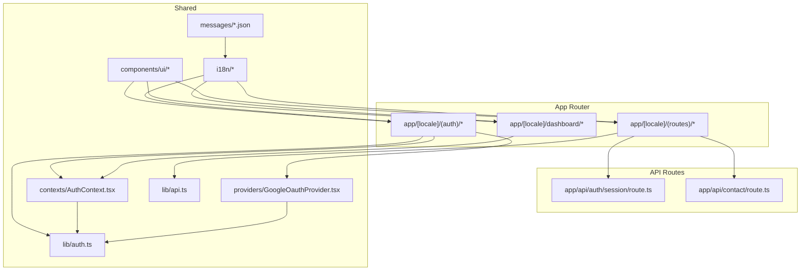
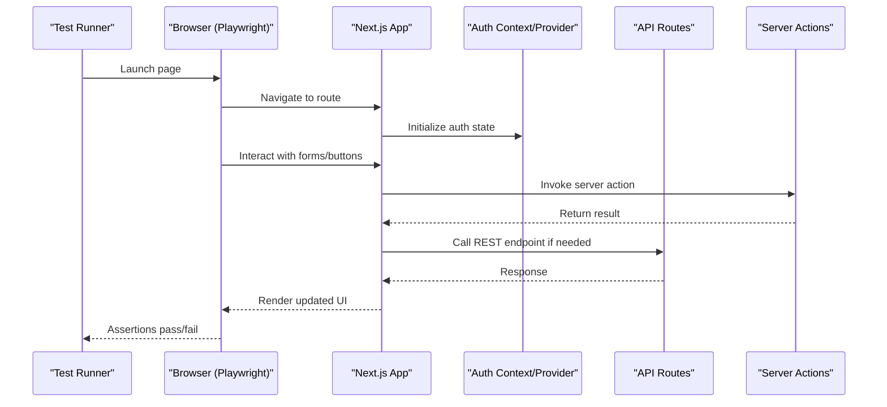
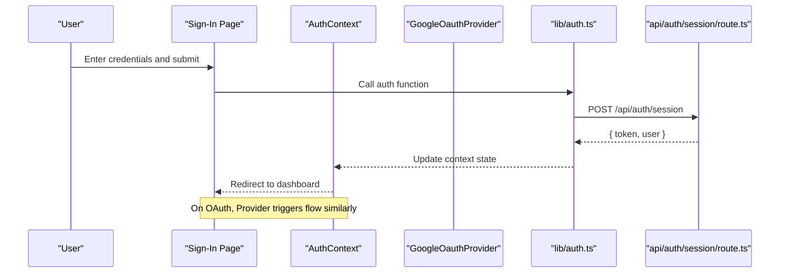
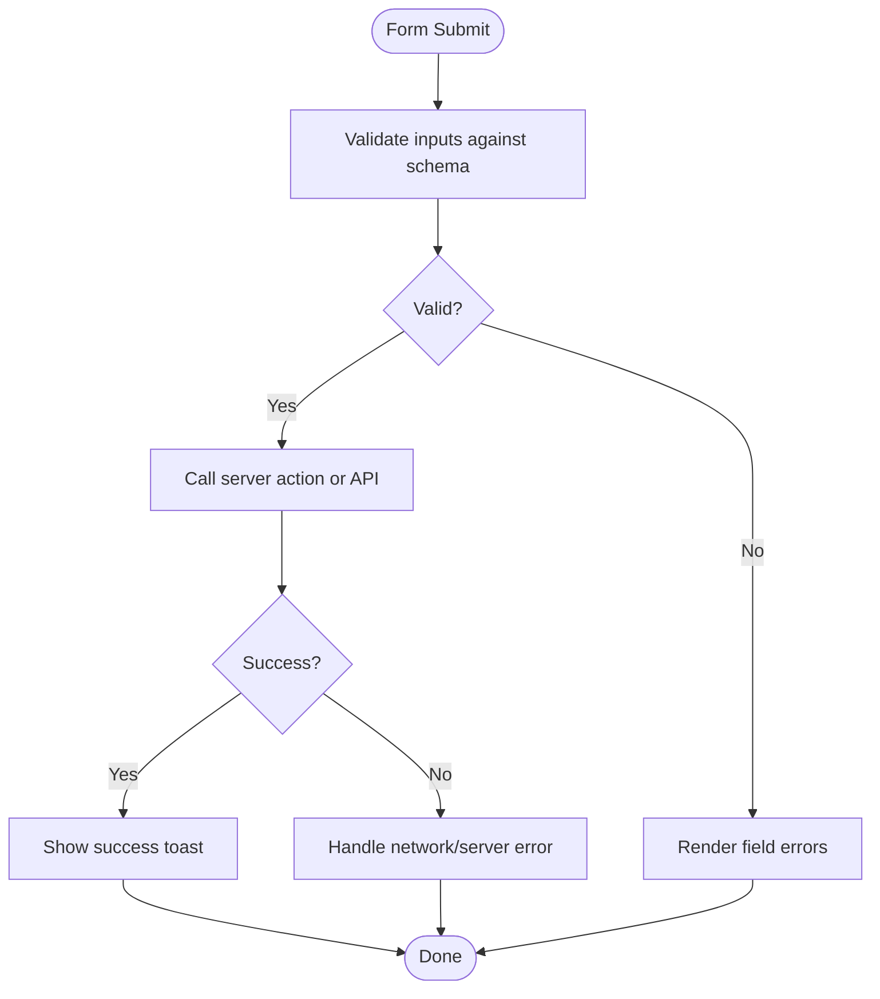
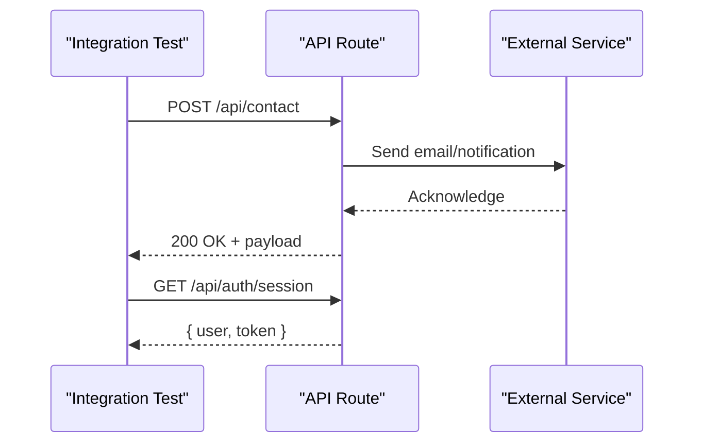
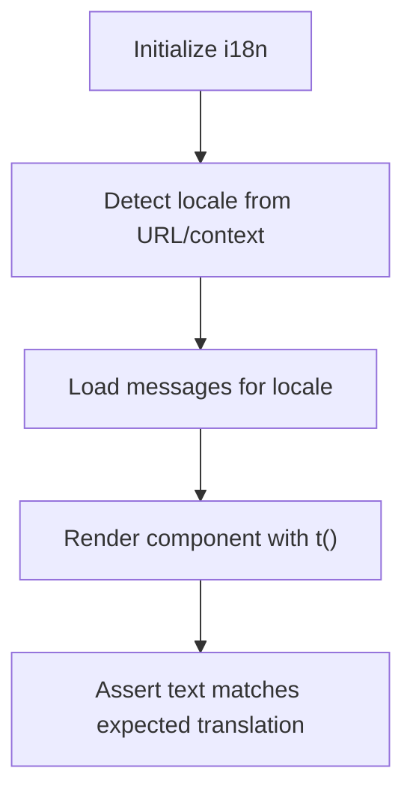
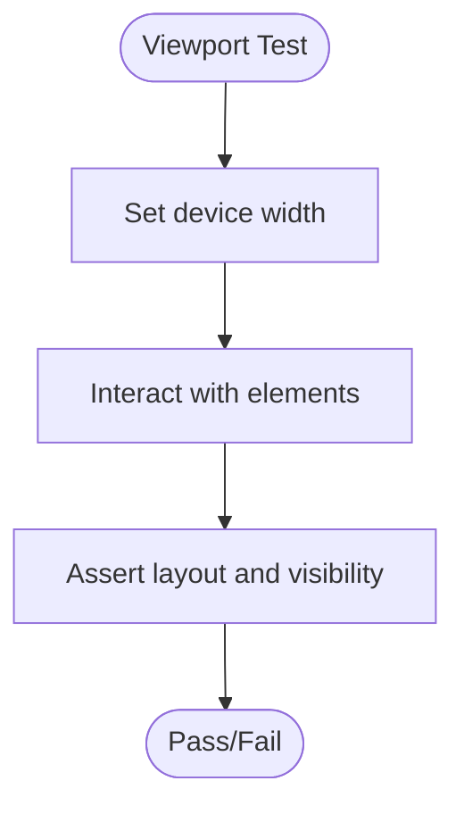
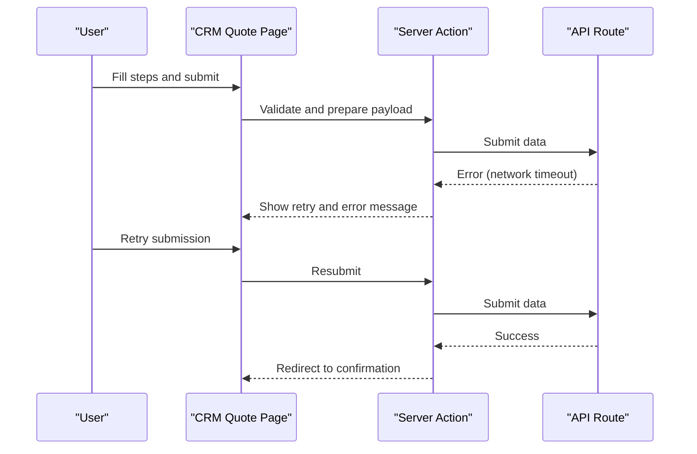
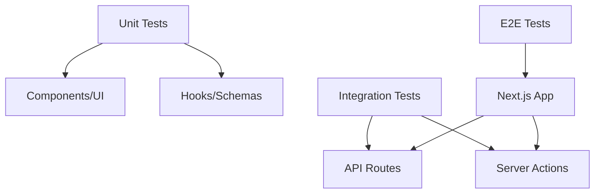

# Testing Strategy and Implementation

<cite>
**Referenced Files in This Document**
- [package.json](file://package.json)
- [next.config.ts](file://next.config.ts)
- [tsconfig.json](file://tsconfig.json)
- [app/[locale]/(auth)/layout.tsx](file://app/[locale]/(auth)/layout.tsx)
- [app/[locale]/(auth)/sign-in/page.tsx](file://app/[locale]/(auth)/sign-in/page.tsx)
- [app/[locale]/(auth)/sign-up/page.tsx](file://app/[locale]/(auth)/sign-up/page.tsx)
- [app/[locale]/(auth)/forgot-password/page.tsx](file://app/[locale]/(auth)/forgot-password/page.tsx)
- [app/[locale]/(auth)/auth/magic-link/page.tsx](file://app/[locale]/(auth)/auth/magic-link/page.tsx)
- [app/[locale]/(auth)/auth/reset-password/page.tsx](file://app/[locale]/(auth)/auth/reset-password/page.tsx)
- [app/[locale]/(auth)/auth/verify-email/page.tsx](file://app/[locale]/(auth)/auth/verify-email/page.tsx)
- [app/[locale]/(auth)/_components/AuthFormField.tsx](file://app/[locale]/(auth)/_components/AuthFormField.tsx)
- [app/[locale]/(auth)/_components/PasswordInput.tsx](file://app/[locale]/(auth)/_components/PasswordInput.tsx)
- [app/[locale]/(auth)/_components/GoogleButton.tsx](file://app/[locale]/(auth)/_components/GoogleButton.tsx)
- [contexts/AuthContext.tsx](file://contexts/AuthContext.tsx)
- [providers/GoogleOauthProvider.tsx](file://providers/GoogleOauthProvider.tsx)
- [lib/auth.ts](file://lib/auth.ts)
- [lib/api.ts](file://lib/api.ts)
- [app/api/auth/session/route.ts](file://app/api/auth/session/route.ts)
- [app/api/contact/route.ts](file://app/api/contact/route.ts)
- [i18n/request.ts](file://i18n/request.ts)
- [i18n/routing.ts](file://i18n/routing.ts)
- [messages/en.json](file://messages/en.json)
- [messages/ar.json](file://messages/ar.json)
- [app/[locale]/dashboard/layout.tsx](file://app/[locale]/dashboard/layout.tsx)
- [app/[locale]/dashboard/_components/DashboardMain.tsx](file://app/[locale]/dashboard/_components/DashboardMain.tsx)
- [app/[locale]/dashboard/(routes)/profile/page.tsx](file://app/[locale]/dashboard/(routes)/profile/page.tsx)
- [app/[locale]/dashboard/(routes)/security/page.tsx](file://app/[locale]/dashboard/(routes)/security/page.tsx)
- [app/[locale]/dashboard/(routes)/consulting/page.tsx](file://app/[locale]/dashboard/(routes)/consulting/page.tsx)
- [app/[locale]/dashboard/(routes)/services/page.tsx](file://app/[locale]/dashboard/(routes)/services/page.tsx)
- [app/[locale]/dashboard/(routes)/support/page.tsx](file://app/[locale]/dashboard/(routes)/support/page.tsx)
- [app/[locale]/dashboard/(routes)/notifications/page.tsx](file://app/[locale]/dashboard/(routes)/notifications/page.tsx)
- [app/[locale]/dashboard/(routes)/projects/page.tsx](file://app/[locale]/dashboard/(routes)/projects/page.tsx)
- [app/[locale]/(routes)/crm/actions.ts](file://app/[locale]/(routes)/crm/actions.ts)
- [app/[locale]/(routes)/crm/book-a-call/page.tsx](file://app/[locale]/(routes)/crm/book-a-call/page.tsx)
- [app/[locale]/(routes)/crm/contact-sales/page.tsx](file://app/[locale]/(routes)/crm/contact-sales/page.tsx)
- [app/[locale]/(routes)/crm/quote/page.tsx](file://app/[locale]/(routes)/crm/quote/page.tsx)
- [app/[locale]/(routes)/crm/_components/crm-shared/hooks/useCrmFormSubmit.ts](file://app/[locale]/(routes)/crm/_components/crm-shared/hooks/useCrmFormSubmit.ts)
- [app/[locale]/(routes)/crm/_components/crm-shared/fields/schemas.ts](file://app/[locale]/(routes)/crm/_components/crm-shared/fields/schemas.ts)
- [app/[locale]/(routes)/crm/_components/crm-shared/fields/BudgetTimelineFields.tsx](file://app/[locale]/(routes)/crm/_components/crm-shared/fields/BudgetTimelineFields.tsx)
- [app/[locale]/(routes)/crm/_components/crm-shared/fields/ServiceMultiSelect.tsx](file://app/[locale]/(routes)/crm/_components/crm-shared/fields/ServiceMultiSelect.tsx)
- [app/[locale]/(routes)/crm/_components/crm-shared/booking/DatePicker.tsx](file://app/[locale]/(routes)/crm/_components/crm-shared/booking/DatePicker.tsx)
- [app/[locale]/(routes)/crm/_components/crm-shared/booking/SlotPicker.tsx](file://app/[locale]/(routes)/crm/_components/crm-shared/booking/SlotPicker.tsx)
- [app/[locale]/(routes)/services/page.tsx](file://app/[locale]/(routes)/services/page.tsx)
- [app/[locale]/(routes)/services/[slug]/page.tsx](file://app/[locale]/(routes)/services/[slug]/page.tsx)
- [app/[locale]/(routes)/about/page.tsx](file://app/[locale]/(routes)/about/page.tsx)
- [app/[locale]/(routes)/contact/page.tsx](file://app/[locale]/(routes)/contact/page.tsx)
- [app/[locale]/(routes)/privacy/page.tsx](file://app/[locale]/(routes)/privacy/page.tsx)
- [components/ui/button.tsx](file://components/ui/button.tsx)
- [components/ui/input.tsx](file://components/ui/input.tsx)
- [components/ui/select.tsx](file://components/ui/select.tsx)
- [components/ui/textarea.tsx](file://components/ui/textarea.tsx)
- [components/ui/checkbox.tsx](file://components/ui/checkbox.tsx)
- [components/ui/alert-dialog.tsx](file://components/ui/alert-dialog.tsx)
- [components/ui/dialog.tsx](file://components/ui/dialog.tsx)
- [components/ui/popover.tsx](file://components/ui/popover.tsx)
- [components/ui/sonner.tsx](file://components/ui/sonner.tsx)
</cite>

## Table of Contents
1. Introduction
2. Project Structure
3. Core Components
4. Architecture Overview
5. Detailed Component Analysis
6. Dependency Analysis
7. Performance Considerations
8. Troubleshooting Guide
9. Conclusion
10. Appendices

## Introduction
This document defines a comprehensive testing strategy for the project, covering unit tests, integration tests, and end-to-end (E2E) tests. It explains how to test React components, hooks, server actions, authentication flows, internationalization, responsive design, and complex user journeys. It also provides guidelines for maintainable tests, coverage targets, and continuous integration setup.

## Project Structure
The application is a Next.js app with:
- App Router pages under app/[locale]
- Authentication routes under (auth)
- Dashboard routes under dashboard
- CRM and marketing routes under (routes)
- API routes under api
- Shared UI components under components/ui
- Internationalization under i18n and messages
- Contexts and providers for auth and theme

[No sources needed since this diagram shows conceptual structure, not specific code relationships]

## Core Components
Key areas that require focused testing:
- Authentication flows: sign-in, sign-up, magic link, reset password, verify email
- Dashboard protected routes and profile/security forms
- CRM multi-step forms and server actions
- API routes for session and contact
- Internationalization across locales
- Responsive behavior of shared UI components

Testing priorities:
- Unit tests for pure logic, schemas, and small utilities
- Integration tests for form submissions, server actions, and API routes
- E2E tests for complete user journeys across locales and devices

**Section sources**
- [app/[locale]/(auth)/layout.tsx](file://app/[locale]/(auth)/layout.tsx)
- [app/[locale]/(auth)/sign-in/page.tsx](file://app/[locale]/(auth)/sign-in/page.tsx)
- [app/[locale]/(auth)/sign-up/page.tsx](file://app/[locale]/(auth)/sign-up/page.tsx)
- [app/[locale]/(auth)/forgot-password/page.tsx](file://app/[locale]/(auth)/forgot-password/page.tsx)
- [app/[locale]/(auth)/auth/magic-link/page.tsx](file://app/[locale]/(auth)/auth/magic-link/page.tsx)
- [app/[locale]/(auth)/auth/reset-password/page.tsx](file://app/[locale]/(auth)/auth/reset-password/page.tsx)
- [app/[locale]/(auth)/auth/verify-email/page.tsx](file://app/[locale]/(auth)/auth/verify-email/page.tsx)
- [contexts/AuthContext.tsx](file://contexts/AuthContext.tsx)
- [providers/GoogleOauthProvider.tsx](file://providers/GoogleOauthProvider.tsx)
- [lib/auth.ts](file://lib/auth.ts)
- [lib/api.ts](file://lib/api.ts)
- [app/api/auth/session/route.ts](file://app/api/auth/session/route.ts)
- [app/api/contact/route.ts](file://app/api/contact/route.ts)
- [i18n/request.ts](file://i18n/request.ts)
- [i18n/routing.ts](file://i18n/routing.ts)
- [messages/en.json](file://messages/en.json)
- [messages/ar.json](file://messages/ar.json)
- [app/[locale]/dashboard/layout.tsx](file://app/[locale]/dashboard/layout.tsx)
- [app/[locale]/dashboard/_components/DashboardMain.tsx](file://app/[locale]/dashboard/_components/DashboardMain.tsx)
- [app/[locale]/dashboard/(routes)/profile/page.tsx](file://app/[locale]/dashboard/(routes)/profile/page.tsx)
- [app/[locale]/dashboard/(routes)/security/page.tsx](file://app/[locale]/dashboard/(routes)/security/page.tsx)
- [app/[locale]/(routes)/crm/actions.ts](file://app/[locale]/(routes)/crm/actions.ts)
- [app/[locale]/(routes)/crm/book-a-call/page.tsx](file://app/[locale]/(routes)/crm/book-a-call/page.tsx)
- [app/[locale]/(routes)/crm/contact-sales/page.tsx](file://app/[locale]/(routes)/crm/contact-sales/page.tsx)
- [app/[locale]/(routes)/crm/quote/page.tsx](file://app/[locale]/(routes)/crm/quote/page.tsx)
- [app/[locale]/(routes)/crm/_components/crm-shared/hooks/useCrmFormSubmit.ts](file://app/[locale]/(routes)/crm/_components/crm-shared/hooks/useCrmFormSubmit.ts)
- [app/[locale]/(routes)/crm/_components/crm-shared/fields/schemas.ts](file://app/[locale]/(routes)/crm/_components/crm-shared/fields/schemas.ts)
- [app/[locale]/(routes)/crm/_components/crm-shared/fields/BudgetTimelineFields.tsx](file://app/[locale]/(routes)/crm/_components/crm-shared/fields/BudgetTimelineFields.tsx)
- [app/[locale]/(routes)/crm/_components/crm-shared/fields/ServiceMultiSelect.tsx](file://app/[locale]/(routes)/crm/_components/crm-shared/fields/ServiceMultiSelect.tsx)
- [app/[locale]/(routes)/crm/_components/crm-shared/booking/DatePicker.tsx](file://app/[locale]/(routes)/crm/_components/crm-shared/booking/DatePicker.tsx)
- [app/[locale]/(routes)/crm/_components/crm-shared/booking/SlotPicker.tsx](file://app/[locale]/(routes)/crm/_components/crm-shared/booking/SlotPicker.tsx)
- [app/[locale]/(routes)/services/page.tsx](file://app/[locale]/(routes)/services/page.tsx)
- [app/[locale]/(routes)/services/[slug]/page.tsx](file://app/[locale]/(routes)/services/[slug]/page.tsx)
- [app/[locale]/(routes)/about/page.tsx](file://app/[locale]/(routes)/about/page.tsx)
- [app/[locale]/(routes)/contact/page.tsx](file://app/[locale]/(routes)/contact/page.tsx)
- [app/[locale]/(routes)/privacy/page.tsx](file://app/[locale]/(routes)/privacy/page.tsx)
- [components/ui/button.tsx](file://components/ui/button.tsx)
- [components/ui/input.tsx](file://components/ui/input.tsx)
- [components/ui/select.tsx](file://components/ui/select.tsx)
- [components/ui/textarea.tsx](file://components/ui/textarea.tsx)
- [components/ui/checkbox.tsx](file://components/ui/checkbox.tsx)
- [components/ui/alert-dialog.tsx](file://components/ui/alert-dialog.tsx)
- [components/ui/dialog.tsx](file://components/ui/dialog.tsx)
- [components/ui/popover.tsx](file://components/ui/popover.tsx)
- [components/ui/sonner.tsx](file://components/ui/sonner.tsx)

## Architecture Overview
The testing architecture spans three layers:
- Unit layer: component and hook tests using a React testing library
- Integration layer: server actions, API routes, and form workflows
- E2E layer: full browser automation across locales and devices

[No sources needed since this diagram shows conceptual workflow, not actual code structure]

## Detailed Component Analysis

### Authentication Flow Testing
Scope:
- Sign-in, sign-up, forgot password, magic link, reset password, verify email
- Protected dashboard access after login
- OAuth via Google provider

Approach:
- Unit tests for input validation and error messages on auth fields
- Integration tests for server-side auth endpoints and session handling
- E2E tests for complete login flows and redirections

**Diagram sources**
- [app/[locale]/(auth)/sign-in/page.tsx](file://app/[locale]/(auth)/sign-in/page.tsx)
- [contexts/AuthContext.tsx](file://contexts/AuthContext.tsx)
- [providers/GoogleOauthProvider.tsx](file://providers/GoogleOauthProvider.tsx)
- [lib/auth.ts](file://lib/auth.ts)
- [app/api/auth/session/route.ts](file://app/api/auth/session/route.ts)

**Section sources**
- [app/[locale]/(auth)/sign-in/page.tsx](file://app/[locale]/(auth)/sign-in/page.tsx)
- [app/[locale]/(auth)/sign-up/page.tsx](file://app/[locale]/(auth)/sign-up/page.tsx)
- [app/[locale]/(auth)/forgot-password/page.tsx](file://app/[locale]/(auth)/forgot-password/page.tsx)
- [app/[locale]/(auth)/auth/magic-link/page.tsx](file://app/[locale]/(auth)/auth/magic-link/page.tsx)
- [app/[locale]/(auth)/auth/reset-password/page.tsx](file://app/[locale]/(auth)/auth/reset-password/page.tsx)
- [app/[locale]/(auth)/auth/verify-email/page.tsx](file://app/[locale]/(auth)/auth/verify-email/page.tsx)
- [contexts/AuthContext.tsx](file://contexts/AuthContext.tsx)
- [providers/GoogleOauthProvider.tsx](file://providers/GoogleOauthProvider.tsx)
- [lib/auth.ts](file://lib/auth.ts)
- [app/api/auth/session/route.ts](file://app/api/auth/session/route.ts)

### Form Validation and Submission Testing
Scope:
- CRM multi-step forms (budget timeline, service selection, booking date/time)
- Profile and security forms in dashboard
- Contact and quote forms

Approach:
- Schema-level unit tests for validation rules
- Hook-level tests for submission logic and loading/error states
- Integration tests for server actions and API calls
- E2E tests for full form interactions and success paths

**Diagram sources**
- [app/[locale]/(routes)/crm/_components/crm-shared/hooks/useCrmFormSubmit.ts](file://app/[locale]/(routes)/crm/_components/crm-shared/hooks/useCrmFormSubmit.ts)
- [app/[locale]/(routes)/crm/_components/crm-shared/fields/schemas.ts](file://app/[locale]/(routes)/crm/_components/crm-shared/fields/schemas.ts)
- [app/[locale]/(routes)/crm/actions.ts](file://app/[locale]/(routes)/crm/actions.ts)
- [components/ui/sonner.tsx](file://components/ui/sonner.tsx)

**Section sources**
- [app/[locale]/(routes)/crm/_components/crm-shared/hooks/useCrmFormSubmit.ts](file://app/[locale]/(routes)/crm/_components/crm-shared/hooks/useCrmFormSubmit.ts)
- [app/[locale]/(routes)/crm/_components/crm-shared/fields/schemas.ts](file://app/[locale]/(routes)/crm/_components/crm-shared/fields/schemas.ts)
- [app/[locale]/(routes)/crm/_components/crm-shared/fields/BudgetTimelineFields.tsx](file://app/[locale]/(routes)/crm/_components/crm-shared/fields/BudgetTimelineFields.tsx)
- [app/[locale]/(routes)/crm/_components/crm-shared/fields/ServiceMultiSelect.tsx](file://app/[locale]/(routes)/crm/_components/crm-shared/fields/ServiceMultiSelect.tsx)
- [app/[locale]/(routes)/crm/_components/crm-shared/booking/DatePicker.tsx](file://app/[locale]/(routes)/crm/_components/crm-shared/booking/DatePicker.tsx)
- [app/[locale]/(routes)/crm/_components/crm-shared/booking/SlotPicker.tsx](file://app/[locale]/(routes)/crm/_components/crm-shared/booking/SlotPicker.tsx)
- [app/[locale]/(routes)/crm/actions.ts](file://app/[locale]/(routes)/crm/actions.ts)
- [app/[locale]/dashboard/(routes)/profile/page.tsx](file://app/[locale]/dashboard/(routes)/profile/page.tsx)
- [app/[locale]/dashboard/(routes)/security/page.tsx](file://app/[locale]/dashboard/(routes)/security/page.tsx)
- [app/[locale]/(routes)/contact/page.tsx](file://app/[locale]/(routes)/contact/page.tsx)
- [app/[locale]/(routes)/crm/quote/page.tsx](file://app/[locale]/(routes)/crm/quote/page.tsx)

### API Integration Testing
Scope:
- Session management endpoint
- Contact submission endpoint

Approach:
- Use Node fetch or HTTP client to call API routes directly
- Assert status codes, response shapes, and side effects (e.g., cookies, redirects)
- Mock external dependencies if any

**Diagram sources**
- [app/api/contact/route.ts](file://app/api/contact/route.ts)
- [app/api/auth/session/route.ts](file://app/api/auth/session/route.ts)

**Section sources**
- [app/api/contact/route.ts](file://app/api/contact/route.ts)
- [app/api/auth/session/route.ts](file://app/api/auth/session/route.ts)
- [lib/api.ts](file://lib/api.ts)

### Internationalization Testing
Scope:
- Locale routing and content switching
- RTL support for Arabic
- Message keys availability

Approach:
- Unit tests for message key presence per locale
- Component tests rendering localized strings
- E2E tests verifying language switcher and URL locale prefix

**Diagram sources**
- [i18n/request.ts](file://i18n/request.ts)
- [i18n/routing.ts](file://i18n/routing.ts)
- [messages/en.json](file://messages/en.json)
- [messages/ar.json](file://messages/ar.json)

**Section sources**
- [i18n/request.ts](file://i18n/request.ts)
- [i18n/routing.ts](file://i18n/routing.ts)
- [messages/en.json](file://messages/en.json)
- [messages/ar.json](file://messages/ar.json)

### Responsive Design Verification
Scope:
- Mobile-first layouts
- Breakpoint-specific behaviors
- Touch interactions

Approach:
- E2E viewport assertions for common breakpoints
- Component snapshot tests at different widths where applicable
- Visual regression checks for critical pages

[No sources needed since this diagram shows conceptual workflow, not actual code structure]

### Complex User Flows and Edge Cases
Examples:
- Multi-step CRM booking with invalid dates and slot conflicts
- Password reset with expired tokens and invalid emails
- Protected route access without authentication
- Network failures and retries

Approach:
- E2E scenarios simulating realistic user journeys
- Integration tests mocking server responses for edge cases
- Unit tests for error handling branches

**Diagram sources**
- [app/[locale]/(routes)/crm/quote/page.tsx](file://app/[locale]/(routes)/crm/quote/page.tsx)
- [app/[locale]/(routes)/crm/actions.ts](file://app/[locale]/(routes)/crm/actions.ts)
- [app/api/contact/route.ts](file://app/api/contact/route.ts)

**Section sources**
- [app/[locale]/(routes)/crm/quote/page.tsx](file://app/[locale]/(routes)/crm/quote/page.tsx)
- [app/[locale]/(routes)/crm/actions.ts](file://app/[locale]/(routes)/crm/actions.ts)
- [app/api/contact/route.ts](file://app/api/contact/route.ts)

## Dependency Analysis
Testing dependencies should be isolated and explicit:
- Unit tests depend only on components/hooks/utils
- Integration tests depend on API routes and server actions
- E2E tests depend on the running application instance

[No sources needed since this diagram shows conceptual workflow, not actual code structure]

## Performance Considerations
- Keep unit tests fast by avoiding real network calls; mock APIs and server actions
- Parallelize E2E tests across browsers and viewports
- Use test fixtures and factories for consistent test data
- Avoid heavy snapshots; prefer semantic assertions
- Cache dependencies and reuse authenticated sessions in E2E when safe

[No sources needed since this section provides general guidance]

## Troubleshooting Guide
Common issues and resolutions:
- Flaky E2E due to timing: add explicit waits and assertions for stable selectors
- Auth state leakage between tests: isolate contexts and clear cookies/local storage
- i18n mismatches: ensure all message keys exist in every locale file
- API route failures: validate environment variables and mock external services
- UI component regressions: use visual regression tools and compare baseline images

**Section sources**
- [components/ui/sonner.tsx](file://components/ui/sonner.tsx)
- [components/ui/alert-dialog.tsx](file://components/ui/alert-dialog.tsx)
- [components/ui/dialog.tsx](file://components/ui/dialog.tsx)
- [components/ui/popover.tsx](file://components/ui/popover.tsx)

## Conclusion
Adopt a layered testing strategy:
- Unit tests for logic and UI primitives
- Integration tests for forms, server actions, and API routes
- E2E tests for critical user journeys across locales and devices
Maintainability hinges on clear abstractions, robust mocks, and deterministic assertions. Enforce coverage thresholds and integrate tests into CI to prevent regressions.

[No sources needed since this section summarizes without analyzing specific files]

## Appendices

### Unit Testing Guidelines
- Focus on single responsibilities per test
- Prefer semantic queries over brittle selectors
- Mock external dependencies explicitly
- Snapshot sparingly; assert behavior instead

### Integration Testing Guidelines
- Test server actions and API routes in isolation
- Assert both success and failure paths
- Validate request/response contracts

### E2E Testing Guidelines
- Cover happy paths and key error scenarios
- Test across locales and RTL languages
- Verify responsive behavior on mobile/tablet/desktop

### Test Coverage Requirements
- Aim for high coverage on business logic and validation
- Maintain meaningful coverage on critical flows (auth, payments, bookings)
- Track coverage trends in CI

### Continuous Integration Setup
- Run unit and integration tests on each PR
- Execute E2E tests on a staging build
- Publish coverage reports and fail builds below thresholds

### Example Test Data Management
- Centralize fixtures for users, forms, and API payloads
- Seed minimal data for integration tests
- Randomize sensitive values while keeping determinism for assertions