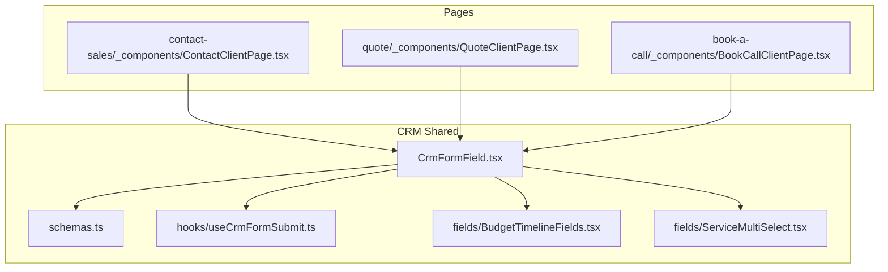
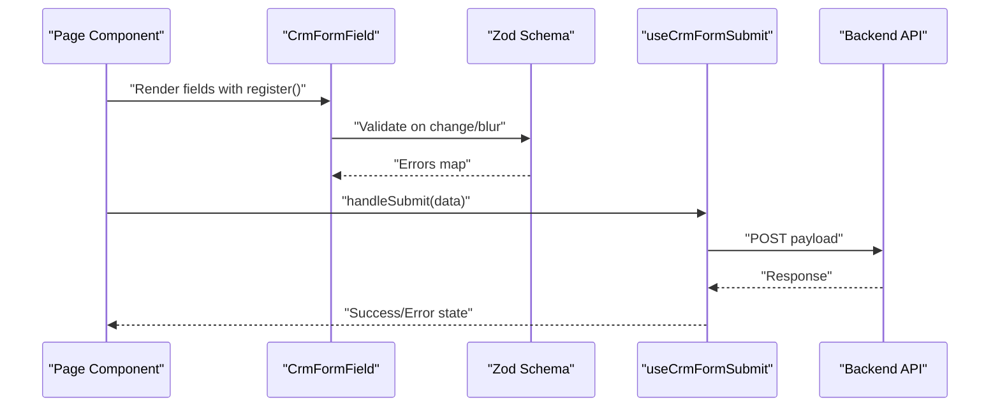
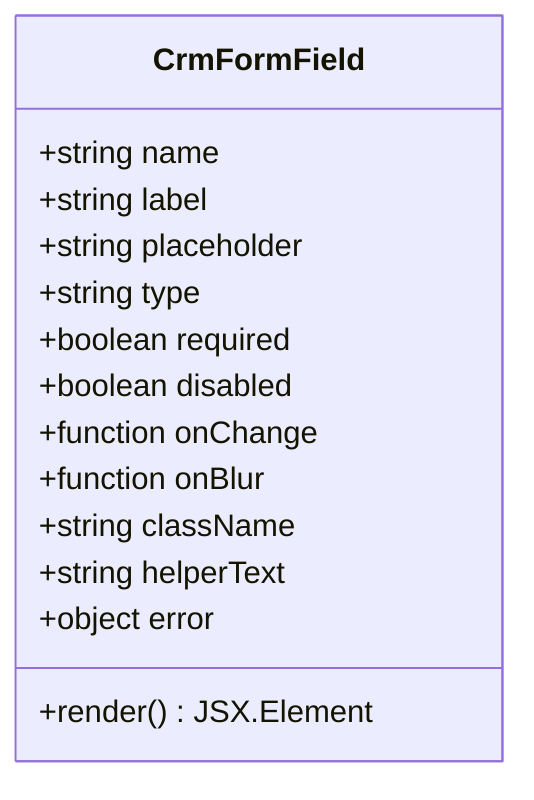
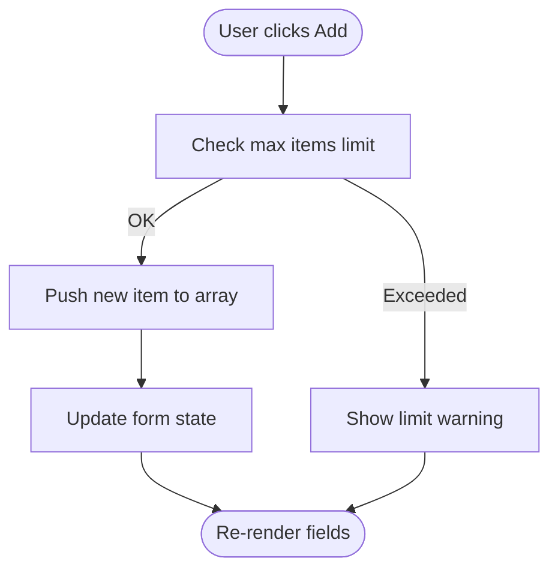
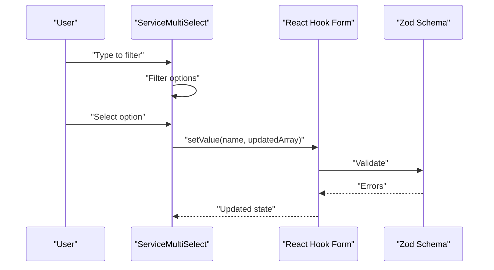
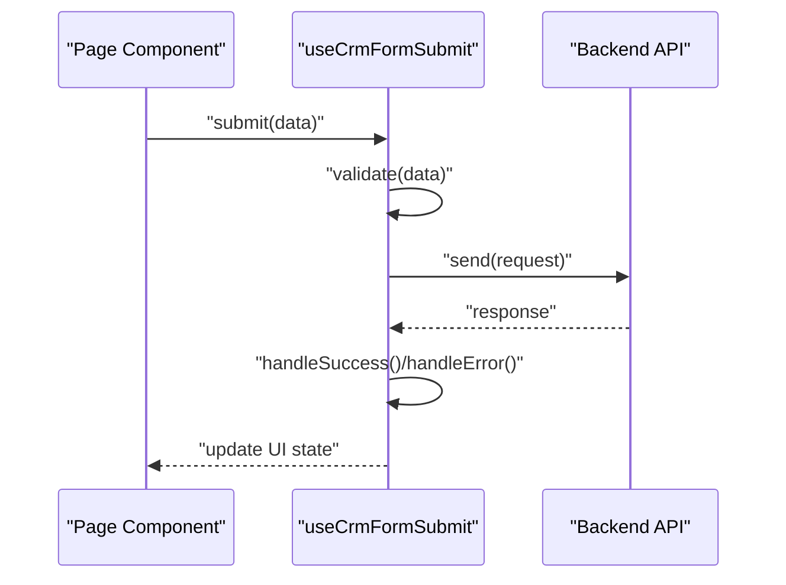
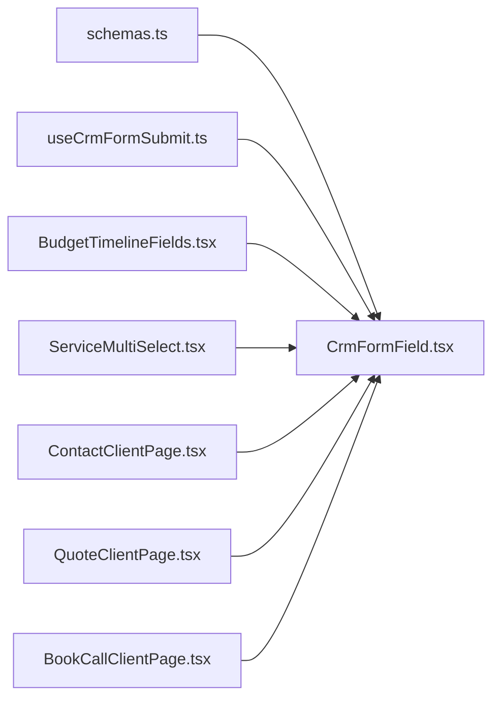

# Form Management

<cite>
**Referenced Files in This Document**
- [BudgetTimelineFields.tsx](file://app/[locale]/(routes)/crm/_components/crm-shared/fields/BudgetTimelineFields.tsx)
- [ServiceMultiSelect.tsx](file://app/[locale]/(routes)/crm/_components/crm-shared/fields/ServiceMultiSelect.tsx)
- [CrmFormField.tsx](file://app/[locale]/(routes)/crm/_components/crm-shared/CrmFormField.tsx)
- [schemas.ts](file://app/[locale]/(routes)/crm/_components/crm-shared/schemas.ts)
- [useCrmFormSubmit.ts](file://app/[locale]/(routes)/crm/_components/crm-shared/hooks/useCrmFormSubmit.ts)
- [ContactClientPage.tsx](file://app/[locale]/(routes)/crm/contact-sales/_components/ContactClientPage.tsx)
- [QuoteClientPage.tsx](file://app/[locale]/(routes)/crm/quote/_components/QuoteClientPage.tsx)
- [BookCallClientPage.tsx](file://app/[locale]/(routes)/crm/book-a-call/_components/BookCallClientPage.tsx)
</cite>

## Table of Contents
1. [Introduction](#introduction)
2. [Project Structure](#project-structure)
3. [Core Components](#core-components)
4. [Architecture Overview](#architecture-overview)
5. [Detailed Component Analysis](#detailed-component-analysis)
6. [Dependency Analysis](#dependency-analysis)
7. [Performance Considerations](#performance-considerations)
8. [Troubleshooting Guide](#troubleshooting-guide)
9. [Conclusion](#conclusion)
10. [Appendices](#appendices)

## Introduction
This document explains the form management system built with React Hook Form and Zod validation. It covers schema definitions, validation rules, error handling strategies, reusable field components (BudgetTimelineFields, ServiceMultiSelect, CrmFormField), submission hooks, async validation, real-time feedback, multi-step forms, conditional rendering, persistence, performance optimization, accessibility, and UX best practices.

## Project Structure
The CRM-related form logic is organized under app/[locale]/(routes)/crm/_components/crm-shared:
- Field components: fields/BudgetTimelineFields.tsx, fields/ServiceMultiSelect.tsx
- Shared form wrapper: CrmFormField.tsx
- Validation schemas: schemas.ts
- Submission hook: hooks/useCrmFormSubmit.ts
- Page-level consumers: contact-sales/_components/ContactClientPage.tsx, quote/_components/QuoteClientPage.tsx, book-a-call/_components/BookCallClientPage.tsx

**Diagram sources**
- [schemas.ts](file://app/[locale]/(routes)/crm/_components/crm-shared/schemas.ts)
- [useCrmFormSubmit.ts](file://app/[locale]/(routes)/crm/_components/crm-shared/hooks/useCrmFormSubmit.ts)
- [CrmFormField.tsx](file://app/[locale]/(routes)/crm/_components/crm-shared/CrmFormField.tsx)
- [BudgetTimelineFields.tsx](file://app/[locale]/(routes)/crm/_components/crm-shared/fields/BudgetTimelineFields.tsx)
- [ServiceMultiSelect.tsx](file://app/[locale]/(routes)/crm/_components/crm-shared/fields/ServiceMultiSelect.tsx)
- [ContactClientPage.tsx](file://app/[locale]/(routes)/crm/contact-sales/_components/ContactClientPage.tsx)
- [QuoteClientPage.tsx](file://app/[locale]/(routes)/crm/quote/_components/QuoteClientPage.tsx)
- [BookCallClientPage.tsx](file://app/[locale]/(routes)/crm/book-a-call/_components/BookCallClientPage.tsx)

**Section sources**
- [schemas.ts](file://app/[locale]/(routes)/crm/_components/crm-shared/schemas.ts)
- [useCrmFormSubmit.ts](file://app/[locale]/(routes)/crm/_components/crm-shared/hooks/useCrmFormSubmit.ts)
- [CrmFormField.tsx](file://app/[locale]/(routes)/crm/_components/crm-shared/CrmFormField.tsx)
- [BudgetTimelineFields.tsx](file://app/[locale]/(routes)/crm/_components/crm-shared/fields/BudgetTimelineFields.tsx)
- [ServiceMultiSelect.tsx](file://app/[locale]/(routes)/crm/_components/crm-shared/fields/ServiceMultiSelect.tsx)
- [ContactClientPage.tsx](file://app/[locale]/(routes)/crm/contact-sales/_components/ContactClientPage.tsx)
- [QuoteClientPage.tsx](file://app/[locale]/(routes)/crm/quote/_components/QuoteClientPage.tsx)
- [BookCallClientPage.tsx](file://app/[locale]/(routes)/crm/book-a-call/_components/BookCallClientPage.tsx)

## Core Components
- CrmFormField: A typed wrapper around React Hook Form inputs that integrates Zod errors, labels, helper text, and accessibility attributes. It centralizes UI consistency and error display across all CRM forms.
- BudgetTimelineFields: Reusable group of timeline-related inputs (e.g., budget ranges or phases). It binds to nested paths and exposes controlled props for integration with complex schemas.
- ServiceMultiSelect: Multi-select component for services, supporting search, selection state, and keyboard navigation. It integrates with React Hook Form via register and setValue patterns.
- useCrmFormSubmit: Submission hook encapsulating validation, async calls, loading states, success/error notifications, and cleanup. It standardizes how pages submit forms.

Key responsibilities:
- Schema-driven validation using Zod
- Centralized error mapping from Zod to UI messages
- Controlled input behavior via React Hook Form
- Async submission flow with optimistic updates and user feedback

**Section sources**
- [CrmFormField.tsx](file://app/[locale]/(routes)/crm/_components/crm-shared/CrmFormField.tsx)
- [BudgetTimelineFields.tsx](file://app/[locale]/(routes)/crm/_components/crm-shared/fields/BudgetTimelineFields.tsx)
- [ServiceMultiSelect.tsx](file://app/[locale]/(routes)/crm/_components/crm-shared/fields/ServiceMultiSelect.tsx)
- [useCrmFormSubmit.ts](file://app/[locale]/(routes)/crm/_components/crm-shared/hooks/useCrmFormSubmit.ts)

## Architecture Overview
The form architecture follows a layered approach:
- Pages compose forms by importing shared components and schemas
- Schemas define validation rules and types
- CrmFormField renders inputs with consistent UX and error handling
- useCrmFormSubmit orchestrates submission lifecycle

**Diagram sources**
- [CrmFormField.tsx](file://app/[locale]/(routes)/crm/_components/crm-shared/CrmFormField.tsx)
- [schemas.ts](file://app/[locale]/(routes)/crm/_components/crm-shared/schemas.ts)
- [useCrmFormSubmit.ts](file://app/[locale]/(routes)/crm/_components/crm-shared/hooks/useCrmFormSubmit.ts)
- [ContactClientPage.tsx](file://app/[locale]/(routes)/crm/contact-sales/_components/ContactClientPage.tsx)
- [QuoteClientPage.tsx](file://app/[locale]/(routes)/crm/quote/_components/QuoteClientPage.tsx)
- [BookCallClientPage.tsx](file://app/[locale]/(routes)/crm/book-a-call/_components/BookCallClientPage.tsx)

## Detailed Component Analysis

### CrmFormField
Purpose:
- Provides a consistent input wrapper with label, description, and error message
- Integrates React Hook Form’s register and error objects
- Ensures accessibility attributes (aria-invalid, aria-describedby)

Configuration options:
- name: string path to the form value
- label: string displayed above the input
- placeholder: optional hint text
- type: input type (text, email, number, etc.)
- required: boolean to enforce presence
- disabled: boolean to disable interaction
- onChange/onBlur: optional handlers for custom behavior
- className: additional styling classes
- helperText: descriptive help below the input
- error: error object from React Hook Form

Customization patterns:
- Compose multiple CrmFormField instances for simple forms
- Wrap with a parent form controller to manage global state
- Use conditional rendering based on other fields’ values

Accessibility:
- Associates label and input via htmlFor/id
- Announces invalid state and error descriptions to assistive technologies

Error handling:
- Maps Zod error messages to UI strings
- Displays inline errors beneath inputs

**Section sources**
- [CrmFormField.tsx](file://app/[locale]/(routes)/crm/_components/crm-shared/CrmFormField.tsx)

#### Class Diagram

**Diagram sources**
- [CrmFormField.tsx](file://app/[locale]/(routes)/crm/_components/crm-shared/CrmFormField.tsx)

### BudgetTimelineFields
Purpose:
- Renders a set of related timeline/budget inputs
- Manages nested field groups and cross-field validation

Configuration options:
- prefix: string used to namespace nested fields
- initialData: default values for timeline entries
- onChange: callback when any field changes
- disabled: disables all nested inputs

Validation:
- Uses Zod to validate arrays or nested objects
- Enforces minimum/maximum counts and range constraints

Rendering:
- Dynamically adds/removes timeline items
- Provides inline add/remove controls

**Section sources**
- [BudgetTimelineFields.tsx](file://app/[locale]/(routes)/crm/_components/crm-shared/fields/BudgetTimelineFields.tsx)

#### Flowchart: Adding a Timeline Item

**Diagram sources**
- [BudgetTimelineFields.tsx](file://app/[locale]/(routes)/crm/_components/crm-shared/fields/BudgetTimelineFields.tsx)

### ServiceMultiSelect
Purpose:
- Multi-select dropdown for choosing one or more services
- Supports search filtering and keyboard navigation

Configuration options:
- name: form field path
- options: array of selectable items
- placeholder: prompt text
- disabled: disables selection
- onChange: custom handler for selection changes
- renderOption: function to customize option rendering

Behavior:
- Maintains selected IDs in form state
- Debounces search input to reduce re-renders
- Highlights focused option for accessibility

Integration:
- Uses register for basic binding
- Uses setValue for programmatic updates

**Section sources**
- [ServiceMultiSelect.tsx](file://app/[locale]/(routes)/crm/_components/crm-shared/fields/ServiceMultiSelect.tsx)

#### Sequence Diagram: Selection Flow

**Diagram sources**
- [ServiceMultiSelect.tsx](file://app/[locale]/(routes)/crm/_components/crm-shared/fields/ServiceMultiSelect.tsx)
- [schemas.ts](file://app/[locale]/(routes)/crm/_components/crm-shared/schemas.ts)

### useCrmFormSubmit
Purpose:
- Encapsulates form submission logic including validation, async requests, and user feedback
- Exposes loading, success, and error states

Configuration options:
- endpoint: API route or URL
- method: HTTP method (GET, POST, PUT, DELETE)
- headers: request headers
- transformRequest: function to shape payload before sending
- onSuccess: callback on successful response
- onError: callback on failure
- debounceMs: delay between submissions

Flow:
- Validates data using Zod schema
- Calls API with transformed payload
- Updates UI state and shows notifications
- Handles network errors and server errors

**Section sources**
- [useCrmFormSubmit.ts](file://app/[locale]/(routes)/crm/_components/crm-shared/hooks/useCrmFormSubmit.ts)

#### Sequence Diagram: Submission Lifecycle

**Diagram sources**
- [useCrmFormSubmit.ts](file://app/[locale]/(routes)/crm/_components/crm-shared/hooks/useCrmFormSubmit.ts)

### Page-Level Consumers
- ContactClientPage: Uses CrmFormField and useCrmFormSubmit to collect contact details and send them to the backend
- QuoteClientPage: Composes BudgetTimelineFields and ServiceMultiSelect to build a quote request
- BookCallClientPage: Integrates date/time pickers with form validation and submission

These pages demonstrate:
- Conditional field rendering based on selections
- Real-time validation feedback
- Error boundaries and retry mechanisms

**Section sources**
- [ContactClientPage.tsx](file://app/[locale]/(routes)/crm/contact-sales/_components/ContactClientPage.tsx)
- [QuoteClientPage.tsx](file://app/[locale]/(routes)/crm/quote/_components/QuoteClientPage.tsx)
- [BookCallClientPage.tsx](file://app/[locale]/(routes)/crm/book-a-call/_components/BookCallClientPage.tsx)

## Dependency Analysis

**Diagram sources**
- [schemas.ts](file://app/[locale]/(routes)/crm/_components/crm-shared/schemas.ts)
- [CrmFormField.tsx](file://app/[locale]/(routes)/crm/_components/crm-shared/CrmFormField.tsx)
- [useCrmFormSubmit.ts](file://app/[locale]/(routes)/crm/_components/crm-shared/hooks/useCrmFormSubmit.ts)
- [BudgetTimelineFields.tsx](file://app/[locale]/(routes)/crm/_components/crm-shared/fields/BudgetTimelineFields.tsx)
- [ServiceMultiSelect.tsx](file://app/[locale]/(routes)/crm/_components/crm-shared/fields/ServiceMultiSelect.tsx)
- [ContactClientPage.tsx](file://app/[locale]/(routes)/crm/contact-sales/_components/ContactClientPage.tsx)
- [QuoteClientPage.tsx](file://app/[locale]/(routes)/crm/quote/_components/QuoteClientPage.tsx)
- [BookCallClientPage.tsx](file://app/[locale]/(routes)/crm/book-a-call/_components/BookCallClientPage.tsx)

**Section sources**
- [schemas.ts](file://app/[locale]/(routes)/crm/_components/crm-shared/schemas.ts)
- [CrmFormField.tsx](file://app/[locale]/(routes)/crm/_components/crm-shared/CrmFormField.tsx)
- [useCrmFormSubmit.ts](file://app/[locale]/(routes)/crm/_components/crm-shared/hooks/useCrmFormSubmit.ts)
- [BudgetTimelineFields.tsx](file://app/[locale]/(routes)/crm/_components/crm-shared/fields/BudgetTimelineFields.tsx)
- [ServiceMultiSelect.tsx](file://app/[locale]/(routes)/crm/_components/crm-shared/fields/ServiceMultiSelect.tsx)
- [ContactClientPage.tsx](file://app/[locale]/(routes)/crm/contact-sales/_components/ContactClientPage.tsx)
- [QuoteClientPage.tsx](file://app/[locale]/(routes)/crm/quote/_components/QuoteClientPage.tsx)
- [BookCallClientPage.tsx](file://app/[locale]/(routes)/crm/book-a-call/_components/BookCallClientPage.tsx)

## Performance Considerations
- Memoize expensive computations and derived values in large forms
- Debounce search inputs in multi-select components to avoid excessive re-renders
- Use React Hook Form’s shouldUnregister selectively to keep memory usage low
- Split large forms into smaller sections and lazy-load heavy components
- Avoid unnecessary re-renders by isolating field components and using stable keys
- Prefer controlled inputs only where necessary; leverage uncontrolled patterns for performance-critical fields

[No sources needed since this section provides general guidance]

## Troubleshooting Guide
Common issues and resolutions:
- Validation not triggering: Ensure fields are registered correctly and schema paths match form names
- Errors not displaying: Verify error mapping from Zod to CrmFormField’s error prop
- Async submission hangs: Check debounce settings and ensure proper error handling in useCrmFormSubmit
- Multi-select not updating: Confirm setValue usage and that the schema accepts arrays
- Accessibility warnings: Ensure labels are associated with inputs and aria attributes are present

**Section sources**
- [CrmFormField.tsx](file://app/[locale]/(routes)/crm/_components/crm-shared/CrmFormField.tsx)
- [useCrmFormSubmit.ts](file://app/[locale]/(routes)/crm/_components/crm-shared/hooks/useCrmFormSubmit.ts)
- [ServiceMultiSelect.tsx](file://app/[locale]/(routes)/crm/_components/crm-shared/fields/ServiceMultiSelect.tsx)

## Conclusion
The CRM form system leverages React Hook Form and Zod to provide robust, accessible, and maintainable forms. Shared components and hooks standardize validation, submission, and UX patterns across pages. By following the documented configuration options and best practices, teams can build complex, multi-step forms efficiently while ensuring performance and accessibility.

[No sources needed since this section summarizes without analyzing specific files]

## Appendices

### Practical Examples

- Creating a multi-step form:
  - Split the schema into steps and validate each step independently
  - Persist intermediate progress using local storage or session storage
  - Navigate between steps with clear progress indicators

- Conditional field rendering:
  - Derive visibility flags from other fields’ values
  - Use short-circuit evaluation to render optional sections
  - Keep validation rules dynamic by merging base and conditional schemas

- Form state persistence:
  - Save draft values to localStorage on change
  - Restore values on mount if available
  - Clear persisted state after successful submission

- Real-time feedback:
  - Show inline errors immediately after blur or change
  - Provide success indicators upon valid completion
  - Debounce async checks to balance responsiveness and performance

- Accessibility compliance:
  - Associate labels with inputs
  - Announce errors and status changes to screen readers
  - Ensure keyboard navigation and focus management

- UX best practices:
  - Group related fields logically
  - Provide helpful placeholders and helper text
  - Offer clear error messages and recovery actions

[No sources needed since this section provides general guidance]