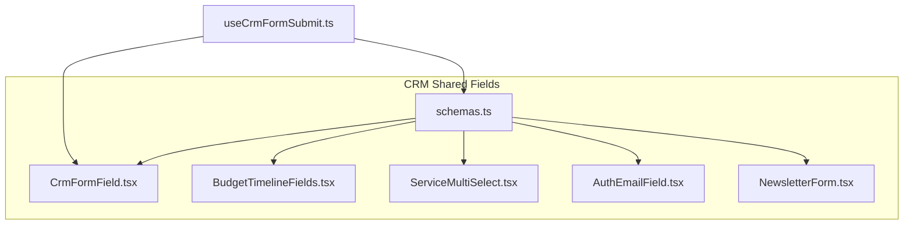
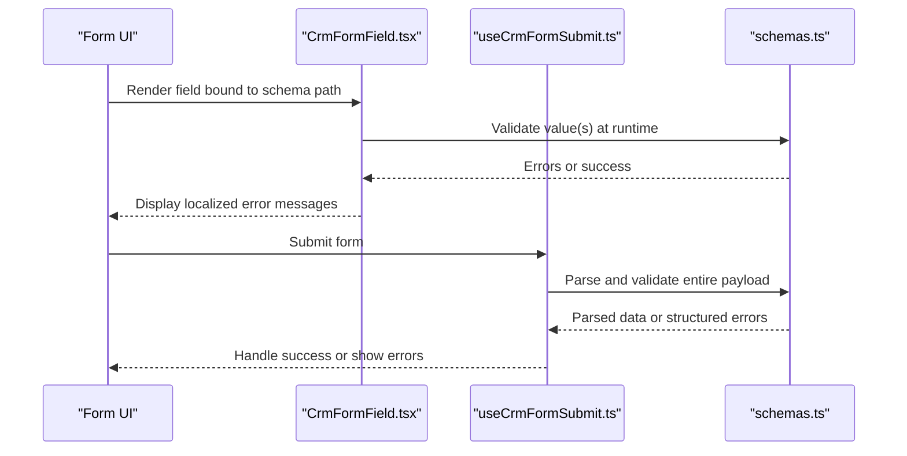
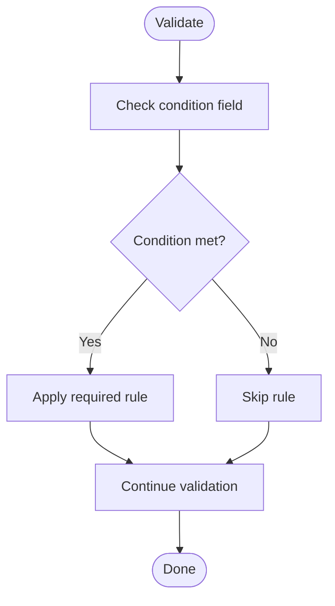
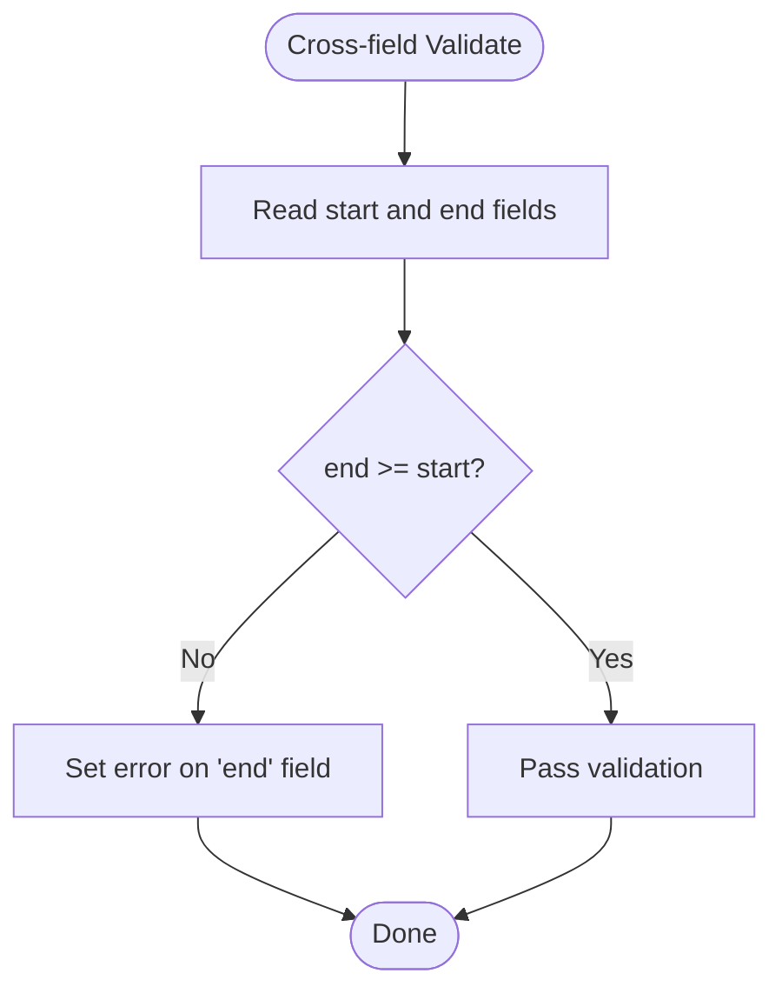
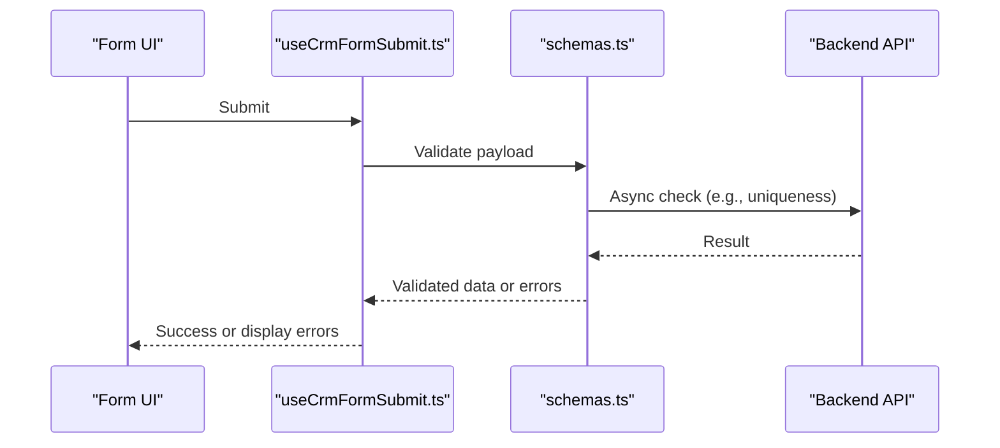
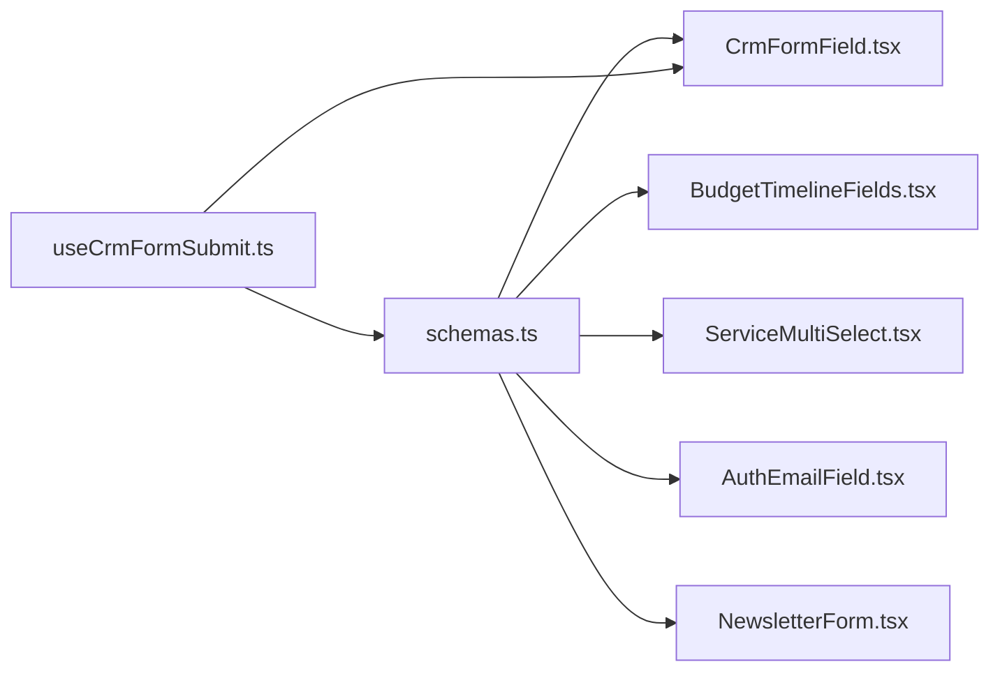

# Form Schemas and Validation

<cite>
**Referenced Files in This Document**
- [schemas.ts](file://app/[locale]/(routes)/crm/_components/crm-shared/fields/schemas.ts)
- [CrmFormField.tsx](file://app/[locale]/(routes)/crm/_components/crm-shared/fields/CrmFormField.tsx)
- [BudgetTimelineFields.tsx](file://app/[locale]/(routes)/crm/_components/crm-shared/fields/BudgetTimelineFields.tsx)
- [ServiceMultiSelect.tsx](file://app/[locale]/(routes)/crm/_components/crm-shared/fields/ServiceMultiSelect.tsx)
- [AuthEmailField.tsx](file://app/[locale]/(routes)/crm/_components/crm-shared/AuthEmailField.tsx)
- [NewsletterForm.tsx](file://app/[locale]/(routes)/crm/_components/crm-shared/NewsletterForm.tsx)
- [useCrmFormSubmit.ts](file://app/[locale]/(routes)/crm/_components/hooks/useCrmFormSubmit.ts)
</cite>

## Table of Contents
1. [Introduction](#introduction)
2. [Project Structure](#project-structure)
3. [Core Components](#core-components)
4. [Architecture Overview](#architecture-overview)
5. [Detailed Component Analysis](#detailed-component-analysis)
6. [Dependency Analysis](#dependency-analysis)
7. [Performance Considerations](#performance-considerations)
8. [Troubleshooting Guide](#troubleshooting-guide)
9. [Conclusion](#conclusion)

## Introduction
This document explains how form schemas and validation are implemented using Zod within the project. It covers schema structure, field types, validation rules, error message customization, and advanced patterns such as conditional validation, cross-field validation, and async validation. It also provides practical examples for different form types, nested object handling, custom validators, performance considerations for large forms, and best practices to maintain validation logic.

## Project Structure
The form-related code is primarily located under the CRM shared fields directory and related hooks:
- Schema definitions live in a dedicated file for reuse across multiple forms.
- Reusable form field components integrate with the schema to provide typed inputs and validation feedback.
- A submission hook orchestrates validation and submission flows.

**Diagram sources**
- [schemas.ts](file://app/[locale]/(routes)/crm/_components/crm-shared/fields/schemas.ts)
- [CrmFormField.tsx](file://app/[locale]/(routes)/crm/_components/crm-shared/fields/CrmFormField.tsx)
- [BudgetTimelineFields.tsx](file://app/[locale]/(routes)/crm/_components/crm-shared/fields/BudgetTimelineFields.tsx)
- [ServiceMultiSelect.tsx](file://app/[locale]/(routes)/crm/_components/crm-shared/fields/ServiceMultiSelect.tsx)
- [AuthEmailField.tsx](file://app/[locale]/(routes)/crm/_components/crm-shared/AuthEmailField.tsx)
- [NewsletterForm.tsx](file://app/[locale]/(routes)/crm/_components/crm-shared/NewsletterForm.tsx)
- [useCrmFormSubmit.ts](file://app/[locale]/(routes)/crm/_components/hooks/useCrmFormSubmit.ts)

**Section sources**
- [schemas.ts](file://app/[locale]/(routes)/crm/_components/crm-shared/fields/schemas.ts)
- [CrmFormField.tsx](file://app/[locale]/(routes)/crm/_components/crm-shared/fields/CrmFormField.tsx)
- [useCrmFormSubmit.ts](file://app/[locale]/(routes)/crm/_components/hooks/useCrmFormSubmit.ts)

## Core Components
- Schema module: Centralized Zod schemas for CRM forms, including reusable primitives and composed objects.
- Field component: A generic form field wrapper that binds input state, validation errors, and UI feedback to a given schema path.
- Submission hook: Encapsulates validation, transformation, and submission logic, integrating with the schema and field components.

Key responsibilities:
- Define strongly-typed schemas for each form type (e.g., newsletter, contact, booking).
- Provide consistent validation messages and error shapes consumed by the field component.
- Enable complex validations (conditional, cross-field, async) while keeping UI decoupled from validation details.

**Section sources**
- [schemas.ts](file://app/[locale]/(routes)/crm/_components/crm-shared/fields/schemas.ts)
- [CrmFormField.tsx](file://app/[locale]/(routes)/crm/_components/crm-shared/fields/CrmFormField.tsx)
- [useCrmFormSubmit.ts](file://app/[locale]/(routes)/crm/_components/hooks/useCrmFormSubmit.ts)

## Architecture Overview
The validation architecture centers on a single source of truth for schemas, which are consumed by both UI components and submission logic.

**Diagram sources**
- [CrmFormField.tsx](file://app/[locale]/(routes)/crm/_components/crm-shared/fields/CrmFormField.tsx)
- [useCrmFormSubmit.ts](file://app/[locale]/(routes)/crm/_components/hooks/useCrmFormSubmit.ts)
- [schemas.ts](file://app/[locale]/(routes)/crm/_components/crm-shared/fields/schemas.ts)

## Detailed Component Analysis

### Schema Module: schemas.ts
Responsibilities:
- Define base field schemas (string, number, email, boolean, arrays, enums).
- Compose complex schemas for nested objects and arrays.
- Implement conditional and cross-field validations using Zod’s refine and superRefine.
- Provide async validation via .refine with asynchronous functions where needed.
- Centralize error messages for consistency and localization readiness.

Common patterns:
- Primitive types: string, number, boolean, enum, array, optional, default values.
- Nested objects: define inner schemas and reference them in parent schemas.
- Conditional logic: use .refine with context-aware checks based on other fields.
- Cross-field validation: compare two fields (e.g., start vs end date) and attach errors to specific paths.
- Async validation: perform server-side checks (e.g., uniqueness) and return descriptive errors.

Best practices:
- Keep schemas close to their domain (e.g., newsletter, contact, booking).
- Export both the schema and its inferred TypeScript type for full-stack safety.
- Prefer small, composable schemas over monolithic ones.
- Use meaningful error messages tied to user-facing labels.

**Section sources**
- [schemas.ts](file://app/[locale]/(routes)/crm/_components/crm-shared/fields/schemas.ts)

### Field Wrapper: CrmFormField.tsx
Responsibilities:
- Bind an input control to a schema path.
- Trigger validation on change and blur events.
- Display field-level errors and accessibility attributes.
- Support common props like label, placeholder, disabled, and helper text.

Integration points:
- Consumes schema-derived types to ensure type-safe bindings.
- Reads validation results from the schema and maps them to UI feedback.

**Section sources**
- [CrmFormField.tsx](file://app/[locale]/(routes)/crm/_components/crm-shared/fields/CrmFormField.tsx)

### Specialized Fields
- BudgetTimelineFields.tsx: Implements timeline-specific inputs and constraints (e.g., budget ranges, dates). Uses schema-defined rules for range and date ordering.
- ServiceMultiSelect.tsx: Handles multi-select services with selection limits and required selections enforced by schema.
- AuthEmailField.tsx: Provides email-focused input with stricter validation and UX tailored for authentication flows.

These components rely on shared schemas for validation and focus on presentation and interaction specifics.

**Section sources**
- [BudgetTimelineFields.tsx](file://app/[locale]/(routes)/crm/_components/crm-shared/fields/BudgetTimelineFields.tsx)
- [ServiceMultiSelect.tsx](file://app/[locale]/(routes)/crm/_components/crm-shared/fields/ServiceMultiSelect.tsx)
- [AuthEmailField.tsx](file://app/[locale]/(routes)/crm/_components/crm-shared/AuthEmailField.tsx)

### NewsletterForm.tsx
A concrete example of composing multiple fields into a cohesive form. It demonstrates:
- Using multiple schema-driven fields together.
- Handling nested structures if applicable.
- Integrating with the submission hook for end-to-end validation and submission.

**Section sources**
- [NewsletterForm.tsx](file://app/[locale]/(routes)/crm/_components/crm-shared/NewsletterForm.tsx)

### Submission Hook: useCrmFormSubmit.ts
Responsibilities:
- Orchestrate form submission lifecycle.
- Run schema-based validation before sending requests.
- Normalize errors and surface them to the UI.
- Manage loading states and success outcomes.

Validation flow:
- Collect form values.
- Parse and validate against the root schema.
- If valid, proceed with submission; otherwise, map errors to field paths.

**Section sources**
- [useCrmFormSubmit.ts](file://app/[locale]/(routes)/crm/_components/hooks/useCrmFormSubmit.ts)

### Advanced Validation Patterns

#### Conditional Validation
Use schema refinements to enable/disable rules based on other fields. For example, require additional details only when a certain option is selected.

[No sources needed since this diagram shows conceptual workflow, not actual code structure]

#### Cross-Field Validation
Compare multiple fields to enforce business rules (e.g., end date must be after start date). Attach errors to the appropriate field path for precise UI feedback.

[No sources needed since this diagram shows conceptual workflow, not actual code structure]

#### Async Validation
Perform server-side checks (e.g., email uniqueness) asynchronously. Return structured errors mapped to field paths.

**Diagram sources**
- [useCrmFormSubmit.ts](file://app/[locale]/(routes)/crm/_components/hooks/useCrmFormSubmit.ts)
- [schemas.ts](file://app/[locale]/(routes)/crm/_components/crm-shared/fields/schemas.ts)

## Dependency Analysis
The following diagram illustrates dependencies between schema definitions, field components, and the submission hook.

**Diagram sources**
- [schemas.ts](file://app/[locale]/(routes)/crm/_components/crm-shared/fields/schemas.ts)
- [CrmFormField.tsx](file://app/[locale]/(routes)/crm/_components/crm-shared/fields/CrmFormField.tsx)
- [BudgetTimelineFields.tsx](file://app/[locale]/(routes)/crm/_components/crm-shared/fields/BudgetTimelineFields.tsx)
- [ServiceMultiSelect.tsx](file://app/[locale]/(routes)/crm/_components/crm-shared/fields/ServiceMultiSelect.tsx)
- [AuthEmailField.tsx](file://app/[locale]/(routes)/crm/_components/crm-shared/AuthEmailField.tsx)
- [NewsletterForm.tsx](file://app/[locale]/(routes)/crm/_components/crm-shared/NewsletterForm.tsx)
- [useCrmFormSubmit.ts](file://app/[locale]/(routes)/crm/_components/hooks/useCrmFormSubmit.ts)

**Section sources**
- [schemas.ts](file://app/[locale]/(routes)/crm/_components/crm-shared/fields/schemas.ts)
- [useCrmFormSubmit.ts](file://app/[locale]/(routes)/crm/_components/hooks/useCrmFormSubmit.ts)

## Performance Considerations
For large forms with many fields and complex validations:
- Defer heavy validations until necessary (e.g., on submit or explicit “check” actions).
- Use memoization for derived validation results where possible.
- Avoid unnecessary re-runs by stabilizing dependency arrays and avoiding volatile values in refinement contexts.
- Split large schemas into smaller, focused modules and compose them to reduce parse overhead.
- Prefer synchronous validations for immediate feedback; reserve async validations for server checks.
- Batch updates to form state to minimize re-renders.

[No sources needed since this section provides general guidance]

## Troubleshooting Guide
Common issues and resolutions:
- Missing required fields: Ensure all required paths are present in the schema and that the UI triggers validation on change/blur.
- Incorrect error mapping: Verify that cross-field errors are attached to the correct field path so the UI can display them accurately.
- Async validation failures: Confirm that async refinements return structured errors and handle network failures gracefully.
- Type mismatches: Align inferred types from schemas with component props to avoid runtime coercion issues.
- Localization: Ensure error messages are centralized and can be swapped for different locales without changing validation logic.

**Section sources**
- [schemas.ts](file://app/[locale]/(routes)/crm/_components/crm-shared/fields/schemas.ts)
- [CrmFormField.tsx](file://app/[locale]/(routes)/crm/_components/crm-shared/fields/CrmFormField.tsx)
- [useCrmFormSubmit.ts](file://app/[locale]/(routes)/crm/_components/hooks/useCrmFormSubmit.ts)

## Conclusion
By centralizing validation logic in a dedicated schema module and integrating it with reusable field components and a submission hook, the project achieves strong typing, consistent user feedback, and scalable validation patterns. Advanced scenarios—conditional, cross-field, and async validations—are supported through Zod’s refinement capabilities while maintaining clear separation between validation and presentation. Following the recommended practices ensures maintainability, performance, and a smooth developer experience.