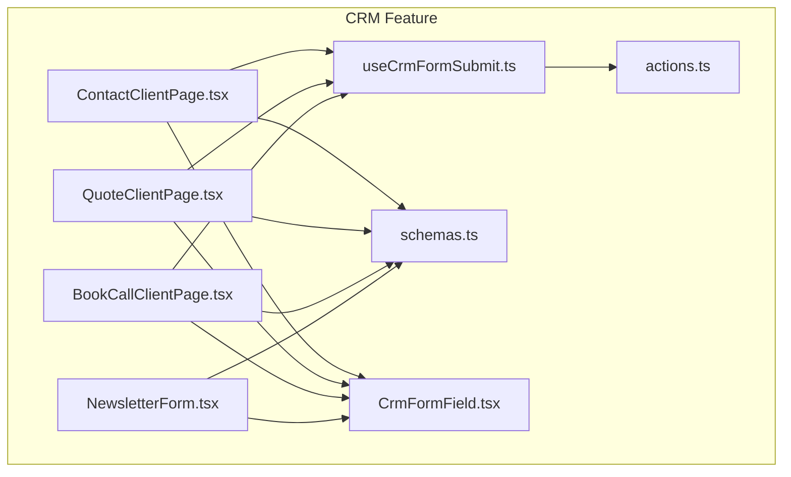
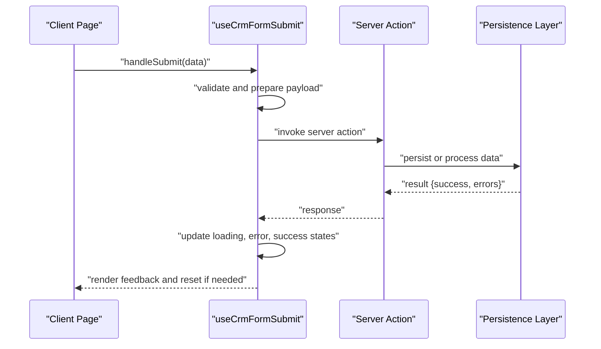
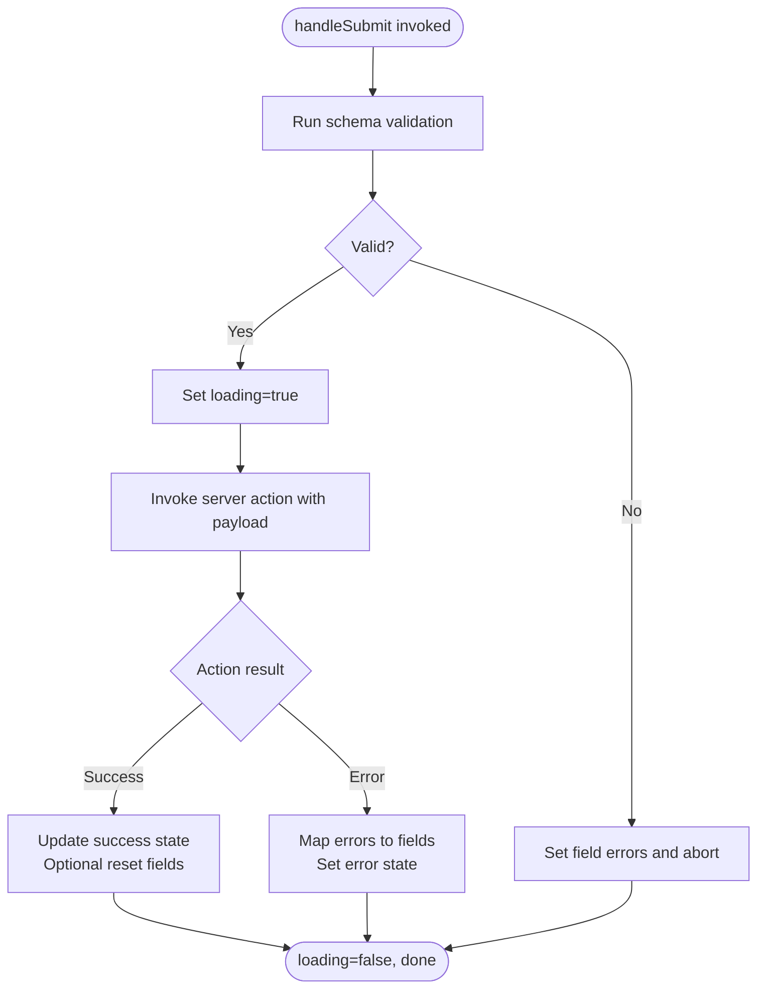
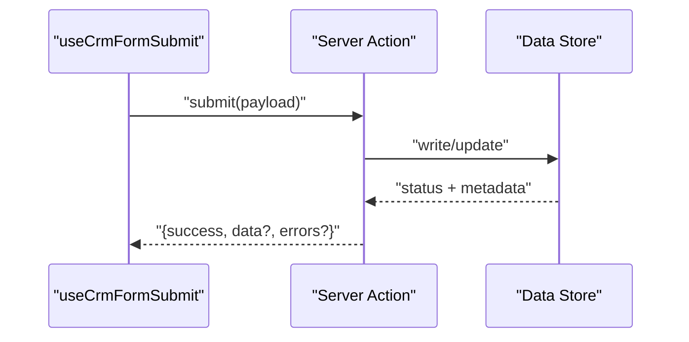
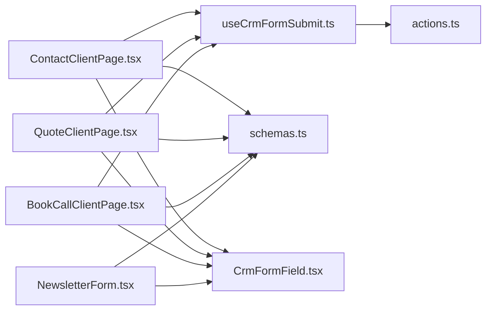

# Form Submission and State Management

<cite>
**Referenced Files in This Document**
- [useCrmFormSubmit.ts](file://app/[locale]/(routes)/crm/_components/hooks/useCrmFormSubmit.ts)
- [actions.ts](file://app/[locale]/(routes)/crm/actions.ts)
- [ContactClientPage.tsx](file://app/[locale]/(routes)/crm/contact-sales/_components/ContactClientPage.tsx)
- [QuoteClientPage.tsx](file://app/[locale]/(routes)/crm/quote/_components/QuoteClientPage.tsx)
- [BookCallClientPage.tsx](file://app/[locale]/(routes)/crm/book-a-call/_components/BookCallClientPage.tsx)
- [schemas.ts](file://app/[locale]/(routes)/crm/_components/crm-shared/fields/schemas.ts)
- [CrmFormField.tsx](file://app/[locale]/(routes)/crm/_components/crm-shared/fields/CrmFormField.tsx)
- [NewsletterForm.tsx](file://app/[locale]/(routes)/crm/_components/crm-shared/fields/NewsletterForm.tsx)
</cite>

## Table of Contents
1. [Introduction](#introduction)
2. [Project Structure](#project-structure)
3. [Core Components](#core-components)
4. [Architecture Overview](#architecture-overview)
5. [Detailed Component Analysis](#detailed-component-analysis)
6. [Dependency Analysis](#dependency-analysis)
7. [Performance Considerations](#performance-considerations)
8. [Troubleshooting Guide](#troubleshooting-guide)
9. [Conclusion](#conclusion)
10. [Appendices](#appendices)

## Introduction
This document explains how form submission handling and state management are implemented using React Hook Form hooks, focusing on the useCrmFormSubmit hook, server action integration, and error handling strategies. It covers form state persistence, loading states, success feedback, and recovery patterns. Practical examples include file uploads, multi-step submissions, and real-time validation feedback. Performance optimization techniques for large forms and UX best practices during interactions are also provided.

## Project Structure
The CRM feature area organizes shared form utilities, schemas, and client pages under app/[locale]/(routes)/crm. The key pieces for form submission and state management are:
- A custom hook that encapsulates React Hook Form setup and submission orchestration
- Server actions that handle data processing and persistence
- Client pages that wire up forms to the hook and server actions
- Shared field components and validation schemas

**Diagram sources**
- [useCrmFormSubmit.ts](file://app/[locale]/(routes)/crm/_components/hooks/useCrmFormSubmit.ts)
- [actions.ts](file://app/[locale]/(routes)/crm/actions.ts)
- [ContactClientPage.tsx](file://app/[locale]/(routes)/crm/contact-sales/_components/ContactClientPage.tsx)
- [QuoteClientPage.tsx](file://app/[locale]/(routes)/crm/quote/_components/QuoteClientPage.tsx)
- [BookCallClientPage.tsx](file://app/[locale]/(routes)/crm/book-a-call/_components/BookCallClientPage.tsx)
- [schemas.ts](file://app/[locale]/(routes)/crm/_components/crm-shared/fields/schemas.ts)
- [CrmFormField.tsx](file://app/[locale]/(routes)/crm/_components/crm-shared/fields/CrmFormField.tsx)
- [NewsletterForm.tsx](file://app/[locale]/(routes)/crm/_components/crm-shared/fields/NewsletterForm.tsx)

**Section sources**
- [useCrmFormSubmit.ts](file://app/[locale]/(routes)/crm/_components/hooks/useCrmFormSubmit.ts)
- [actions.ts](file://app/[locale]/(routes)/crm/actions.ts)
- [ContactClientPage.tsx](file://app/[locale]/(routes)/crm/contact-sales/_components/ContactClientPage.tsx)
- [QuoteClientPage.tsx](file://app/[locale]/(routes)/crm/quote/_components/QuoteClientPage.tsx)
- [BookCallClientPage.tsx](file://app/[locale]/(routes)/crm/book-a-call/_components/BookCallClientPage.tsx)
- [schemas.ts](file://app/[locale]/(routes)/crm/_components/crm-shared/fields/schemas.ts)
- [CrmFormField.tsx](file://app/[locale]/(routes)/crm/_components/crm-shared/fields/CrmFormField.tsx)
- [NewsletterForm.tsx](file://app/[locale]/(routes)/crm/_components/crm-shared/fields/NewsletterForm.tsx)

## Core Components
- useCrmFormSubmit: Custom hook that centralizes React Hook Form configuration, submission lifecycle, loading and error states, and success feedback. It integrates with server actions and provides a consistent API across CRM forms.
- Server Actions (actions.ts): Encapsulate business logic, validation, persistence, and side effects. They return structured results consumed by the hook.
- Client Pages: Compose forms using shared fields and schemas, bind them to useCrmFormSubmit, and render UI based on submission state.
- Shared Field Components and Schemas: Provide reusable inputs and centralized validation rules used by all CRM forms.

Key responsibilities:
- Centralized form state and submission control
- Consistent error handling and user feedback
- Integration with server actions for data operations
- Support for complex scenarios like file uploads and multi-step flows

**Section sources**
- [useCrmFormSubmit.ts](file://app/[locale]/(routes)/crm/_components/hooks/useCrmFormSubmit.ts)
- [actions.ts](file://app/[locale]/(routes)/crm/actions.ts)
- [ContactClientPage.tsx](file://app/[locale]/(routes)/crm/contact-sales/_components/ContactClientPage.tsx)
- [QuoteClientPage.tsx](file://app/[locale]/(routes)/crm/quote/_components/QuoteClientPage.tsx)
- [BookCallClientPage.tsx](file://app/[locale]/(routes)/crm/book-a-call/_components/BookCallClientPage.tsx)
- [schemas.ts](file://app/[locale]/(routes)/crm/_components/crm-shared/fields/schemas.ts)
- [CrmFormField.tsx](file://app/[locale]/(routes)/crm/_components/crm-shared/fields/CrmFormField.tsx)
- [NewsletterForm.tsx](file://app/[locale]/(routes)/crm/_components/crm-shared/fields/NewsletterForm.tsx)

## Architecture Overview
The form submission architecture follows a clear separation between UI, orchestration, and server logic:
- UI layers (client pages) manage presentation and user interaction
- useCrmFormSubmit orchestrates React Hook Form, validation, submission, and state transitions
- Server actions perform data operations and return standardized responses

**Diagram sources**
- [useCrmFormSubmit.ts](file://app/[locale]/(routes)/crm/_components/hooks/useCrmFormSubmit.ts)
- [actions.ts](file://app/[locale]/(routes)/crm/actions.ts)

## Detailed Component Analysis

### useCrmFormSubmit Hook
Responsibilities:
- Initialize and configure React Hook Form with schema-driven validation
- Manage submission lifecycle: start loading, call server action, handle success/error, finalize
- Expose a unified submit handler and state accessors for UI components
- Support advanced scenarios: file uploads, multi-step submissions, and real-time validation feedback

Implementation highlights:
- Schema-based validation via shared schemas
- Centralized error mapping from server responses to field-level messages
- Loading state toggling around server action invocation
- Success feedback and optional auto-reset after successful submission
- Error recovery patterns: retry, partial resets, and graceful degradation

**Diagram sources**
- [useCrmFormSubmit.ts](file://app/[locale]/(routes)/crm/_components/hooks/useCrmFormSubmit.ts)
- [schemas.ts](file://app/[locale]/(routes)/crm/_components/crm-shared/fields/schemas.ts)

**Section sources**
- [useCrmFormSubmit.ts](file://app/[locale]/(routes)/crm/_components/hooks/useCrmFormSubmit.ts)
- [schemas.ts](file://app/[locale]/(routes)/crm/_components/crm-shared/fields/schemas.ts)

### Server Actions Integration
Purpose:
- Encapsulate business logic and persistence
- Return structured results indicating success or detailed errors
- Be compatible with client-side error mapping and recovery

Integration points:
- Called by useCrmFormSubmit during submission
- Accept validated payloads prepared by the hook
- Provide consistent response shape for predictable UI behavior

**Diagram sources**
- [actions.ts](file://app/[locale]/(routes)/crm/actions.ts)
- [useCrmFormSubmit.ts](file://app/[locale]/(routes)/crm/_components/hooks/useCrmFormSubmit.ts)

**Section sources**
- [actions.ts](file://app/[locale]/(routes)/crm/actions.ts)
- [useCrmFormSubmit.ts](file://app/[locale]/(routes)/crm/_components/hooks/useCrmFormSubmit.ts)

### Client Pages Wiring
Examples:
- Contact sales page: wires contact form to useCrmFormSubmit and renders feedback
- Quote request page: handles quote-specific fields and submission flow
- Book a call page: manages scheduling-related inputs and confirmation

Common patterns:
- Import shared schemas and fields
- Use the hook’s submit handler and state flags
- Display inline field errors and global notifications

**Section sources**
- [ContactClientPage.tsx](file://app/[locale]/(routes)/crm/contact-sales/_components/ContactClientPage.tsx)
- [QuoteClientPage.tsx](file://app/[locale]/(routes)/crm/quote/_components/QuoteClientPage.tsx)
- [BookCallClientPage.tsx](file://app/[locale]/(routes)/crm/book-a-call/_components/BookCallClientPage.tsx)

### Shared Fields and Validation
- CrmFormField: Reusable input wrapper integrating with React Hook Form and displaying validation messages
- NewsletterForm: Example of a focused form component using shared schemas and fields
- schemas.ts: Centralized validation rules ensuring consistency across CRM forms

Best practices:
- Keep validation rules close to the domain model
- Surface actionable error messages to users
- Reuse field components to reduce duplication

**Section sources**
- [CrmFormField.tsx](file://app/[locale]/(routes)/crm/_components/crm-shared/fields/CrmFormField.tsx)
- [NewsletterForm.tsx](file://app/[locale]/(routes)/crm/_components/crm-shared/fields/NewsletterForm.tsx)
- [schemas.ts](file://app/[locale]/(routes)/crm/_components/crm-shared/fields/schemas.ts)

## Dependency Analysis
High-level dependencies among core files:
- Client pages depend on useCrmFormSubmit and shared schemas/fields
- useCrmFormSubmit depends on server actions and schemas
- Shared fields depend on schemas for validation

**Diagram sources**
- [useCrmFormSubmit.ts](file://app/[locale]/(routes)/crm/_components/hooks/useCrmFormSubmit.ts)
- [actions.ts](file://app/[locale]/(routes)/crm/actions.ts)
- [ContactClientPage.tsx](file://app/[locale]/(routes)/crm/contact-sales/_components/ContactClientPage.tsx)
- [QuoteClientPage.tsx](file://app/[locale]/(routes)/crm/quote/_components/QuoteClientPage.tsx)
- [BookCallClientPage.tsx](file://app/[locale]/(routes)/crm/book-a-call/_components/BookCallClientPage.tsx)
- [schemas.ts](file://app/[locale]/(routes)/crm/_components/crm-shared/fields/schemas.ts)
- [CrmFormField.tsx](file://app/[locale]/(routes)/crm/_components/crm-shared/fields/CrmFormField.tsx)
- [NewsletterForm.tsx](file://app/[locale]/(routes)/crm/_components/crm-shared/fields/NewsletterForm.tsx)

**Section sources**
- [useCrmFormSubmit.ts](file://app/[locale]/(routes)/crm/_components/hooks/useCrmFormSubmit.ts)
- [actions.ts](file://app/[locale]/(routes)/crm/actions.ts)
- [ContactClientPage.tsx](file://app/[locale]/(routes)/crm/contact-sales/_components/ContactClientPage.tsx)
- [QuoteClientPage.tsx](file://app/[locale]/(routes)/crm/quote/_components/QuoteClientPage.tsx)
- [BookCallClientPage.tsx](file://app/[locale]/(routes)/crm/book-a-call/_components/BookCallClientPage.tsx)
- [schemas.ts](file://app/[locale]/(routes)/crm/_components/crm-shared/fields/schemas.ts)
- [CrmFormField.tsx](file://app/[locale]/(routes)/crm/_components/crm-shared/fields/CrmFormField.tsx)
- [NewsletterForm.tsx](file://app/[locale]/(routes)/crm/_components/crm-shared/fields/NewsletterForm.tsx)

## Performance Considerations
For large forms and complex workflows:
- Debounce real-time validation to avoid excessive re-renders
- Use memoization for expensive computations and derived values
- Split large forms into logical steps to reduce initial render cost
- Lazy-load heavy field components when not visible
- Batch updates and minimize state changes during submission
- Prefer controlled inputs only where necessary; consider uncontrolled patterns for performance-critical fields

[No sources needed since this section provides general guidance]

## Troubleshooting Guide
Common issues and resolutions:
- Validation errors not showing: Ensure schema is correctly bound and field names match
- Submit button remains disabled: Check validation state and required fields
- Loading state stuck: Verify server action completion paths and error branches
- File upload failures: Confirm payload structure and server action support for multipart data
- Multi-step navigation breaks: Reset step state on back navigation and preserve valid progress

Recovery patterns:
- Map server errors to specific fields for precise feedback
- Offer retry mechanisms for transient network errors
- Preserve user progress locally when possible and restore on reload

**Section sources**
- [useCrmFormSubmit.ts](file://app/[locale]/(routes)/crm/_components/hooks/useCrmFormSubmit.ts)
- [actions.ts](file://app/[locale]/(routes)/crm/actions.ts)
- [CrmFormField.tsx](file://app/[locale]/(routes)/crm/_components/crm-shared/fields/CrmFormField.tsx)

## Conclusion
The CRM form system leverages a cohesive pattern centered around useCrmFormSubmit, server actions, and shared schemas/fields. This approach ensures consistent validation, robust error handling, and clear user feedback. By following the outlined best practices—debouncing validation, splitting complex flows, and optimizing rendering—you can deliver responsive, accessible, and maintainable forms at scale.

[No sources needed since this section summarizes without analyzing specific files]

## Appendices

### Practical Examples

#### Handling File Uploads
- Prepare FormData in the hook before invoking the server action
- Ensure server action accepts and processes multipart payloads
- Provide clear feedback for size/type constraints and upload progress

**Section sources**
- [useCrmFormSubmit.ts](file://app/[locale]/(routes)/crm/_components/hooks/useCrmFormSubmit.ts)
- [actions.ts](file://app/[locale]/(routes)/crm/actions.ts)

#### Multi-step Form Submissions
- Divide the form into steps with separate validation per step
- Persist intermediate state and allow navigation between steps
- Aggregate validated steps into a final payload for submission

**Section sources**
- [useCrmFormSubmit.ts](file://app/[locale]/(routes)/crm/_components/hooks/useCrmFormSubmit.ts)
- [schemas.ts](file://app/[locale]/(routes)/crm/_components/crm-shared/fields/schemas.ts)

#### Real-time Validation Feedback
- Bind onChange handlers to trigger immediate validation
- Display inline errors next to fields using shared field components
- Debounce intensive validations to balance responsiveness and performance

**Section sources**
- [CrmFormField.tsx](file://app/[locale]/(routes)/crm/_components/crm-shared/fields/CrmFormField.tsx)
- [schemas.ts](file://app/[locale]/(routes)/crm/_components/crm-shared/fields/schemas.ts)