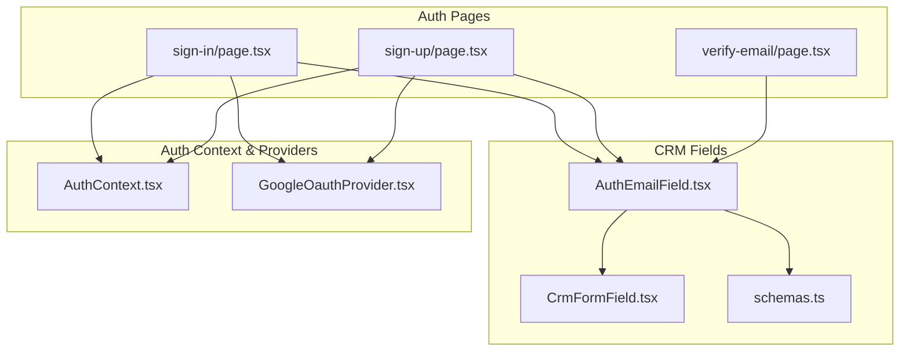
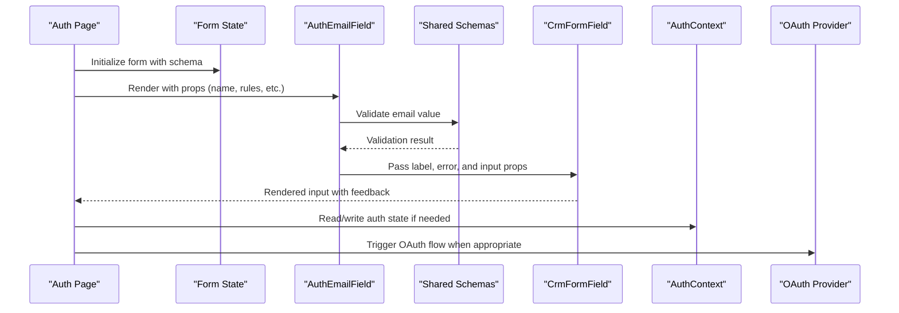
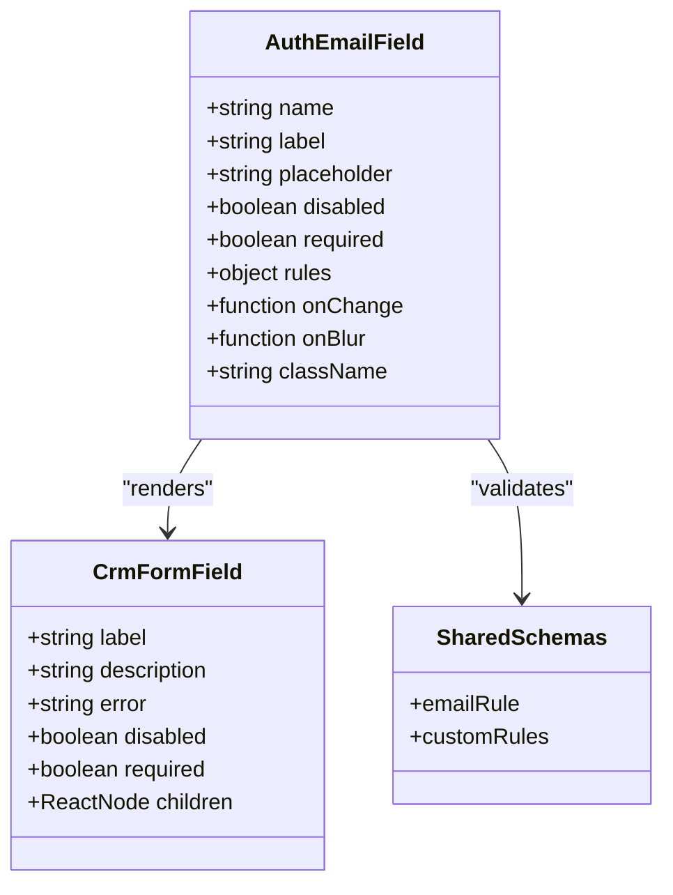
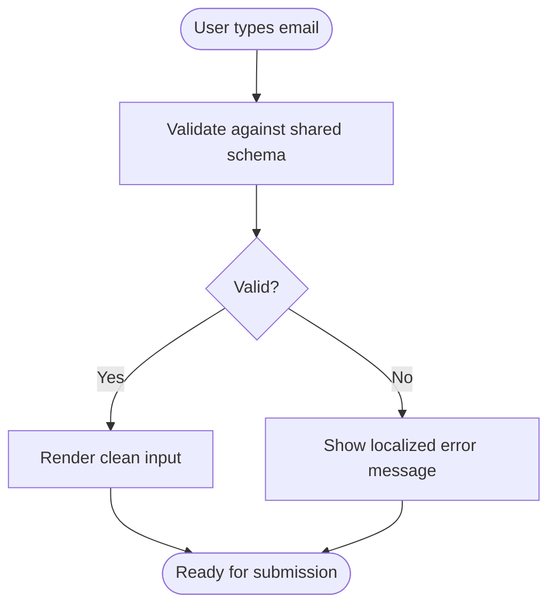
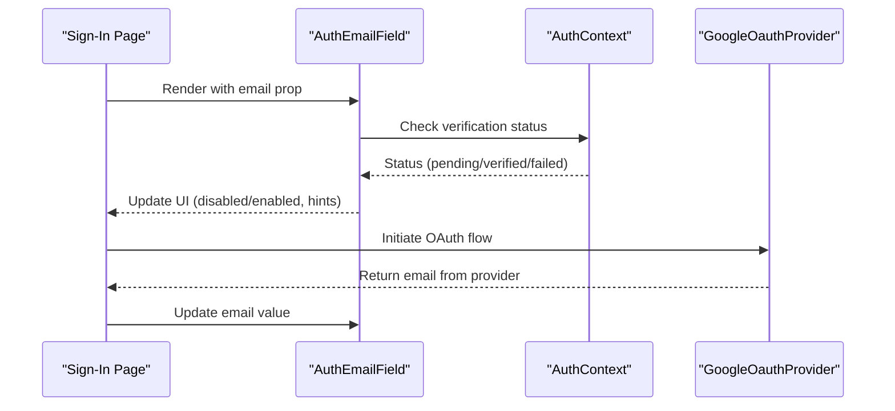
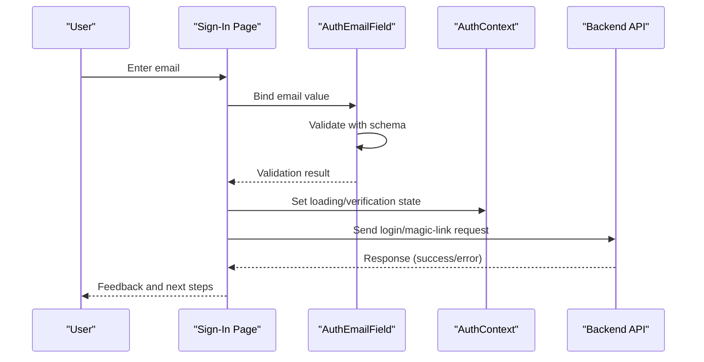
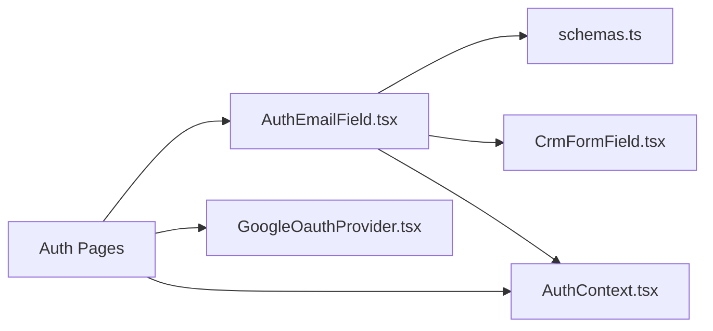

# Auth Email Field

<cite>
**Referenced Files in This Document**
- [AuthEmailField.tsx](file://app/[locale]/(routes)/crm/_components/crm-shared/fields/AuthEmailField.tsx)
- [schemas.ts](file://app/[locale]/(routes)/crm/_components/crm-shared/fields/schemas.ts)
- [CrmFormField.tsx](file://app/[locale]/(routes)/crm/_components/crm-shared/fields/CrmFormField.tsx)
- [AuthContext.tsx](file://contexts/AuthContext.tsx)
- [GoogleOauthProvider.tsx](file://providers/GoogleOauthProvider.tsx)
- [sign-in/page.tsx](file://app/[locale]/(auth)/sign-in/page.tsx)
- [sign-up/page.tsx](file://app/[locale]/(auth)/sign-up/page.tsx)
- [verify-email/page.tsx](file://app/[locale]/(auth)/verify-email/page.tsx)
</cite>

## Table of Contents
1. [Introduction](#introduction)
2. [Project Structure](#project-structure)
3. [Core Components](#core-components)
4. [Architecture Overview](#architecture-overview)
5. [Detailed Component Analysis](#detailed-component-analysis)
6. [Dependency Analysis](#dependency-analysis)
7. [Performance Considerations](#performance-considerations)
8. [Troubleshooting Guide](#troubleshooting-guide)
9. [Conclusion](#conclusion)
10. [Appendices](#appendices)

## Introduction
This document provides comprehensive documentation for the AuthEmailField component used across authentication and CRM-related flows. It explains email validation patterns, authentication-specific features, integration points with auth flows, and how to customize validation rules, error messages, and verification states. It also includes examples for extending validation, adding custom error messages, and connecting with authentication context and providers.

## Project Structure
The AuthEmailField is part of a shared CRM field library and is reused by both CRM forms and authentication pages. The relevant files include:
- The component implementation
- Shared form schema definitions
- A generic form field wrapper
- Authentication context and provider
- Authentication pages that consume the component

**Diagram sources**
- [AuthEmailField.tsx](file://app/[locale]/(routes)/crm/_components/crm-shared/fields/AuthEmailField.tsx)
- [CrmFormField.tsx](file://app/[locale]/(routes)/crm/_components/crm-shared/fields/CrmFormField.tsx)
- [schemas.ts](file://app/[locale]/(routes)/crm/_components/crm-shared/fields/schemas.ts)
- [AuthContext.tsx](file://contexts/AuthContext.tsx)
- [GoogleOauthProvider.tsx](file://providers/GoogleOauthProvider.tsx)
- [sign-in/page.tsx](file://app/[locale]/(auth)/sign-in/page.tsx)
- [sign-up/page.tsx](file://app/[locale]/(auth)/sign-up/page.tsx)
- [verify-email/page.tsx](file://app/[locale]/(auth)/verify-email/page.tsx)

**Section sources**
- [AuthEmailField.tsx](file://app/[locale]/(routes)/crm/_components/crm-shared/fields/AuthEmailField.tsx)
- [CrmFormField.tsx](file://app/[locale]/(routes)/crm/_components/crm-shared/fields/CrmFormField.tsx)
- [schemas.ts](file://app/[locale]/(routes)/crm/_components/crm-shared/fields/schemas.ts)
- [AuthContext.tsx](file://contexts/AuthContext.tsx)
- [GoogleOauthProvider.tsx](file://providers/GoogleOauthProvider.tsx)
- [sign-in/page.tsx](file://app/[locale]/(auth)/sign-in/page.tsx)
- [sign-up/page.tsx](file://app/[locale]/(auth)/sign-up/page.tsx)
- [verify-email/page.tsx](file://app/[locale]/(auth)/verify-email/page.tsx)

## Core Components
- AuthEmailField: An email input tailored for authentication flows. It integrates with a shared schema for validation and a generic form field wrapper for consistent UI behavior.
- CrmFormField: A reusable wrapper providing label, description, error display, and accessibility attributes.
- schemas: Centralized Zod-based schemas defining validation rules for emails and other fields.

Key responsibilities:
- Enforce email format using shared schema rules
- Surface validation errors via the form field wrapper
- Expose props to customize validation, labels, placeholders, and disabled state
- Integrate with authentication context where applicable (e.g., tracking verification status or enabling/disabling actions based on email state)

**Section sources**
- [AuthEmailField.tsx](file://app/[locale]/(routes)/crm/_components/crm-shared/fields/AuthEmailField.tsx)
- [CrmFormField.tsx](file://app/[locale]/(routes)/crm/_components/crm-shared/fields/CrmFormField.tsx)
- [schemas.ts](file://app/[locale]/(routes)/crm/_components/crm-shared/fields/schemas.ts)

## Architecture Overview
The AuthEmailField participates in two primary flows:
- CRM forms: Uses shared schema and CrmFormField for validation and presentation
- Authentication pages: Consumed by sign-in/sign-up and verify-email pages; may interact with AuthContext and OAuth providers

**Diagram sources**
- [AuthEmailField.tsx](file://app/[locale]/(routes)/crm/_components/crm-shared/fields/AuthEmailField.tsx)
- [CrmFormField.tsx](file://app/[locale]/(routes)/crm/_components/crm-shared/fields/CrmFormField.tsx)
- [schemas.ts](file://app/[locale]/(routes)/crm/_components/crm-shared/fields/schemas.ts)
- [AuthContext.tsx](file://contexts/AuthContext.tsx)
- [GoogleOauthProvider.tsx](file://providers/GoogleOauthProvider.tsx)
- [sign-in/page.tsx](file://app/[locale]/(auth)/sign-in/page.tsx)
- [sign-up/page.tsx](file://app/[locale]/(auth)/sign-up/page.tsx)
- [verify-email/page.tsx](file://app/[locale]/(auth)/verify-email/page.tsx)

## Detailed Component Analysis

### AuthEmailField Component
Responsibilities:
- Accepts props for customization (label, placeholder, disabled, required, validation rules)
- Integrates with shared schema for robust email validation
- Delegates rendering and error display to CrmFormField
- Optionally reads from or writes to authentication context to reflect verification states or enable/disable submit actions

Props overview:
- name: Identifier for the field within the form
- label: Accessible label text
- placeholder: Input placeholder text
- disabled: Disables user interaction
- required: Marks the field as required
- rules: Additional validation rules merged with default email schema
- onChange/onBlur: Optional event handlers for advanced integrations
- className: Styling hook for container/input elements

Validation behavior:
- Uses shared schema to enforce email format and any additional constraints
- Displays localized error messages via CrmFormField
- Supports real-time validation feedback

Integration points:
- Reads auth context to adjust UI (e.g., show verification pending state)
- Works alongside OAuth providers by coordinating with parent page logic

**Diagram sources**
- [AuthEmailField.tsx](file://app/[locale]/(routes)/crm/_components/crm-shared/fields/AuthEmailField.tsx)
- [CrmFormField.tsx](file://app/[locale]/(routes)/crm/_components/crm-shared/fields/CrmFormField.tsx)
- [schemas.ts](file://app/[locale]/(routes)/crm/_components/crm-shared/fields/schemas.ts)

**Section sources**
- [AuthEmailField.tsx](file://app/[locale]/(routes)/crm/_components/crm-shared/fields/AuthEmailField.tsx)
- [CrmFormField.tsx](file://app/[locale]/(routes)/crm/_components/crm-shared/fields/CrmFormField.tsx)
- [schemas.ts](file://app/[locale]/(routes)/crm/_components/crm-shared/fields/schemas.ts)

### Email Validation Patterns
- Base pattern: Standard RFC-compliant email format enforced by shared schema
- Customization: Extend or override rules via the rules prop to add domain restrictions, length limits, or regex patterns
- Error messages: Localized messages surfaced through CrmFormField; can be customized by overriding schema messages

**Diagram sources**
- [schemas.ts](file://app/[locale]/(routes)/crm/_components/crm-shared/fields/schemas.ts)
- [CrmFormField.tsx](file://app/[locale]/(routes)/crm/_components/crm-shared/fields/CrmFormField.tsx)

**Section sources**
- [schemas.ts](file://app/[locale]/(routes)/crm/_components/crm-shared/fields/schemas.ts)
- [CrmFormField.tsx](file://app/[locale]/(routes)/crm/_components/crm-shared/fields/CrmFormField.tsx)

### Authentication-Specific Features
- Verification state awareness: Can read from AuthContext to indicate pending verification or success states
- Conditional disabling: Disable submit or actions until email is verified
- Integration with OAuth: Coordinate with GoogleOauthProvider to prefill or validate email during social sign-in

**Diagram sources**
- [AuthEmailField.tsx](file://app/[locale]/(routes)/crm/_components/crm-shared/fields/AuthEmailField.tsx)
- [AuthContext.tsx](file://contexts/AuthContext.tsx)
- [GoogleOauthProvider.tsx](file://providers/GoogleOauthProvider.tsx)
- [sign-in/page.tsx](file://app/[locale]/(auth)/sign-in/page.tsx)

**Section sources**
- [AuthEmailField.tsx](file://app/[locale]/(routes)/crm/_components/crm-shared/fields/AuthEmailField.tsx)
- [AuthContext.tsx](file://contexts/AuthContext.tsx)
- [GoogleOauthProvider.tsx](file://providers/GoogleOauthProvider.tsx)
- [sign-in/page.tsx](file://app/[locale]/(auth)/sign-in/page.tsx)

### Integration with Auth Flows
- Sign-In: Use AuthEmailField to capture and validate user email before initiating login or magic link flows
- Sign-Up: Capture new user email, validate, and proceed to registration steps
- Verify Email: Display verification status and guide users to complete verification

**Diagram sources**
- [AuthEmailField.tsx](file://app/[locale]/(routes)/crm/_components/crm-shared/fields/AuthEmailField.tsx)
- [AuthContext.tsx](file://contexts/AuthContext.tsx)
- [sign-in/page.tsx](file://app/[locale]/(auth)/sign-in/page.tsx)
- [sign-up/page.tsx](file://app/[locale]/(auth)/sign-up/page.tsx)
- [verify-email/page.tsx](file://app/[locale]/(auth)/verify-email/page.tsx)

**Section sources**
- [sign-in/page.tsx](file://app/[locale]/(auth)/sign-in/page.tsx)
- [sign-up/page.tsx](file://app/[locale]/(auth)/sign-up/page.tsx)
- [verify-email/page.tsx](file://app/[locale]/(auth)/verify-email/page.tsx)
- [AuthEmailField.tsx](file://app/[locale]/(routes)/crm/_components/crm-shared/fields/AuthEmailField.tsx)
- [AuthContext.tsx](file://contexts/AuthContext.tsx)

### Prop Configuration Reference
Commonly used props for customization:
- name: Unique field identifier
- label: Screen-reader-friendly label
- placeholder: Hint text inside the input
- disabled: Prevents editing
- required: Enforces presence
- rules: Additional validation rules (e.g., domain allowlist, max length)
- onChange/onBlur: Hooks for side effects or analytics
- className: Styling overrides

Best practices:
- Keep label concise and descriptive
- Provide meaningful placeholder text
- Use rules to centralize validation logic
- Avoid heavy computations in onChange; prefer debounced updates if necessary

**Section sources**
- [AuthEmailField.tsx](file://app/[locale]/(routes)/crm/_components/crm-shared/fields/AuthEmailField.tsx)
- [CrmFormField.tsx](file://app/[locale]/(routes)/crm/_components/crm-shared/fields/CrmFormField.tsx)
- [schemas.ts](file://app/[locale]/(routes)/crm/_components/crm-shared/fields/schemas.ts)

### Extending Email Validation
To extend validation:
- Add custom rules via the rules prop
- Override error messages by customizing schema messages
- Combine multiple rules (format, domain, length) for stricter policies

Example approach:
- Define a domain allowlist rule
- Merge with base email rule
- Provide localized error messages

**Section sources**
- [schemas.ts](file://app/[locale]/(routes)/crm/_components/crm-shared/fields/schemas.ts)
- [AuthEmailField.tsx](file://app/[locale]/(routes)/crm/_components/crm-shared/fields/AuthEmailField.tsx)

### Adding Custom Error Messages
- Customize messages at the schema level for consistency
- Map specific validation failures to user-friendly strings
- Ensure localization support if applicable

**Section sources**
- [schemas.ts](file://app/[locale]/(routes)/crm/_components/crm-shared/fields/schemas.ts)
- [CrmFormField.tsx](file://app/[locale]/(routes)/crm/_components/crm-shared/fields/CrmFormField.tsx)

### Connecting with Authentication Context
- Read verification status from AuthContext to adjust UI
- Update context when email changes or verification completes
- Coordinate with OAuth providers to prefill email and handle provider-specific flows

**Section sources**
- [AuthContext.tsx](file://contexts/AuthContext.tsx)
- [GoogleOauthProvider.tsx](file://providers/GoogleOauthProvider.tsx)
- [sign-in/page.tsx](file://app/[locale]/(auth)/sign-in/page.tsx)
- [sign-up/page.tsx](file://app/[locale]/(auth)/sign-up/page.tsx)

## Dependency Analysis
AuthEmailField depends on:
- Shared schemas for validation
- CrmFormField for presentation and accessibility
- AuthContext for state coordination
- OAuth provider for social sign-in flows

**Diagram sources**
- [AuthEmailField.tsx](file://app/[locale]/(routes)/crm/_components/crm-shared/fields/AuthEmailField.tsx)
- [schemas.ts](file://app/[locale]/(routes)/crm/_components/crm-shared/fields/schemas.ts)
- [CrmFormField.tsx](file://app/[locale]/(routes)/crm/_components/crm-shared/fields/CrmFormField.tsx)
- [AuthContext.tsx](file://contexts/AuthContext.tsx)
- [GoogleOauthProvider.tsx](file://providers/GoogleOauthProvider.tsx)
- [sign-in/page.tsx](file://app/[locale]/(auth)/sign-in/page.tsx)
- [sign-up/page.tsx](file://app/[locale]/(auth)/sign-up/page.tsx)
- [verify-email/page.tsx](file://app/[locale]/(auth)/verify-email/page.tsx)

**Section sources**
- [AuthEmailField.tsx](file://app/[locale]/(routes)/crm/_components/crm-shared/fields/AuthEmailField.tsx)
- [schemas.ts](file://app/[locale]/(routes)/crm/_components/crm-shared/fields/schemas.ts)
- [CrmFormField.tsx](file://app/[locale]/(routes)/crm/_components/crm-shared/fields/CrmFormField.tsx)
- [AuthContext.tsx](file://contexts/AuthContext.tsx)
- [GoogleOauthProvider.tsx](file://providers/GoogleOauthProvider.tsx)
- [sign-in/page.tsx](file://app/[locale]/(auth)/sign-in/page.tsx)
- [sign-up/page.tsx](file://app/[locale]/(auth)/sign-up/page.tsx)
- [verify-email/page.tsx](file://app/[locale]/(auth)/verify-email/page.tsx)

## Performance Considerations
- Prefer memoization for expensive validation rules
- Debounce onChange if performing network checks
- Avoid re-renders by stabilizing props and context values
- Use controlled inputs judiciously; consider uncontrolled patterns for large forms

[No sources needed since this section provides general guidance]

## Troubleshooting Guide
Common issues and resolutions:
- Validation not triggering: Ensure the field name matches the schema definition and that rules are correctly merged
- Error messages not showing: Confirm CrmFormField receives error details and that schema messages are defined
- Verification state not updating: Verify AuthContext usage and ensure state updates propagate to the component
- OAuth email mismatch: Normalize provider email values and reconcile with local state

**Section sources**
- [AuthEmailField.tsx](file://app/[locale]/(routes)/crm/_components/crm-shared/fields/AuthEmailField.tsx)
- [CrmFormField.tsx](file://app/[locale]/(routes)/crm/_components/crm-shared/fields/CrmFormField.tsx)
- [schemas.ts](file://app/[locale]/(routes)/crm/_components/crm-shared/fields/schemas.ts)
- [AuthContext.tsx](file://contexts/AuthContext.tsx)
- [GoogleOauthProvider.tsx](file://providers/GoogleOauthProvider.tsx)

## Conclusion
AuthEmailField provides a robust, customizable email input tailored for authentication flows. By leveraging shared schemas, a consistent form field wrapper, and authentication context, it ensures reliable validation, clear error messaging, and seamless integration with sign-in, sign-up, and verification processes. Extending validation and customizing messages is straightforward, while coordination with OAuth providers enhances user experience.

[No sources needed since this section summarizes without analyzing specific files]

## Appendices

### Example Scenarios
- Restrict emails to a specific domain
- Add custom error messages for invalid formats
- Connect with authentication context to disable submit until verification completes
- Pre-fill email from Google OAuth and continue the sign-in flow

**Section sources**
- [AuthEmailField.tsx](file://app/[locale]/(routes)/crm/_components/crm-shared/fields/AuthEmailField.tsx)
- [schemas.ts](file://app/[locale]/(routes)/crm/_components/crm-shared/fields/schemas.ts)
- [AuthContext.tsx](file://contexts/AuthContext.tsx)
- [GoogleOauthProvider.tsx](file://providers/GoogleOauthProvider.tsx)
- [sign-in/page.tsx](file://app/[locale]/(auth)/sign-in/page.tsx)
- [sign-up/page.tsx](file://app/[locale]/(auth)/sign-up/page.tsx)
- [verify-email/page.tsx](file://app/[locale]/(auth)/verify-email/page.tsx)