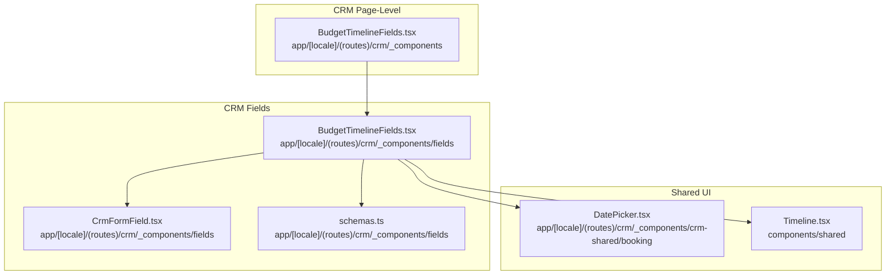
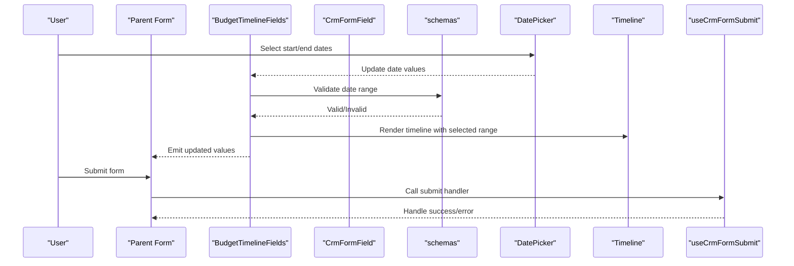
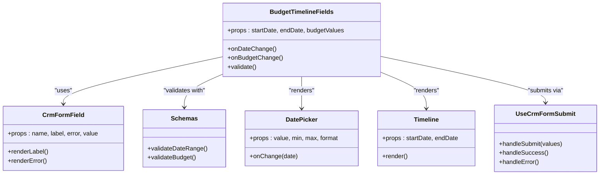

# Budget Timeline Fields

<cite>
**Referenced Files in This Document**
- [BudgetTimelineFields.tsx](file://app/[locale]/(routes)/crm/_components/fields/BudgetTimelineFields.tsx)
- [BudgetTimelineFields.tsx](file://app/[locale]/(routes)/crm/_components/BudgetTimelineFields.tsx)
- [CrmFormField.tsx](file://app/[locale]/(routes)/crm/_components/fields/CrmFormField.tsx)
- [schemas.ts](file://app/[locale]/(routes)/crm/_components/fields/schemas.ts)
- [useCrmFormSubmit.ts](file://app/[locale]/(routes)/crm/_components/hooks/useCrmFormSubmit.ts)
- [DatePicker.tsx](file://app/[locale]/(routes)/crm/_components/crm-shared/booking/DatePicker.tsx)
- [Timeline.tsx](file://components/shared/Timeline.tsx)
</cite>

## Table of Contents
1. [Introduction](#introduction)
2. [Project Structure](#project-structure)
3. [Core Components](#core-components)
4. [Architecture Overview](#architecture-overview)
5. [Detailed Component Analysis](#detailed-component-analysis)
6. [Dependency Analysis](#dependency-analysis)
7. [Performance Considerations](#performance-considerations)
8. [Troubleshooting Guide](#troubleshooting-guide)
9. [Conclusion](#conclusion)
10. [Appendices](#appendices)

## Introduction
This document provides comprehensive documentation for the BudgetTimelineFields component, focusing on:
- Date range selection interface
- Budget input fields
- Timeline visualization features
- Prop configurations and validation rules
- Integration with form submission flows
- Practical examples for customization (date formats, min/max dates, budget calculations, styling)

The component is used within CRM-related pages to collect project timeline and budget information from users.

## Project Structure
BudgetTimelineFields appears in two locations:
- A shared field implementation under CRM fields
- A page-level wrapper or variant under CRM components

**Diagram sources**
- [BudgetTimelineFields.tsx](file://app/[locale]/(routes)/crm/_components/fields/BudgetTimelineFields.tsx)
- [BudgetTimelineFields.tsx](file://app/[locale]/(routes)/crm/_components/BudgetTimelineFields.tsx)
- [CrmFormField.tsx](file://app/[locale]/(routes)/crm/_components/fields/CrmFormField.tsx)
- [schemas.ts](file://app/[locale]/(routes)/crm/_components/fields/schemas.ts)
- [DatePicker.tsx](file://app/[locale]/(routes)/crm/_components/crm-shared/booking/DatePicker.tsx)
- [Timeline.tsx](file://components/shared/Timeline.tsx)

**Section sources**
- [BudgetTimelineFields.tsx](file://app/[locale]/(routes)/crm/_components/fields/BudgetTimelineFields.tsx)
- [BudgetTimelineFields.tsx](file://app/[locale]/(routes)/crm/_components/BudgetTimelineFields.tsx)
- [CrmFormField.tsx](file://app/[locale]/(routes)/crm/_components/fields/CrmFormField.tsx)
- [schemas.ts](file://app/[locale]/(routes)/crm/_components/fields/schemas.ts)
- [DatePicker.tsx](file://app/[locale]/(routes)/crm/_components/crm-shared/booking/DatePicker.tsx)
- [Timeline.tsx](file://components/shared/Timeline.tsx)

## Core Components
- BudgetTimelineFields (fields): The primary reusable field that renders date range inputs, budget inputs, and a timeline visualization. It integrates with CrmFormField for consistent form behavior and uses schemas for validation.
- BudgetTimelineFields (page-level): A wrapper or variant tailored for a specific CRM page context; it composes the fields component and may pass additional props or default values.
- CrmFormField: Shared form field wrapper providing label, error display, and integration with form libraries.
- schemas: Validation schema definitions used by the form system to validate date ranges and budget values.
- DatePicker: Reusable date picker used for start/end date selection.
- Timeline: Shared timeline visualization component used to render the selected date range visually.

Key responsibilities:
- Manage local state for start date, end date, and budget values
- Validate inputs using schema rules
- Render a visual timeline based on selected dates
- Expose controlled props for parent forms to read/write values
- Provide customization hooks for formatting, constraints, and styling

**Section sources**
- [BudgetTimelineFields.tsx](file://app/[locale]/(routes)/crm/_components/fields/BudgetTimelineFields.tsx)
- [BudgetTimelineFields.tsx](file://app/[locale]/(routes)/crm/_components/BudgetTimelineFields.tsx)
- [CrmFormField.tsx](file://app/[locale]/(routes)/crm/_components/fields/CrmFormField.tsx)
- [schemas.ts](file://app/[locale]/(routes)/crm/_components/fields/schemas.ts)
- [DatePicker.tsx](file://app/[locale]/(routes)/crm/_components/crm-shared/booking/DatePicker.tsx)
- [Timeline.tsx](file://components/shared/Timeline.tsx)

## Architecture Overview
The component integrates into a form-driven workflow:
- Parent form binds to BudgetTimelineFields via controlled props
- BudgetTimelineFields validates against schemas and updates form state
- DatePicker handles user interactions for start/end dates
- Timeline renders a visual representation of the selected range
- On submit, useCrmFormSubmit orchestrates data transformation and API calls

**Diagram sources**
- [BudgetTimelineFields.tsx](file://app/[locale]/(routes)/crm/_components/fields/BudgetTimelineFields.tsx)
- [CrmFormField.tsx](file://app/[locale]/(routes)/crm/_components/fields/CrmFormField.tsx)
- [schemas.ts](file://app/[locale]/(routes)/crm/_components/fields/schemas.ts)
- [DatePicker.tsx](file://app/[locale]/(routes)/crm/_components/crm-shared/booking/DatePicker.tsx)
- [Timeline.tsx](file://components/shared/Timeline.tsx)
- [useCrmFormSubmit.ts](file://app/[locale]/(routes)/crm/_components/hooks/useCrmFormSubmit.ts)

## Detailed Component Analysis

### BudgetTimelineFields (fields)
Responsibilities:
- Renders date range selection using DatePicker
- Provides budget input fields with numeric validation
- Displays a timeline visualization using Timeline
- Integrates with CrmFormField for labels and errors
- Validates inputs using schemas

Prop configuration overview:
- Controlled value bindings for start date, end date, and budget fields
- Optional min/max date constraints
- Optional custom date formatter
- Optional callback for budget calculation or side effects
- Styling overrides for container, inputs, and timeline

Validation rules:
- Start date must be before or equal to end date
- End date must not exceed maximum allowed date if provided
- Budget values must be non-negative and within configured limits
- Schema-based validation ensures consistent error messages

Integration points:
- Uses CrmFormField for consistent UX across CRM forms
- Subscribes to form library events to update parent form state
- Emits change events when any field updates

Customization examples:
- Custom date format: Pass a formatter function to adjust how dates are displayed in DatePicker
- Min/max dates: Configure minimum and maximum bounds to restrict user selection
- Budget calculations: Provide a callback to compute derived totals or apply discounts
- Styling: Apply Tailwind classes or CSS variables to customize appearance

**Section sources**
- [BudgetTimelineFields.tsx](file://app/[locale]/(routes)/crm/_components/fields/BudgetTimelineFields.tsx)
- [CrmFormField.tsx](file://app/[locale]/(routes)/crm/_components/fields/CrmFormField.tsx)
- [schemas.ts](file://app/[locale]/(routes)/crm/_components/fields/schemas.ts)
- [DatePicker.tsx](file://app/[locale]/(routes)/crm/_components/crm-shared/booking/DatePicker.tsx)
- [Timeline.tsx](file://components/shared/Timeline.tsx)

### BudgetTimelineFields (page-level)
Purpose:
- Wraps the fields component for a specific CRM page
- Supplies default props such as initial values, locale-specific labels, or page-specific constraints
- May integrate with page-level form handlers or analytics

Usage pattern:
- Import the page-level wrapper
- Place it within the page’s form layout
- Rely on defaults while overriding only what is necessary

**Section sources**
- [BudgetTimelineFields.tsx](file://app/[locale]/(routes)/crm/_components/BudgetTimelineFields.tsx)

### CrmFormField
Role:
- Standardizes label rendering, error display, and accessibility attributes
- Bridges BudgetTimelineFields with the form library

Behavior:
- Accepts name, label, error, and value props
- Renders inline validation feedback
- Ensures consistent spacing and typography

**Section sources**
- [CrmFormField.tsx](file://app/[locale]/(routes)/crm/_components/fields/CrmFormField.tsx)

### schemas
Role:
- Defines validation rules for date ranges and budget fields
- Centralizes error messages and constraints

Rules typically include:
- Date ordering (start <= end)
- Maximum date boundaries
- Numeric constraints for budget fields
- Required field checks

**Section sources**
- [schemas.ts](file://app/[locale]/(routes)/crm/_components/fields/schemas.ts)

### DatePicker
Role:
- Provides date selection UI for start and end dates
- Supports min/max constraints and custom formatting

Integration:
- Receives current value and onChange from BudgetTimelineFields
- Emits validated date changes back to the parent

**Section sources**
- [DatePicker.tsx](file://app/[locale]/(routes)/crm/_components/crm-shared/booking/DatePicker.tsx)

### Timeline
Role:
- Visualizes the selected date range
- Highlights milestones or phases if provided

Styling:
- Accepts class names or style props for customization
- Adapts to theme and responsive layouts

**Section sources**
- [Timeline.tsx](file://components/shared/Timeline.tsx)

### useCrmFormSubmit
Role:
- Orchestrates form submission logic
- Transforms collected values into API payloads
- Handles success and error states

Integration:
- Called by parent forms after validating all fields including BudgetTimelineFields

**Section sources**
- [useCrmFormSubmit.ts](file://app/[locale]/(routes)/crm/_components/hooks/useCrmFormSubmit.ts)

## Dependency Analysis
Relationships between components and utilities:

**Diagram sources**
- [BudgetTimelineFields.tsx](file://app/[locale]/(routes)/crm/_components/fields/BudgetTimelineFields.tsx)
- [CrmFormField.tsx](file://app/[locale]/(routes)/crm/_components/fields/CrmFormField.tsx)
- [schemas.ts](file://app/[locale]/(routes)/crm/_components/fields/schemas.ts)
- [DatePicker.tsx](file://app/[locale]/(routes)/crm/_components/crm-shared/booking/DatePicker.tsx)
- [Timeline.tsx](file://components/shared/Timeline.tsx)
- [useCrmFormSubmit.ts](file://app/[locale]/(routes)/crm/_components/hooks/useCrmFormSubmit.ts)

**Section sources**
- [BudgetTimelineFields.tsx](file://app/[locale]/(routes)/crm/_components/fields/BudgetTimelineFields.tsx)
- [CrmFormField.tsx](file://app/[locale]/(routes)/crm/_components/fields/CrmFormField.tsx)
- [schemas.ts](file://app/[locale]/(routes)/crm/_components/fields/schemas.ts)
- [DatePicker.tsx](file://app/[locale]/(routes)/crm/_components/crm-shared/booking/DatePicker.tsx)
- [Timeline.tsx](file://components/shared/Timeline.tsx)
- [useCrmFormSubmit.ts](file://app/[locale]/(routes)/crm/_components/hooks/useCrmFormSubmit.ts)

## Performance Considerations
- Debounce budget recalculation callbacks to avoid excessive re-renders
- Memoize computed timeline segments to reduce layout thrashing
- Avoid unnecessary re-validation by leveraging schema caching where possible
- Prefer controlled inputs with stable references to prevent redundant updates

[No sources needed since this section provides general guidance]

## Troubleshooting Guide
Common issues and resolutions:
- Date range invalid: Ensure start date is not after end date; check schema constraints and min/max props
- Budget validation errors: Verify non-negative values and upper bounds; confirm currency formatting does not interfere with parsing
- Timeline not updating: Confirm that date changes propagate to the Timeline props and that no intermediate state blocks updates
- Form submission failures: Inspect payload shape produced by useCrmFormSubmit and ensure required fields are present

**Section sources**
- [schemas.ts](file://app/[locale]/(routes)/crm/_components/fields/schemas.ts)
- [useCrmFormSubmit.ts](file://app/[locale]/(routes)/crm/_components/hooks/useCrmFormSubmit.ts)

## Conclusion
BudgetTimelineFields offers a cohesive interface for selecting project timelines and budgets, integrating validation, visualization, and form submission. By leveraging its prop configuration and customization hooks, teams can tailor date formats, enforce constraints, implement budget calculations, and style the timeline to match their design system.

[No sources needed since this section summarizes without analyzing specific files]

## Appendices

### Practical Examples

- Customize date formats
  - Provide a formatter function to DatePicker to control display strings
  - Reference: [DatePicker.tsx](file://app/[locale]/(routes)/crm/_components/crm-shared/booking/DatePicker.tsx)

- Set minimum and maximum dates
  - Configure min/max props on DatePicker and validate via schemas
  - References: [DatePicker.tsx](file://app/[locale]/(routes)/crm/_components/crm-shared/booking/DatePicker.tsx), [schemas.ts](file://app/[locale]/(routes)/crm/_components/fields/schemas.ts)

- Handle budget calculations
  - Implement a callback to compute totals, apply discounts, or convert currencies
  - Reference: [BudgetTimelineFields.tsx](file://app/[locale]/(routes)/crm/_components/fields/BudgetTimelineFields.tsx)

- Style the timeline components
  - Apply Tailwind classes or CSS variables to Timeline and container elements
  - Reference: [Timeline.tsx](file://components/shared/Timeline.tsx)

- Integrate with form submission flows
  - Bind BudgetTimelineFields to your form and call useCrmFormSubmit on submit
  - References: [BudgetTimelineFields.tsx](file://app/[locale]/(routes)/crm/_components/fields/BudgetTimelineFields.tsx), [useCrmFormSubmit.ts](file://app/[locale]/(routes)/crm/_components/hooks/useCrmFormSubmit.ts)