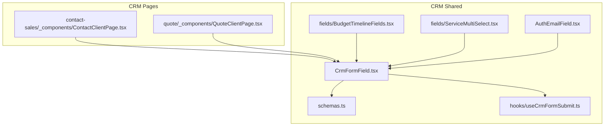
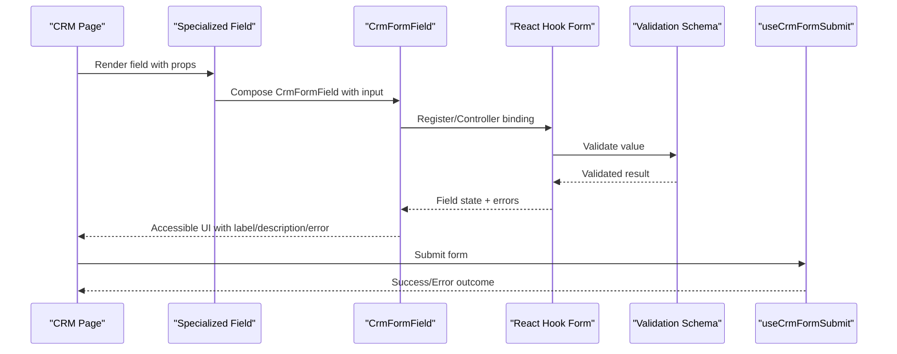
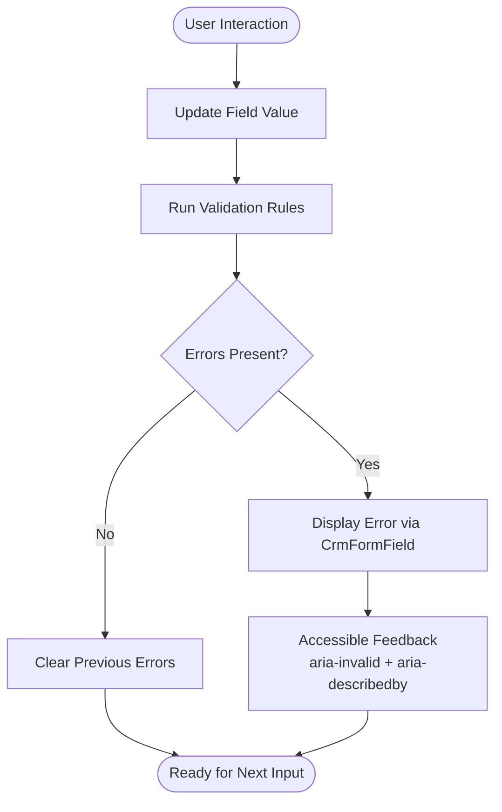
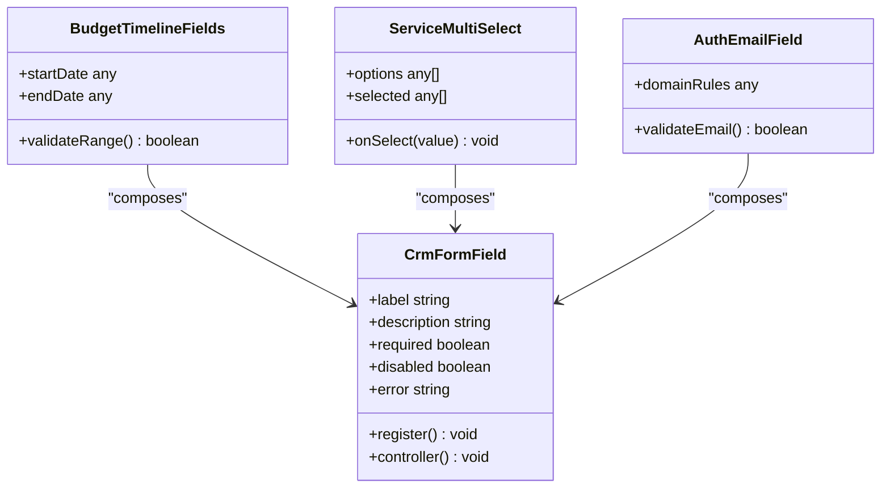
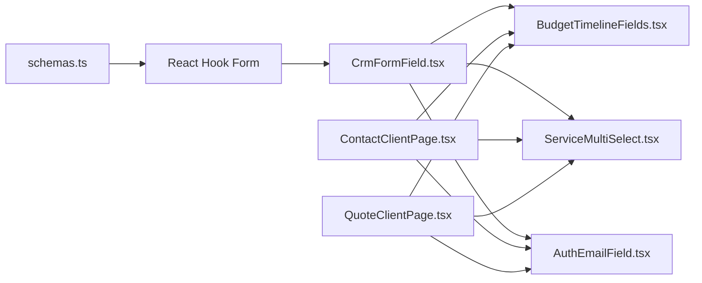

# CrmFormField Base Component

<cite>
**Referenced Files in This Document**
- [CrmFormField.tsx](file://app/[locale]/(routes)/crm/_components/crm-shared/CrmFormField.tsx)
- [BudgetTimelineFields.tsx](file://app/[locale]/(routes)/crm/_components/crm-shared/fields/BudgetTimelineFields.tsx)
- [ServiceMultiSelect.tsx](file://app/[locale]/(routes)/crm/_components/crm-shared/fields/ServiceMultiSelect.tsx)
- [AuthEmailField.tsx](file://app/[locale]/(routes)/crm/_components/crm-shared/AuthEmailField.tsx)
- [schemas.ts](file://app/[locale]/(routes)/crm/_components/crm-shared/schemas.ts)
- [useCrmFormSubmit.ts](file://app/[locale]/(routes)/crm/_components/hooks/useCrmFormSubmit.ts)
- [ContactClientPage.tsx](file://app/[locale]/(routes)/crm/contact-sales/_components/ContactClientPage.tsx)
- [QuoteClientPage.tsx](file://app/[locale]/(routes)/crm/quote/_components/QuoteClientPage.tsx)
</cite>

## Table of Contents
1. [Introduction](#introduction)
2. [Project Structure](#project-structure)
3. [Core Components](#core-components)
4. [Architecture Overview](#architecture-overview)
5. [Detailed Component Analysis](#detailed-component-analysis)
6. [Dependency Analysis](#dependency-analysis)
7. [Performance Considerations](#performance-considerations)
8. [Troubleshooting Guide](#troubleshooting-guide)
9. [Conclusion](#conclusion)

## Introduction
This document explains the CrmFormField base component that serves as the foundation for all CRM form fields in the application. It covers the component’s core architecture, prop interfaces, validation integration, error handling, styling patterns, and accessibility features. It also provides guidance on extending the base component to create custom field types, configuring field behavior, and integrating with React Hook Form.

## Project Structure
The CRM form system is organized under a shared directory for CRM components. The base CrmFormField lives alongside specialized field implementations and schema definitions used by CRM pages.

**Diagram sources**
- [CrmFormField.tsx](file://app/[locale]/(routes)/crm/_components/crm-shared/CrmFormField.tsx)
- [schemas.ts](file://app/[locale]/(routes)/crm/_components/crm-shared/schemas.ts)
- [useCrmFormSubmit.ts](file://app/[locale]/(routes)/crm/_components/hooks/useCrmFormSubmit.ts)
- [BudgetTimelineFields.tsx](file://app/[locale]/(routes)/crm/_components/crm-shared/fields/BudgetTimelineFields.tsx)
- [ServiceMultiSelect.tsx](file://app/[locale]/(routes)/crm/_components/crm-shared/fields/ServiceMultiSelect.tsx)
- [AuthEmailField.tsx](file://app/[locale]/(routes)/crm/_components/crm-shared/AuthEmailField.tsx)
- [ContactClientPage.tsx](file://app/[locale]/(routes)/crm/contact-sales/_components/ContactClientPage.tsx)
- [QuoteClientPage.tsx](file://app/[locale]/(routes)/crm/quote/_components/QuoteClientPage.tsx)

**Section sources**
- [CrmFormField.tsx](file://app/[locale]/(routes)/crm/_components/crm-shared/CrmFormField.tsx)
- [schemas.ts](file://app/[locale]/(routes)/crm/_components/crm-shared/schemas.ts)
- [useCrmFormSubmit.ts](file://app/[locale]/(routes)/crm/_components/hooks/useCrmFormSubmit.ts)
- [BudgetTimelineFields.tsx](file://app/[locale]/(routes)/crm/_components/crm-shared/fields/BudgetTimelineFields.tsx)
- [ServiceMultiSelect.tsx](file://app/[locale]/(routes)/crm/_components/crm-shared/fields/ServiceMultiSelect.tsx)
- [AuthEmailField.tsx](file://app/[locale]/(routes)/crm/_components/crm-shared/AuthEmailField.tsx)
- [ContactClientPage.tsx](file://app/[locale]/(routes)/crm/contact-sales/_components/ContactClientPage.tsx)
- [QuoteClientPage.tsx](file://app/[locale]/(routes)/crm/quote/_components/QuoteClientPage.tsx)

## Core Components
- CrmFormField: Base wrapper that standardizes label, description, error display, disabled state, and accessibility attributes across all CRM fields. It integrates with React Hook Form via registration or controller patterns and exposes consistent props for configuration.
- Specialized Fields: BudgetTimelineFields, ServiceMultiSelect, and AuthEmailField extend or compose CrmFormField to implement domain-specific inputs while reusing common behavior.
- Schema Definitions: schemas.ts centralizes validation rules consumed by React Hook Form and displayed through CrmFormField.
- Submission Hook: useCrmFormSubmit orchestrates form submission flows and integrates with CrmFormField’s error reporting.

Key responsibilities:
- Provide a unified interface for labels, helper text, errors, and disabled states.
- Enforce consistent accessibility (aria attributes, roles).
- Bridge React Hook Form state into UI feedback.
- Offer styling hooks for theme-aware appearance.

**Section sources**
- [CrmFormField.tsx](file://app/[locale]/(routes)/crm/_components/crm-shared/CrmFormField.tsx)
- [BudgetTimelineFields.tsx](file://app/[locale]/(routes)/crm/_components/crm-shared/fields/BudgetTimelineFields.tsx)
- [ServiceMultiSelect.tsx](file://app/[locale]/(routes)/crm/_components/crm-shared/fields/ServiceMultiSelect.tsx)
- [AuthEmailField.tsx](file://app/[locale]/(routes)/crm/_components/crm-shared/AuthEmailField.tsx)
- [schemas.ts](file://app/[locale]/(routes)/crm/_components/crm-shared/schemas.ts)
- [useCrmFormSubmit.ts](file://app/[locale]/(routes)/crm/_components/hooks/useCrmFormSubmit.ts)

## Architecture Overview
CrmFormField sits at the center of the CRM form layer. Pages consume it directly or via specialized field components. Validation is defined in schemas and applied through React Hook Form. Errors are surfaced consistently by CrmFormField.

**Diagram sources**
- [CrmFormField.tsx](file://app/[locale]/(routes)/crm/_components/crm-shared/CrmFormField.tsx)
- [schemas.ts](file://app/[locale]/(routes)/crm/_components/crm-shared/schemas.ts)
- [useCrmFormSubmit.ts](file://app/[locale]/(routes)/crm/_components/hooks/useCrmFormSubmit.ts)
- [BudgetTimelineFields.tsx](file://app/[locale]/(routes)/crm/_components/crm-shared/fields/BudgetTimelineFields.tsx)
- [ServiceMultiSelect.tsx](file://app/[locale]/(routes)/crm/_components/crm-shared/fields/ServiceMultiSelect.tsx)
- [AuthEmailField.tsx](file://app/[locale]/(routes)/crm/_components/crm-shared/AuthEmailField.tsx)

## Detailed Component Analysis

### CrmFormField Base Component
CrmFormField provides a standardized shell for CRM inputs. It typically includes:
- Props for label, description/helper text, required indicator, disabled state, and error message.
- Accessibility attributes such as aria-describedby for helper text and aria-invalid when there is an error.
- Consistent layout for label, control, and feedback regions.
- Integration points for React Hook Form via register or controller to bind values and errors.

Styling patterns:
- Uses consistent spacing and typography tokens for labels and messages.
- Applies visual cues for invalid state (e.g., border color changes) and disabled state (opacity or cursor).
- Supports optional prefix/suffix slots for advanced inputs.

Error handling:
- Displays server-side or client-side errors uniformly.
- Clears errors on change unless validation fails again.
- Provides programmatic methods to set or clear errors if needed.

Accessibility:
- Associates label and input using htmlFor/id pairs.
- Announces required status and error messages to assistive technologies.
- Ensures focus management and keyboard navigation for complex controls.

Extensibility:
- Exposes render props or slot-based customization for the inner control.
- Allows overriding default styles via className or theme props.
- Encourages composition over inheritance; specialized fields wrap CrmFormField.

Integration with React Hook Form:
- Accepts field name and validation rules from schema.
- Bridges setValue/getValue for controlled usage.
- Emits onChange onBlur events to keep form state in sync.

**Section sources**
- [CrmFormField.tsx](file://app/[locale]/(routes)/crm/_components/crm-shared/CrmFormField.tsx)

### Specialized Field Examples

#### BudgetTimelineFields
A composite field that likely renders multiple related inputs (e.g., start/end dates or ranges). It composes CrmFormField for each sub-control and aggregates validation results.

Behavior highlights:
- Coordinates cross-field validation (e.g., end date after start date).
- Shares error messaging between sub-fields.
- Reuses CrmFormField’s accessibility and styling.

**Section sources**
- [BudgetTimelineFields.tsx](file://app/[locale]/(routes)/crm/_components/crm-shared/fields/BudgetTimelineFields.tsx)
- [CrmFormField.tsx](file://app/[locale]/(routes)/crm/_components/crm-shared/CrmFormField.tsx)

#### ServiceMultiSelect
A multi-select implementation built on CrmFormField. It manages selected options, supports search/filtering, and displays selection summaries.

Behavior highlights:
- Integrates with React Hook Form for array-type values.
- Shows per-option errors and overall field errors.
- Maintains focus and keyboard navigation for select interactions.

**Section sources**
- [ServiceMultiSelect.tsx](file://app/[locale]/(routes)/crm/_components/crm-shared/fields/ServiceMultiSelect.tsx)
- [CrmFormField.tsx](file://app/[locale]/(routes)/crm/_components/crm-shared/CrmFormField.tsx)

#### AuthEmailField
An email-focused field tailored for authentication contexts. It may include additional constraints like domain allowlists or specific formatting.

Behavior highlights:
- Leverages CrmFormField for consistent UX.
- Applies stricter validation rules from schemas.
- Provides contextual help text for auth flows.

**Section sources**
- [AuthEmailField.tsx](file://app/[locale]/(routes)/crm/_components/crm-shared/AuthEmailField.tsx)
- [schemas.ts](file://app/[locale]/(routes)/crm/_components/crm-shared/schemas.ts)
- [CrmFormField.tsx](file://app/[locale]/(routes)/crm/_components/crm-shared/CrmFormField.tsx)

### Validation and Error Handling Flow
The following flowchart shows how validation and errors propagate through the system.

**Diagram sources**
- [CrmFormField.tsx](file://app/[locale]/(routes)/crm/_components/crm-shared/CrmFormField.tsx)
- [schemas.ts](file://app/[locale]/(routes)/crm/_components/crm-shared/schemas.ts)

### Class-like Relationships Among CRM Fields
Although these are functional components, we can illustrate their relationships conceptually.

**Diagram sources**
- [CrmFormField.tsx](file://app/[locale]/(routes)/crm/_components/crm-shared/CrmFormField.tsx)
- [BudgetTimelineFields.tsx](file://app/[locale]/(routes)/crm/_components/crm-shared/fields/BudgetTimelineFields.tsx)
- [ServiceMultiSelect.tsx](file://app/[locale]/(routes)/crm/_components/crm-shared/fields/ServiceMultiSelect.tsx)
- [AuthEmailField.tsx](file://app/[locale]/(routes)/crm/_components/crm-shared/AuthEmailField.tsx)

## Dependency Analysis
CrmFormField depends on React Hook Form for state and validation orchestration and on shared schema definitions for rule enforcement. Specialized fields depend on CrmFormField for presentation and accessibility. Pages depend on specialized fields and CrmFormField for rendering forms.

**Diagram sources**
- [schemas.ts](file://app/[locale]/(routes)/crm/_components/crm-shared/schemas.ts)
- [CrmFormField.tsx](file://app/[locale]/(routes)/crm/_components/crm-shared/CrmFormField.tsx)
- [BudgetTimelineFields.tsx](file://app/[locale]/(routes)/crm/_components/crm-shared/fields/BudgetTimelineFields.tsx)
- [ServiceMultiSelect.tsx](file://app/[locale]/(routes)/crm/_components/crm-shared/fields/ServiceMultiSelect.tsx)
- [AuthEmailField.tsx](file://app/[locale]/(routes)/crm/_components/crm-shared/AuthEmailField.tsx)
- [ContactClientPage.tsx](file://app/[locale]/(routes)/crm/contact-sales/_components/ContactClientPage.tsx)
- [QuoteClientPage.tsx](file://app/[locale]/(routes)/crm/quote/_components/QuoteClientPage.tsx)

**Section sources**
- [schemas.ts](file://app/[locale]/(routes)/crm/_components/crm-shared/schemas.ts)
- [CrmFormField.tsx](file://app/[locale]/(routes)/crm/_components/crm-shared/CrmFormField.tsx)
- [BudgetTimelineFields.tsx](file://app/[locale]/(routes)/crm/_components/crm-shared/fields/BudgetTimelineFields.tsx)
- [ServiceMultiSelect.tsx](file://app/[locale]/(routes)/crm/_components/crm-shared/fields/ServiceMultiSelect.tsx)
- [AuthEmailField.tsx](file://app/[locale]/(routes)/crm/_components/crm-shared/AuthEmailField.tsx)
- [ContactClientPage.tsx](file://app/[locale]/(routes)/crm/contact-sales/_components/ContactClientPage.tsx)
- [QuoteClientPage.tsx](file://app/[locale]/(routes)/crm/quote/_components/QuoteClientPage.tsx)

## Performance Considerations
- Prefer memoization for expensive specialized fields to avoid unnecessary re-renders.
- Use React Hook Form’s controller pattern for highly customized inputs to minimize re-renders and maintain performance.
- Debounce heavy validations or API calls triggered by user input.
- Keep CrmFormField lightweight; defer complex logic to specialized fields.

[No sources needed since this section provides general guidance]

## Troubleshooting Guide
Common issues and resolutions:
- Missing label association: Ensure htmlFor/id pairing and aria-describedby are present so screen readers announce context correctly.
- Validation not triggering: Verify field registration and that schema rules match the field’s data type.
- Error not clearing: Confirm onChange handlers update form state and clear previous errors.
- Disabled state not reflected: Ensure disabled prop propagates to the underlying input and updates aria-disabled where applicable.
- Focus management: For complex fields (multi-select), ensure focus remains predictable and accessible.

**Section sources**
- [CrmFormField.tsx](file://app/[locale]/(routes)/crm/_components/crm-shared/CrmFormField.tsx)
- [schemas.ts](file://app/[locale]/(routes)/crm/_components/crm-shared/schemas.ts)

## Conclusion
CrmFormField establishes a consistent, accessible, and extensible foundation for CRM form fields. By centralizing validation integration, error handling, and styling patterns, it enables specialized fields to focus on domain logic while maintaining a uniform user experience. Pages integrate seamlessly through either direct usage or composed specialized fields, and React Hook Form ensures robust state and validation management.

[No sources needed since this section summarizes without analyzing specific files]