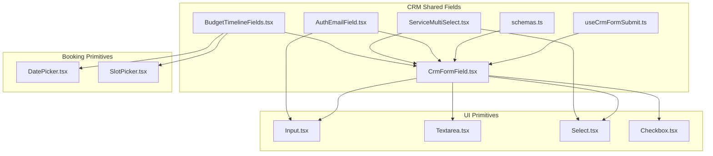
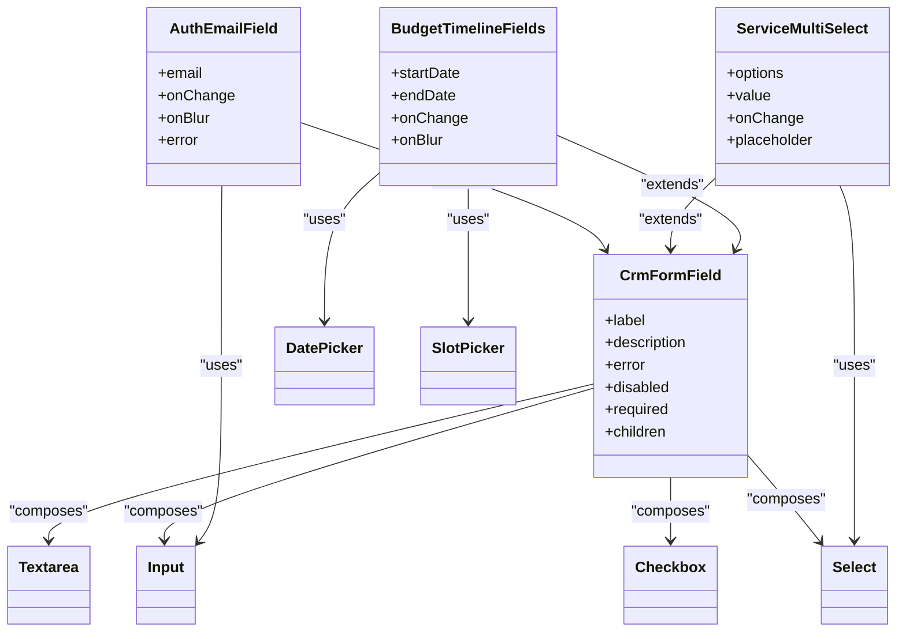
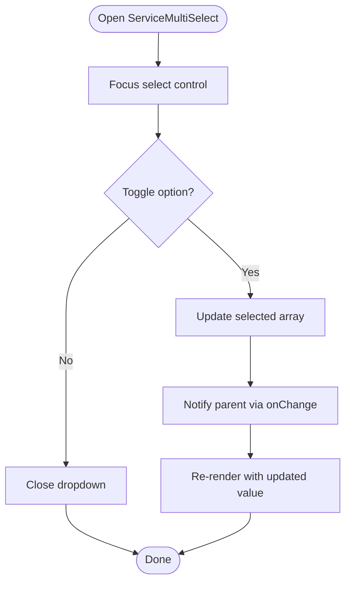
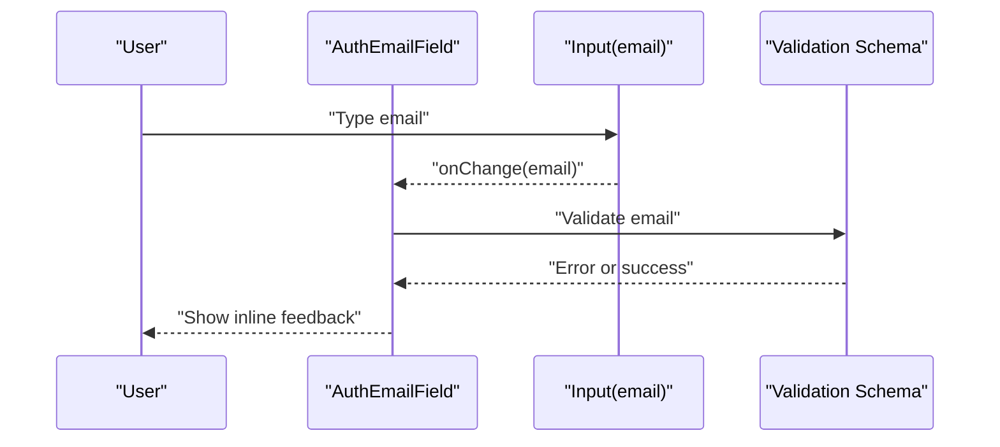
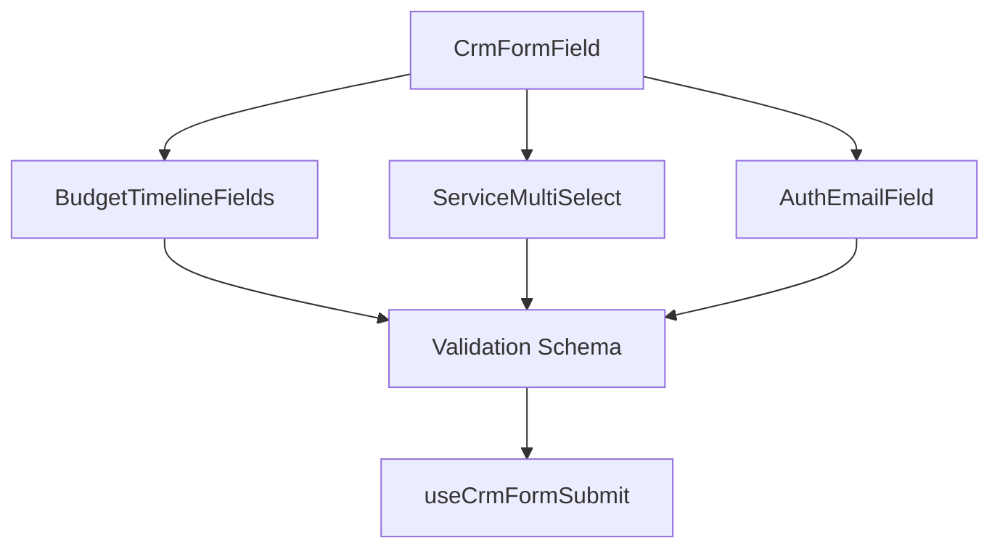
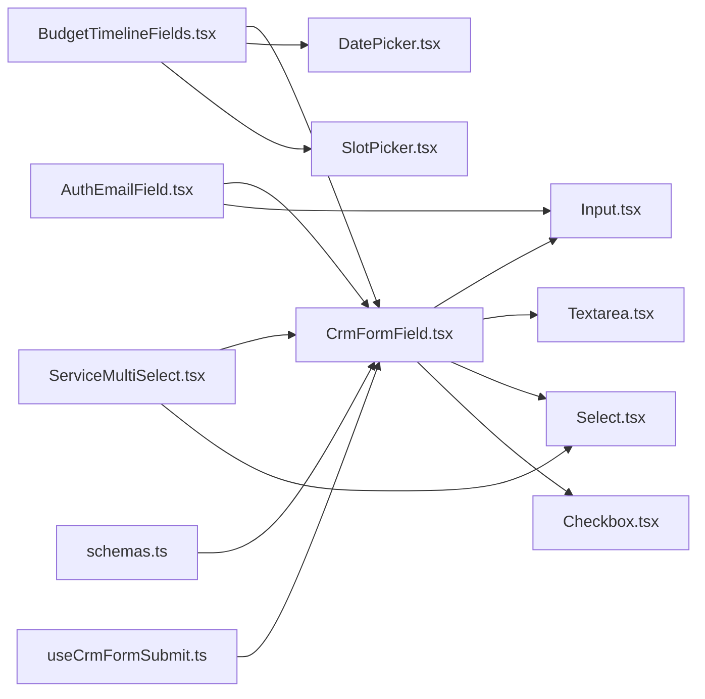

# Reusable Form Fields

<cite>
**Referenced Files in This Document**
- [CrmFormField.tsx](file://app/[locale]/(routes)/crm/_components/crm-shared/fields/CrmFormField.tsx)
- [BudgetTimelineFields.tsx](file://app/[locale]/(routes)/crm/_components/crm-shared/fields/BudgetTimelineFields.tsx)
- [ServiceMultiSelect.tsx](file://app/[locale]/(routes)/crm/_components/crm-shared/fields/ServiceMultiSelect.tsx)
- [AuthEmailField.tsx](file://app/[locale]/(routes)/crm/_components/crm-shared/fields/AuthEmailField.tsx)
- [schemas.ts](file://app/[locale]/(routes)/crm/_components/crm-shared/fields/schemas.ts)
- [useCrmFormSubmit.ts](file://app/[locale]/(routes)/crm/_components/crm-shared/hooks/useCrmFormSubmit.ts)
- [DatePicker.tsx](file://app/[locale]/(routes)/crm/_components/crm-shared/booking/DatePicker.tsx)
- [SlotPicker.tsx](file://app/[locale]/(routes)/crm/_components/crm-shared/booking/SlotPicker.tsx)
- [Input.tsx](file://components/ui/input.tsx)
- [Textarea.tsx](file://components/ui/textarea.tsx)
- [Select.tsx](file://components/ui/select.tsx)
- [Checkbox.tsx](file://components/ui/checkbox.tsx)
</cite>

## Table of Contents
1. [Introduction](#introduction)
2. [Project Structure](#project-structure)
3. [Core Components](#core-components)
4. [Architecture Overview](#architecture-overview)
5. [Detailed Component Analysis](#detailed-component-analysis)
6. [Dependency Analysis](#dependency-analysis)
7. [Performance Considerations](#performance-considerations)
8. [Troubleshooting Guide](#troubleshooting-guide)
9. [Conclusion](#conclusion)
10. [Appendices](#appendices)

## Introduction
This document explains the reusable form field components used across CRM and authentication flows. It focuses on:
- The CrmFormField base component architecture, prop interfaces, and customization options
- Specialized fields for common use cases: BudgetTimelineFields (date range selection), ServiceMultiSelect (multiple service selection), and AuthEmailField (email authentication)
- Composition patterns, styling approaches, and accessibility features
- Practical guidance for creating new custom fields, extending existing ones, and integrating with validation systems

The goal is to provide a clear mental model and practical recipes for building consistent, accessible, and maintainable forms.

## Project Structure
Reusable CRM fields live under a shared directory and are composed from UI primitives. The structure emphasizes separation of concerns:
- Base field wrapper and shared utilities
- Specialized fields that compose primitives and domain logic
- Validation schemas and submission hooks
- Booking-related primitives used by specialized fields



**Diagram sources**
- [CrmFormField.tsx](file://app/[locale]/(routes)/crm/_components/crm-shared/fields/CrmFormField.tsx)
- [BudgetTimelineFields.tsx](file://app/[locale]/(routes)/crm/_components/crm-shared/fields/BudgetTimelineFields.tsx)
- [ServiceMultiSelect.tsx](file://app/[locale]/(routes)/crm/_components/crm-shared/fields/ServiceMultiSelect.tsx)
- [AuthEmailField.tsx](file://app/[locale]/(routes)/crm/_components/crm-shared/fields/AuthEmailField.tsx)
- [schemas.ts](file://app/[locale]/(routes)/crm/_components/crm-shared/fields/schemas.ts)
- [useCrmFormSubmit.ts](file://app/[locale]/(routes)/crm/_components/crm-shared/hooks/useCrmFormSubmit.ts)
- [DatePicker.tsx](file://app/[locale]/(routes)/crm/_components/crm-shared/booking/DatePicker.tsx)
- [SlotPicker.tsx](file://app/[locale]/(routes)/crm/_components/crm-shared/booking/SlotPicker.tsx)
- [Input.tsx](file://components/ui/input.tsx)
- [Textarea.tsx](file://components/ui/textarea.tsx)
- [Select.tsx](file://components/ui/select.tsx)
- [Checkbox.tsx](file://components/ui/checkbox.tsx)

**Section sources**
- [CrmFormField.tsx](file://app/[locale]/(routes)/crm/_components/crm-shared/fields/CrmFormField.tsx)
- [BudgetTimelineFields.tsx](file://app/[locale]/(routes)/crm/_components/crm-shared/fields/BudgetTimelineFields.tsx)
- [ServiceMultiSelect.tsx](file://app/[locale]/(routes)/crm/_components/crm-shared/fields/ServiceMultiSelect.tsx)
- [AuthEmailField.tsx](file://app/[locale]/(routes)/crm/_components/crm-shared/fields/AuthEmailField.tsx)
- [schemas.ts](file://app/[locale]/(routes)/crm/_components/crm-shared/fields/schemas.ts)
- [useCrmFormSubmit.ts](file://app/[locale]/(routes)/crm/_components/crm-shared/hooks/useCrmFormSubmit.ts)
- [DatePicker.tsx](file://app/[locale]/(routes)/crm/_components/crm-shared/booking/DatePicker.tsx)
- [SlotPicker.tsx](file://app/[locale]/(routes)/crm/_components/crm-shared/booking/SlotPicker.tsx)
- [Input.tsx](file://components/ui/input.tsx)
- [Textarea.tsx](file://components/ui/textarea.tsx)
- [Select.tsx](file://components/ui/select.tsx)
- [Checkbox.tsx](file://components/ui/checkbox.tsx)

## Core Components
This section outlines the base component and its role as a consistent wrapper around UI primitives.

- CrmFormField responsibilities
  - Provides a unified interface for label, helper text, error messages, disabled state, and required indicators
  - Normalizes integration with form libraries and validation schemas
  - Ensures consistent accessibility attributes and keyboard navigation
  - Encapsulates layout and styling conventions for CRM forms

- Typical props and behaviors
  - Label and description/hint text
  - Error message display and validation state binding
  - Disabled and read-only states
  - Required indicator and screen-reader hints
  - Optional slot-based content area for advanced customization

- Integration points
  - Works with validation schemas to surface errors consistently
  - Composes UI primitives (input, textarea, select, checkbox) via composition or render props
  - Exposes standard events for onChange/onBlur to integrate with controlled forms

Practical usage patterns
- Wrap any primitive input to inherit consistent behavior
- Provide schema-driven validation through a central schema file
- Use optional slots to inject complex inputs while retaining base semantics

**Section sources**
- [CrmFormField.tsx](file://app/[locale]/(routes)/crm/_components/crm-shared/fields/CrmFormField.tsx)
- [schemas.ts](file://app/[locale]/(routes)/crm/_components/crm-shared/fields/schemas.ts)
- [Input.tsx](file://components/ui/input.tsx)
- [Textarea.tsx](file://components/ui/textarea.tsx)
- [Select.tsx](file://components/ui/select.tsx)
- [Checkbox.tsx](file://components/ui/checkbox.tsx)

## Architecture Overview
The form system follows a layered approach:
- Base layer: CrmFormField provides consistent UX, accessibility, and validation wiring
- Specialized layers: Domain-specific fields compose primitives and business rules
- Utilities: Schemas define validation rules; hooks encapsulate submission workflows
- Primitives: Low-level UI components implement visual details and browser semantics



**Diagram sources**
- [CrmFormField.tsx](file://app/[locale]/(routes)/crm/_components/crm-shared/fields/CrmFormField.tsx)
- [BudgetTimelineFields.tsx](file://app/[locale]/(routes)/crm/_components/crm-shared/fields/BudgetTimelineFields.tsx)
- [ServiceMultiSelect.tsx](file://app/[locale]/(routes)/crm/_components/crm-shared/fields/ServiceMultiSelect.tsx)
- [AuthEmailField.tsx](file://app/[locale]/(routes)/crm/_components/crm-shared/fields/AuthEmailField.tsx)
- [DatePicker.tsx](file://app/[locale]/(routes)/crm/_components/crm-shared/booking/DatePicker.tsx)
- [SlotPicker.tsx](file://app/[locale]/(routes)/crm/_components/crm-shared/booking/SlotPicker.tsx)
- [Input.tsx](file://components/ui/input.tsx)
- [Textarea.tsx](file://components/ui/textarea.tsx)
- [Select.tsx](file://components/ui/select.tsx)
- [Checkbox.tsx](file://components/ui/checkbox.tsx)

## Detailed Component Analysis

### CrmFormField Base Component
- Purpose: Standardize field appearance, behavior, and accessibility across all CRM forms
- Key capabilities:
  - Consistent label and hint rendering
  - Centralized error presentation tied to validation
  - Keyboard-friendly focus management
  - Optional content slot for advanced inputs
- Customization:
  - Override default labels, hints, and error messages
  - Provide custom children to embed complex inputs while keeping base semantics
  - Control disabled/read-only states uniformly

Integration tips
- Pair with a validation schema to map field errors to this component’s error prop
- Use controlled values and change handlers for seamless integration with form libraries

**Section sources**
- [CrmFormField.tsx](file://app/[locale]/(routes)/crm/_components/crm-shared/fields/CrmFormField.tsx)
- [schemas.ts](file://app/[locale]/(routes)/crm/_components/crm-shared/fields/schemas.ts)

### BudgetTimelineFields (Date Range Selection)
- Purpose: Collect a start and end date for budget timelines
- Composition:
  - Wraps two date pickers and integrates with slot-based time selection if needed
  - Delegates to primitives for calendar interaction and slot availability
- Data flow:
  - Emits updated start/end dates via onChange
  - Integrates with validation to enforce ordering and constraints
- Accessibility:
  - Associates labels with inputs
  - Announces required status and error messages to assistive technologies

```mermaid
sequenceDiagram
participant User as "User"
participant Field as "BudgetTimelineFields"
participant Start as "DatePicker(start)"
participant End as "DatePicker(end)"
participant Slots as "SlotPicker"
participant Schema as "Validation Schema"
User->>Start : "Select start date"
Start-->>Field : "onChange(startDate)"
User->>End : "Select end date"
End-->>Field : "onChange(endDate)"
Field->>Slots : "Query available slots"
Slots-->>Field : "Available slots"
Field->>Schema : "Validate range"
Schema-->>Field : "Errors or success"
Field-->>User : "Rendered timeline with feedback"
```

**Diagram sources**
- [BudgetTimelineFields.tsx](file://app/[locale]/(routes)/crm/_components/crm-shared/fields/BudgetTimelineFields.tsx)
- [DatePicker.tsx](file://app/[locale]/(routes)/crm/_components/crm-shared/booking/DatePicker.tsx)
- [SlotPicker.tsx](file://app/[locale]/(routes)/crm/_components/crm-shared/booking/SlotPicker.tsx)
- [schemas.ts](file://app/[locale]/(routes)/crm/_components/crm-shared/fields/schemas.ts)

**Section sources**
- [BudgetTimelineFields.tsx](file://app/[locale]/(routes)/crm/_components/crm-shared/fields/BudgetTimelineFields.tsx)
- [DatePicker.tsx](file://app/[locale]/(routes)/crm/_components/crm-shared/booking/DatePicker.tsx)
- [SlotPicker.tsx](file://app/[locale]/(routes)/crm/_components/crm-shared/booking/SlotPicker.tsx)
- [schemas.ts](file://app/[locale]/(routes)/crm/_components/crm-shared/fields/schemas.ts)

### ServiceMultiSelect (Multiple Service Selection)
- Purpose: Allow users to select one or more services from a list
- Composition:
  - Uses a multi-select primitive to render options and handle selections
  - Supports placeholder, loading, and disabled states
- Data flow:
  - Controlled value array of selected service identifiers
  - Emits updates via onChange for parent form synchronization
- Accessibility:
  - Properly labeled control with aria attributes
  - Clear indication of selected items and count



**Diagram sources**
- [ServiceMultiSelect.tsx](file://app/[locale]/(routes)/crm/_components/crm-shared/fields/ServiceMultiSelect.tsx)
- [Select.tsx](file://components/ui/select.tsx)

**Section sources**
- [ServiceMultiSelect.tsx](file://app/[locale]/(routes)/crm/_components/crm-shared/fields/ServiceMultiSelect.tsx)
- [Select.tsx](file://components/ui/select.tsx)

### AuthEmailField (Email Authentication)
- Purpose: Capture email addresses for authentication flows with immediate feedback
- Composition:
  - Wraps an input primitive with email-specific validation and messaging
- Data flow:
  - Controlled email value with onChange/onBlur
  - Integrates with schema to validate format and uniqueness if applicable
- Accessibility:
  - Associated label and error descriptions
  - Clear required indicator and focus management



**Diagram sources**
- [AuthEmailField.tsx](file://app/[locale]/(routes)/crm/_components/crm-shared/fields/AuthEmailField.tsx)
- [Input.tsx](file://components/ui/input.tsx)
- [schemas.ts](file://app/[locale]/(routes)/crm/_components/crm-shared/fields/schemas.ts)

**Section sources**
- [AuthEmailField.tsx](file://app/[locale]/(routes)/crm/_components/crm-shared/fields/AuthEmailField.tsx)
- [Input.tsx](file://components/ui/input.tsx)
- [schemas.ts](file://app/[locale]/(routes)/crm/_components/crm-shared/fields/schemas.ts)

### Conceptual Overview
The following conceptual diagram shows how specialized fields extend the base component and integrate with validation and submission:



[No sources needed since this diagram shows conceptual workflow, not actual code structure]

## Dependency Analysis
Key dependencies and relationships:
- Specialized fields depend on CrmFormField for consistent UX and accessibility
- Specialized fields compose UI primitives for rendering and interaction
- Validation schemas centralize rules and feed errors back into fields
- Submission hook orchestrates form submission after validation



**Diagram sources**
- [CrmFormField.tsx](file://app/[locale]/(routes)/crm/_components/crm-shared/fields/CrmFormField.tsx)
- [BudgetTimelineFields.tsx](file://app/[locale]/(routes)/crm/_components/crm-shared/fields/BudgetTimelineFields.tsx)
- [ServiceMultiSelect.tsx](file://app/[locale]/(routes)/crm/_components/crm-shared/fields/ServiceMultiSelect.tsx)
- [AuthEmailField.tsx](file://app/[locale]/(routes)/crm/_components/crm-shared/fields/AuthEmailField.tsx)
- [schemas.ts](file://app/[locale]/(routes)/crm/_components/crm-shared/fields/schemas.ts)
- [useCrmFormSubmit.ts](file://app/[locale]/(routes)/crm/_components/crm-shared/hooks/useCrmFormSubmit.ts)
- [DatePicker.tsx](file://app/[locale]/(routes)/crm/_components/crm-shared/booking/DatePicker.tsx)
- [SlotPicker.tsx](file://app/[locale]/(routes)/crm/_components/crm-shared/booking/SlotPicker.tsx)
- [Input.tsx](file://components/ui/input.tsx)
- [Textarea.tsx](file://components/ui/textarea.tsx)
- [Select.tsx](file://components/ui/select.tsx)
- [Checkbox.tsx](file://components/ui/checkbox.tsx)

**Section sources**
- [CrmFormField.tsx](file://app/[locale]/(routes)/crm/_components/crm-shared/fields/CrmFormField.tsx)
- [BudgetTimelineFields.tsx](file://app/[locale]/(routes)/crm/_components/crm-shared/fields/BudgetTimelineFields.tsx)
- [ServiceMultiSelect.tsx](file://app/[locale]/(routes)/crm/_components/crm-shared/fields/ServiceMultiSelect.tsx)
- [AuthEmailField.tsx](file://app/[locale]/(routes)/crm/_components/crm-shared/fields/AuthEmailField.tsx)
- [schemas.ts](file://app/[locale]/(routes)/crm/_components/crm-shared/fields/schemas.ts)
- [useCrmFormSubmit.ts](file://app/[locale]/(routes)/crm/_components/crm-shared/hooks/useCrmFormSubmit.ts)
- [DatePicker.tsx](file://app/[locale]/(routes)/crm/_components/crm-shared/booking/DatePicker.tsx)
- [SlotPicker.tsx](file://app/[locale]/(routes)/crm/_components/crm-shared/booking/SlotPicker.tsx)
- [Input.tsx](file://components/ui/input.tsx)
- [Textarea.tsx](file://components/ui/textarea.tsx)
- [Select.tsx](file://components/ui/select.tsx)
- [Checkbox.tsx](file://components/ui/checkbox.tsx)

## Performance Considerations
- Prefer memoization for expensive computations in specialized fields (e.g., filtering large option lists)
- Avoid unnecessary re-renders by controlling only necessary state and using stable references for callbacks
- Debounce heavy operations like remote lookups in multi-selects
- Keep validation synchronous where possible; defer async checks until blur or submit

[No sources needed since this section provides general guidance]

## Troubleshooting Guide
Common issues and resolutions:
- Validation errors not showing
  - Ensure the schema maps field keys correctly and that errors are passed to the base component’s error prop
  - Confirm onBlur triggers validation when appropriate
- Accessibility warnings
  - Verify labels are associated with inputs and that error messages are announced
  - Check that required indicators are present and meaningful
- State desynchronization
  - Make sure controlled values and change handlers are wired consistently
  - Avoid mutating values directly; always emit updates via onChange

**Section sources**
- [CrmFormField.tsx](file://app/[locale]/(routes)/crm/_components/crm-shared/fields/CrmFormField.tsx)
- [schemas.ts](file://app/[locale]/(routes)/crm/_components/crm-shared/fields/schemas.ts)
- [useCrmFormSubmit.ts](file://app/[locale]/(routes)/crm/_components/crm-shared/hooks/useCrmFormSubmit.ts)

## Conclusion
By centralizing field behavior in CrmFormField and composing specialized fields from UI primitives, the system achieves consistency, accessibility, and extensibility. Validation schemas and submission hooks further streamline development and reduce duplication. Following the patterns outlined here will help you build robust, user-friendly forms quickly.

[No sources needed since this section summarizes without analyzing specific files]

## Appendices

### Creating a New Custom Field
Steps:
- Extend CrmFormField to inherit consistent UX and accessibility
- Compose UI primitives for rendering and interaction
- Integrate with the validation schema to surface errors
- Wire controlled values and change handlers for form library compatibility

Example pattern reference
- See how specialized fields wrap primitives and pass props to the base component

**Section sources**
- [CrmFormField.tsx](file://app/[locale]/(routes)/crm/_components/crm-shared/fields/CrmFormField.tsx)
- [Input.tsx](file://components/ui/input.tsx)
- [Select.tsx](file://components/ui/select.tsx)
- [Textarea.tsx](file://components/ui/textarea.tsx)
- [Checkbox.tsx](file://components/ui/checkbox.tsx)
- [schemas.ts](file://app/[locale]/(routes)/crm/_components/crm-shared/fields/schemas.ts)

### Extending Existing Components
Approach:
- Create a new component that composes CrmFormField and your chosen primitives
- Add domain-specific props and behaviors while preserving base semantics
- Reuse validation rules from the schema to keep consistency

Reference implementations
- BudgetTimelineFields for composite date handling
- ServiceMultiSelect for multi-selection patterns
- AuthEmailField for email-specific validation and messaging

**Section sources**
- [BudgetTimelineFields.tsx](file://app/[locale]/(routes)/crm/_components/crm-shared/fields/BudgetTimelineFields.tsx)
- [ServiceMultiSelect.tsx](file://app/[locale]/(routes)/crm/_components/crm-shared/fields/ServiceMultiSelect.tsx)
- [AuthEmailField.tsx](file://app/[locale]/(routes)/crm/_components/crm-shared/fields/AuthEmailField.tsx)
- [CrmFormField.tsx](file://app/[locale]/(routes)/crm/_components/crm-shared/fields/CrmFormField.tsx)

### Integrating with Form Validation Systems
Guidance:
- Define field rules in the shared schema
- Map schema errors to CrmFormField’s error prop
- Trigger validation on relevant events (blur, change, submit)
- Use the submission hook to orchestrate final submission after validation

**Section sources**
- [schemas.ts](file://app/[locale]/(routes)/crm/_components/crm-shared/fields/schemas.ts)
- [useCrmFormSubmit.ts](file://app/[locale]/(routes)/crm/_components/crm-shared/hooks/useCrmFormSubmit.ts)
- [CrmFormField.tsx](file://app/[locale]/(routes)/crm/_components/crm-shared/fields/CrmFormField.tsx)