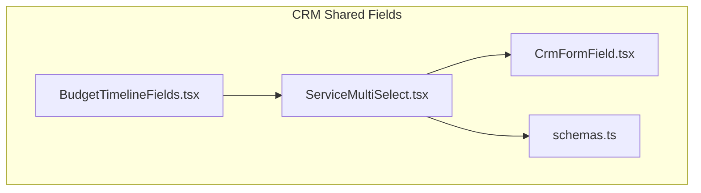
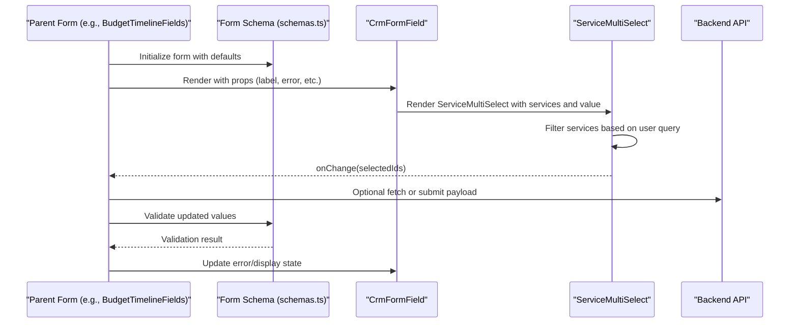
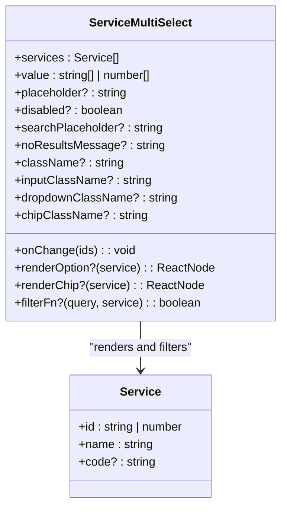
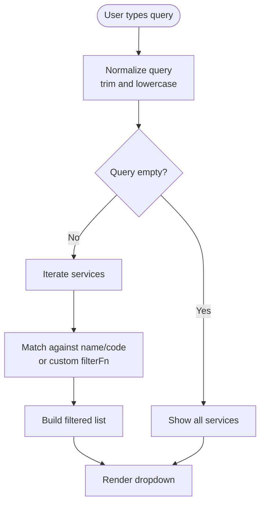
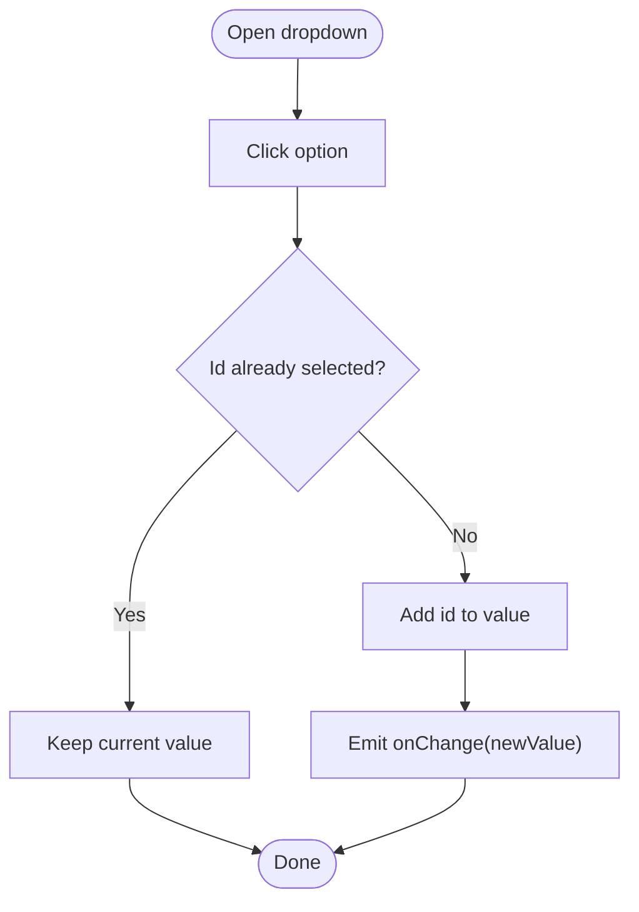
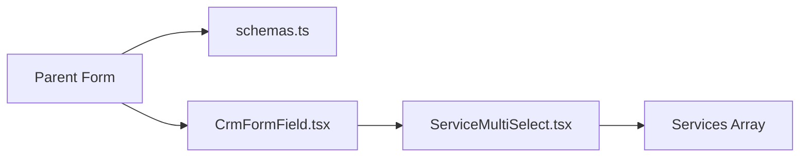
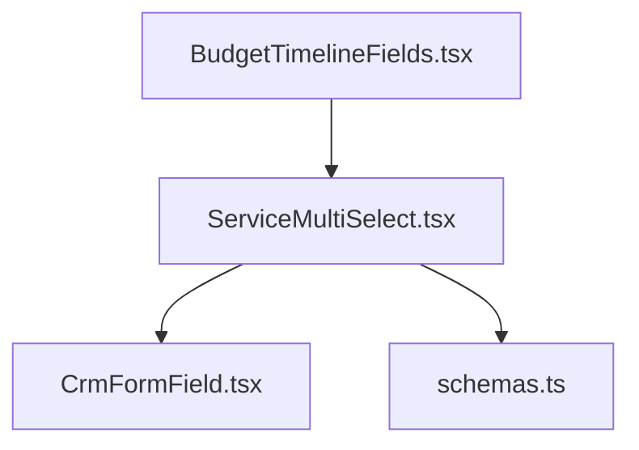

# Service MultiSelect Component

<cite>
**Referenced Files in This Document**
- [ServiceMultiSelect.tsx](file://app/[locale]/(routes)/crm/_components/crm-shared/fields/ServiceMultiSelect.tsx)
- [CrmFormField.tsx](file://app/[locale]/(routes)/crm/_components/crm-shared/fields/CrmFormField.tsx)
- [schemas.ts](file://app/[locale]/(routes)/crm/_components/crm-shared/fields/schemas.ts)
- [BudgetTimelineFields.tsx](file://app/[locale]/(routes)/crm/_components/crm-shared/BudgetTimelineFields.tsx)
</cite>

## Table of Contents
1. [Introduction](#introduction)
2. [Project Structure](#project-structure)
3. [Core Components](#core-components)
4. [Architecture Overview](#architecture-overview)
5. [Detailed Component Analysis](#detailed-component-analysis)
6. [Dependency Analysis](#dependency-analysis)
7. [Performance Considerations](#performance-considerations)
8. [Troubleshooting Guide](#troubleshooting-guide)
9. [Conclusion](#conclusion)

## Introduction
This document explains the ServiceMultiSelect component used within the CRM shared fields to enable multi-selection of services with search and filtering capabilities. It covers:
- The multi-selection interface behavior
- Search and filtering logic
- Expected service data structure
- Prop configurations for display, selection handling, and search customization
- Strategies for managing large datasets
- Integration patterns with backend services
- Styling guidance for the dropdown interface

## Project Structure
The ServiceMultiSelect component is part of the CRM shared field library and is consumed by CRM forms. It integrates with form schemas and a generic form field wrapper.

**Diagram sources**
- [ServiceMultiSelect.tsx](file://app/[locale]/(routes)/crm/_components/crm-shared/fields/ServiceMultiSelect.tsx)
- [CrmFormField.tsx](file://app/[locale]/(routes)/crm/_components/crm-shared/fields/CrmFormField.tsx)
- [schemas.ts](file://app/[locale]/(routes)/crm/_components/crm-shared/fields/schemas.ts)
- [BudgetTimelineFields.tsx](file://app/[locale]/(routes)/crm/_components/crm-shared/BudgetTimelineFields.tsx)

**Section sources**
- [ServiceMultiSelect.tsx](file://app/[locale]/(routes)/crm/_components/crm-shared/fields/ServiceMultiSelect.tsx)
- [CrmFormField.tsx](file://app/[locale]/(routes)/crm/_components/crm-shared/fields/CrmFormField.tsx)
- [schemas.ts](file://app/[locale]/(routes)/crm/_components/crm-shared/fields/schemas.ts)
- [BudgetTimelineFields.tsx](file://app/[locale]/(routes)/crm/_components/crm-shared/BudgetTimelineFields.tsx)

## Core Components
- ServiceMultiSelect: A multi-select input that supports searching and filtering a list of services. It renders selected values as removable chips and provides an openable dropdown with searchable options.
- CrmFormField: A wrapper that standardizes label, description, error, and disabled states across CRM fields.
- Schemas: Defines validation rules and default values for CRM forms, including arrays of service identifiers.
- BudgetTimelineFields: An example consumer that composes ServiceMultiSelect into a larger form context.

Key responsibilities:
- Presenting a searchable list of services
- Managing selected items state and updates
- Integrating with form schema validation
- Providing consistent UI via CrmFormField

**Section sources**
- [ServiceMultiSelect.tsx](file://app/[locale]/(routes)/crm/_components/crm-shared/fields/ServiceMultiSelect.tsx)
- [CrmFormField.tsx](file://app/[locale]/(routes)/crm/_components/crm-shared/fields/CrmFormField.tsx)
- [schemas.ts](file://app/[locale]/(routes)/crm/_components/crm-shared/fields/schemas.ts)
- [BudgetTimelineFields.tsx](file://app/[locale]/(routes)/crm/_components/crm-shared/BudgetTimelineFields.tsx)

## Architecture Overview
At runtime, the component receives a list of services and a controlled value array. It exposes callbacks to update the parent’s state and integrates with the form schema for validation.

**Diagram sources**
- [ServiceMultiSelect.tsx](file://app/[locale]/(routes)/crm/_components/crm-shared/fields/ServiceMultiSelect.tsx)
- [CrmFormField.tsx](file://app/[locale]/(routes)/crm/_components/crm-shared/fields/CrmFormField.tsx)
- [schemas.ts](file://app/[locale]/(routes)/crm/_components/crm-shared/fields/schemas.ts)
- [BudgetTimelineFields.tsx](file://app/[locale]/(routes)/crm/_components/crm-shared/BudgetTimelineFields.tsx)

## Detailed Component Analysis

### ServiceMultiSelect Behavior and Data Model
- Multi-selection interface: Displays selected items as chips; clicking a chip removes it from selection.
- Dropdown: Opens to show available services; supports keyboard navigation and click-to-select.
- Search and filtering: Accepts a text query and filters the service list by one or more fields (for example, name or code).
- Controlled value: Expects an array of service identifiers and emits updates via a callback.
- Disabled and placeholder states: Respects disabled prop and shows a placeholder when no selection exists.

Expected service data structure:
- Each service should be an object containing at least:
  - id: unique identifier (string or number)
  - name: display label
  - code: optional short code for quick identification
  - Additional fields can be included if needed for advanced filtering or display

Integration notes:
- The component does not perform network requests itself; pass pre-fetched services to avoid redundant calls.
- For large lists, consider server-side pagination or virtualization outside this component and pass only visible items.

**Section sources**
- [ServiceMultiSelect.tsx](file://app/[locale]/(routes)/crm/_components/crm-shared/fields/ServiceMultiSelect.tsx)

#### Class-like Props Contract

**Diagram sources**
- [ServiceMultiSelect.tsx](file://app/[locale]/(routes)/crm/_components/crm-shared/fields/ServiceMultiSelect.tsx)

### Search and Filtering Logic
- Default filter matches the query against service name and code fields using case-insensitive substring matching.
- Custom filter function can be provided to implement complex matching (e.g., fuzzy search, accent-insensitive, or multi-field scoring).
- Debounce the input handler at the parent level to reduce re-renders during typing.

**Diagram sources**
- [ServiceMultiSelect.tsx](file://app/[locale]/(routes)/crm/_components/crm-shared/fields/ServiceMultiSelect.tsx)

### Selection Handling and Chip Management
- Adding selections: Clicking an option adds its id to the value array if not already present.
- Removing selections: Clicking a chip removes its id from the value array.
- Duplicate prevention: Ensures uniqueness of ids in the value array.
- Controlled updates: Emits onChange with the new array so the parent remains the source of truth.

**Diagram sources**
- [ServiceMultiSelect.tsx](file://app/[locale]/(routes)/crm/_components/crm-shared/fields/ServiceMultiSelect.tsx)

### Integration with CrmFormField and Schemas
- CrmFormField wraps ServiceMultiSelect to provide consistent labels, descriptions, errors, and disabled states.
- Schemas define validation rules for the services field (for example, required array of ids).
- Consumers compose these pieces to build complete forms.

**Diagram sources**
- [CrmFormField.tsx](file://app/[locale]/(routes)/crm/_components/crm-shared/fields/CrmFormField.tsx)
- [schemas.ts](file://app/[locale]/(routes)/crm/_components/crm-shared/fields/schemas.ts)
- [ServiceMultiSelect.tsx](file://app/[locale]/(routes)/crm/_components/crm-shared/fields/ServiceMultiSelect.tsx)

**Section sources**
- [CrmFormField.tsx](file://app/[locale]/(routes)/crm/_components/crm-shared/fields/CrmFormField.tsx)
- [schemas.ts](file://app/[locale]/(routes)/crm/_components/crm-shared/fields/schemas.ts)
- [BudgetTimelineFields.tsx](file://app/[locale]/(routes)/crm/_components/crm-shared/BudgetTimelineFields.tsx)

### Example Usage Patterns
- Basic usage: Provide services and a controlled value array; wire onChange to update parent state.
- With validation: Define a schema rule requiring at least one selected service; display errors via CrmFormField.
- Custom rendering: Use renderOption and renderChip to customize how each service appears in the dropdown and chips.
- Custom filtering: Supply filterFn to implement advanced search (e.g., match by category or tags).

[No sources needed since this section provides general guidance]

## Dependency Analysis
ServiceMultiSelect depends on:
- CrmFormField for consistent field presentation
- Schemas for validation rules
- Consumer components (e.g., BudgetTimelineFields) for integration into specific forms

**Diagram sources**
- [ServiceMultiSelect.tsx](file://app/[locale]/(routes)/crm/_components/crm-shared/fields/ServiceMultiSelect.tsx)
- [CrmFormField.tsx](file://app/[locale]/(routes)/crm/_components/crm-shared/fields/CrmFormField.tsx)
- [schemas.ts](file://app/[locale]/(routes)/crm/_components/crm-shared/fields/schemas.ts)
- [BudgetTimelineFields.tsx](file://app/[locale]/(routes)/crm/_components/crm-shared/BudgetTimelineFields.tsx)

**Section sources**
- [ServiceMultiSelect.tsx](file://app/[locale]/(routes)/crm/_components/crm-shared/fields/ServiceMultiSelect.tsx)
- [CrmFormField.tsx](file://app/[locale]/(routes)/crm/_components/crm-shared/fields/CrmFormField.tsx)
- [schemas.ts](file://app/[locale]/(routes)/crm/_components/crm-shared/fields/schemas.ts)
- [BudgetTimelineFields.tsx](file://app/[locale]/(routes)/crm/_components/crm-shared/BudgetTimelineFields.tsx)

## Performance Considerations
- Debounce search input at the parent level to minimize re-renders during rapid typing.
- Memoize expensive computations such as custom filter functions or derived lists.
- For large datasets:
  - Prefer server-side filtering and pagination; pass only relevant pages to the component.
  - Consider virtualized lists if client-side rendering becomes a bottleneck.
- Avoid unnecessary re-renders by ensuring stable references for services and callbacks.

[No sources needed since this section provides general guidance]

## Troubleshooting Guide
Common issues and resolutions:
- No results shown while typing:
  - Ensure the query normalization and filter logic are correct.
  - Verify that service objects contain expected fields (name, code).
- Selected items disappear after typing:
  - Confirm the component is controlled correctly and onChange updates the parent state.
  - Check that the value array persists across re-renders.
- Validation errors not updating:
  - Ensure the schema is revalidated after onChange and that CrmFormField receives the latest error state.
- Dropdown not opening or closing:
  - Verify focus management and event handlers are wired properly.
- Performance lag with many services:
  - Implement debounced search and limit the number of rendered options.

[No sources needed since this section provides general guidance]

## Conclusion
ServiceMultiSelect offers a flexible, searchable multi-selection interface tailored for CRM forms. By combining controlled value updates, customizable rendering, and pluggable filtering, it adapts to various business needs. Integrate it with CrmFormField and your form schemas for consistent UX and robust validation, and apply performance strategies when working with large service catalogs.

[No sources needed since this section summarizes without analyzing specific files]