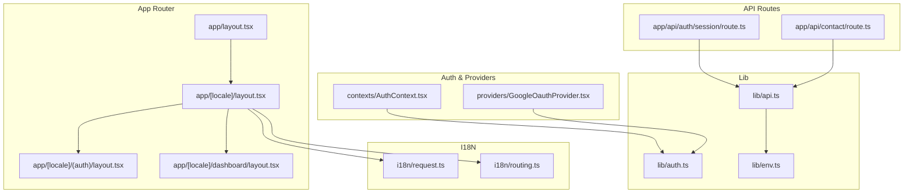
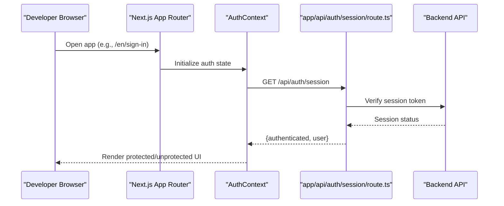
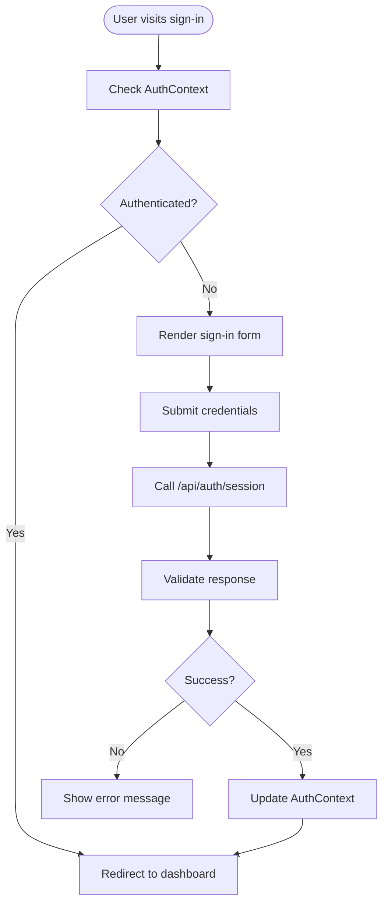
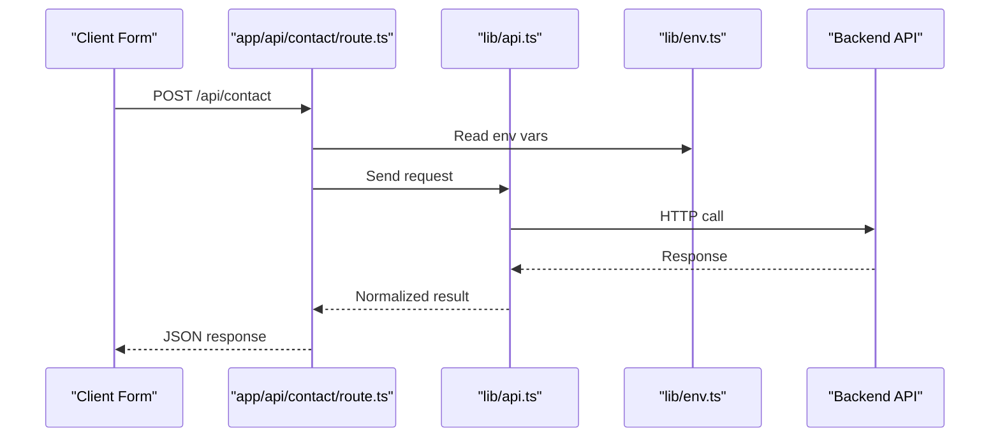
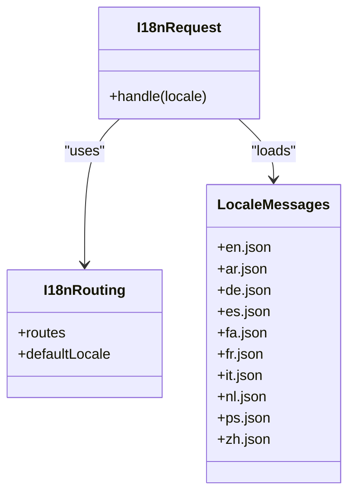
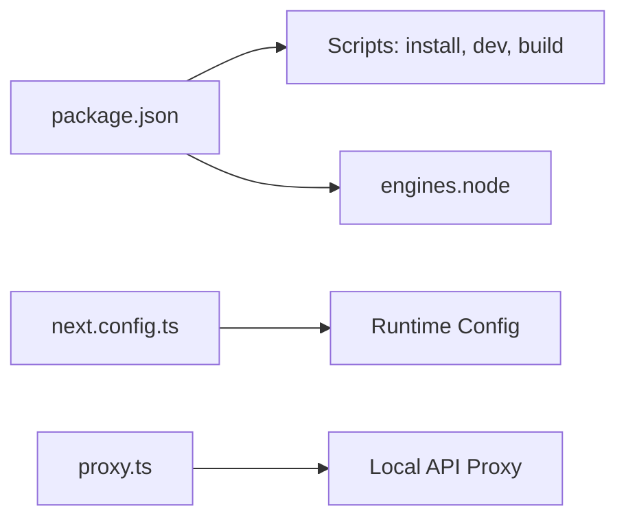

# Getting Started

<cite>
**Referenced Files in This Document**
- [README.md](file://README.md)
- [package.json](file://package.json)
- [next.config.ts](file://next.config.ts)
- [app/layout.tsx](file://app/layout.tsx)
- [app/[locale]/layout.tsx](file://app/[locale]/layout.tsx)
- [app/[locale]/(auth)/layout.tsx](file://app/[locale]/(auth)/layout.tsx)
- [app/[locale]/dashboard/layout.tsx](file://app/[locale]/dashboard/layout.tsx)
- [i18n/request.ts](file://i18n/request.ts)
- [i18n/routing.ts](file://i18n/routing.ts)
- [lib/env.ts](file://lib/env.ts)
- [lib/api.ts](file://lib/api.ts)
- [lib/auth.ts](file://lib/auth.ts)
- [contexts/AuthContext.tsx](file://contexts/AuthContext.tsx)
- [providers/GoogleOauthProvider.tsx](file://providers/GoogleOauthProvider.tsx)
- [app/api/auth/session/route.ts](file://app/api/auth/session/route.ts)
- [app/api/contact/route.ts](file://app/api/contact/route.ts)
- [proxy.ts](file://proxy.ts)
</cite>

## Table of Contents
1. Introduction
2. Project Structure
3. Core Components
4. Architecture Overview
5. Detailed Component Analysis
6. Dependency Analysis
7. Performance Considerations
8. Troubleshooting Guide
9. Conclusion

## Introduction
Automex Frontend is a multi-language CRM platform built with Next.js. It provides authentication flows, a user dashboard, and public-facing pages for services, about, contact, and more. The application supports multiple locales, theme toggling, and integrates with backend APIs for authentication, contacts, and CRM features.

Primary goals:
- Deliver a responsive, internationalized CRM experience
- Provide secure authentication (email/password and Google OAuth)
- Offer a dashboard for managing profile, security, projects, notifications, and support
- Enable quick onboarding for new developers through clear setup instructions

Primary use cases:
- User sign-up, sign-in, password reset, email verification, and magic link login
- Dashboard navigation and profile/security management
- Public content browsing and contact submission
- Multi-language UI with locale-aware routing and messages

[No sources needed since this section summarizes project purpose without analyzing specific files]

## Project Structure
The app follows the Next.js App Router structure with route groups for authentication and dashboard areas. Internationalization is configured at the root layout and per-locale layouts. API routes are organized under app/api. Shared components live under components/ui and shared folders. Contexts and providers manage auth state and theme.

Key directories:
- app: Next.js app router pages, layouts, and API routes
- components: Reusable UI primitives and shared page components
- contexts: Global React contexts (authentication, sidebar)
- i18n: Request handling and routing configuration for locales
- lib: Environment validation, API helpers, auth utilities
- providers: Theme provider and Google OAuth provider
- messages: Locale message bundles
- config: Feature configurations used by shared components

**Diagram sources**
- [app/layout.tsx](file://app/layout.tsx)
- [app/[locale]/layout.tsx](file://app/[locale]/layout.tsx)
- [app/[locale]/(auth)/layout.tsx](file://app/[locale]/(auth)/layout.tsx)
- [app/[locale]/dashboard/layout.tsx](file://app/[locale]/dashboard/layout.tsx)
- [i18n/request.ts](file://i18n/request.ts)
- [i18n/routing.ts](file://i18n/routing.ts)
- [contexts/AuthContext.tsx](file://contexts/AuthContext.tsx)
- [providers/GoogleOauthProvider.tsx](file://providers/GoogleOauthProvider.tsx)
- [lib/env.ts](file://lib/env.ts)
- [lib/api.ts](file://lib/api.ts)
- [lib/auth.ts](file://lib/auth.ts)
- [app/api/auth/session/route.ts](file://app/api/auth/session/route.ts)
- [app/api/contact/route.ts](file://app/api/contact/route.ts)

**Section sources**
- [app/layout.tsx](file://app/layout.tsx)
- [app/[locale]/layout.tsx](file://app/[locale]/layout.tsx)
- [app/[locale]/(auth)/layout.tsx](file://app/[locale]/(auth)/layout.tsx)
- [app/[locale]/dashboard/layout.tsx](file://app/[locale]/dashboard/layout.tsx)
- [i18n/request.ts](file://i18n/request.ts)
- [i18n/routing.ts](file://i18n/routing.ts)
- [lib/env.ts](file://lib/env.ts)
- [lib/api.ts](file://lib/api.ts)
- [lib/auth.ts](file://lib/auth.ts)
- [contexts/AuthContext.tsx](file://contexts/AuthContext.tsx)
- [providers/GoogleOauthProvider.tsx](file://providers/GoogleOauthProvider.tsx)
- [app/api/auth/session/route.ts](file://app/api/auth/session/route.ts)
- [app/api/contact/route.ts](file://app/api/contact/route.ts)

## Core Components
This section highlights the foundational pieces you will interact with during setup and development.

- Internationalization
  - Request and routing configuration for locales
  - Message bundles per language
- Authentication
  - Context-based auth state and hooks
  - Google OAuth provider integration
  - Session API route for server-side session checks
- API Helpers
  - Centralized fetch wrapper and environment validation
- Configuration
  - Next.js runtime and middleware settings
  - Proxy configuration for local API calls

What to know before running:
- Node.js version must match the engine requirement defined in package.json
- Use the package manager specified in package.json (npm or pnpm) consistently
- Set required environment variables before starting the dev server

**Section sources**
- [i18n/request.ts](file://i18n/request.ts)
- [i18n/routing.ts](file://i18n/routing.ts)
- [contexts/AuthContext.tsx](file://contexts/AuthContext.tsx)
- [providers/GoogleOauthProvider.tsx](file://providers/GoogleOauthProvider.tsx)
- [app/api/auth/session/route.ts](file://app/api/auth/session/route.ts)
- [lib/api.ts](file://lib/api.ts)
- [lib/env.ts](file://lib/env.ts)
- [next.config.ts](file://next.config.ts)
- [proxy.ts](file://proxy.ts)
- [package.json](file://package.json)

## Architecture Overview
High-level flow for authentication and API interactions:

**Diagram sources**
- [contexts/AuthContext.tsx](file://contexts/AuthContext.tsx)
- [app/api/auth/session/route.ts](file://app/api/auth/session/route.ts)

## Detailed Component Analysis

### Installation Requirements
- Node.js: Use the version specified in package.json engines
- Package Manager: Use npm or pnpm as indicated in package.json scripts
- Environment Variables: Create a .env file based on the variables validated in lib/env.ts

Typical steps:
- Clone the repository
- Install dependencies using your chosen package manager
- Configure environment variables
- Start the development server

**Section sources**
- [package.json](file://package.json)
- [lib/env.ts](file://lib/env.ts)

### Environment Configuration
Environment variables are validated at startup via lib/env.ts. Ensure all required keys exist before running the app. Common categories include:
- Backend base URL and API endpoints
- Authentication provider credentials (e.g., Google OAuth client ID)
- Locale and theme defaults
- Feature flags or integrations

If any required variable is missing, the app will fail fast during initialization.

**Section sources**
- [lib/env.ts](file://lib/env.ts)

### Development Server Startup
Start the development server using the script defined in package.json. The server reads next.config.ts and applies runtime settings. If you need to proxy API requests locally, configure proxy.ts accordingly.

Common commands:
- Install dependencies
- Run development server
- Build for production (optional)

**Section sources**
- [package.json](file://package.json)
- [next.config.ts](file://next.config.ts)
- [proxy.ts](file://proxy.ts)

### Basic Usage Examples
- Public pages: Navigate to home, about, services, and contact pages
- Authentication: Access sign-in, sign-up, forgot-password, verify-email, and magic-link flows under the auth route group
- Dashboard: After authentication, access dashboard sections such as profile, security, projects, notifications, services, consulting, and support
- Internationalization: Switch languages using the locale switcher; URLs reflect the selected locale

Navigation hints:
- Root layout wraps all pages
- Locale layout handles i18n request and routing
- Auth layout protects authentication-related routes
- Dashboard layout provides sidebar and header for authenticated users

**Section sources**
- [app/layout.tsx](file://app/layout.tsx)
- [app/[locale]/layout.tsx](file://app/[locale]/layout.tsx)
- [app/[locale]/(auth)/layout.tsx](file://app/[locale]/(auth)/layout.tsx)
- [app/[locale]/dashboard/layout.tsx](file://app/[locale]/dashboard/layout.tsx)

### Authentication Flow
Authentication uses a context-driven approach with a session API route. Google OAuth is supported via a dedicated provider.

**Diagram sources**
- [contexts/AuthContext.tsx](file://contexts/AuthContext.tsx)
- [app/api/auth/session/route.ts](file://app/api/auth/session/route.ts)
- [lib/auth.ts](file://lib/auth.ts)

**Section sources**
- [contexts/AuthContext.tsx](file://contexts/AuthContext.tsx)
- [providers/GoogleOauthProvider.tsx](file://providers/GoogleOauthProvider.tsx)
- [app/api/auth/session/route.ts](file://app/api/auth/session/route.ts)
- [lib/auth.ts](file://lib/auth.ts)

### API Integration
Centralized API helpers and environment validation ensure consistent network calls. Contact submissions go through an API route that forwards to the backend.

**Diagram sources**
- [app/api/contact/route.ts](file://app/api/contact/route.ts)
- [lib/api.ts](file://lib/api.ts)
- [lib/env.ts](file://lib/env.ts)

**Section sources**
- [app/api/contact/route.ts](file://app/api/contact/route.ts)
- [lib/api.ts](file://lib/api.ts)
- [lib/env.ts](file://lib/env.ts)

### Internationalization Setup
Locale handling is configured via request and routing modules. Messages are stored per language and loaded based on the active locale.

**Diagram sources**
- [i18n/request.ts](file://i18n/request.ts)
- [i18n/routing.ts](file://i18n/routing.ts)

**Section sources**
- [i18n/request.ts](file://i18n/request.ts)
- [i18n/routing.ts](file://i18n/routing.ts)

## Dependency Analysis
External dependencies and tooling are declared in package.json. Key aspects:
- Node.js engine constraint ensures compatibility
- Scripts define install, dev, build, and lint commands
- Next.js runtime configuration is centralized in next.config.ts
- Optional proxy configuration can be used for local API forwarding

**Diagram sources**
- [package.json](file://package.json)
- [next.config.ts](file://next.config.ts)
- [proxy.ts](file://proxy.ts)

**Section sources**
- [package.json](file://package.json)
- [next.config.ts](file://next.config.ts)
- [proxy.ts](file://proxy.ts)

## Performance Considerations
- Keep environment variables minimal and avoid heavy computations in layouts
- Prefer client components only where interactivity is necessary
- Leverage Next.js caching and static generation where applicable
- Monitor bundle size and lazy-load heavy components

[No sources needed since this section provides general guidance]

## Troubleshooting Guide
Common issues and resolutions:
- Missing environment variables: Ensure all required keys are present in .env as validated by lib/env.ts
- Wrong Node.js version: Align with the engines field in package.json
- Package manager mismatch: Use the same package manager across install and run commands
- API connectivity errors: Verify backend URL and credentials; check proxy.ts if using local proxy
- Locale not switching: Confirm i18n routing and request configuration; ensure message files exist for the target locale
- Auth redirects loop: Inspect session route and AuthContext logic; confirm tokens and cookies are set correctly

Where to look:
- Environment validation: lib/env.ts
- API helpers: lib/api.ts
- Auth context and session route: contexts/AuthContext.tsx, app/api/auth/session/route.ts
- I18N request and routing: i18n/request.ts, i18n/routing.ts
- Next.js config: next.config.ts
- Proxy setup: proxy.ts

**Section sources**
- [lib/env.ts](file://lib/env.ts)
- [lib/api.ts](file://lib/api.ts)
- [contexts/AuthContext.tsx](file://contexts/AuthContext.tsx)
- [app/api/auth/session/route.ts](file://app/api/auth/session/route.ts)
- [i18n/request.ts](file://i18n/request.ts)
- [i18n/routing.ts](file://i18n/routing.ts)
- [next.config.ts](file://next.config.ts)
- [proxy.ts](file://proxy.ts)

## Conclusion
You now have the essentials to set up and run Automex Frontend. Follow the installation steps, configure environment variables, start the development server, and explore the authentication and dashboard flows. For deeper customization, review the i18n setup, API helpers, and providers.

[No sources needed since this section summarizes without analyzing specific files]