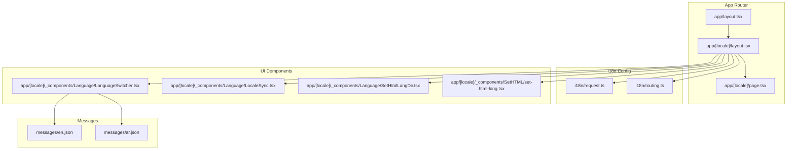
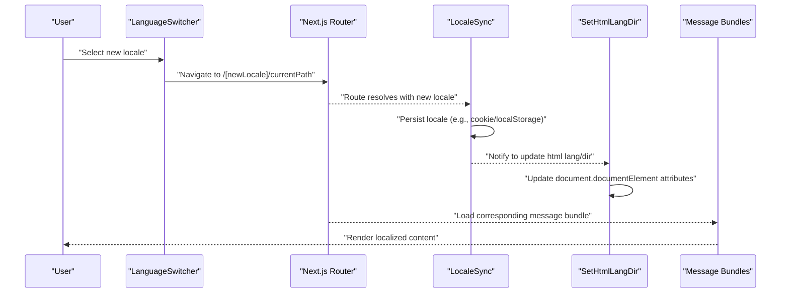
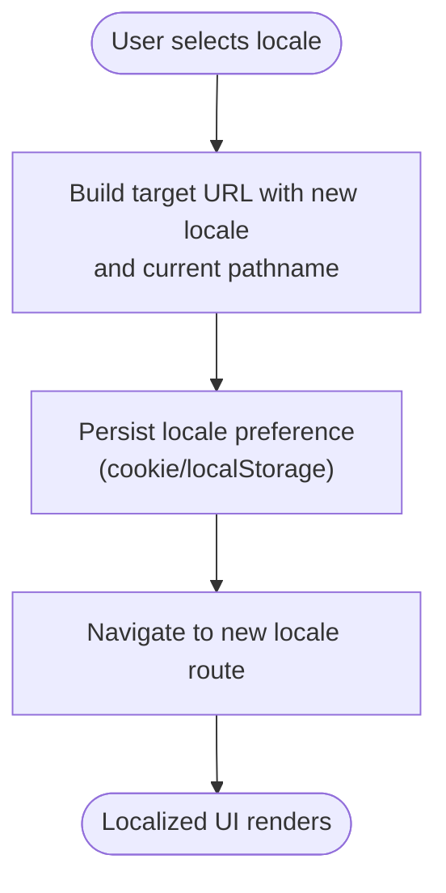
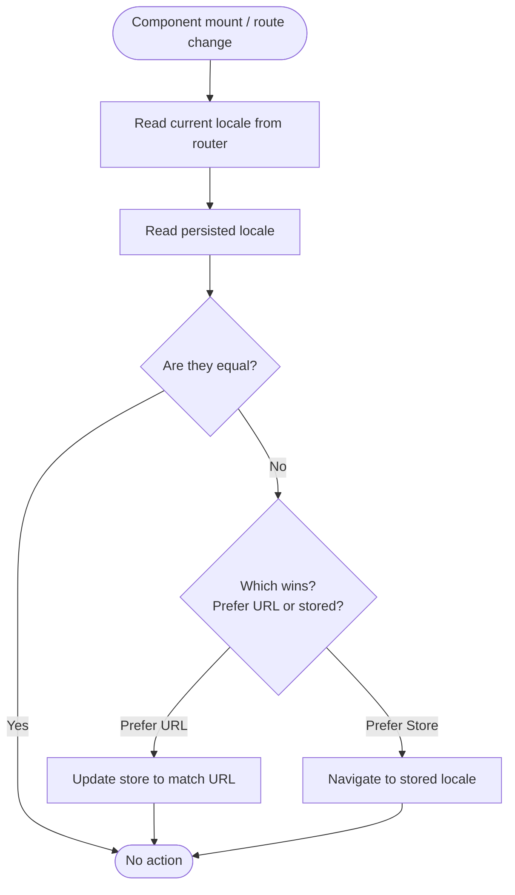
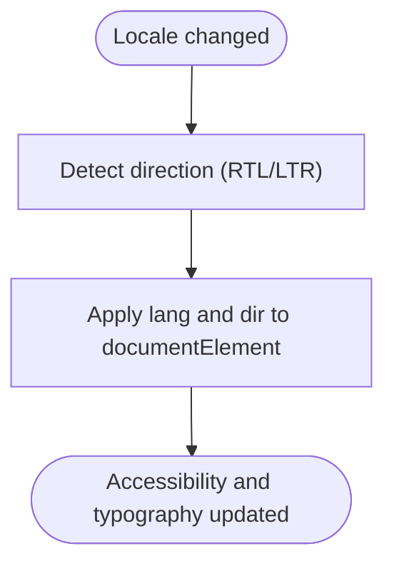
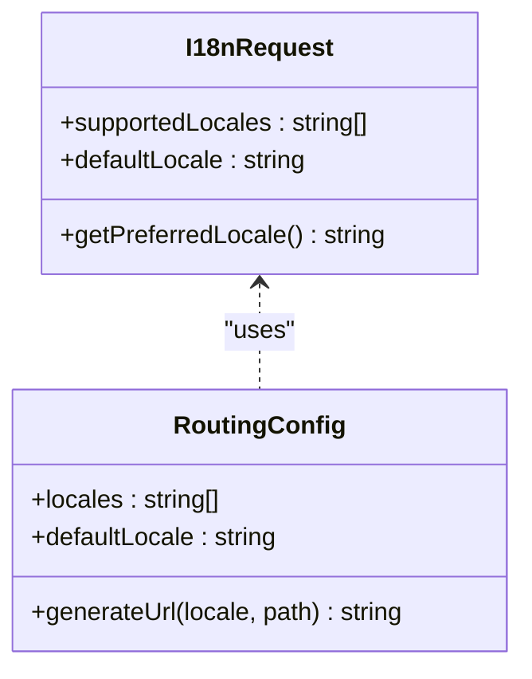
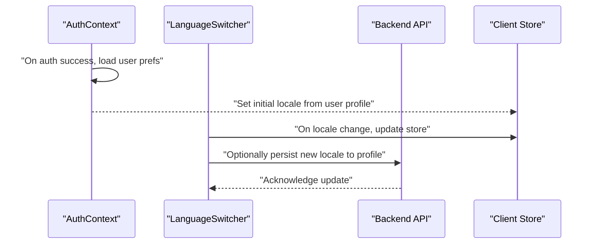
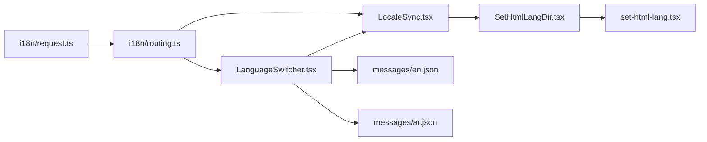

# Dynamic Language Switching

<cite>
**Referenced Files in This Document**
- [LanguageSwitcher.tsx](file://app/[locale]/_components/Language/LanguageSwitcher.tsx)
- [LocaleSync.tsx](file://app/[locale]/_components/Language/LocaleSync.tsx)
- [SetHtmlLangDir.tsx](file://app/[locale]/_components/Language/SetHtmlLangDir.tsx)
- [set-html-lang.tsx](file://app/[locale]/_components/SetHTML/set-html-lang.tsx)
- [request.ts](file://i18n/request.ts)
- [routing.ts](file://i18n/routing.ts)
- [layout.tsx](file://app/layout.tsx)
- [page.tsx](file://app/[locale]/page.tsx)
- [AuthContext.tsx](file://contexts/AuthContext.tsx)
- [en.json](file://messages/en.json)
- [ar.json](file://messages/ar.json)
- [next.config.ts](file://next.config.ts)
</cite>

## Table of Contents
1. [Introduction](#introduction)
2. [Project Structure](#project-structure)
3. [Core Components](#core-components)
4. [Architecture Overview](#architecture-overview)
5. [Detailed Component Analysis](#detailed-component-analysis)
6. [Dependency Analysis](#dependency-analysis)
7. [Performance Considerations](#performance-considerations)
8. [Troubleshooting Guide](#troubleshooting-guide)
9. [Conclusion](#conclusion)
10. [Appendices](#appendices)

## Introduction
This document explains the dynamic language switching implementation across client and server layers, focusing on:
- The language switcher component and its integration with Next.js App Router locale routing
- Locale state management and URL synchronization
- Persistence of language preferences across sessions
- Integration with authentication context for user-specific language settings
- Practical examples for custom selectors, event handling, and dynamic content updates
- Performance optimizations such as lazy loading translation files, caching strategies, and minimizing re-renders
- Testing guidelines and edge case handling

## Project Structure
The internationalization setup is organized under the i18n directory and integrated into the app layout and locale-based routes. Key elements include:
- i18n configuration for request parsing and routing
- Locale-aware layouts and pages under app/[locale]
- Language UI components under app/[locale]/_components/Language
- Message bundles under messages
- Global HTML lang/direction setters under app/[locale]/_components/SetHTML

**Diagram sources**
- [layout.tsx](file://app/layout.tsx)
- [page.tsx](file://app/[locale]/page.tsx)
- [request.ts](file://i18n/request.ts)
- [routing.ts](file://i18n/routing.ts)
- [LanguageSwitcher.tsx](file://app/[locale]/_components/Language/LanguageSwitcher.tsx)
- [LocaleSync.tsx](file://app/[locale]/_components/Language/LocaleSync.tsx)
- [SetHtmlLangDir.tsx](file://app/[locale]/_components/Language/SetHtmlLangDir.tsx)
- [set-html-lang.tsx](file://app/[locale]/_components/SetHTML/set-html-lang.tsx)
- [en.json](file://messages/en.json)
- [ar.json](file://messages/ar.json)

**Section sources**
- [layout.tsx](file://app/layout.tsx)
- [page.tsx](file://app/[locale]/page.tsx)
- [request.ts](file://i18n/request.ts)
- [routing.ts](file://i18n/routing.ts)
- [LanguageSwitcher.tsx](file://app/[locale]/_components/Language/LanguageSwitcher.tsx)
- [LocaleSync.tsx](file://app/[locale]/_components/Language/LocaleSync.tsx)
- [SetHtmlLangDir.tsx](file://app/[locale]/_components/Language/SetHtmlLangDir.tsx)
- [set-html-lang.tsx](file://app/[locale]/_components/SetHTML/set-html-lang.tsx)
- [en.json](file://messages/en.json)
- [ar.json](file://messages/ar.json)

## Core Components
- LanguageSwitcher: User-facing control to change the active locale; triggers navigation and persistence.
- LocaleSync: Ensures the current route reflects the selected locale and keeps URL and browser history in sync.
- SetHtmlLangDir: Applies html lang and dir attributes based on the active locale.
- set-html-lang: Utility to update global HTML attributes during hydration or runtime.

Responsibilities:
- LanguageSwitcher handles user interactions and calls a locale change function that navigates and persists the preference.
- LocaleSync reads the current locale from the router and ensures it matches the persisted preference.
- SetHtmlLangDir and set-html-lang keep the document’s language metadata consistent with the active locale.

**Section sources**
- [LanguageSwitcher.tsx](file://app/[locale]/_components/Language/LanguageSwitcher.tsx)
- [LocaleSync.tsx](file://app/[locale]/_components/Language/LocaleSync.tsx)
- [SetHtmlLangDir.tsx](file://app/[locale]/_components/Language/SetHtmlLangDir.tsx)
- [set-html-lang.tsx](file://app/[locale]/_components/SetHTML/set-html-lang.tsx)

## Architecture Overview
The language switching architecture integrates Next.js App Router locale routing with client-side state and persistence:

**Diagram sources**
- [LanguageSwitcher.tsx](file://app/[locale]/_components/Language/LanguageSwitcher.tsx)
- [LocaleSync.tsx](file://app/[locale]/_components/Language/LocaleSync.tsx)
- [SetHtmlLangDir.tsx](file://app/[locale]/_components/Language/SetHtmlLangDir.tsx)
- [routing.ts](file://i18n/routing.ts)
- [request.ts](file://i18n/request.ts)

## Detailed Component Analysis

### LanguageSwitcher Component
Purpose:
- Provides UI to select a different locale
- Triggers navigation to the same path under the new locale
- Persists the chosen locale for future sessions

Key behaviors:
- On selection, constructs the target route using the current pathname and the new locale
- Updates persistent storage (cookie or localStorage) to remember the preference
- Optionally emits an event for analytics or telemetry

Implementation considerations:
- Use Next.js router methods to navigate without full page reloads when possible
- Ensure the new locale is supported by routing configuration
- Avoid unnecessary re-renders by memoizing options and handlers

**Diagram sources**
- [LanguageSwitcher.tsx](file://app/[locale]/_components/Language/LanguageSwitcher.tsx)
- [routing.ts](file://i18n/routing.ts)

**Section sources**
- [LanguageSwitcher.tsx](file://app/[locale]/_components/Language/LanguageSwitcher.tsx)
- [routing.ts](file://i18n/routing.ts)

### LocaleSync Component
Purpose:
- Synchronizes the active locale with the URL and persisted preference
- Ensures consistency between what the user expects and what is rendered

Key behaviors:
- Reads the current locale from the router
- Compares with the persisted locale and navigates if needed
- Updates persistent storage when the URL changes

**Diagram sources**
- [LocaleSync.tsx](file://app/[locale]/_components/Language/LocaleSync.tsx)
- [routing.ts](file://i18n/routing.ts)

**Section sources**
- [LocaleSync.tsx](file://app/[locale]/_components/Language/LocaleSync.tsx)
- [routing.ts](file://i18n/routing.ts)

### SetHtmlLangDir and set-html-lang Utilities
Purpose:
- Keep the document’s html lang and dir attributes aligned with the active locale
- Improve accessibility and text rendering for RTL languages

Key behaviors:
- Detects whether the locale is RTL or LTR
- Sets document.documentElement.lang and .dir accordingly
- Runs at hydration and on locale changes

**Diagram sources**
- [SetHtmlLangDir.tsx](file://app/[locale]/_components/Language/SetHtmlLangDir.tsx)
- [set-html-lang.tsx](file://app/[locale]/_components/SetHTML/set-html-lang.tsx)

**Section sources**
- [SetHtmlLangDir.tsx](file://app/[locale]/_components/Language/SetHtmlLangDir.tsx)
- [set-html-lang.tsx](file://app/[locale]/_components/SetHTML/set-html-lang.tsx)

### i18n Request and Routing Configuration
Purpose:
- Configure supported locales and how the server determines the active locale per request
- Define default locale and fallback behavior

Key responsibilities:
- Parse Accept-Language headers and cookies to determine locale
- Provide routing helpers for generating locale-prefixed URLs
- Ensure consistent locale resolution across server and client

**Diagram sources**
- [request.ts](file://i18n/request.ts)
- [routing.ts](file://i18n/routing.ts)

**Section sources**
- [request.ts](file://i18n/request.ts)
- [routing.ts](file://i18n/routing.ts)

### Authentication Context Integration
Purpose:
- Allow users to persist their preferred language in their profile
- Respect user preference over browser defaults when authenticated

Integration points:
- On login, read the user’s saved language and apply it if not already set
- When the user changes language, optionally update their profile via API
- Fallback to browser or cookie preference when no user preference exists

**Diagram sources**
- [AuthContext.tsx](file://contexts/AuthContext.tsx)
- [LanguageSwitcher.tsx](file://app/[locale]/_components/Language/LanguageSwitcher.tsx)

**Section sources**
- [AuthContext.tsx](file://contexts/AuthContext.tsx)
- [LanguageSwitcher.tsx](file://app/[locale]/_components/Language/LanguageSwitcher.tsx)

## Dependency Analysis
High-level dependencies among language-related modules:

**Diagram sources**
- [request.ts](file://i18n/request.ts)
- [routing.ts](file://i18n/routing.ts)
- [LanguageSwitcher.tsx](file://app/[locale]/_components/Language/LanguageSwitcher.tsx)
- [LocaleSync.tsx](file://app/[locale]/_components/Language/LocaleSync.tsx)
- [SetHtmlLangDir.tsx](file://app/[locale]/_components/Language/SetHtmlLangDir.tsx)
- [set-html-lang.tsx](file://app/[locale]/_components/SetHTML/set-html-lang.tsx)
- [en.json](file://messages/en.json)
- [ar.json](file://messages/ar.json)

**Section sources**
- [request.ts](file://i18n/request.ts)
- [routing.ts](file://i18n/routing.ts)
- [LanguageSwitcher.tsx](file://app/[locale]/_components/Language/LanguageSwitcher.tsx)
- [LocaleSync.tsx](file://app/[locale]/_components/Language/LocaleSync.tsx)
- [SetHtmlLangDir.tsx](file://app/[locale]/_components/Language/SetHtmlLangDir.tsx)
- [set-html-lang.tsx](file://app/[locale]/_components/SetHTML/set-html-lang.tsx)
- [en.json](file://messages/en.json)
- [ar.json](file://messages/ar.json)

## Performance Considerations
- Lazy-load translation files:
  - Load only the necessary message bundle for the active locale
  - Preload next likely locales on idle to reduce perceived latency
- Cache strategies:
  - Cache message bundles in memory and/or sessionStorage
  - Invalidate cache on build-time changes or explicit version bumps
- Minimize re-renders:
  - Memoize locale-dependent computations and derived values
  - Avoid triggering full-page navigations where client-side routing suffices
- SSR/CSR balance:
  - Hydrate with the correct initial locale to avoid flash of unlocalized content
  - Defer heavy translations until after first paint when feasible
- Bundle size:
  - Split message bundles by feature area and load on demand
  - Remove unused locales from production builds

[No sources needed since this section provides general guidance]

## Troubleshooting Guide
Common issues and resolutions:
- Locale mismatch between URL and stored preference:
  - Verify LocaleSync logic to decide precedence (URL vs. stored)
  - Ensure persistence writes are synchronous before navigation
- HTML lang/dir not updating:
  - Confirm SetHtmlLangDir runs after hydration and on route changes
  - Check that direction detection includes all supported locales
- Missing translations:
  - Validate message bundles exist for all configured locales
  - Add fallback keys to prevent empty strings
- Authentication conflicts:
  - Ensure user preference is applied after successful login
  - Debounce profile updates to avoid excessive API calls
- SEO implications:
  - Verify hreflang tags reflect the active locale
  - Ensure canonical URLs include the locale segment

**Section sources**
- [LocaleSync.tsx](file://app/[locale]/_components/Language/LocaleSync.tsx)
- [SetHtmlLangDir.tsx](file://app/[locale]/_components/Language/SetHtmlLangDir.tsx)
- [set-html-lang.tsx](file://app/[locale]/_components/SetHTML/set-html-lang.tsx)
- [en.json](file://messages/en.json)
- [ar.json](file://messages/ar.json)

## Conclusion
The dynamic language switching system combines Next.js App Router locale routing with client-side synchronization and persistence. By integrating language preferences with authentication, optimizing performance through lazy loading and caching, and ensuring robust testing practices, the application delivers a seamless multilingual experience across sessions and devices.

[No sources needed since this section summarizes without analyzing specific files]

## Appendices

### Practical Examples

- Implementing a custom language selector:
  - Create a dropdown or segmented control that calls the locale change handler with the selected code
  - Persist the choice and navigate to the same path under the new locale
  - Example reference: [LanguageSwitcher.tsx](file://app/[locale]/_components/Language/LanguageSwitcher.tsx)

- Handling language change events:
  - Subscribe to locale change events to update analytics, tracking, or UI state
  - Example reference: [LocaleSync.tsx](file://app/[locale]/_components/Language/LocaleSync.tsx)

- Updating page content dynamically:
  - Use the active locale to render localized strings and adjust layout direction
  - Example references: [SetHtmlLangDir.tsx](file://app/[locale]/_components/Language/SetHtmlLangDir.tsx), [set-html-lang.tsx](file://app/[locale]/_components/SetHTML/set-html-lang.tsx)

- Integrating with authentication:
  - On login, apply the user’s saved language if present
  - On language change, optionally persist to the user profile
  - Example reference: [AuthContext.tsx](file://contexts/AuthContext.tsx)

- Server-side locale determination:
  - Configure request parsing and routing defaults
  - Example references: [request.ts](file://i18n/request.ts), [routing.ts](file://i18n/routing.ts)

### Testing Guidelines
- Unit tests:
  - Verify persistence writes and reads for locale preference
  - Assert navigation targets use the correct locale prefix
- Integration tests:
  - Simulate locale changes and assert URL updates and HTML attributes
  - Validate message bundle loading for the active locale
- Accessibility tests:
  - Ensure html lang and dir are correctly set for RTL and LTR locales
- Edge cases:
  - Unsupported locale codes should fall back to default
  - Network failures when fetching profiles should not block UI localization
  - Rapid successive locale switches should be debounced or coalesced

[No sources needed since this section provides general guidance]