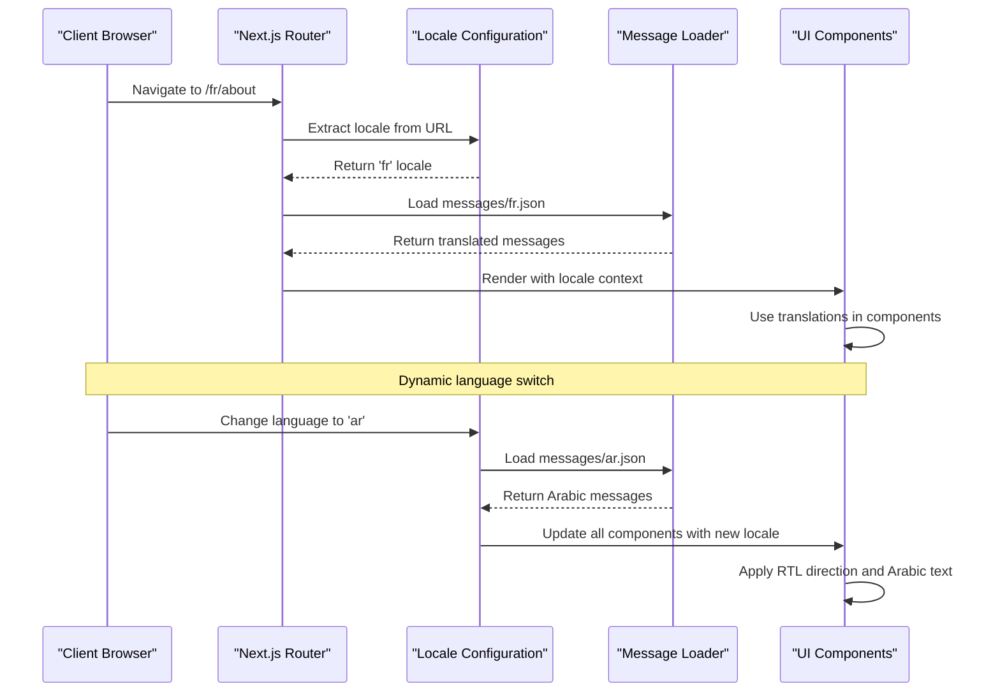
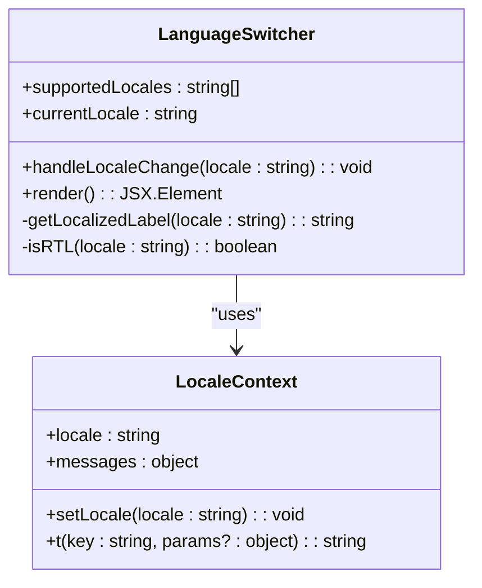
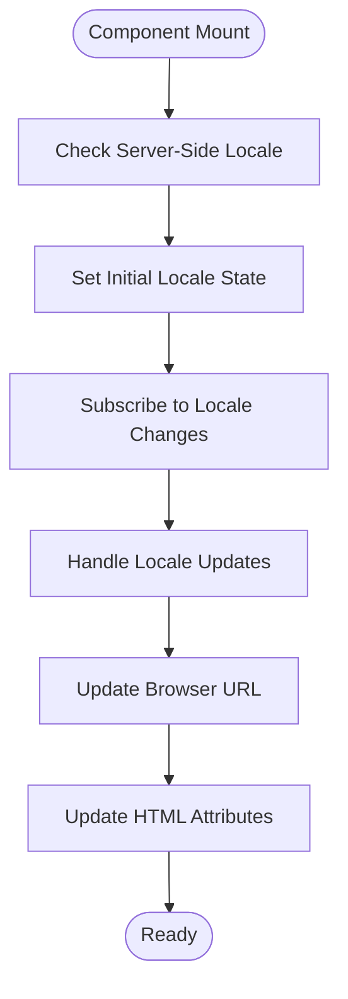
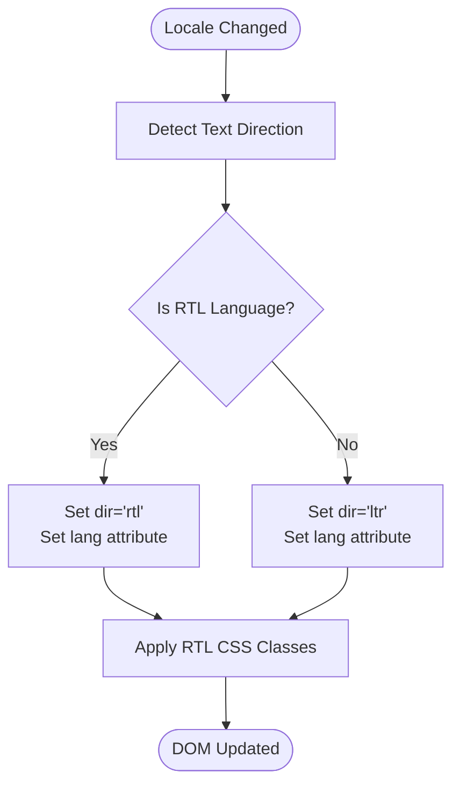
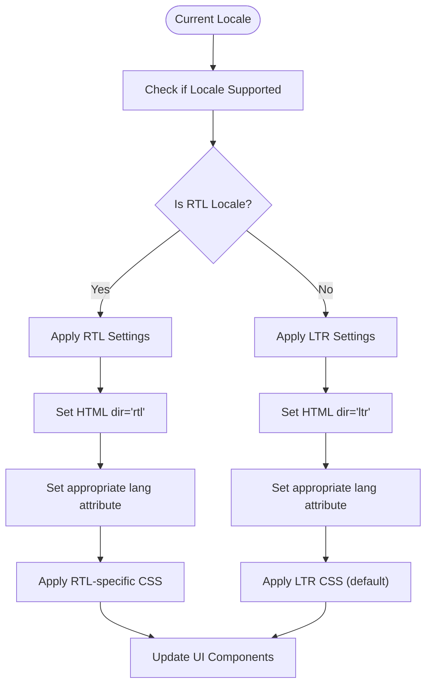
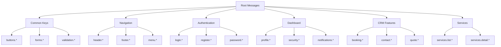
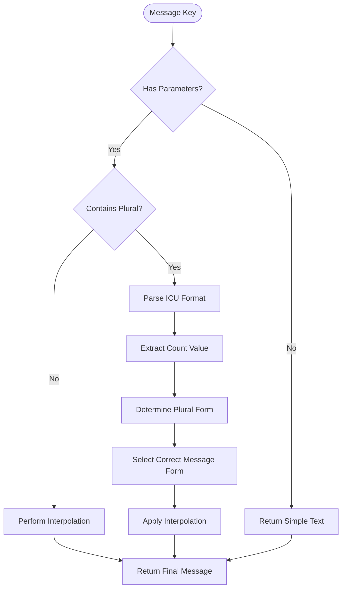
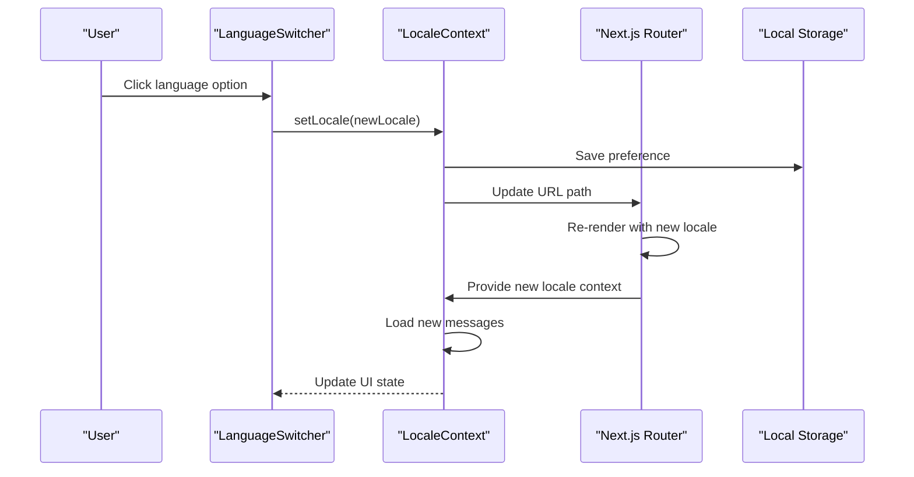
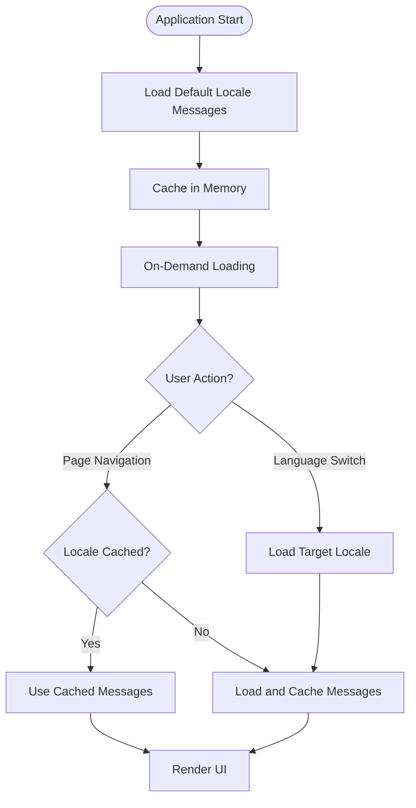
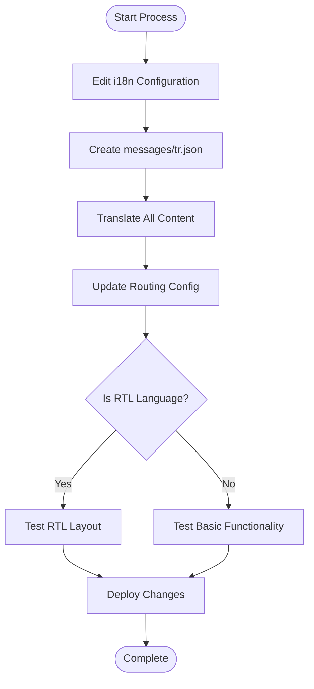

# Internationalization (i18n)

<cite>
**Referenced Files in This Document**
- [app/[locale]/layout.tsx](file://app/[locale]/layout.tsx)
- [app/layout.tsx](file://app/layout.tsx)
- [i18n/request.ts](file://i18n/request.ts)
- [i18n/routing.ts](file://i18n/routing.ts)
- [lib/locale.ts](file://lib/locale.ts)
- [app/[locale]/_components/Language/LanguageSwitcher.tsx](file://app/[locale]/_components/Language/LanguageSwitcher.tsx)
- [app/[locale]/_components/Language/LocaleSync.tsx](file://app/[locale]/_components/Language/LocaleSync.tsx)
- [app/[locale]/_components/Language/SetHtmlLangDir.tsx](file://app/[locale]/_components/Language/SetHtmlLangDir.tsx)
- [messages/en.json](file://messages/en.json)
- [messages/ar.json](file://messages/ar.json)
- [messages/fa.json](file://messages/fa.json)
- [messages/ps.json](file://messages/ps.json)
- [next.config.ts](file://next.config.ts)
</cite>

## Table of Contents
1. [Introduction](#introduction)
2. [Project Structure](#project-structure)
3. [Core Components](#core-components)
4. [Architecture Overview](#architecture-overview)
5. [Detailed Component Analysis](#detailed-component-analysis)
6. [RTL Language Implementation](#rtl-language-implementation)
7. [Translation File Structure](#translation-file-structure)
8. [Dynamic Language Switching](#dynamic-language-switching)
9. [Performance Optimization](#performance-optimization)
10. [Adding New Languages](#adding-new-languages)
11. [Best Practices](#best-practices)
12. [Troubleshooting Guide](#troubleshooting-guide)
13. [Conclusion](#conclusion)

## Introduction

This document provides comprehensive documentation for the internationalization (i18n) system supporting 10 languages with full RTL (Right-to-Left) language support. The implementation uses Next.js internationalized routing with a robust architecture that handles dynamic language switching, message loading strategies, and proper text direction management for Arabic, Persian, and Pashto languages.

The system supports the following languages:
- **LTR (Left-to-Right)**: English, German, Spanish, French, Italian, Dutch, Chinese
- **RTL (Right-to-Left)**: Arabic, Persian, Pashto

## Project Structure

The internationalization system follows Next.js App Router conventions with locale-based routing:

```mermaid
graph TB
subgraph "App Router Structure"
A[app/] --> B[app/[locale]/]
B --> C[(routes)/]
B --> D[(auth)/]
B --> E[_components/]
subgraph "Language Components"
E --> F[Language/]
F --> G[LanguageSwitcher.tsx]
F --> H[LocaleSync.tsx]
F --> I[SetHtmlLangDir.tsx]
end
subgraph "Messages"
M[messages/] --> N[en.json]
M --> O[ar.json]
M --> P[fa.json]
M --> Q[ps.json]
M --> R[Other locales...]
end
subgraph "Configuration"
K[i18n/] --> L[routing.ts]
K --> S[request.ts]
T[lib/] --> U[locale.ts]
end
end
```

**Diagram sources**
- [app/[locale]/layout.tsx](file://app/[locale]/layout.tsx)
- [i18n/routing.ts](file://i18n/routing.ts)
- [i18n/request.ts](file://i18n/request.ts)
- [lib/locale.ts](file://lib/locale.ts)

**Section sources**
- [app/[locale]/layout.tsx](file://app/[locale]/layout.tsx)
- [app/layout.tsx](file://app/layout.tsx)
- [next.config.ts](file://next.config.ts)

## Core Components

The i18n system consists of several key components working together:

### Locale Configuration
The core configuration manages supported locales, default language settings, and routing behavior.

### Message Loading System
Handles dynamic loading of translation files with lazy loading capabilities for performance optimization.

### Language Switcher Component
Provides user interface for switching between available languages with URL updates.

### HTML Direction Management
Automatically sets HTML `dir` and `lang` attributes based on current locale.

### Locale Context Provider
Manages global locale state and provides locale-aware functionality throughout the application.

**Section sources**
- [i18n/routing.ts](file://i18n/routing.ts)
- [i18n/request.ts](file://i18n/request.ts)
- [lib/locale.ts](file://lib/locale.ts)

## Architecture Overview

The internationalization architecture follows a layered approach with clear separation of concerns:



**Diagram sources**
- [app/[locale]/layout.tsx](file://app/[locale]/layout.tsx)
- [i18n/routing.ts](file://i18n/routing.ts)
- [app/[locale]/_components/Language/LanguageSwitcher.tsx](file://app/[locale]/_components/Language/LanguageSwitcher.tsx)

## Detailed Component Analysis

### Language Switcher Component

The LanguageSwitcher component provides the user interface for changing languages:



**Diagram sources**
- [app/[locale]/_components/Language/LanguageSwitcher.tsx](file://app/[locale]/_components/Language/LanguageSwitcher.tsx)

### Locale Synchronization

The LocaleSync component ensures consistent locale state across server and client:



**Diagram sources**
- [app/[locale]/_components/Language/LocaleSync.tsx](file://app/[locale]/_components/Language/LocaleSync.tsx)

### HTML Direction Management

The SetHtmlLangDir component automatically manages HTML attributes:



**Diagram sources**
- [app/[locale]/_components/Language/SetHtmlLangDir.tsx](file://app/[locale]/_components/Language/SetHtmlLangDir.tsx)

**Section sources**
- [app/[locale]/_components/Language/LanguageSwitcher.tsx](file://app/[locale]/_components/Language/LanguageSwitcher.tsx)
- [app/[locale]/_components/Language/LocaleSync.tsx](file://app/[locale]/_components/Language/LocaleSync.tsx)
- [app/[locale]/_components/Language/SetHtmlLangDir.tsx](file://app/[locale]/_components/Language/SetHtmlLangDir.tsx)

## RTL Language Implementation

The system provides comprehensive RTL support for Arabic, Persian, and Pashto languages with automatic text direction handling.

### RTL Detection Logic



**Diagram sources**
- [app/[locale]/_components/Language/SetHtmlLangDir.tsx](file://app/[locale]/_components/Language/SetHtmlLangDir.tsx)

### RTL Language Support Matrix

| Language | Code | Direction | Notes |
|----------|------|-----------|-------|
| Arabic | ar | RTL | Full support with proper font rendering |
| Persian | fa | RTL | Includes Persian numerals support |
| Pashto | ps | RTL | Right-to-left text flow |
| English | en | LTR | Default language |
| German | de | LTR | Latin script |
| Spanish | es | LTR | Latin script |
| French | fr | LTR | Latin script |
| Italian | it | LTR | Latin script |
| Dutch | nl | LTR | Latin script |
| Chinese | zh | LTR | Simplified Chinese |

**Section sources**
- [app/[locale]/_components/Language/SetHtmlLangDir.tsx](file://app/[locale]/_components/Language/SetHtmlLangDir.tsx)
- [i18n/routing.ts](file://i18n/routing.ts)

## Translation File Structure

The translation files follow a hierarchical structure organized by feature and context:

### Message Key Organization



### Pluralization Rules

The system supports pluralization through ICU message format:



**Diagram sources**
- [messages/en.json](file://messages/en.json)
- [messages/ar.json](file://messages/ar.json)

**Section sources**
- [messages/en.json](file://messages/en.json)
- [messages/ar.json](file://messages/ar.json)
- [messages/fa.json](file://messages/fa.json)
- [messages/ps.json](file://messages/ps.json)

## Dynamic Language Switching

The language switching mechanism provides seamless transitions between languages without page reloads:

### Switching Flow



### URL Structure

The system maintains clean URLs with locale prefixes:
- `/en/about` - English About page
- `/ar/about` - Arabic About page  
- `/fa/services` - Persian Services page
- `/ps/contact` - Pashto Contact page

**Section sources**
- [app/[locale]/_components/Language/LanguageSwitcher.tsx](file://app/[locale]/_components/Language/LanguageSwitcher.tsx)
- [app/[locale]/_components/Language/LocaleSync.tsx](file://app/[locale]/_components/Language/LocaleSync.tsx)

## Performance Optimization

### Lazy Loading Strategy

The system implements lazy loading for translation files to optimize initial bundle size:



### Bundle Size Optimization

- **Code Splitting**: Each locale's messages are loaded separately
- **Tree Shaking**: Unused translation keys are eliminated during build
- **Compression**: Translation files are compressed using gzip/brotli
- **Caching**: Browser cache headers configured for static assets

### Memory Management

- **LRU Cache**: Recently used locales are cached in memory
- **Cleanup**: Unused locale data is cleared when memory pressure occurs
- **Streaming**: Large translation files are streamed rather than loaded entirely

**Section sources**
- [i18n/request.ts](file://i18n/request.ts)
- [lib/locale.ts](file://lib/locale.ts)

## Adding New Languages

### Step-by-Step Process

1. **Add Locale Configuration**
   - Update supported locales list
   - Configure RTL/LTR direction
   - Set default fallback language

2. **Create Translation File**
   - Copy base English file as template
   - Translate all message keys
   - Maintain same structure as source

3. **Update Routing Configuration**
   - Add new locale to routing rules
   - Configure URL patterns
   - Set up redirects if needed

4. **Test Implementation**
   - Verify language switching works
   - Test RTL layout (if applicable)
   - Validate all translations render correctly

### Example: Adding Turkish (tr)



**Section sources**
- [i18n/routing.ts](file://i18n/routing.ts)
- [messages/en.json](file://messages/en.json)

## Best Practices

### Translation Management

1. **Consistent Key Naming**
   - Use descriptive, hierarchical keys
   - Follow naming conventions consistently
   - Group related messages logically

2. **Context-Aware Translations**
   - Include context in message keys when needed
   - Provide comments for translators
   - Use separate keys for similar but different contexts

3. **Pluralization Handling**
   - Use ICU message format for complex pluralization
   - Test with various count values
   - Consider cultural differences in pluralization rules

### RTL Language Considerations

1. **Layout Testing**
   - Test all layouts with RTL languages
   - Verify icon directions and positioning
   - Check form input alignment

2. **Font Selection**
   - Choose fonts that support RTL characters
   - Ensure proper character rendering
   - Test with different font sizes

3. **CSS Considerations**
   - Use logical properties (margin-inline-start)
   - Avoid hardcoded left/right margins
   - Test responsive layouts in RTL mode

### Performance Guidelines

1. **Message File Organization**
   - Keep translation files under reasonable size
   - Use lazy loading for large applications
   - Implement caching strategies

2. **Bundle Optimization**
   - Remove unused locales in production builds
   - Compress translation files
   - Use CDN for static assets

**Section sources**
- [messages/en.json](file://messages/en.json)
- [app/[locale]/_components/Language/SetHtmlLangDir.tsx](file://app/[locale]/_components/Language/SetHtmlLangDir.tsx)

## Troubleshooting Guide

### Common Issues and Solutions

#### Language Not Switching
- **Problem**: Language doesn't change after clicking switcher
- **Solution**: Check locale context provider and URL update logic

#### RTL Layout Broken
- **Problem**: RTL content displays incorrectly
- **Solution**: Verify HTML dir attribute and CSS logical properties

#### Missing Translations
- **Problem**: Some messages show as undefined or fallback
- **Solution**: Check translation file completeness and key matching

#### Performance Issues
- **Problem**: Slow language switching or high memory usage
- **Solution**: Implement lazy loading and cleanup unused locales

### Debugging Tools

1. **Console Logging**
   - Enable debug logging for locale changes
   - Track message loading and caching
   - Monitor performance metrics

2. **Browser DevTools**
   - Inspect network requests for translation files
   - Check localStorage for locale preferences
   - Verify HTML attributes and CSS classes

3. **Testing Utilities**
   - Unit test locale switching logic
   - Integration test multi-language flows
   - Accessibility testing with screen readers

**Section sources**
- [app/[locale]/_components/Language/LocaleSync.tsx](file://app/[locale]/_components/Language/LocaleSync.tsx)
- [lib/locale.ts](file://lib/locale.ts)

## Conclusion

The internationalization system provides a robust foundation for supporting multiple languages with comprehensive RTL language support. The architecture follows Next.js best practices with efficient message loading, dynamic language switching, and proper text direction management.

Key strengths include:
- Clean separation of concerns with modular components
- Efficient lazy loading and caching strategies
- Comprehensive RTL support for Arabic, Persian, and Pashto
- Scalable message organization and key management
- Performance optimizations for large-scale applications

The system is designed to be extensible, making it easy to add new languages and features while maintaining consistency and performance across all supported locales.