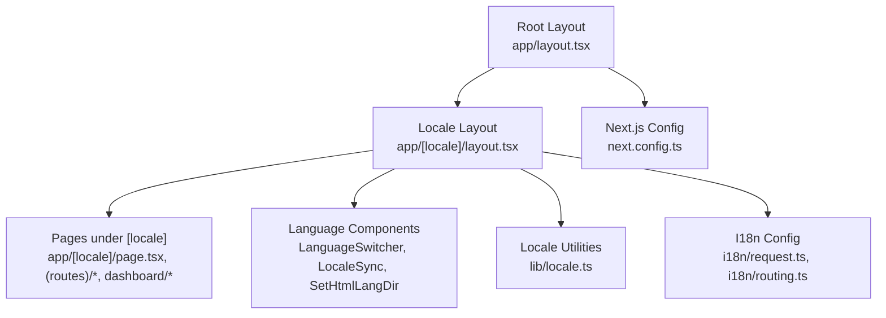
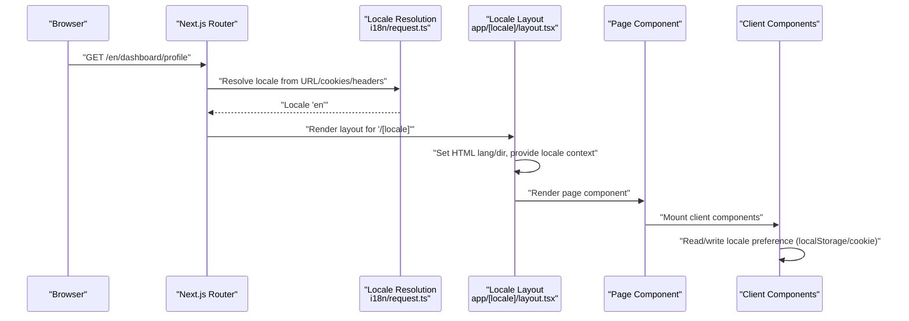
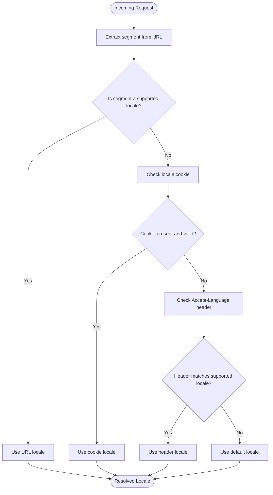
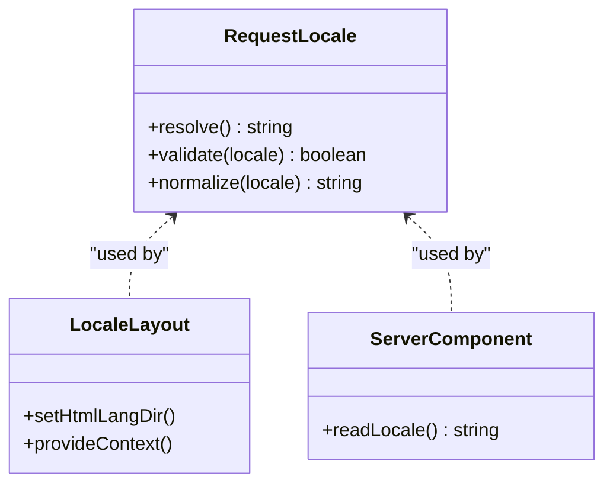
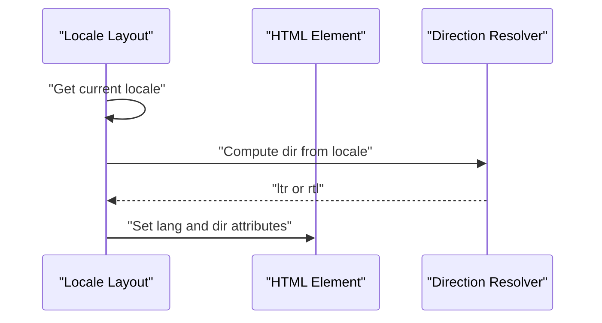
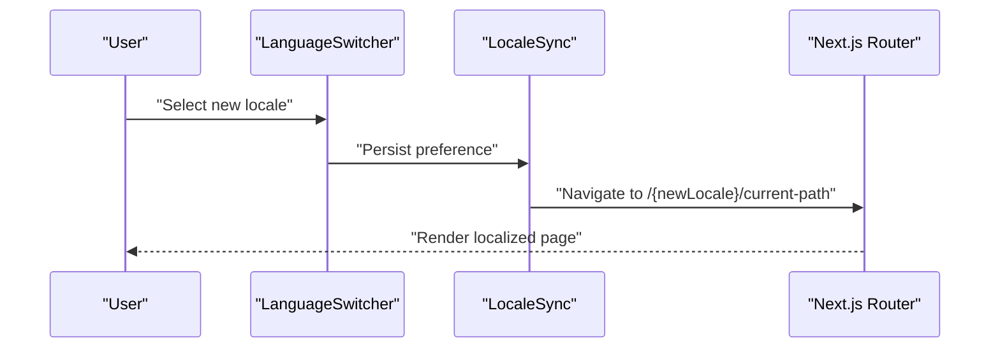
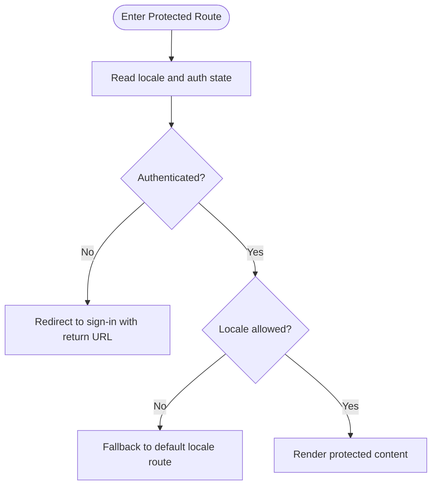
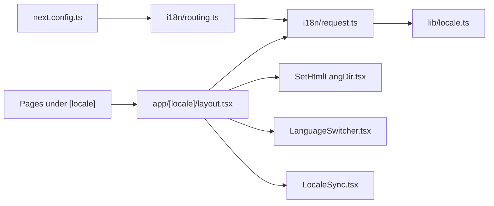

# Internationalization Architecture

<cite>
**Referenced Files in This Document**
- [next.config.ts](file://next.config.ts)
- [i18n/request.ts](file://i18n/request.ts)
- [i18n/routing.ts](file://i18n/routing.ts)
- [lib/locale.ts](file://lib/locale.ts)
- [app/[locale]/layout.tsx](file://app/[locale]/layout.tsx)
- [app/layout.tsx](file://app/layout.tsx)
- [app/[locale]/page.tsx](file://app/[locale]/page.tsx)
- [app/[locale]/(routes)/services/page.tsx](file://app/[locale]/(routes)/services/page.tsx)
- [app/[locale]/dashboard/layout.tsx](file://app/[locale]/dashboard/layout.tsx)
- [app/[locale]/_components/Language/LanguageSwitcher.tsx](file://app/[locale]/_components/Language/LanguageSwitcher.tsx)
- [app/[locale]/_components/Language/LocaleSync.tsx](file://app/[locale]/_components/Language/LocaleSync.tsx)
- [app/[locale]/_components/Language/SetHtmlLangDir.tsx](file://app/[locale]/_components/Language/SetHtmlLangDir.tsx)
- [messages/en.json](file://messages/en.json)
</cite>

## Table of Contents
1. [Introduction](#introduction)
2. [Project Structure](#project-structure)
3. [Core Components](#core-components)
4. [Architecture Overview](#architecture-overview)
5. [Detailed Component Analysis](#detailed-component-analysis)
6. [Dependency Analysis](#dependency-analysis)
7. [Performance Considerations](#performance-considerations)
8. [Troubleshooting Guide](#troubleshooting-guide)
9. [Conclusion](#conclusion)

## Introduction
This document explains the internationalization (i18n) architecture implemented with Next.js App Router. It covers:
- Internationalized routing setup and URL patterns
- Locale detection and request handling
- Routing configuration, supported locales, and default language
- Request context usage for server components
- Practical examples for locale-aware layouts, middleware-like behavior, and route protection based on user preferences
- Performance considerations and caching strategies for large-scale i18n deployments

## Project Structure
The project uses Next.js App Router with a top-level dynamic segment [locale] to scope all routes by language. The structure includes:
- A root layout that initializes global providers and HTML attributes
- A per-locale layout under app/[locale]/layout.tsx that sets up locale-specific context and metadata
- Feature folders grouped by domain (e.g., (auth), (routes), dashboard)
- Shared UI and i18n utilities under app/[locale]/_components and lib/
- Message bundles under messages/

**Diagram sources**
- [app/layout.tsx](file://app/layout.tsx)
- [app/[locale]/layout.tsx](file://app/[locale]/layout.tsx)
- [app/[locale]/page.tsx](file://app/[locale]/page.tsx)
- [app/[locale]/_components/Language/LanguageSwitcher.tsx](file://app/[locale]/_components/Language/LanguageSwitcher.tsx)
- [app/[locale]/_components/Language/LocaleSync.tsx](file://app/[locale]/_components/Language/LocaleSync.tsx)
- [app/[locale]/_components/Language/SetHtmlLangDir.tsx](file://app/[locale]/_components/Language/SetHtmlLangDir.tsx)
- [lib/locale.ts](file://lib/locale.ts)
- [i18n/request.ts](file://i18n/request.ts)
- [i18n/routing.ts](file://i18n/routing.ts)
- [next.config.ts](file://next.config.ts)

**Section sources**
- [app/layout.tsx](file://app/layout.tsx)
- [app/[locale]/layout.tsx](file://app/[locale]/layout.tsx)
- [app/[locale]/page.tsx](file://app/[locale]/page.tsx)
- [app/[locale]/(routes)/services/page.tsx](file://app/[locale]/(routes)/services/page.tsx)
- [app/[locale]/dashboard/layout.tsx](file://app/[locale]/dashboard/layout.tsx)
- [app/[locale]/_components/Language/LanguageSwitcher.tsx](file://app/[locale]/_components/Language/LanguageSwitcher.tsx)
- [app/[locale]/_components/Language/LocaleSync.tsx](file://app/[locale]/_components/Language/LocaleSync.tsx)
- [app/[locale]/_components/Language/SetHtmlLangDir.tsx](file://app/[locale]/_components/Language/SetHtmlLangDir.tsx)
- [lib/locale.ts](file://lib/locale.ts)
- [i18n/request.ts](file://i18n/request.ts)
- [i18n/routing.ts](file://i18n/routing.ts)
- [next.config.ts](file://next.config.ts)

## Core Components
- next.config.ts: Defines Next.js runtime and build-time settings relevant to i18n, including supported locales and default locale.
- i18n/routing.ts: Declares supported locales and default locale used by Next.js i18n helpers.
- i18n/request.ts: Provides request-scoped locale resolution utilities for server components and server actions.
- lib/locale.ts: Utility functions for locale parsing, validation, and normalization across client and server.
- app/[locale]/layout.tsx: Sets up locale-aware context, HTML lang/direction, and shared UI for each locale.
- Language components: LanguageSwitcher, LocaleSync, and SetHtmlLangDir manage user preference persistence and DOM updates.

Key responsibilities:
- Locale detection from URL, cookies, headers, or fallbacks
- Centralized configuration of supported locales and defaults
- Consistent access to current locale in server and client code
- Automatic HTML lang and direction updates

**Section sources**
- [next.config.ts](file://next.config.ts)
- [i18n/routing.ts](file://i18n/routing.ts)
- [i18n/request.ts](file://i18n/request.ts)
- [lib/locale.ts](file://lib/locale.ts)
- [app/[locale]/layout.tsx](file://app/[locale]/layout.tsx)
- [app/[locale]/_components/Language/LanguageSwitcher.tsx](file://app/[locale]/_components/Language/LanguageSwitcher.tsx)
- [app/[locale]/_components/Language/LocaleSync.tsx](file://app/[locale]/_components/Language/LocaleSync.tsx)
- [app/[locale]/_components/Language/SetHtmlLangDir.tsx](file://app/[locale]/_components/Language/SetHtmlLangDir.tsx)

## Architecture Overview
The i18n architecture follows Next.js App Router conventions with a top-level [locale] segment. Requests are resolved to the appropriate locale using a combination of URL path, cookies, and Accept-Language header. Server components consume locale via request utilities, while client components synchronize state through context and local storage.

**Diagram sources**
- [i18n/request.ts](file://i18n/request.ts)
- [app/[locale]/layout.tsx](file://app/[locale]/layout.tsx)
- [app/[locale]/page.tsx](file://app/[locale]/page.tsx)
- [app/[locale]/_components/Language/LocaleSync.tsx](file://app/[locale]/_components/Language/LocaleSync.tsx)

## Detailed Component Analysis

### Routing Configuration and Supported Locales
- Supported locales and default locale are declared in the routing configuration file and mirrored in Next.js config.
- The [locale] segment enforces URL patterns like /{locale}/... for all routes.
- Example route paths:
  - Home: /{locale}/
  - Services listing: /{locale}/services
  - Service detail: /{locale}/services/{slug}
  - Dashboard: /{locale}/dashboard/*

**Diagram sources**
- [i18n/routing.ts](file://i18n/routing.ts)
- [i18n/request.ts](file://i18n/request.ts)
- [next.config.ts](file://next.config.ts)

**Section sources**
- [i18n/routing.ts](file://i18n/routing.ts)
- [next.config.ts](file://next.config.ts)
- [app/[locale]/(routes)/services/page.tsx](file://app/[locale]/(routes)/services/page.tsx)

### Request Context Setup for Server Components
- The locale is resolved at request time and made available to server components via utilities.
- The per-locale layout sets HTML lang and direction and can initialize any locale-specific server-side data.
- Server components can read the current locale directly from the request context without prop drilling.

**Diagram sources**
- [i18n/request.ts](file://i18n/request.ts)
- [app/[locale]/layout.tsx](file://app/[locale]/layout.tsx)

**Section sources**
- [i18n/request.ts](file://i18n/request.ts)
- [app/[locale]/layout.tsx](file://app/[locale]/layout.tsx)

### Locale-Aware Layouts and HTML Attributes
- The per-locale layout ensures consistent structure and provides locale context to nested pages.
- HTML lang and direction are updated based on the resolved locale to improve accessibility and rendering.
- Shared UI elements (header, footer, theme toggle) can be localized within this layout.

**Diagram sources**
- [app/[locale]/layout.tsx](file://app/[locale]/layout.tsx)
- [app/[locale]/_components/Language/SetHtmlLangDir.tsx](file://app/[locale]/_components/Language/SetHtmlLangDir.tsx)

**Section sources**
- [app/[locale]/layout.tsx](file://app/[locale]/layout.tsx)
- [app/[locale]/_components/Language/SetHtmlLangDir.tsx](file://app/[locale]/_components/Language/SetHtmlLangDir.tsx)

### Client-Side Locale Synchronization
- LanguageSwitcher allows users to change the active locale.
- LocaleSync persists the selected locale (e.g., in localStorage or cookie) and triggers navigation to the same route under the new locale.
- These components ensure seamless switching without losing context.

**Diagram sources**
- [app/[locale]/_components/Language/LanguageSwitcher.tsx](file://app/[locale]/_components/Language/LanguageSwitcher.tsx)
- [app/[locale]/_components/Language/LocaleSync.tsx](file://app/[locale]/_components/Language/LocaleSync.tsx)

**Section sources**
- [app/[locale]/_components/Language/LanguageSwitcher.tsx](file://app/[locale]/_components/Language/LanguageSwitcher.tsx)
- [app/[locale]/_components/Language/LocaleSync.tsx](file://app/[locale]/_components/Language/LocaleSync.tsx)

### Route Protection Based on User Preferences
- While not strictly i18n, protecting routes based on user preferences (including locale) can be implemented by reading the resolved locale in server components or server actions and enforcing access rules before rendering.
- For example, redirect unauthenticated users or enforce locale-based content visibility.

**Diagram sources**
- [i18n/request.ts](file://i18n/request.ts)
- [app/[locale]/dashboard/layout.tsx](file://app/[locale]/dashboard/layout.tsx)

**Section sources**
- [i18n/request.ts](file://i18n/request.ts)
- [app/[locale]/dashboard/layout.tsx](file://app/[locale]/dashboard/layout.tsx)

### Messages and Content Bundles
- Message files are organized by locale under messages/.
- At build time or runtime, these bundles are loaded according to the resolved locale.
- Ensure only necessary locales are included in production builds to reduce bundle size.

**Section sources**
- [messages/en.json](file://messages/en.json)

## Dependency Analysis
The i18n system has clear separation between configuration, request-time resolution, and UI synchronization.

**Diagram sources**
- [next.config.ts](file://next.config.ts)
- [i18n/routing.ts](file://i18n/routing.ts)
- [i18n/request.ts](file://i18n/request.ts)
- [lib/locale.ts](file://lib/locale.ts)
- [app/[locale]/layout.tsx](file://app/[locale]/layout.tsx)
- [app/[locale]/_components/Language/SetHtmlLangDir.tsx](file://app/[locale]/_components/Language/SetHtmlLangDir.tsx)
- [app/[locale]/_components/Language/LanguageSwitcher.tsx](file://app/[locale]/_components/Language/LanguageSwitcher.tsx)
- [app/[locale]/_components/Language/LocaleSync.tsx](file://app/[locale]/_components/Language/LocaleSync.tsx)

**Section sources**
- [next.config.ts](file://next.config.ts)
- [i18n/routing.ts](file://i18n/routing.ts)
- [i18n/request.ts](file://i18n/request.ts)
- [lib/locale.ts](file://lib/locale.ts)
- [app/[locale]/layout.tsx](file://app/[locale]/layout.tsx)
- [app/[locale]/_components/Language/SetHtmlLangDir.tsx](file://app/[locale]/_components/Language/SetHtmlLangDir.tsx)
- [app/[locale]/_components/Language/LanguageSwitcher.tsx](file://app/[locale]/_components/Language/LanguageSwitcher.tsx)
- [app/[locale]/_components/Language/LocaleSync.tsx](file://app/[locale]/_components/Language/LocaleSync.tsx)

## Performance Considerations
- Minimize message bundle sizes by loading only required locales in production.
- Prefer static generation for pages where possible; avoid heavy computations during locale resolution.
- Cache locale preferences in cookies or localStorage to reduce repeated lookups.
- Avoid unnecessary re-renders when switching locales by keeping locale state stable and co-located near the layout.
- Use Next.js built-in caching and edge runtime features where applicable to speed up locale detection.

## Troubleshooting Guide
Common issues and resolutions:
- Incorrect locale in URL: Verify supported locales and default locale configuration.
- Missing translations: Ensure message files exist for all supported locales and keys are present.
- HTML lang/direction not updating: Confirm the per-locale layout sets attributes and that the direction resolver handles all locales.
- Locale switch not persisting: Check client-side sync logic and storage mechanism.
- Route protection failures: Validate that locale and auth checks run before rendering protected content.

**Section sources**
- [i18n/routing.ts](file://i18n/routing.ts)
- [i18n/request.ts](file://i18n/request.ts)
- [app/[locale]/layout.tsx](file://app/[locale]/layout.tsx)
- [app/[locale]/_components/Language/LocaleSync.tsx](file://app/[locale]/_components/Language/LocaleSync.tsx)

## Conclusion
This i18n architecture leverages Next.js App Router’s [locale] segment to provide robust, scalable internationalization. With centralized configuration, clear request-time resolution, and cohesive client-side synchronization, it supports complex routing, locale-aware layouts, and performance-conscious implementations suitable for large-scale applications.