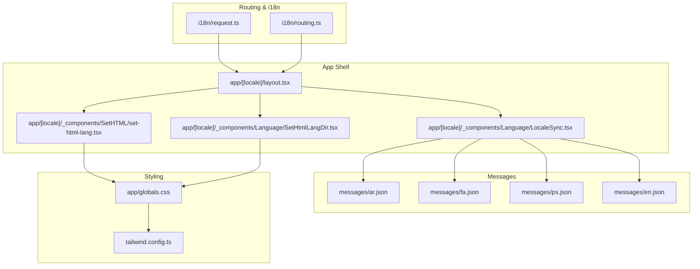
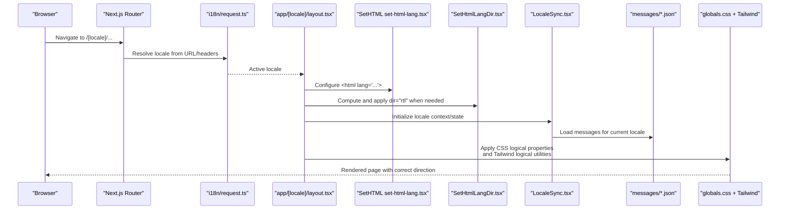
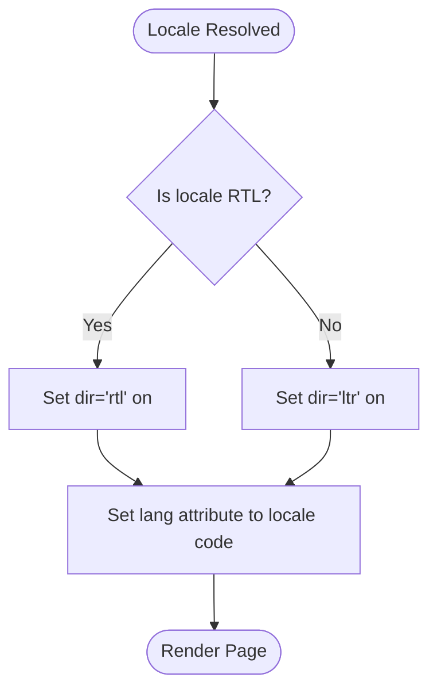
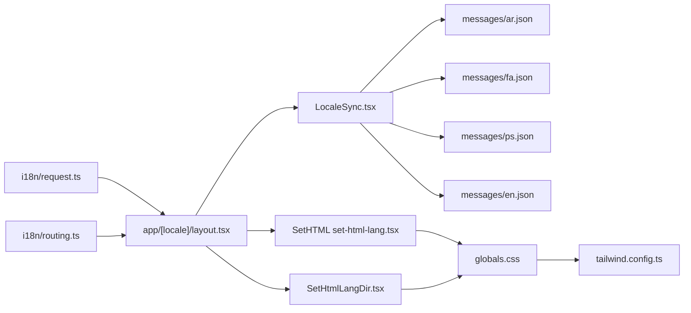

# RTL Language Support

<cite>
**Referenced Files in This Document**
- [SetHtmlLangDir.tsx](file://app/[locale]/_components/Language/SetHtmlLangDir.tsx)
- [LocaleSync.tsx](file://app/[locale]/_components/Language/LocaleSync.tsx)
- [LanguageSwitcher.tsx](file://app/[locale]/_components/Language/LanguageSwitcher.tsx)
- [set-html-lang.tsx](file://app/[locale]/_components/SetHTML/set-html-lang.tsx)
- [layout.tsx](file://app/[locale]/layout.tsx)
- [request.ts](file://i18n/request.ts)
- [routing.ts](file://i18n/routing.ts)
- [ar.json](file://messages/ar.json)
- [fa.json](file://messages/fa.json)
- [ps.json](file://messages/ps.json)
- [en.json](file://messages/en.json)
- [globals.css](file://app/globals.css)
- [tailwind.config.ts](file://tailwind.config.ts)
</cite>

## Table of Contents
1. [Introduction](#introduction)
2. [Project Structure](#project-structure)
3. [Core Components](#core-components)
4. [Architecture Overview](#architecture-overview)
5. [Detailed Component Analysis](#detailed-component-analysis)
6. [Dependency Analysis](#dependency-analysis)
7. [Performance Considerations](#performance-considerations)
8. [Troubleshooting Guide](#troubleshooting-guide)
9. [Conclusion](#conclusion)
10. [Appendices](#appendices)

## Introduction
This document explains how Right-to-Left (RTL) language support is implemented for Arabic, Persian, and Pashto. It covers automatic direction detection based on locale, HTML lang attribute configuration, CSS direction properties, layout adjustments, and component-level adaptations. It also provides guidance for customizing RTL-specific styles, handling mixed LTR/RTL content, testing RTL layouts, and addressing common RTL challenges such as icon positioning, margin/padding adjustments, and responsive design considerations.

## Project Structure
The RTL implementation spans several layers:
- Locale routing and request resolution
- HTML lang and dir attributes at the app root
- Global CSS and Tailwind configuration for logical properties
- Message catalogs for supported languages including RTL locales
- UI components that adapt to direction via CSS logical properties and conditional classes

**Diagram sources**
- [request.ts](file://i18n/request.ts)
- [routing.ts](file://i18n/routing.ts)
- [layout.tsx](file://app/[locale]/layout.tsx)
- [set-html-lang.tsx](file://app/[locale]/_components/SetHTML/set-html-lang.tsx)
- [SetHtmlLangDir.tsx](file://app/[locale]/_components/Language/SetHtmlLangDir.tsx)
- [LocaleSync.tsx](file://app/[locale]/_components/Language/LocaleSync.tsx)
- [ar.json](file://messages/ar.json)
- [fa.json](file://messages/fa.json)
- [ps.json](file://messages/ps.json)
- [en.json](file://messages/en.json)
- [globals.css](file://app/globals.css)
- [tailwind.config.ts](file://tailwind.config.ts)

**Section sources**
- [layout.tsx](file://app/[locale]/layout.tsx)
- [request.ts](file://i18n/request.ts)
- [routing.ts](file://i18n/routing.ts)
- [set-html-lang.tsx](file://app/[locale]/_components/SetHTML/set-html-lang.tsx)
- [SetHtmlLangDir.tsx](file://app/[locale]/_components/Language/SetHtmlLangDir.tsx)
- [LocaleSync.tsx](file://app/[locale]/_components/Language/LocaleSync.tsx)
- [globals.css](file://app/globals.css)
- [tailwind.config.ts](file://tailwind.config.ts)

## Core Components
- Locale resolution and routing: Determines the active locale from the URL or request headers and exposes it to the app shell.
- HTML lang and dir setup: Ensures the root <html> element has correct lang and dir attributes for accessibility and browser behavior.
- Direction-aware styling: Uses CSS logical properties and Tailwind’s logical utilities to mirror spacing and alignment automatically in RTL contexts.
- Message catalogs: Provide localized strings for Arabic, Persian, and Pashto, enabling full localization alongside direction changes.

Key responsibilities:
- Automatic direction detection based on locale
- Setting HTML lang and dir attributes
- Applying global CSS rules for RTL
- Leveraging Tailwind logical properties for consistent layouts

**Section sources**
- [request.ts](file://i18n/request.ts)
- [routing.ts](file://i18n/routing.ts)
- [layout.tsx](file://app/[locale]/layout.tsx)
- [set-html-lang.tsx](file://app/[locale]/_components/SetHTML/set-html-lang.tsx)
- [SetHtmlLangDir.tsx](file://app/[locale]/_components/Language/SetHtmlLangDir.tsx)
- [LocaleSync.tsx](file://app/[locale]/_components/Language/LocaleSync.tsx)
- [globals.css](file://app/globals.css)
- [tailwind.config.ts](file://tailwind.config.ts)

## Architecture Overview
The RTL architecture integrates Next.js internationalization with React state and global CSS/Tailwind to ensure consistent right-to-left rendering across the application.

**Diagram sources**
- [request.ts](file://i18n/request.ts)
- [layout.tsx](file://app/[locale]/layout.tsx)
- [set-html-lang.tsx](file://app/[locale]/_components/SetHTML/set-html-lang.tsx)
- [SetHtmlLangDir.tsx](file://app/[locale]/_components/Language/SetHtmlLangDir.tsx)
- [LocaleSync.tsx](file://app/[locale]/_components/Language/LocaleSync.tsx)
- [ar.json](file://messages/ar.json)
- [fa.json](file://messages/fa.json)
- [ps.json](file://messages/ps.json)
- [en.json](file://messages/en.json)
- [globals.css](file://app/globals.css)
- [tailwind.config.ts](file://tailwind.config.ts)

## Detailed Component Analysis

### Locale Resolution and Routing
- Purpose: Determine the active locale from the URL segment or request headers and make it available throughout the app.
- Behavior: The router uses a configured list of locales and fallbacks. When an RTL locale is detected, downstream components should enable RTL mode.
- Integration: The resolved locale is passed into the app shell where HTML attributes and direction are applied.

**Section sources**
- [request.ts](file://i18n/request.ts)
- [routing.ts](file://i18n/routing.ts)

### HTML Lang and Direction Setup
- HTML lang attribute: Set on the root element to reflect the current locale for accessibility tools and search engines.
- Direction attribute: Automatically set to rtl for Arabic, Persian, and Pashto; otherwise ltr.
- Implementation points:
  - A dedicated component sets the lang attribute.
  - Another component computes and applies the dir attribute based on the active locale.

**Diagram sources**
- [set-html-lang.tsx](file://app/[locale]/_components/SetHTML/set-html-lang.tsx)
- [SetHtmlLangDir.tsx](file://app/[locale]/_components/Language/SetHtmlLangDir.tsx)

**Section sources**
- [set-html-lang.tsx](file://app/[locale]/_components/SetHTML/set-html-lang.tsx)
- [SetHtmlLangDir.tsx](file://app/[locale]/_components/Language/SetHtmlLangDir.tsx)

### Locale Context and Message Loading
- Purpose: Maintain the active locale in React context/state and load corresponding message files.
- Behavior: On mount or locale change, the component loads messages for the selected locale and ensures UI updates accordingly.
- Impact on RTL: Once the locale is known, direction can be derived and applied globally.

**Section sources**
- [LocaleSync.tsx](file://app/[locale]/_components/Language/LocaleSync.tsx)
- [ar.json](file://messages/ar.json)
- [fa.json](file://messages/fa.json)
- [ps.json](file://messages/ps.json)
- [en.json](file://messages/en.json)

### Global Styling and Tailwind Logical Properties
- CSS logical properties: Use margin-inline-start/end, padding-inline-start/end, text-align, etc., to automatically flip spacing and alignment in RTL.
- Tailwind utilities: Prefer logical variants like ms-*, me-*, ps-*, pe-*, start-* and end-* to avoid hard-coded left/right values.
- Root direction: Ensure the root element reflects the correct dir so browsers and user agents interpret logical properties correctly.

Best practices:
- Replace left/right margins and paddings with inline-start/inline-end equivalents.
- Align text using start/end instead of left/right.
- Avoid absolute positioning with fixed left/right values; prefer inset-inline-start/inset-inline-end or transform-based approaches.

**Section sources**
- [globals.css](file://app/globals.css)
- [tailwind.config.ts](file://tailwind.config.ts)

### App Shell Integration
- The app shell composes the locale resolution, HTML attribute setting, and direction application.
- It ensures all child routes inherit the correct lang and dir attributes and that messages are loaded before rendering.

**Section sources**
- [layout.tsx](file://app/[locale]/layout.tsx)

## Dependency Analysis
The following diagram shows how RTL-related modules depend on each other:

**Diagram sources**
- [request.ts](file://i18n/request.ts)
- [routing.ts](file://i18n/routing.ts)
- [layout.tsx](file://app/[locale]/layout.tsx)
- [set-html-lang.tsx](file://app/[locale]/_components/SetHTML/set-html-lang.tsx)
- [SetHtmlLangDir.tsx](file://app/[locale]/_components/Language/SetHtmlLangDir.tsx)
- [LocaleSync.tsx](file://app/[locale]/_components/Language/LocaleSync.tsx)
- [ar.json](file://messages/ar.json)
- [fa.json](file://messages/fa.json)
- [ps.json](file://messages/ps.json)
- [en.json](file://messages/en.json)
- [globals.css](file://app/globals.css)
- [tailwind.config.ts](file://tailwind.config.ts)

**Section sources**
- [request.ts](file://i18n/request.ts)
- [routing.ts](file://i18n/routing.ts)
- [layout.tsx](file://app/[locale]/layout.tsx)
- [set-html-lang.tsx](file://app/[locale]/_components/SetHTML/set-html-lang.tsx)
- [SetHtmlLangDir.tsx](file://app/[locale]/_components/Language/SetHtmlLangDir.tsx)
- [LocaleSync.tsx](file://app/[locale]/_components/Language/LocaleSync.tsx)
- [globals.css](file://app/globals.css)
- [tailwind.config.ts](file://tailwind.config.ts)

## Performance Considerations
- Minimize re-renders: Keep locale and direction state stable; avoid unnecessary recalculations on every render.
- Defer heavy work: Load messages lazily if needed, but ensure critical UI renders with default direction first.
- Prefer CSS logical properties: Reduces need for JS-driven style toggles and improves rendering performance.
- Avoid layout thrashing: Batch DOM reads/writes when adjusting styles programmatically.

[No sources needed since this section provides general guidance]

## Troubleshooting Guide
Common issues and resolutions:
- Icons pointing the wrong way in RTL:
  - Use CSS logical properties or Tailwind’s start/end utilities to flip icons automatically.
  - For SVGs, consider mirroring transforms only in RTL contexts.
- Margins and paddings not flipping:
  - Replace left/right with inline-start/inline-end equivalents.
  - Verify that the root dir attribute is set correctly.
- Text alignment anomalies:
  - Use text-align: start/end rather than left/right.
- Mixed LTR/RTL content:
  - Wrap mixed segments in containers with explicit dir attributes to isolate direction.
  - Use CSS logical properties within those containers to maintain consistency.
- Responsive breakpoints:
  - Ensure logical properties are used consistently across breakpoints to prevent misalignment on mobile devices.
- Testing strategies:
  - Toggle browser language or navigate to /ar/, /fa/, /ps/ to validate layout.
  - Use DevTools to inspect computed styles and verify dir and lang attributes.
  - Test with long words and numbers to confirm proper wrapping and alignment.

**Section sources**
- [SetHtmlLangDir.tsx](file://app/[locale]/_components/Language/SetHtmlLangDir.tsx)
- [set-html-lang.tsx](file://app/[locale]/_components/SetHTML/set-html-lang.tsx)
- [globals.css](file://app/globals.css)
- [tailwind.config.ts](file://tailwind.config.ts)

## Conclusion
By combining Next.js i18n routing, explicit HTML lang/dir attributes, and CSS logical properties with Tailwind utilities, the application achieves robust RTL support for Arabic, Persian, and Pashto. Following the guidelines here will help you customize RTL styles, handle mixed-direction content, and test layouts effectively while avoiding common pitfalls.

[No sources needed since this section summarizes without analyzing specific files]

## Appendices

### Supported RTL Locales
- Arabic (ar)
- Persian (fa)
- Pashto (ps)

These locales are included in the message catalogs and should trigger automatic RTL direction when active.

**Section sources**
- [ar.json](file://messages/ar.json)
- [fa.json](file://messages/fa.json)
- [ps.json](file://messages/ps.json)

### Quick Checklist for Implementing RTL in New Components
- Use logical properties (margin-inline, padding-inline, text-align: start/end).
- Prefer Tailwind’s ms-*, me-*, ps-*, pe-*, start-*, end-* utilities.
- Avoid hardcoded left/right positions; use inset-inline-start/inset-inline-end or transforms.
- Wrap mixed LTR/RTL snippets with explicit dir attributes.
- Validate with browser dev tools and by switching locales.

[No sources needed since this section provides general guidance]