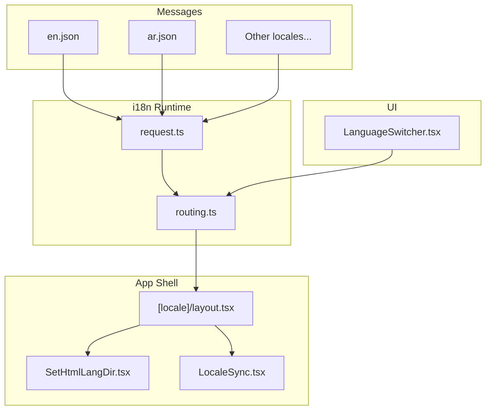
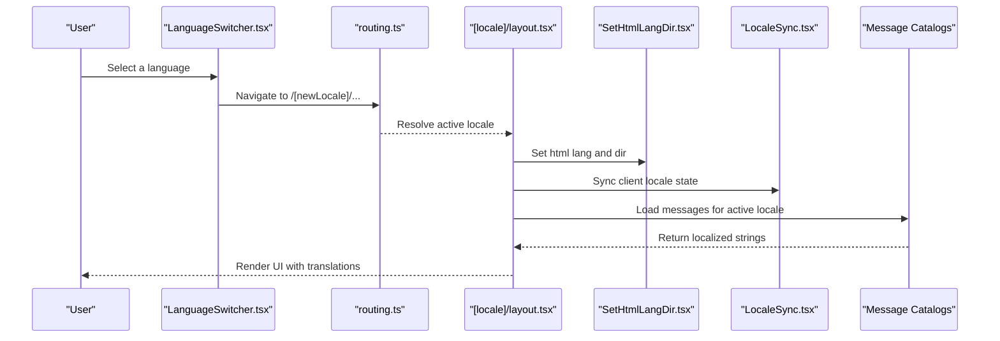
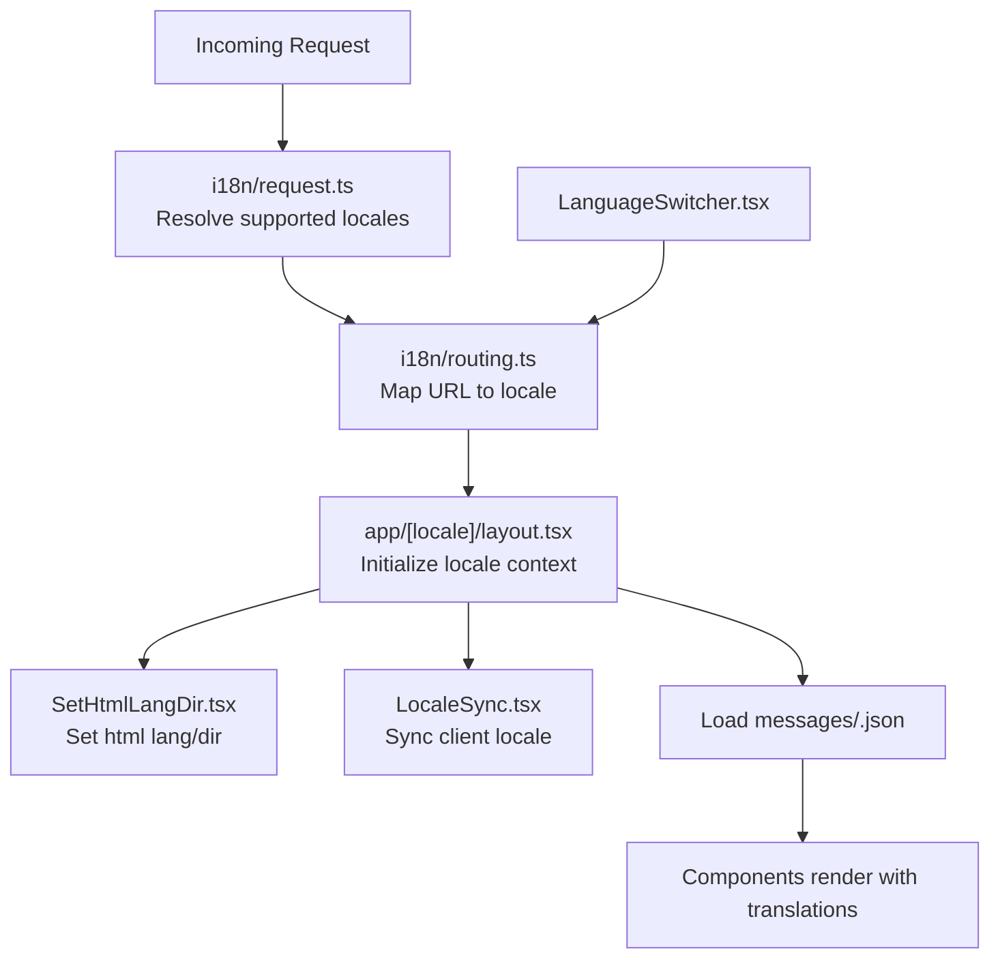

# Translation Management

<cite>
**Referenced Files in This Document**
- [messages/en.json](file://messages/en.json)
- [messages/ar.json](file://messages/ar.json)
- [i18n/request.ts](file://i18n/request.ts)
- [i18n/routing.ts](file://i18n/routing.ts)
- [app/[locale]/layout.tsx](file://app/[locale]/layout.tsx)
- [app/[locale]/_components/Language/LanguageSwitcher.tsx](file://app/[locale]/_components/Language/LanguageSwitcher.tsx)
- [app/[locale]/_components/Language/LocaleSync.tsx](file://app/[locale]/_components/Language/LocaleSync.tsx)
- [app/[locale]/_components/Language/SetHtmlLangDir.tsx](file://app/[locale]/_components/Language/SetHtmlLangDir.tsx)
- [lib/locale.ts](file://lib/locale.ts)
</cite>

## Table of Contents
1. [Introduction](#introduction)
2. [Project Structure](#project-structure)
3. [Core Components](#core-components)
4. [Architecture Overview](#architecture-overview)
5. [Detailed Component Analysis](#detailed-component-analysis)
6. [Dependency Analysis](#dependency-analysis)
7. [Performance Considerations](#performance-considerations)
8. [Troubleshooting Guide](#troubleshooting-guide)
9. [Conclusion](#conclusion)
10. [Appendices](#appendices)

## Introduction
This document explains how translation files are organized and consumed across the application. It covers the JSON message file structure, key naming conventions, hierarchical organization patterns, adding new languages, creating and maintaining translation files, pluralization rules, dynamic content interpolation, integration with UI components, best practices for large translation sets, and guidelines for working with external translators to maintain quality.

## Project Structure
Translation assets live under a single messages directory, with one JSON file per supported locale. The i18n runtime is configured via request and routing modules, and the Next.js layout wires locale context into the app shell. Language switching is provided by dedicated UI components that update the URL and synchronize client state.

**Diagram sources**
- [messages/en.json](file://messages/en.json)
- [messages/ar.json](file://messages/ar.json)
- [i18n/request.ts](file://i18n/request.ts)
- [i18n/routing.ts](file://i18n/routing.ts)
- [app/[locale]/layout.tsx](file://app/[locale]/layout.tsx)
- [app/[locale]/_components/Language/SetHtmlLangDir.tsx](file://app/[locale]/_components/Language/SetHtmlLangDir.tsx)
- [app/[locale]/_components/Language/LocaleSync.tsx](file://app/[locale]/_components/Language/LocaleSync.tsx)
- [app/[locale]/_components/Language/LanguageSwitcher.tsx](file://app/[locale]/_components/Language/LanguageSwitcher.tsx)

**Section sources**
- [i18n/request.ts](file://i18n/request.ts)
- [i18n/routing.ts](file://i18n/routing.ts)
- [app/[locale]/layout.tsx](file://app/[locale]/layout.tsx)
- [app/[locale]/_components/Language/LanguageSwitcher.tsx](file://app/[locale]/_components/Language/LanguageSwitcher.tsx)
- [app/[locale]/_components/Language/LocaleSync.tsx](file://app/[locale]/_components/Language/LocaleSync.tsx)
- [app/[locale]/_components/Language/SetHtmlLangDir.tsx](file://app/[locale]/_components/Language/SetHtmlLangDir.tsx)

## Core Components
- Message catalogs: One JSON file per locale under messages/. Each file contains nested objects keyed by feature or domain (for example, auth, common, dashboard).
- Request configuration: Determines which locales are available and how to resolve the active locale from the incoming request.
- Routing configuration: Defines supported locales and default locale behavior.
- App shell: The [locale] layout initializes locale context and applies language direction.
- Language switcher: Updates the URL to the selected locale and triggers re-rendering with the correct translations.
- Locale synchronization: Ensures client-side state stays in sync with the current locale.
- HTML lang/direction: Sets the <html> lang attribute and text direction based on the active locale.

Key responsibilities:
- Centralize all user-visible strings in JSON catalogs.
- Provide a consistent API to access messages from components.
- Keep locale resolution deterministic and predictable.
- Maintain proper text direction for RTL languages.

**Section sources**
- [i18n/request.ts](file://i18n/request.ts)
- [i18n/routing.ts](file://i18n/routing.ts)
- [app/[locale]/layout.tsx](file://app/[locale]/layout.tsx)
- [app/[locale]/_components/Language/LanguageSwitcher.tsx](file://app/[locale]/_components/Language/LanguageSwitcher.tsx)
- [app/[locale]/_components/Language/LocaleSync.tsx](file://app/[locale]/_components/Language/LocaleSync.tsx)
- [app/[locale]/_components/Language/SetHtmlLangDir.tsx](file://app/[locale]/_components/Language/SetHtmlLangDir.tsx)

## Architecture Overview
The internationalization architecture follows a clear separation between data (message catalogs), runtime configuration (request and routing), and presentation (UI components and layout).

**Diagram sources**
- [app/[locale]/_components/Language/LanguageSwitcher.tsx](file://app/[locale]/_components/Language/LanguageSwitcher.tsx)
- [i18n/routing.ts](file://i18n/routing.ts)
- [app/[locale]/layout.tsx](file://app/[locale]/layout.tsx)
- [app/[locale]/_components/Language/SetHtmlLangDir.tsx](file://app/[locale]/_components/Language/SetHtmlLangDir.tsx)
- [app/[locale]/_components/Language/LocaleSync.tsx](file://app/[locale]/_components/Language/LocaleSync.tsx)
- [messages/en.json](file://messages/en.json)
- [messages/ar.json](file://messages/ar.json)

## Detailed Component Analysis

### Message Catalog Structure and Key Conventions
- File-per-locale: Each locale has its own JSON file under messages/.
- Hierarchical keys: Organize keys by feature/domain (for example, auth, common, dashboard). Use dot notation within nested objects to represent deeper levels.
- Consistent naming: Use lowercase words separated by underscores or camelCase consistently across all locales. Avoid special characters and spaces.
- Completeness: Ensure every key exists in all locales. Missing keys should be flagged during development.

Recommended top-level groups:
- common: Shared labels, placeholders, errors, and status messages.
- auth: Sign-in, sign-up, password reset, email verification flows.
- dashboard: Dashboard-specific sections and actions.
- pages: Page-specific content such as about, contact, services.

Best practices:
- Prefer short, descriptive keys over verbose sentences.
- Group related strings together to simplify navigation and review.
- Keep values human-readable; avoid embedding formatting logic inside strings.

**Section sources**
- [messages/en.json](file://messages/en.json)
- [messages/ar.json](file://messages/ar.json)

### Adding a New Language
Steps:
1. Add a new JSON file under messages/ using the ISO code for the target language.
2. Update the request configuration to include the new locale in the list of supported locales.
3. Update the routing configuration to recognize the new locale path segment.
4. Optionally add a display name and flag in the language switcher if it maintains a locale registry.
5. Verify that the HTML lang and direction are set correctly for the new locale.

Validation checklist:
- All existing keys exist in the new catalog.
- Plural forms and interpolation tokens match other locales.
- UI renders without missing-key warnings.

**Section sources**
- [i18n/request.ts](file://i18n/request.ts)
- [i18n/routing.ts](file://i18n/routing.ts)
- [app/[locale]/_components/Language/SetHtmlLangDir.tsx](file://app/[locale]/_components/Language/SetHtmlLangDir.tsx)

### Creating and Maintaining Translation Files
- Start from the English catalog as a baseline.
- Copy the base structure to the new locale file and translate values only.
- Keep keys identical across all locales.
- Use comments at the top of each file to note translator notes or glossary links if needed.
- Run consistency checks to detect missing or extra keys.

Maintenance tips:
- When adding a new key, add it to all locale files simultaneously.
- Use automated scripts to compare keys across locales and report differences.
- Review diffs before merging to catch accidental deletions or typos.

**Section sources**
- [messages/en.json](file://messages/en.json)
- [messages/ar.json](file://messages/ar.json)

### Nested Message Objects
Organize messages hierarchically to mirror UI features:
- Top-level domains (for example, auth, common, dashboard).
- Sub-keys for screens or components (for example, signIn, signUp).
- Leaf keys for actual strings (for example, title, description, submit).

Guidelines:
- Keep nesting depth reasonable (two to three levels typically).
- Avoid overly deep trees that make lookup cumbersome.
- Use consistent grouping across locales.

**Section sources**
- [messages/en.json](file://messages/en.json)

### Pluralization Rules
Use ICU-style pluralization where supported:
- Define plural categories in the message value using selectors like zero, one, two, few, many, other.
- Reference the count variable when constructing the message.
- Keep plural forms concise and readable.

Example pattern (conceptual):
- A message key with a plural selector that chooses among multiple forms depending on the numeric input.

Note: Implement pluralization through the i18n runtime’s formatter or a helper that resolves the correct form based on the locale’s plural rules.

**Section sources**
- [messages/en.json](file://messages/en.json)

### Dynamic Content Interpolation
Interpolate variables directly into messages:
- Use placeholders in message values (for example, {name}, {count}).
- Pass the corresponding variables when resolving the message.
- Avoid concatenating strings in components; prefer interpolation to preserve grammar and word order.

Guidelines:
- Keep interpolated values simple (strings, numbers).
- Do not embed HTML unless explicitly supported and sanitized.
- Validate inputs to prevent injection issues.

**Section sources**
- [messages/en.json](file://messages/en.json)

### Integration with UI Components
- Buttons: Bind button labels and tooltips to message keys. For icons with accessible names, use aria-label resolved from messages.
- Form fields: Map placeholder texts, labels, and validation messages to keys. Keep error messages granular and actionable.
- Pages: Compose page content from message keys grouped by section.

Recommendations:
- Create small wrapper components for frequently used elements (for example, SubmitButton, FieldLabel) that accept a message key and optional interpolation variables.
- Centralize common phrases in the common namespace to reduce duplication.

**Section sources**
- [app/[locale]/_components/Language/LanguageSwitcher.tsx](file://app/[locale]/_components/Language/LanguageSwitcher.tsx)

### Best Practices for Large Translation Files
- Split by feature: If a single file grows too large, consider splitting into multiple files per feature and composing them at runtime.
- Use shared namespaces: Place reusable strings in a common namespace.
- Version keys: Prefix keys with module or route identifiers to avoid collisions.
- Automated audits: Regularly run scripts to detect missing keys, duplicates, and unused keys.

**Section sources**
- [messages/en.json](file://messages/en.json)

### Working with External Translators
- Provide a clean export of keys and values without code references.
- Include a style guide describing tone, terminology, and constraints (character limits, placeholders).
- Supply examples of pluralization and interpolation usage.
- Require back-translation spot-checks for critical flows.
- Establish a review process to validate completeness and accuracy.

Quality checklist:
- No missing keys compared to the source locale.
- Plural forms present and correct.
- Interpolation tokens preserved exactly.
- Cultural appropriateness reviewed by native speakers.

**Section sources**
- [messages/en.json](file://messages/en.json)

## Dependency Analysis
The following diagram shows how locale resolution flows from request to rendering and how the language switcher updates the active locale.

**Diagram sources**
- [i18n/request.ts](file://i18n/request.ts)
- [i18n/routing.ts](file://i18n/routing.ts)
- [app/[locale]/layout.tsx](file://app/[locale]/layout.tsx)
- [app/[locale]/_components/Language/SetHtmlLangDir.tsx](file://app/[locale]/_components/Language/SetHtmlLangDir.tsx)
- [app/[locale]/_components/Language/LocaleSync.tsx](file://app/[locale]/_components/Language/LocaleSync.tsx)
- [app/[locale]/_components/Language/LanguageSwitcher.tsx](file://app/[locale]/_components/Language/LanguageSwitcher.tsx)
- [messages/en.json](file://messages/en.json)
- [messages/ar.json](file://messages/ar.json)

**Section sources**
- [i18n/request.ts](file://i18n/request.ts)
- [i18n/routing.ts](file://i18n/routing.ts)
- [app/[locale]/layout.tsx](file://app/[locale]/layout.tsx)
- [app/[locale]/_components/Language/LanguageSwitcher.tsx](file://app/[locale]/_components/Language/LanguageSwitcher.tsx)
- [app/[locale]/_components/Language/LocaleSync.tsx](file://app/[locale]/_components/Language/LocaleSync.tsx)
- [app/[locale]/_components/Language/SetHtmlLangDir.tsx](file://app/[locale]/_components/Language/SetHtmlLangDir.tsx)

## Performance Considerations
- Lazy-load message catalogs per route or feature to reduce initial bundle size.
- Cache resolved messages in memory during a session to avoid repeated lookups.
- Minimize interpolation overhead by avoiding heavy computations inside message resolution.
- Monitor network requests for large catalogs and consider splitting by feature.

## Troubleshooting Guide
Common issues and resolutions:
- Missing key warning: Ensure the key exists in all locale files and matches the exact casing and nesting.
- Incorrect text direction: Verify that the HTML lang and dir attributes are set for RTL locales.
- Pluralization mismatch: Confirm that plural forms are defined for the target locale and that the count variable is passed correctly.
- Interpolation errors: Check that placeholder names match exactly and that variables are provided at call sites.
- Stale locale state: Ensure the language switcher navigates to the correct URL and that client-side locale sync is triggered.

Operational checks:
- Compare keys across locales to detect drift.
- Validate JSON syntax in all message files.
- Test both LTR and RTL layouts thoroughly.

**Section sources**
- [app/[locale]/_components/Language/SetHtmlLangDir.tsx](file://app/[locale]/_components/Language/SetHtmlLangDir.tsx)
- [app/[locale]/_components/Language/LocaleSync.tsx](file://app/[locale]/_components/Language/LocaleSync.tsx)
- [app/[locale]/_components/Language/LanguageSwitcher.tsx](file://app/[locale]/_components/Language/LanguageSwitcher.tsx)

## Conclusion
A robust translation system hinges on clear file organization, consistent key conventions, and reliable runtime configuration. By centralizing messages, enforcing completeness across locales, and integrating seamlessly with UI components, teams can scale localization efforts efficiently while maintaining high quality. Adopting the practices outlined here will streamline collaboration with translators and reduce maintenance overhead as the application grows.

## Appendices

### Quick Checklist for Adding a New Key
- Add the key to the source locale file.
- Mirror the key in all other locale files.
- Use it in components via the standard message resolver.
- Verify pluralization and interpolation tokens.
- Test in both LTR and RTL modes.

### Example Patterns (Conceptual)
- Nested object: group keys by feature and screen.
- Pluralization: define multiple forms using selectors.
- Interpolation: embed placeholders and pass variables at call time.