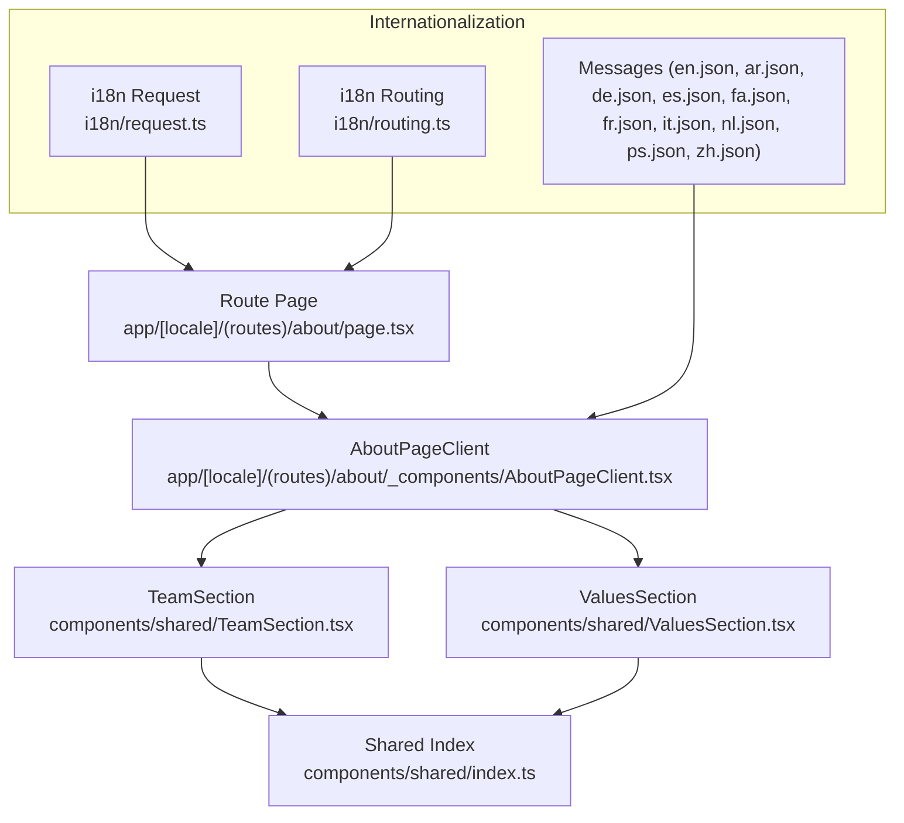
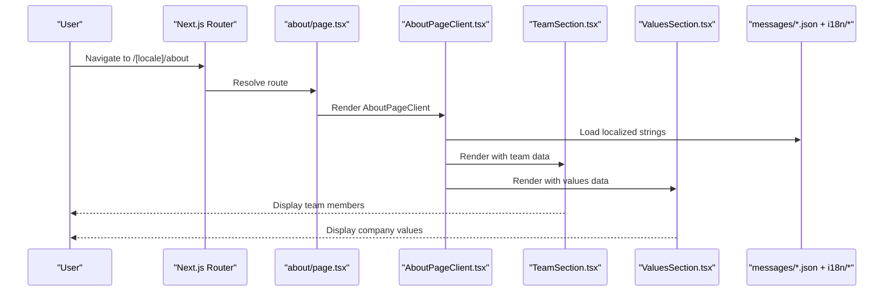
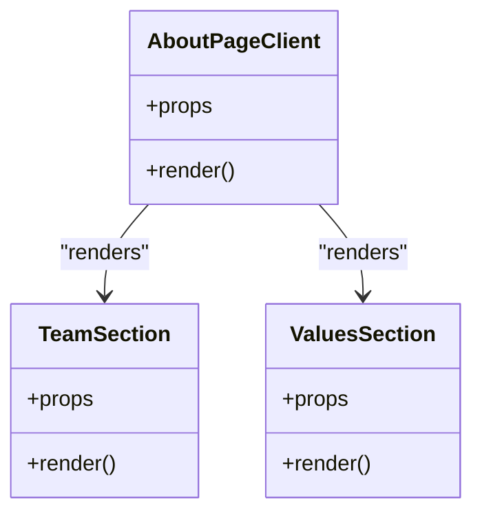
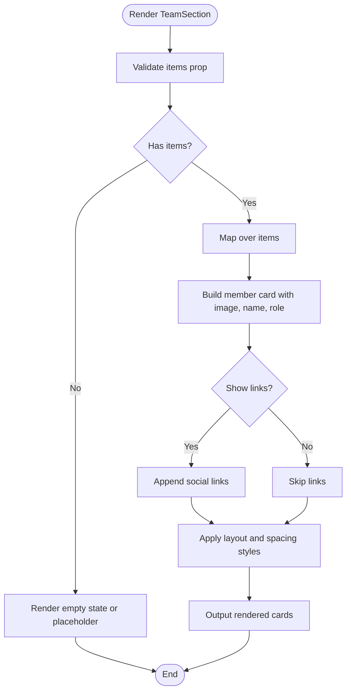
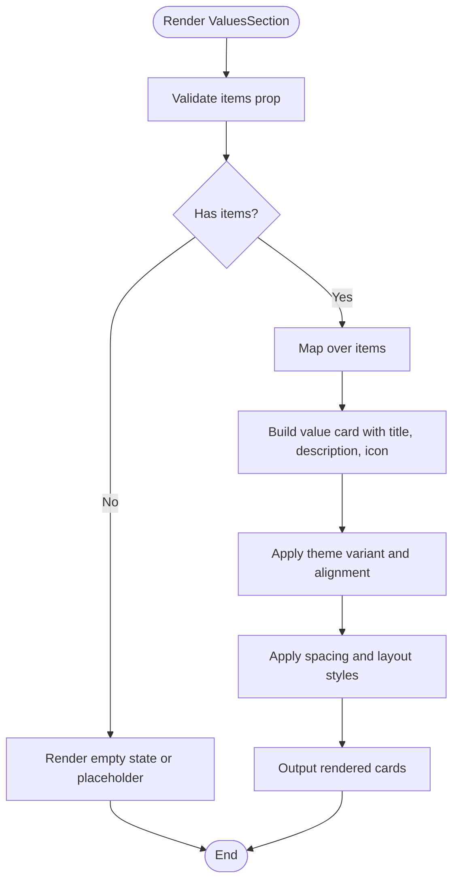
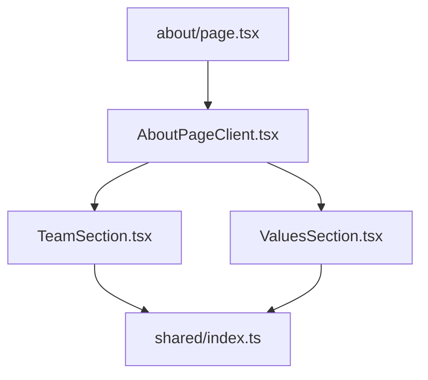
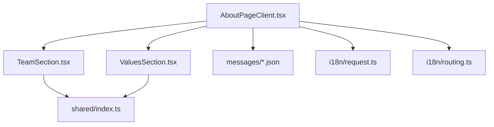

# About Information

<cite>
**Referenced Files in This Document**
- [AboutPageClient.tsx](file://app/[locale]/(routes)/about/_components/AboutPageClient.tsx)
- [page.tsx](file://app/[locale]/(routes)/about/page.tsx)
- [TeamSection.tsx](file://components/shared/TeamSection.tsx)
- [ValuesSection.tsx](file://components/shared/ValuesSection.tsx)
- [index.ts](file://components/shared/index.ts)
- [en.json](file://messages/en.json)
- [ar.json](file://messages/ar.json)
- [de.json](file://messages/de.json)
- [es.json](file://messages/es.json)
- [fa.json](file://messages/fa.json)
- [fr.json](file://messages/fr.json)
- [it.json](file://messages/it.json)
- [nl.json](file://messages/nl.json)
- [ps.json](file://messages/ps.json)
- [zh.json](file://messages/zh.json)
- [request.ts](file://i18n/request.ts)
- [routing.ts](file://i18n/routing.ts)
</cite>

## Table of Contents
1. [Introduction](#introduction)
2. [Project Structure](#project-structure)
3. [Core Components](#core-components)
4. [Architecture Overview](#architecture-overview)
5. [Detailed Component Analysis](#detailed-component-analysis)
6. [Dependency Analysis](#dependency-analysis)
7. [Performance Considerations](#performance-considerations)
8. [Troubleshooting Guide](#troubleshooting-guide)
9. [Conclusion](#conclusion)
10. [Appendices](#appendices)

## Introduction
This document explains the about information pages, focusing on:
- The AboutPageClient component structure and how it composes reusable sections
- Team member display functionality via the TeamSection component
- Company values presentation via the ValuesSection component
- Customization options and data structures for both components
- Examples for adding team members, updating company information, and styling different sections
- Content management patterns and multi-language support for about content

## Project Structure
The about page is implemented as a Next.js route under the locale-aware routes directory. It renders a client component that composes shared reusable sections for team and values.

**Diagram sources**
- [page.tsx](file://app/[locale]/(routes)/about/page.tsx)
- [AboutPageClient.tsx](file://app/[locale]/(routes)/about/_components/AboutPageClient.tsx)
- [TeamSection.tsx](file://components/shared/TeamSection.tsx)
- [ValuesSection.tsx](file://components/shared/ValuesSection.tsx)
- [index.ts](file://components/shared/index.ts)
- [en.json](file://messages/en.json)
- [ar.json](file://messages/ar.json)
- [de.json](file://messages/de.json)
- [es.json](file://messages/es.json)
- [fa.json](file://messages/fa.json)
- [fr.json](file://messages/fr.json)
- [it.json](file://messages/it.json)
- [nl.json](file://messages/nl.json)
- [ps.json](file://messages/ps.json)
- [zh.json](file://messages/zh.json)
- [request.ts](file://i18n/request.ts)
- [routing.ts](file://i18n/routing.ts)

**Section sources**
- [page.tsx](file://app/[locale]/(routes)/about/page.tsx)
- [AboutPageClient.tsx](file://app/[locale]/(routes)/about/_components/AboutPageClient.tsx)
- [TeamSection.tsx](file://components/shared/TeamSection.tsx)
- [ValuesSection.tsx](file://components/shared/ValuesSection.tsx)
- [index.ts](file://components/shared/index.ts)
- [request.ts](file://i18n/request.ts)
- [routing.ts](file://i18n/routing.ts)

## Core Components
- AboutPageClient: Client-side page controller that composes the about page by rendering TeamSection and ValuesSection with localized content and configuration.
- TeamSection: Reusable section to display team members with profile images, names, roles, and optional social links. Supports customization via props for layout, spacing, and visual style.
- ValuesSection: Reusable section to present company values or pillars with titles, descriptions, and optional icons or media. Supports customization via props for layout, alignment, and theme variants.

Key responsibilities:
- Data binding: Accepts structured data arrays for teams and values.
- Localization: Integrates with i18n messages for labels and copy.
- Styling: Exposes props to adjust appearance without modifying internal markup.

**Section sources**
- [AboutPageClient.tsx](file://app/[locale]/(routes)/about/_components/AboutPageClient.tsx)
- [TeamSection.tsx](file://components/shared/TeamSection.tsx)
- [ValuesSection.tsx](file://components/shared/ValuesSection.tsx)

## Architecture Overview
The about page follows a composition pattern:
- Route page imports and renders AboutPageClient.
- AboutPageClient fetches or constructs localized content and passes it to TeamSection and ValuesSection.
- Shared index exports TeamSection and ValuesSection for reuse across the app.
- Internationalization is handled through message files and i18n routing/request utilities.

**Diagram sources**
- [page.tsx](file://app/[locale]/(routes)/about/page.tsx)
- [AboutPageClient.tsx](file://app/[locale]/(routes)/about/_components/AboutPageClient.tsx)
- [TeamSection.tsx](file://components/shared/TeamSection.tsx)
- [ValuesSection.tsx](file://components/shared/ValuesSection.tsx)
- [en.json](file://messages/en.json)
- [request.ts](file://i18n/request.ts)
- [routing.ts](file://i18n/routing.ts)

## Detailed Component Analysis

### AboutPageClient
Purpose:
- Orchestrates the about page by composing TeamSection and ValuesSection.
- Provides localized content and configuration to child sections.
- Manages any client-side state needed for interactivity (e.g., toggles, filters).

Typical responsibilities:
- Importing TeamSection and ValuesSection from shared index.
- Loading or constructing team and values data structures.
- Passing props such as title, description, items, and style variants.
- Handling responsive behavior and layout decisions.

Customization points:
- Props for section titles, subtitles, and descriptions.
- Props for item lists (team members, values).
- Props for layout variants (grid vs list), spacing, and alignment.
- Optional props for image aspect ratios, link targets, and accessibility attributes.

Data flow:
- Route page -> AboutPageClient -> TeamSection/ValuesSection.
- i18n messages feed into labels and copy used by AboutPageClient and its children.

**Section sources**
- [AboutPageClient.tsx](file://app/[locale]/(routes)/about/_components/AboutPageClient.tsx)
- [index.ts](file://components/shared/index.ts)

#### Class Diagram

**Diagram sources**
- [AboutPageClient.tsx](file://app/[locale]/(routes)/about/_components/AboutPageClient.tsx)
- [TeamSection.tsx](file://components/shared/TeamSection.tsx)
- [ValuesSection.tsx](file://components/shared/ValuesSection.tsx)

### TeamSection
Purpose:
- Displays a collection of team members with consistent layout and styling.
- Supports optional social links and role descriptions.

Data structure:
- Array of team member objects containing fields such as name, role, image URL, and optional social links.
- Each member object should be typed consistently to ensure predictable rendering.

Props and customization:
- items: array of team member data.
- layout: grid or list mode.
- imageSize: small, medium, large.
- showLinks: boolean to toggle social links visibility.
- spacing: compact, default, spacious.
- ariaLabel: accessible label for screen readers.

Rendering logic:
- Maps over items to render individual member cards.
- Applies conditional styles based on props.
- Ensures accessibility attributes are set appropriately.

**Section sources**
- [TeamSection.tsx](file://components/shared/TeamSection.tsx)

#### Flowchart: Team Rendering

**Diagram sources**
- [TeamSection.tsx](file://components/shared/TeamSection.tsx)

### ValuesSection
Purpose:
- Presents company values or pillars with titles, descriptions, and optional icons or media.
- Supports multiple layout modes and alignment options.

Data structure:
- Array of value objects containing fields such as title, description, icon/media URL, and optional metadata.

Props and customization:
- items: array of value data.
- layout: grid, carousel, or list.
- alignment: left, center, right.
- variant: light, dark, or brand-specific themes.
- spacing: compact, default, spacious.
- ariaLabel: accessible label for screen readers.

Rendering logic:
- Iterates over items to render value cards.
- Applies conditional styles based on props and theme.
- Ensures semantic HTML and accessibility attributes.

**Section sources**
- [ValuesSection.tsx](file://components/shared/ValuesSection.tsx)

#### Flowchart: Values Rendering

**Diagram sources**
- [ValuesSection.tsx](file://components/shared/ValuesSection.tsx)

### Conceptual Overview
The about page uses a clear separation of concerns:
- Route page handles navigation and minimal setup.
- AboutPageClient manages composition and localization.
- TeamSection and ValuesSection encapsulate presentation logic and styling.

[No sources needed since this diagram shows conceptual workflow, not actual code structure]

## Dependency Analysis
- AboutPageClient depends on TeamSection and ValuesSection exported from shared index.
- Both TeamSection and ValuesSection may depend on shared UI primitives and theme providers.
- Internationalization dependencies include message files and i18n request/routing utilities.

**Diagram sources**
- [AboutPageClient.tsx](file://app/[locale]/(routes)/about/_components/AboutPageClient.tsx)
- [TeamSection.tsx](file://components/shared/TeamSection.tsx)
- [ValuesSection.tsx](file://components/shared/ValuesSection.tsx)
- [index.ts](file://components/shared/index.ts)
- [en.json](file://messages/en.json)
- [request.ts](file://i18n/request.ts)
- [routing.ts](file://i18n/routing.ts)

**Section sources**
- [index.ts](file://components/shared/index.ts)
- [en.json](file://messages/en.json)
- [request.ts](file://i18n/request.ts)
- [routing.ts](file://i18n/routing.ts)

## Performance Considerations
- Prefer static or memoized data for team and values to avoid unnecessary re-renders.
- Use appropriate image sizes and lazy loading for team photos.
- Keep props minimal and stable to reduce diffing overhead.
- Avoid heavy computations inside render; precompute derived data where possible.
- Leverage layout variants that minimize reflows and repaints.

[No sources needed since this section provides general guidance]

## Troubleshooting Guide
Common issues and resolutions:
- Missing or malformed team/value items: Ensure all required fields exist and match expected types.
- Broken images: Verify image URLs and fallbacks; consider using placeholders.
- Accessibility warnings: Confirm aria-labels and semantic tags are present.
- Localization gaps: Check that keys exist in all message files; provide defaults if necessary.
- Layout anomalies: Adjust spacing and alignment props; test across breakpoints.

**Section sources**
- [TeamSection.tsx](file://components/shared/TeamSection.tsx)
- [ValuesSection.tsx](file://components/shared/ValuesSection.tsx)

## Conclusion
The about information pages are built around a clean composition model:
- AboutPageClient orchestrates content and localization.
- TeamSection and ValuesSection provide reusable, customizable presentations for team and values.
- Internationalization is integrated through message files and i18n utilities.
Adhering to the documented data structures and props ensures maintainability, accessibility, and scalability.

[No sources needed since this section summarizes without analyzing specific files]

## Appendices

### Adding Team Members
Steps:
- Prepare an array of team member objects with required fields (name, role, image URL, optional social links).
- Pass the array to TeamSection via the items prop.
- Customize layout, image size, and link visibility using props.
- Test responsiveness and accessibility.

**Section sources**
- [TeamSection.tsx](file://components/shared/TeamSection.tsx)

### Updating Company Information
Steps:
- Update the values array passed to ValuesSection with new titles, descriptions, and optional icons.
- Adjust layout and theme variant props to reflect branding changes.
- Verify internationalization keys for updated copy.

**Section sources**
- [ValuesSection.tsx](file://components/shared/ValuesSection.tsx)

### Styling Different Sections
Approach:
- Use provided props for spacing, alignment, and layout variants.
- Extend theme tokens if deeper customization is needed.
- Maintain consistency across TeamSection and ValuesSection by sharing style tokens.

**Section sources**
- [TeamSection.tsx](file://components/shared/TeamSection.tsx)
- [ValuesSection.tsx](file://components/shared/ValuesSection.tsx)

### Multi-Language Support for About Content
Patterns:
- Store localized strings in message files per language.
- Load messages via i18n request utility within the route or client component.
- Ensure all keys exist across languages; provide safe defaults.
- Align routing with locale prefixes for SEO and user experience.

**Section sources**
- [en.json](file://messages/en.json)
- [ar.json](file://messages/ar.json)
- [de.json](file://messages/de.json)
- [es.json](file://messages/es.json)
- [fa.json](file://messages/fa.json)
- [fr.json](file://messages/fr.json)
- [it.json](file://messages/it.json)
- [nl.json](file://messages/nl.json)
- [ps.json](file://messages/ps.json)
- [zh.json](file://messages/zh.json)
- [request.ts](file://i18n/request.ts)
- [routing.ts](file://i18n/routing.ts)