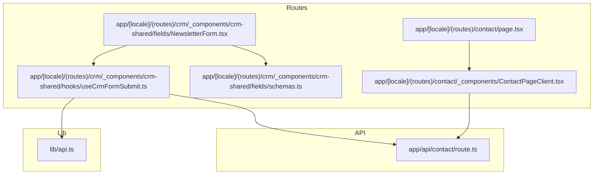
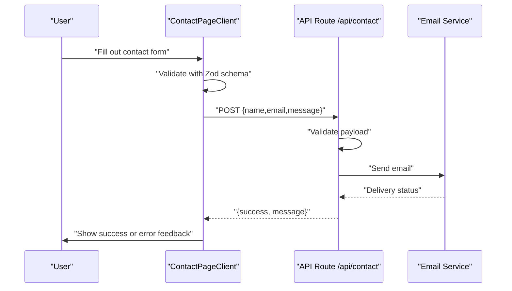
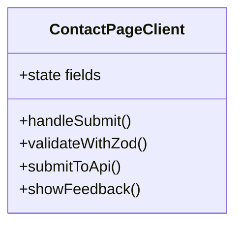
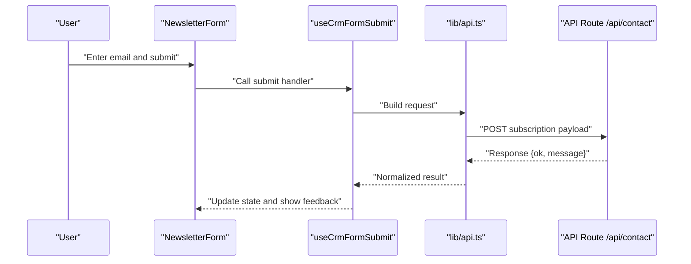
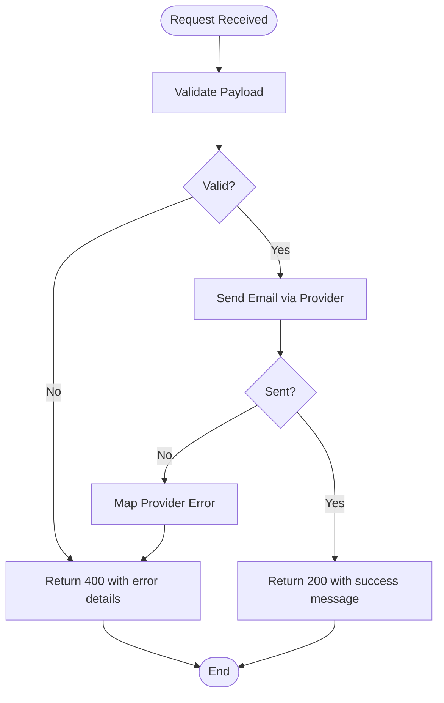
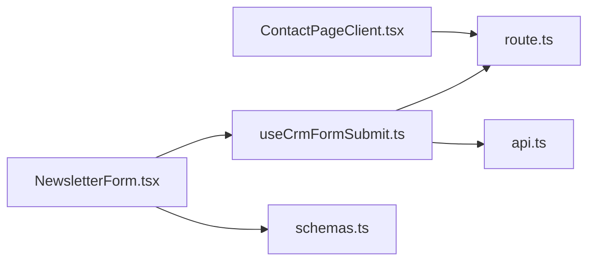

# Contact Forms

<cite>
**Referenced Files in This Document**
- [ContactPageClient.tsx](file://app/[locale]/(routes)/contact/_components/ContactPageClient.tsx)
- [page.tsx](file://app/[locale]/(routes)/contact/page.tsx)
- [route.ts](file://app/api/contact/route.ts)
- [NewsletterForm.tsx](file://app/[locale]/(routes)/crm/_components/crm-shared/fields/NewsletterForm.tsx)
- [schemas.ts](file://app/[locale]/(routes)/crm/_components/crm-shared/fields/schemas.ts)
- [useCrmFormSubmit.ts](file://app/[locale]/(routes)/crm/_components/crm-shared/hooks/useCrmFormSubmit.ts)
- [api.ts](file://lib/api.ts)
</cite>

## Table of Contents
1. [Introduction](#introduction)
2. [Project Structure](#project-structure)
3. [Core Components](#core-components)
4. [Architecture Overview](#architecture-overview)
5. [Detailed Component Analysis](#detailed-component-analysis)
6. [Dependency Analysis](#dependency-analysis)
7. [Performance Considerations](#performance-considerations)
8. [Troubleshooting Guide](#troubleshooting-guide)
9. [Conclusion](#conclusion)
10. [Appendices](#appendices)

## Introduction
This document explains how contact forms are implemented across the application, focusing on:
- The ContactPageClient component for user-facing contact form interactions
- Form validation using Zod schemas
- Email submission handling via the API route
- The NewsletterForm component for subscription management
- Error handling strategies and feedback mechanisms
- Security considerations, spam prevention, and accessibility compliance
- Practical examples for customization and integration with email services

## Project Structure
The contact-related features are organized under the routes and API layers:
- Contact page client component and page entry
- API route for contact submissions
- CRM shared fields including newsletter subscription form and validation schemas
- Shared hooks for form submission behavior
- Centralized API utilities

**Diagram sources**
- [page.tsx](file://app/[locale]/(routes)/contact/page.tsx)
- [ContactPageClient.tsx](file://app/[locale]/(routes)/contact/_components/ContactPageClient.tsx)
- [route.ts](file://app/api/contact/route.ts)
- [NewsletterForm.tsx](file://app/[locale]/(routes)/crm/_components/crm-shared/fields/NewsletterForm.tsx)
- [schemas.ts](file://app/[locale]/(routes)/crm/_components/crm-shared/fields/schemas.ts)
- [useCrmFormSubmit.ts](file://app/[locale]/(routes)/crm/_components/crm-shared/hooks/useCrmFormSubmit.ts)
- [api.ts](file://lib/api.ts)

**Section sources**
- [page.tsx](file://app/[locale]/(routes)/contact/page.tsx)
- [ContactPageClient.tsx](file://app/[locale]/(routes)/contact/_components/ContactPageClient.tsx)
- [route.ts](file://app/api/contact/route.ts)
- [NewsletterForm.tsx](file://app/[locale]/(routes)/crm/_components/crm-shared/fields/NewsletterForm.tsx)
- [schemas.ts](file://app/[locale]/(routes)/crm/_components/crm-shared/fields/schemas.ts)
- [useCrmFormSubmit.ts](file://app/[locale]/(routes)/crm/_components/crm-shared/hooks/useCrmFormSubmit.ts)
- [api.ts](file://lib/api.ts)

## Core Components
- ContactPageClient: Renders the contact form UI, manages local state, validates inputs, and submits to the API endpoint. It provides user feedback (success/error) and handles loading states.
- NewsletterForm: A reusable subscription form that uses shared validation schemas and a common submission hook to subscribe users to newsletters.
- useCrmFormSubmit: A shared hook encapsulating form submission logic, error handling, and response processing used by CRM-related forms including newsletter subscriptions.
- API Route (/api/contact): Accepts POST requests for contact submissions, validates payloads, sends emails via configured providers, and returns standardized responses.

Key responsibilities:
- Validation: Zod schemas define field-level constraints and error messages.
- Submission: Client components call the API route; the hook centralizes request/response handling.
- Feedback: User-visible success and error notifications are shown after submission.
- Reusability: Shared schemas and hooks reduce duplication across forms.

**Section sources**
- [ContactPageClient.tsx](file://app/[locale]/(routes)/contact/_components/ContactPageClient.tsx)
- [NewsletterForm.tsx](file://app/[locale]/(routes)/crm/_components/crm-shared/fields/NewsletterForm.tsx)
- [useCrmFormSubmit.ts](file://app/[locale]/(routes)/crm/_components/crm-shared/hooks/useCrmFormSubmit.ts)
- [route.ts](file://app/api/contact/route.ts)
- [schemas.ts](file://app/[locale]/(routes)/crm/_components/crm-shared/fields/schemas.ts)

## Architecture Overview
The contact flow connects the client-side form to the server-side API route and email service.

**Diagram sources**
- [ContactPageClient.tsx](file://app/[locale]/(routes)/contact/_components/ContactPageClient.tsx)
- [route.ts](file://app/api/contact/route.ts)

## Detailed Component Analysis

### ContactPageClient Component
Responsibilities:
- Manages form fields and submission lifecycle
- Validates input using Zod schemas
- Submits data to the API route
- Displays loading, success, and error states
- Ensures accessible labels and keyboard navigation

Implementation highlights:
- Uses a Zod schema to validate required fields and formats
- Calls the API route with sanitized inputs
- Updates UI state based on server response
- Provides clear error messages and success confirmations

Customization tips:
- Extend the schema to add new fields (e.g., phone number)
- Adjust feedback messages for localization
- Integrate analytics events on submit

Accessibility:
- Associate labels with inputs
- Announce errors and success to screen readers
- Ensure focus management during submission

Security:
- Validate all inputs on both client and server
- Sanitize content before sending to email provider
- Enforce rate limiting at the API layer

**Section sources**
- [ContactPageClient.tsx](file://app/[locale]/(routes)/contact/_components/ContactPageClient.tsx)
- [route.ts](file://app/api/contact/route.ts)

#### Class Diagram

**Diagram sources**
- [ContactPageClient.tsx](file://app/[locale]/(routes)/contact/_components/ContactPageClient.tsx)

### NewsletterForm Component
Purpose:
- Collects email addresses for newsletter subscriptions
- Leverages shared validation schemas and submission hook
- Integrates with CRM flows and reuses common UX patterns

Behavior:
- Validates email format and uniqueness if applicable
- Subscribes via the shared hook which calls the appropriate API
- Shows inline errors and global notifications
- Supports disabled state while submitting

Integration points:
- Uses schemas.ts for validation rules
- Uses useCrmFormSubmit.ts for consistent submission handling
- Can be embedded in multiple pages for broad reach

**Section sources**
- [NewsletterForm.tsx](file://app/[locale]/(routes)/crm/_components/crm-shared/fields/NewsletterForm.tsx)
- [schemas.ts](file://app/[locale]/(routes)/crm/_components/crm-shared/fields/schemas.ts)
- [useCrmFormSubmit.ts](file://app/[locale]/(routes)/crm/_components/crm-shared/hooks/useCrmFormSubmit.ts)

#### Sequence Diagram

**Diagram sources**
- [NewsletterForm.tsx](file://app/[locale]/(routes)/crm/_components/crm-shared/fields/NewsletterForm.tsx)
- [useCrmFormSubmit.ts](file://app/[locale]/(routes)/crm/_components/crm-shared/hooks/useCrmFormSubmit.ts)
- [api.ts](file://lib/api.ts)
- [route.ts](file://app/api/contact/route.ts)

### API Route: /api/contact
Responsibilities:
- Receives contact form submissions
- Validates incoming data against expected structure
- Sends emails through configured providers
- Returns consistent JSON responses

Processing logic:
- Input validation and sanitization
- Provider selection and configuration
- Error mapping and logging
- Rate limiting and abuse protection

Error handling:
- Maps provider errors to user-friendly messages
- Returns structured error responses for client display

**Section sources**
- [route.ts](file://app/api/contact/route.ts)

#### Flowchart

**Diagram sources**
- [route.ts](file://app/api/contact/route.ts)

### Shared Validation Schemas (Zod)
Location: schemas.ts
- Defines field types, required constraints, and custom validators
- Used by both contact and newsletter forms
- Centralizes error messages for consistency

Benefits:
- Single source of truth for validation rules
- Easy updates across forms
- Strong typing support

**Section sources**
- [schemas.ts](file://app/[locale]/(routes)/crm/_components/crm-shared/fields/schemas.ts)

### Shared Submission Hook (useCrmFormSubmit)
Location: useCrmFormSubmit.ts
- Encapsulates request building, error handling, and state updates
- Normalizes API responses for consistent UI behavior
- Reusable across CRM forms and newsletter subscriptions

Usage:
- Import into forms to handle submission
- Provide callbacks for success and error states
- Customize retry or fallback logic if needed

**Section sources**
- [useCrmFormSubmit.ts](file://app/[locale]/(routes)/crm/_components/crm-shared/hooks/useCrmFormSubmit.ts)
- [api.ts](file://lib/api.ts)

## Dependency Analysis
Relationships between components and utilities:

**Diagram sources**
- [ContactPageClient.tsx](file://app/[locale]/(routes)/contact/_components/ContactPageClient.tsx)
- [route.ts](file://app/api/contact/route.ts)
- [NewsletterForm.tsx](file://app/[locale]/(routes)/crm/_components/crm-shared/fields/NewsletterForm.tsx)
- [schemas.ts](file://app/[locale]/(routes)/crm/_components/crm-shared/fields/schemas.ts)
- [useCrmFormSubmit.ts](file://app/[locale]/(routes)/crm/_components/crm-shared/hooks/useCrmFormSubmit.ts)
- [api.ts](file://lib/api.ts)

**Section sources**
- [ContactPageClient.tsx](file://app/[locale]/(routes)/contact/_components/ContactPageClient.tsx)
- [route.ts](file://app/api/contact/route.ts)
- [NewsletterForm.tsx](file://app/[locale]/(routes)/crm/_components/crm-shared/fields/NewsletterForm.tsx)
- [schemas.ts](file://app/[locale]/(routes)/crm/_components/crm-shared/fields/schemas.ts)
- [useCrmFormSubmit.ts](file://app/[locale]/(routes)/crm/_components/crm-shared/hooks/useCrmFormSubmit.ts)
- [api.ts](file://lib/api.ts)

## Performance Considerations
- Minimize network requests by batching or debouncing where appropriate
- Use optimistic UI updates cautiously; ensure rollback on failure
- Keep payloads small and avoid unnecessary fields
- Cache static assets and leverage browser caching for non-sensitive resources
- Monitor API latency and implement timeouts/retries for resilience

[No sources needed since this section provides general guidance]

## Troubleshooting Guide
Common issues and resolutions:
- Validation failures: Check Zod schema definitions and ensure client/server schemas match
- Network errors: Inspect API route logs and verify environment variables for email providers
- Duplicate submissions: Implement client-side disable-on-submit and server-side idempotency keys
- Accessibility problems: Verify label associations, aria attributes, and focus management
- Spam submissions: Enable rate limiting, honeypot fields, and CAPTCHA integration at the API layer

Operational checks:
- Confirm API route responds with correct status codes and messages
- Validate email provider credentials and delivery settings
- Review error mapping to ensure user-friendly messages

**Section sources**
- [route.ts](file://app/api/contact/route.ts)
- [useCrmFormSubmit.ts](file://app/[locale]/(routes)/crm/_components/crm-shared/hooks/useCrmFormSubmit.ts)
- [schemas.ts](file://app/[locale]/(routes)/crm/_components/crm-shared/fields/schemas.ts)

## Conclusion
The contact form system combines robust client-side validation with secure server-side processing and clear user feedback. Shared schemas and hooks promote consistency and maintainability across forms like newsletter subscriptions. By following the security, spam prevention, and accessibility recommendations, teams can deliver reliable, user-friendly contact experiences.

[No sources needed since this section summarizes without analyzing specific files]

## Appendices

### Customizing Contact Forms
- Add fields by extending the Zod schema and updating the client component
- Localize messages by referencing i18n resources
- Integrate analytics by emitting events on submit and success

### Integrating with Email Services
- Configure provider credentials securely via environment variables
- Handle provider-specific error codes and map them to user messages
- Implement retries and fallbacks for critical communications

### Form Feedback Mechanisms
- Show inline validation errors near fields
- Display global success banners upon successful submission
- Provide actionable error messages with next steps

### Security Considerations
- Validate and sanitize all inputs on the server
- Enforce rate limiting and throttling
- Avoid exposing sensitive information in logs or responses

### Spam Prevention
- Add hidden honeypot fields to deter bots
- Integrate CAPTCHA or similar challenges
- Monitor and block suspicious IP patterns

### Accessibility Compliance
- Use semantic HTML and proper labeling
- Ensure keyboard navigability and visible focus indicators
- Announce dynamic changes to assistive technologies

[No sources needed since this section provides general guidance]