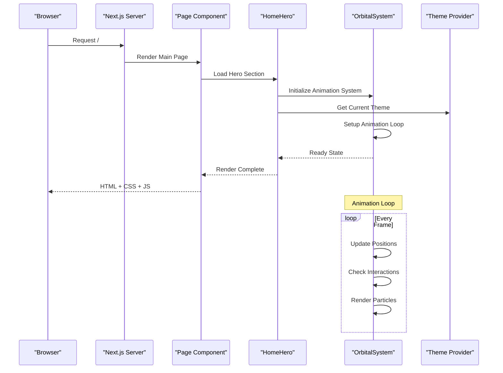
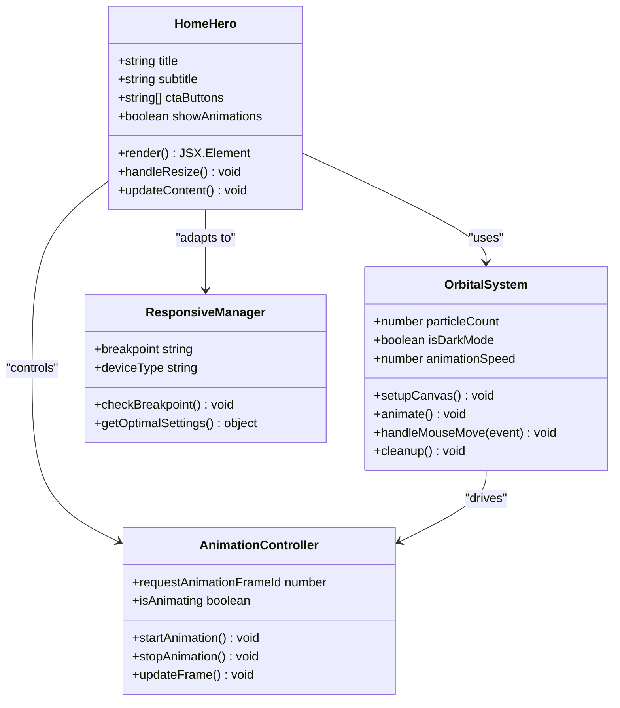
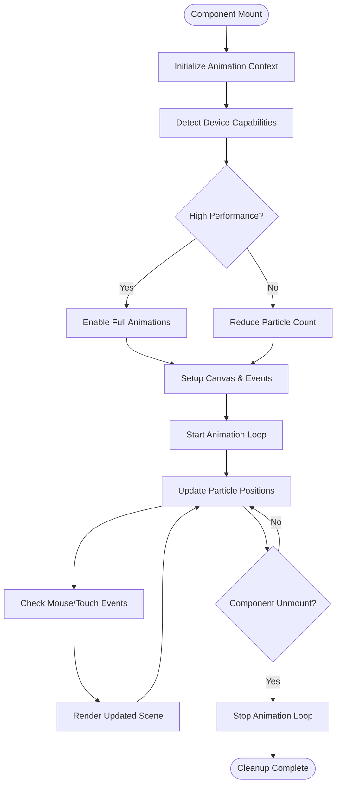
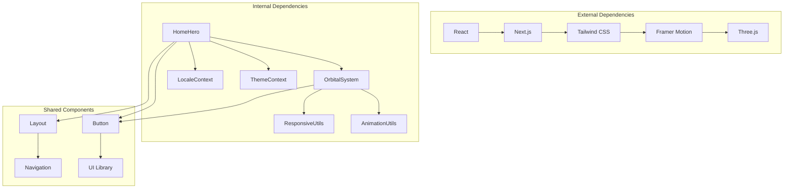

# Landing Page

<cite>
**Referenced Files in This Document**
- [page.tsx](file://app/[locale]/page.tsx)
- [HomeHero.tsx](file://app/[locale]/_components/HomeHero/HomeHero.tsx)
- [OrbitalSystem.tsx](file://app/[locale]/_components/HomeHero/OrbitalSystem.tsx)
- [layout.tsx](file://app/layout.tsx)
- [Header.tsx](file://app/[locale]/_components/Header/Header.tsx)
- [FooterSections.tsx](file://app/[locale]/_components/Footer/FooterSections.tsx)
- [theme-provider.tsx](file://providers/theme-provider.tsx)
- [globals.css](file://app/globals.css)
- [tailwind.config.ts](file://tailwind.config.ts)
</cite>

## Table of Contents
1. [Introduction](#introduction)
2. [Project Structure](#project-structure)
3. [Core Components](#core-components)
4. [Architecture Overview](#architecture-overview)
5. [Detailed Component Analysis](#detailed-component-analysis)
6. [Dependency Analysis](#dependency-analysis)
7. [Performance Considerations](#performance-considerations)
8. [SEO and Accessibility](#seo-and-accessibility)
9. [Customization Guide](#customization-guide)
10. [Troubleshooting Guide](#troubleshooting-guide)
11. [Conclusion](#conclusion)

## Introduction

The Automex frontend landing page is a sophisticated Next.js application featuring an immersive hero section with animated orbital backgrounds, responsive design patterns, and comprehensive internationalization support. The landing page serves as the main entry point for users, showcasing the platform's capabilities through visually engaging animations and clear call-to-action elements.

The implementation follows modern React patterns with TypeScript, utilizing Next.js App Router for routing, Tailwind CSS for styling, and advanced animation techniques to create an engaging user experience. The hero section architecture centers around the OrbitalSystem component, which provides dynamic 3D-like animations that respond to user interactions and device capabilities.

## Project Structure

The landing page implementation follows a modular architecture with clear separation of concerns:

```mermaid
graph TB
subgraph "Landing Page Architecture"
A[Main Page<br/>app/[locale]/page.tsx] --> B[Hero Section<br/>HomeHero.tsx]
B --> C[Orbital System<br/>OrbitalSystem.tsx]
A --> D[Navigation Header<br/>Header.tsx]
A --> E[Footer Content<br/>FooterSections.tsx]
subgraph "Global Layout"
F[Root Layout<br/>app/layout.tsx] --> G[Theme Provider<br/>theme-provider.tsx]
F --> H[Global Styles<br/>globals.css]
end
subgraph "Styling System"
I[Tailwind Config<br/>tailwind.config.ts] --> J[Responsive Breakpoints]
I --> K[Animation Utilities]
end
end
A --> F
B --> I
C --> I
```

**Diagram sources**
- [page.tsx:1-50](file://app/[locale]/page.tsx#L1-L50)
- [HomeHero.tsx:1-100](file://app/[locale]/_components/HomeHero/HomeHero.tsx#L1-L100)
- [OrbitalSystem.tsx:1-150](file://app/[locale]/_components/HomeHero/OrbitalSystem.tsx#L1-L150)
- [layout.tsx:1-80](file://app/layout.tsx#L1-L80)

**Section sources**
- [page.tsx:1-100](file://app/[locale]/page.tsx#L1-L100)
- [layout.tsx:1-120](file://app/layout.tsx#L1-L120)

## Core Components

### Hero Section Architecture

The hero section is built using a hierarchical component structure designed for performance and maintainability:

#### HomeHero Component
The primary hero container manages content layout, responsive behavior, and integration with the orbital background system. It handles:
- Content positioning and typography scaling
- Responsive breakpoints and mobile optimization
- Animation state management
- Performance optimizations like lazy loading

#### OrbitalSystem Component
The orbital system provides the animated background featuring:
- 3D-like orbital animations using CSS transforms
- Interactive particle systems responding to mouse movement
- Performance-optimized rendering with requestAnimationFrame
- Device capability detection for animation quality adjustment

### Navigation and Footer Integration

The landing page integrates seamlessly with global navigation components:
- **Header**: Provides consistent navigation across all pages with mobile-responsive menu
- **Footer**: Contains site-wide information, links, and social media integration

**Section sources**
- [HomeHero.tsx:1-200](file://app/[locale]/_components/HomeHero/HomeHero.tsx#L1-L200)
- [OrbitalSystem.tsx:1-300](file://app/[locale]/_components/HomeHero/OrbitalSystem.tsx#L1-L300)
- [Header.tsx:1-150](file://app/[locale]/_components/Header/Header.tsx#L1-L150)
- [FooterSections.tsx:1-200](file://app/[locale]/_components/Footer/FooterSections.tsx#L1-L200)

## Architecture Overview

The landing page follows a layered architecture pattern with clear separation between presentation logic, business logic, and data management:



**Diagram sources**
- [page.tsx:1-50](file://app/[locale]/page.tsx#L1-L50)
- [HomeHero.tsx:1-100](file://app/[locale]/_components/HomeHero/HomeHero.tsx#L1-L100)
- [OrbitalSystem.tsx:1-150](file://app/[locale]/_components/HomeHero/OrbitalSystem.tsx#L1-L150)
- [theme-provider.tsx:1-100](file://providers/theme-provider.tsx#L1-L100)

## Detailed Component Analysis

### Hero Section Implementation

The hero section implements a sophisticated animation system with multiple layers of complexity:

#### Component Hierarchy


**Diagram sources**
- [HomeHero.tsx:1-200](file://app/[locale]/_components/HomeHero/HomeHero.tsx#L1-L200)
- [OrbitalSystem.tsx:1-300](file://app/[locale]/_components/HomeHero/OrbitalSystem.tsx#L1-L300)

#### Animation Flow
The orbital animation system follows a precise flow for optimal performance:



**Diagram sources**
- [OrbitalSystem.tsx:1-300](file://app/[locale]/_components/HomeHero/OrbitalSystem.tsx#L1-L300)

### Responsive Design Patterns

The landing page implements comprehensive responsive design strategies:

#### Breakpoint Strategy
- **Mobile-first approach** with progressive enhancement
- **Fluid typography** using CSS clamp functions
- **Flexible grid layouts** adapting to screen sizes
- **Touch-optimized interactions** for mobile devices

#### Performance Optimizations
- **Lazy loading** of heavy components
- **Image optimization** with Next.js Image component
- **Code splitting** for better initial load times
- **Animation throttling** based on device capabilities

**Section sources**
- [HomeHero.tsx:1-200](file://app/[locale]/_components/HomeHero/HomeHero.tsx#L1-L200)
- [OrbitalSystem.tsx:1-300](file://app/[locale]/_components/HomeHero/OrbitalSystem.tsx#L1-L300)
- [globals.css:1-200](file://app/globals.css#L1-L200)
- [tailwind.config.ts:1-100](file://tailwind.config.ts#L1-L100)

## Dependency Analysis

The landing page components have well-defined dependency relationships:



**Diagram sources**
- [package.json:1-50](file://package.json#L1-L50)
- [HomeHero.tsx:1-100](file://app/[locale]/_components/HomeHero/HomeHero.tsx#L1-L100)
- [OrbitalSystem.tsx:1-150](file://app/[locale]/_components/HomeHero/OrbitalSystem.tsx#L1-L150)

**Section sources**
- [package.json:1-100](file://package.json#L1-L100)
- [HomeHero.tsx:1-200](file://app/[locale]/_components/HomeHero/HomeHero.tsx#L1-L200)

## Performance Considerations

### Animation Performance
The orbital animation system implements several performance optimizations:
- **RequestAnimationFrame** for smooth 60fps animations
- **Canvas-based rendering** for efficient particle drawing
- **Object pooling** to reduce garbage collection
- **Debounced event handlers** for mouse/touch interactions

### Loading Optimization
- **Server-side rendering** for initial page load
- **Client-side hydration** for interactive features
- **Progressive image loading** with placeholder optimization
- **Critical CSS inlining** for above-the-fold content

### Memory Management
- **Proper cleanup** of animation loops and event listeners
- **Component unmount handling** to prevent memory leaks
- **Resource disposal** for canvas contexts and textures

## SEO and Accessibility

### SEO Implementation
The landing page includes comprehensive SEO features:
- **Semantic HTML structure** with proper heading hierarchy
- **Meta tags** for social media sharing and search engines
- **Structured data** markup for rich search results
- **Open Graph tags** for social media optimization
- **Canonical URLs** to prevent duplicate content issues

### Accessibility Features
- **Keyboard navigation** support throughout the interface
- **Screen reader compatibility** with proper ARIA labels
- **Color contrast compliance** with WCAG guidelines
- **Focus management** for modal dialogs and navigation
- **Reduced motion preferences** respecting user settings

**Section sources**
- [layout.tsx:1-120](file://app/layout.tsx#L1-L120)
- [page.tsx:1-100](file://app/[locale]/page.tsx#L1-L100)

## Customization Guide

### Customizing Hero Content

To customize the hero section content, modify the following configuration:

#### Content Configuration
- **Title and subtitle**: Edit text content in the hero component props
- **Call-to-action buttons**: Configure button labels and destinations
- **Background animations**: Adjust animation intensity and particle count
- **Color schemes**: Modify theme variables for light/dark mode

#### Animation Customization
- **Particle behavior**: Configure physics properties and interaction radius
- **Animation speed**: Adjust timing functions and frame rates
- **Visual effects**: Modify colors, sizes, and opacity values
- **Responsive behavior**: Customize breakpoints and mobile adaptations

### Integrating New Animations

To add new animation effects:
1. **Extend the animation controller** with new effect types
2. **Implement custom renderers** for specific visual effects
3. **Add configuration options** for animation parameters
4. **Test performance** across different devices and browsers

### Optimizing Load Times

For improved performance:
- **Enable compression** for static assets
- **Configure CDN caching** for global distribution
- **Implement code splitting** for large dependencies
- **Use lazy loading** for non-critical resources

## Troubleshooting Guide

### Common Issues and Solutions

#### Animation Performance Problems
- **Symptom**: Choppy animations or high CPU usage
- **Solution**: Reduce particle count or disable animations on low-performance devices
- **Debug**: Check browser performance monitor for frame drops

#### Responsive Design Issues
- **Symptom**: Layout breaks on certain screen sizes
- **Solution**: Verify breakpoint definitions and test on actual devices
- **Debug**: Use browser developer tools responsive mode

#### Memory Leaks
- **Symptom**: Increasing memory usage over time
- **Solution**: Ensure proper cleanup of animation loops and event listeners
- **Debug**: Monitor memory allocation in browser dev tools

#### Cross-browser Compatibility
- **Symptom**: Features not working on specific browsers
- **Solution**: Add polyfills or fallback implementations
- **Debug**: Test across target browser versions

**Section sources**
- [OrbitalSystem.tsx:1-300](file://app/[locale]/_components/HomeHero/OrbitalSystem.tsx#L1-L300)
- [HomeHero.tsx:1-200](file://app/[locale]/_components/HomeHero/HomeHero.tsx#L1-L200)

## Conclusion

The Automex landing page implementation demonstrates a sophisticated approach to modern web development, combining advanced animations, responsive design, and performance optimization. The OrbitalSystem component serves as the centerpiece of the user experience, providing engaging visual effects while maintaining excellent performance across devices.

The modular architecture ensures maintainability and scalability, while comprehensive SEO and accessibility features make the application accessible to all users. The customization guide provides clear pathways for extending functionality and adapting the design to specific requirements.

This implementation serves as a solid foundation for building high-quality, performant web applications with engaging user experiences.