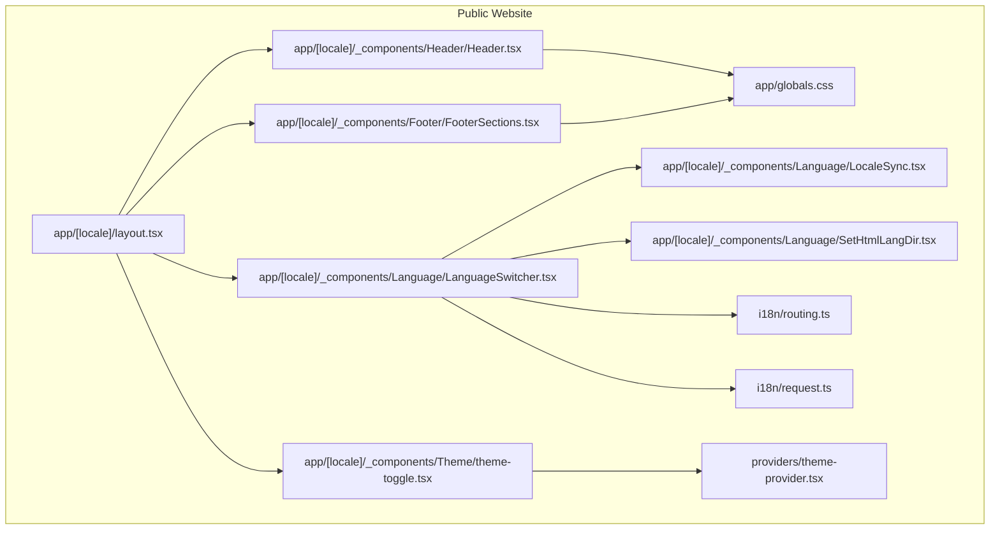
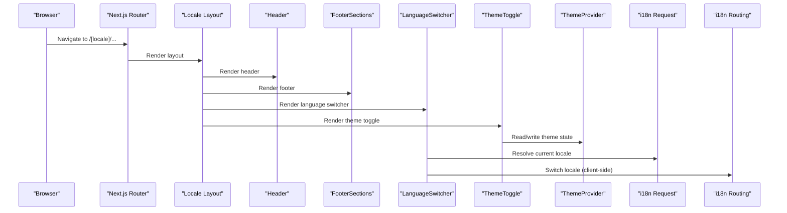
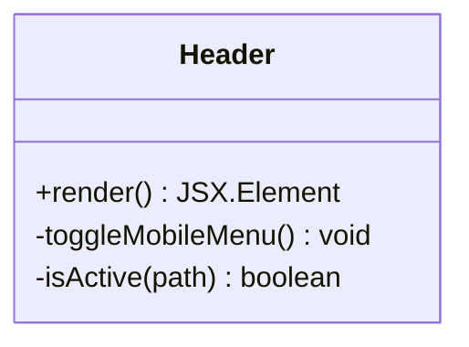
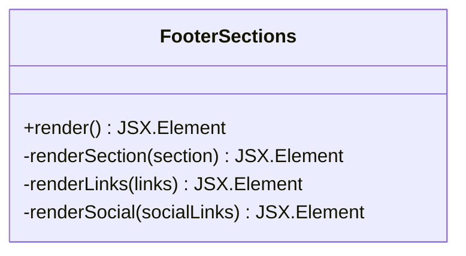
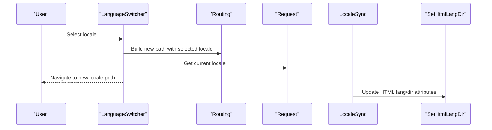
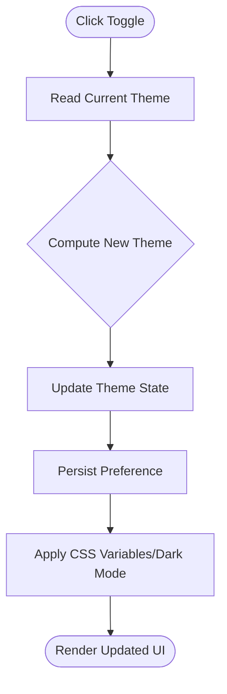
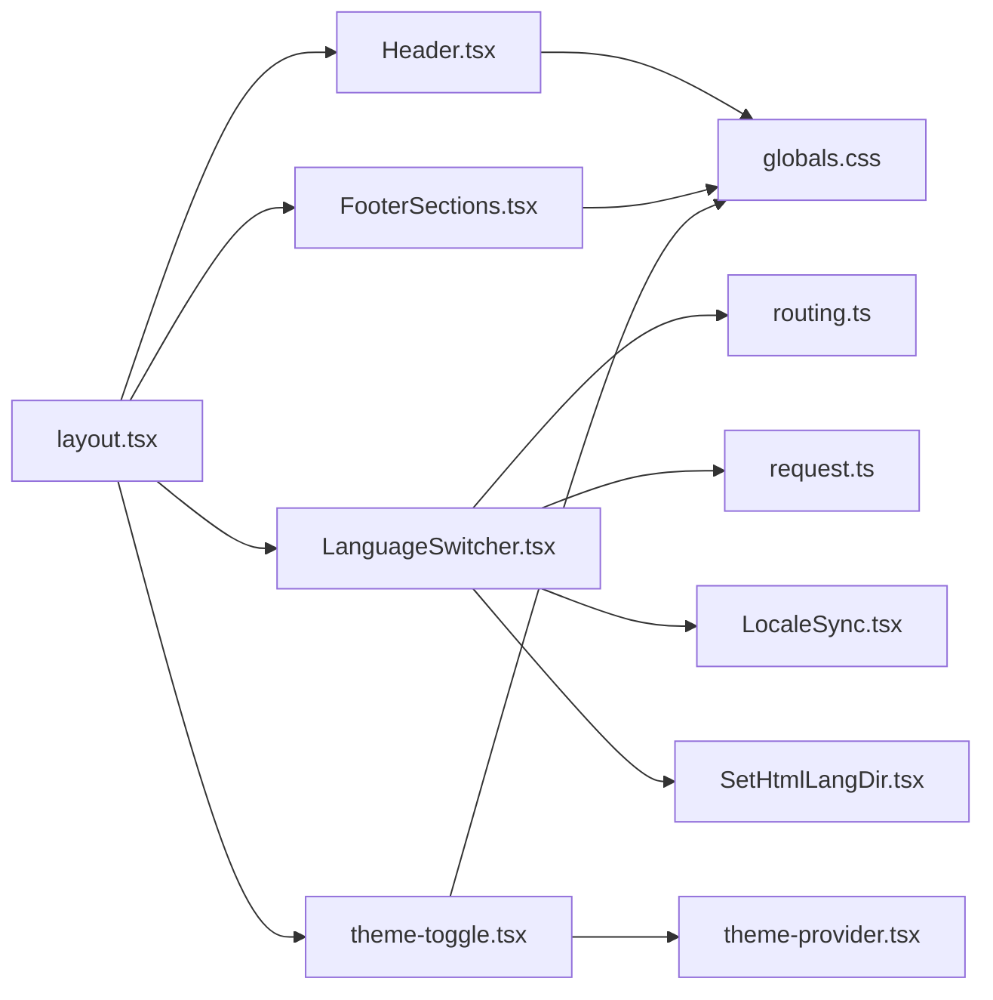

# Layout Components

<cite>
**Referenced Files in This Document**
- [Header.tsx](file://app/[locale]/_components/Header/Header.tsx)
- [FooterSections.tsx](file://app/[locale]/_components/Footer/FooterSections.tsx)
- [LanguageSwitcher.tsx](file://app/[locale]/_components/Language/LanguageSwitcher.tsx)
- [LocaleSync.tsx](file://app/[locale]/_components/Language/LocaleSync.tsx)
- [SetHtmlLangDir.tsx](file://app/[locale]/_components/Language/SetHtmlLangDir.tsx)
- [theme-toggle.tsx](file://app/[locale]/_components/Theme/theme-toggle.tsx)
- [layout.tsx](file://app/[locale]/layout.tsx)
- [routing.ts](file://i18n/routing.ts)
- [request.ts](file://i18n/request.ts)
- [theme-provider.tsx](file://providers/theme-provider.tsx)
- [globals.css](file://app/globals.css)
</cite>

## Table of Contents
1. [Introduction](#introduction)
2. [Project Structure](#project-structure)
3. [Core Components](#core-components)
4. [Architecture Overview](#architecture-overview)
5. [Detailed Component Analysis](#detailed-component-analysis)
6. [Dependency Analysis](#dependency-analysis)
7. [Performance Considerations](#performance-considerations)
8. [Troubleshooting Guide](#troubleshooting-guide)
9. [Conclusion](#conclusion)
10. [Appendices](#appendices)

## Introduction
This document explains the shared layout components used across the public website: Header, FooterSections, LanguageSwitcher, and theme toggle. It covers architecture, navigation integration, logo usage, mobile responsiveness, internationalization, social links management, customization examples, performance optimization, and SEO considerations for layout elements.

## Project Structure
The layout-related components are organized under the locale-aware app directory and integrate with Next.js routing and i18n configuration. The key files include:
- Header component for top navigation and logo
- FooterSections component for footer content and social links
- LanguageSwitcher and related utilities for i18n
- Theme toggle integrated via a provider

**Diagram sources**
- [layout.tsx](file://app/[locale]/layout.tsx)
- [Header.tsx](file://app/[locale]/_components/Header/Header.tsx)
- [FooterSections.tsx](file://app/[locale]/_components/Footer/FooterSections.tsx)
- [LanguageSwitcher.tsx](file://app/[locale]/_components/Language/LanguageSwitcher.tsx)
- [LocaleSync.tsx](file://app/[locale]/_components/Language/LocaleSync.tsx)
- [SetHtmlLangDir.tsx](file://app/[locale]/_components/Language/SetHtmlLangDir.tsx)
- [theme-toggle.tsx](file://app/[locale]/_components/Theme/theme-toggle.tsx)
- [theme-provider.tsx](file://providers/theme-provider.tsx)
- [routing.ts](file://i18n/routing.ts)
- [request.ts](file://i18n/request.ts)
- [globals.css](file://app/globals.css)

**Section sources**
- [layout.tsx](file://app/[locale]/layout.tsx)
- [Header.tsx](file://app/[locale]/_components/Header/Header.tsx)
- [FooterSections.tsx](file://app/[locale]/_components/Footer/FooterSections.tsx)
- [LanguageSwitcher.tsx](file://app/[locale]/_components/Language/LanguageSwitcher.tsx)
- [LocaleSync.tsx](file://app/[locale]/_components/Language/LocaleSync.tsx)
- [SetHtmlLangDir.tsx](file://app/[locale]/_components/Language/SetHtmlLangDir.tsx)
- [theme-toggle.tsx](file://app/[locale]/_components/Theme/theme-toggle.tsx)
- [theme-provider.tsx](file://providers/theme-provider.tsx)
- [routing.ts](file://i18n/routing.ts)
- [request.ts](file://i18n/request.ts)
- [globals.css](file://app/globals.css)

## Core Components
- Header: Provides top-level navigation, logo integration, and mobile menu behavior. It is included in the locale layout to ensure consistent presentation across pages.
- FooterSections: Renders grouped footer sections, manages link lists, and integrates social media links.
- LanguageSwitcher: Allows users to switch site language and coordinates with Next.js i18n routing and request handling.
- Theme Toggle: Integrates with the theme provider to switch between light/dark themes.

These components are composed within the locale layout to form the global shell of the public website.

**Section sources**
- [Header.tsx](file://app/[locale]/_components/Header/Header.tsx)
- [FooterSections.tsx](file://app/[locale]/_components/Footer/FooterSections.tsx)
- [LanguageSwitcher.tsx](file://app/[locale]/_components/Language/LanguageSwitcher.tsx)
- [theme-toggle.tsx](file://app/[locale]/_components/Theme/theme-toggle.tsx)
- [layout.tsx](file://app/[locale]/layout.tsx)

## Architecture Overview
The layout architecture composes the Header and Footer around page content, while LanguageSwitcher and theme toggle provide cross-cutting features. Internationalization is handled by Next.js i18n routing and request utilities.

**Diagram sources**
- [layout.tsx](file://app/[locale]/layout.tsx)
- [Header.tsx](file://app/[locale]/_components/Header/Header.tsx)
- [FooterSections.tsx](file://app/[locale]/_components/Footer/FooterSections.tsx)
- [LanguageSwitcher.tsx](file://app/[locale]/_components/Language/LanguageSwitcher.tsx)
- [theme-toggle.tsx](file://app/[locale]/_components/Theme/theme-toggle.tsx)
- [theme-provider.tsx](file://providers/theme-provider.tsx)
- [request.ts](file://i18n/request.ts)
- [routing.ts](file://i18n/routing.ts)

## Detailed Component Analysis

### Header Component
Responsibilities:
- Displays the site logo and primary navigation items
- Handles mobile menu toggling and responsive breakpoints
- Integrates with client-side navigation and active route highlighting
- Optionally includes utility actions such as search or user controls

Key behaviors:
- Logo renders as a navigational element pointing to the home route
- Navigation items are rendered from a configuration source and support nested or external links
- Mobile menu uses a toggle state to show/hide on small screens
- Active link detection ensures visual feedback for the current route

Customization examples:
- Add a new navigation item by extending the navigation configuration array
- Replace the logo by swapping the image source and alt text
- Adjust mobile breakpoint behavior by modifying responsive classes

SEO considerations:
- Ensure logo has descriptive alt text
- Use semantic nav landmarks and proper heading hierarchy
- Avoid heavy images in the header; prefer optimized SVGs or next/image

Performance tips:
- Keep header markup minimal and avoid expensive computations during render
- Defer non-critical interactions until after initial paint if needed

**Section sources**
- [Header.tsx](file://app/[locale]/_components/Header/Header.tsx)

#### Header Class Diagram

**Diagram sources**
- [Header.tsx](file://app/[locale]/_components/Header/Header.tsx)

### FooterSections Component
Responsibilities:
- Renders multiple footer sections (e.g., company info, quick links, legal)
- Manages link lists and social media icons
- Supports localized labels and URLs where applicable

Key behaviors:
- Sections are defined as an array of section objects containing title and links
- Social links are rendered using icon components and point to external profiles
- Links use Next.js navigation for internal routes and standard anchors for external URLs

Customization examples:
- Add a new footer section by appending a section object with title and links
- Update social media links by editing the social links array
- Reorder sections by changing the order in the configuration

SEO considerations:
- Use semantic footer structure and list semantics for links
- Provide meaningful link text for accessibility and crawlers

Performance tips:
- Avoid rendering large images in the footer; use lightweight SVG icons
- Lazy-load any heavy assets below the fold if necessary

**Section sources**
- [FooterSections.tsx](file://app/[locale]/_components/Footer/FooterSections.tsx)

#### FooterSections Class Diagram

**Diagram sources**
- [FooterSections.tsx](file://app/[locale]/_components/Footer/FooterSections.tsx)

### LanguageSwitcher and i18n Integration
Responsibilities:
- Presents available locales and allows switching languages
- Coordinates with Next.js i18n routing and request utilities
- Synchronizes HTML lang and direction attributes

Key behaviors:
- Uses routing utilities to construct locale-aware paths
- Reads current locale from request context
- Updates HTML lang and dir attributes for correct text direction and language metadata

Customization examples:
- Add a new locale by updating routing configuration and message files
- Customize the dropdown UI by modifying the LanguageSwitcher component
- Persist preferred locale in local storage if desired

SEO considerations:
- Ensure hreflang equivalents are set at the server level
- Maintain consistent URL structures per locale

Performance tips:
- Avoid re-renders of the entire layout when switching locales; rely on Next.js i18n optimizations
- Minimize client-side logic in the switcher

**Section sources**
- [LanguageSwitcher.tsx](file://app/[locale]/_components/Language/LanguageSwitcher.tsx)
- [LocaleSync.tsx](file://app/[locale]/_components/Language/LocaleSync.tsx)
- [SetHtmlLangDir.tsx](file://app/[locale]/_components/Language/SetHtmlLangDir.tsx)
- [routing.ts](file://i18n/routing.ts)
- [request.ts](file://i18n/request.ts)

#### LanguageSwitcher Sequence Diagram

**Diagram sources**
- [LanguageSwitcher.tsx](file://app/[locale]/_components/Language/LanguageSwitcher.tsx)
- [LocaleSync.tsx](file://app/[locale]/_components/Language/LocaleSync.tsx)
- [SetHtmlLangDir.tsx](file://app/[locale]/_components/Language/SetHtmlLangDir.tsx)
- [routing.ts](file://i18n/routing.ts)
- [request.ts](file://i18n/request.ts)

### Theme Toggle
Responsibilities:
- Toggles between light and dark themes
- Persists theme preference and applies it globally
- Integrates with the theme provider for consistent state

Key behaviors:
- Reads current theme from provider state
- Updates theme state and persists to local storage
- Applies CSS variables or Tailwind dark mode classes

Customization examples:
- Extend supported themes by adding new tokens in the provider
- Customize toggle iconography and tooltip text
- Initialize theme based on system preferences

SEO considerations:
- Avoid FOUC by initializing theme synchronously on the client
- Ensure sufficient contrast in both themes for accessibility

Performance tips:
- Keep theme updates minimal and batched
- Avoid heavy computations in the toggle handler

**Section sources**
- [theme-toggle.tsx](file://app/[locale]/_components/Theme/theme-toggle.tsx)
- [theme-provider.tsx](file://providers/theme-provider.tsx)
- [globals.css](file://app/globals.css)

#### Theme Toggle Flowchart

**Diagram sources**
- [theme-toggle.tsx](file://app/[locale]/_components/Theme/theme-toggle.tsx)
- [theme-provider.tsx](file://providers/theme-provider.tsx)
- [globals.css](file://app/globals.css)

## Dependency Analysis
The layout components depend on Next.js routing, i18n utilities, and theming infrastructure. The following diagram shows the main relationships:

**Diagram sources**
- [Header.tsx](file://app/[locale]/_components/Header/Header.tsx)
- [FooterSections.tsx](file://app/[locale]/_components/Footer/FooterSections.tsx)
- [LanguageSwitcher.tsx](file://app/[locale]/_components/Language/LanguageSwitcher.tsx)
- [LocaleSync.tsx](file://app/[locale]/_components/Language/LocaleSync.tsx)
- [SetHtmlLangDir.tsx](file://app/[locale]/_components/Language/SetHtmlLangDir.tsx)
- [theme-toggle.tsx](file://app/[locale]/_components/Theme/theme-toggle.tsx)
- [theme-provider.tsx](file://providers/theme-provider.tsx)
- [routing.ts](file://i18n/routing.ts)
- [request.ts](file://i18n/request.ts)
- [layout.tsx](file://app/[locale]/layout.tsx)
- [globals.css](file://app/globals.css)

**Section sources**
- [Header.tsx](file://app/[locale]/_components/Header/Header.tsx)
- [FooterSections.tsx](file://app/[locale]/_components/Footer/FooterSections.tsx)
- [LanguageSwitcher.tsx](file://app/[locale]/_components/Language/LanguageSwitcher.tsx)
- [LocaleSync.tsx](file://app/[locale]/_components/Language/LocaleSync.tsx)
- [SetHtmlLangDir.tsx](file://app/[locale]/_components/Language/SetHtmlLangDir.tsx)
- [theme-toggle.tsx](file://app/[locale]/_components/Theme/theme-toggle.tsx)
- [theme-provider.tsx](file://providers/theme-provider.tsx)
- [routing.ts](file://i18n/routing.ts)
- [request.ts](file://i18n/request.ts)
- [layout.tsx](file://app/[locale]/layout.tsx)
- [globals.css](file://app/globals.css)

## Performance Considerations
- Header and Footer:
  - Prefer lightweight SVG icons and optimized images
  - Avoid blocking critical rendering with heavy scripts
  - Use lazy loading for non-critical assets below the fold
- LanguageSwitcher:
  - Rely on Next.js i18n optimizations to minimize client work
  - Avoid unnecessary re-renders by memoizing stable configurations
- Theme Toggle:
  - Initialize theme synchronously to prevent flash of unstyled content
  - Batch DOM updates when applying theme changes
- Global:
  - Keep CSS scoped and minimal; leverage Tailwind utilities
  - Monitor bundle size impact of layout dependencies

[No sources needed since this section provides general guidance]

## Troubleshooting Guide
Common issues and resolutions:
- Header not responsive:
  - Verify mobile breakpoint classes and menu toggle state
  - Check that navigation items do not overflow on small screens
- Footer links not working:
  - Confirm internal links use Next.js navigation and external links have correct href values
  - Validate social media URLs and icon mappings
- Language switch does not change locale:
  - Ensure routing configuration includes the target locale
  - Verify request context returns the expected current locale
  - Confirm HTML lang/dir attributes update after switching
- Theme toggle flickers:
  - Ensure theme initialization runs before first paint
  - Check provider setup and persistence logic

**Section sources**
- [Header.tsx](file://app/[locale]/_components/Header/Header.tsx)
- [FooterSections.tsx](file://app/[locale]/_components/Footer/FooterSections.tsx)
- [LanguageSwitcher.tsx](file://app/[locale]/_components/Language/LanguageSwitcher.tsx)
- [LocaleSync.tsx](file://app/[locale]/_components/Language/LocaleSync.tsx)
- [SetHtmlLangDir.tsx](file://app/[locale]/_components/Language/SetHtmlLangDir.tsx)
- [theme-toggle.tsx](file://app/[locale]/_components/Theme/theme-toggle.tsx)
- [theme-provider.tsx](file://providers/theme-provider.tsx)
- [routing.ts](file://i18n/routing.ts)
- [request.ts](file://i18n/request.ts)

## Conclusion
The shared layout components provide a robust foundation for the public website’s navigation, footer, internationalization, and theming. By following the customization examples and adhering to the performance and SEO recommendations, teams can extend these components effectively while maintaining a fast, accessible, and multilingual user experience.

[No sources needed since this section summarizes without analyzing specific files]

## Appendices

### Customization Examples

- Customize navigation items:
  - Extend the navigation configuration array in the Header component to add new entries
  - Support nested menus by grouping items and rendering submenus conditionally
  - Example reference: [Header.tsx](file://app/[locale]/_components/Header/Header.tsx)

- Add footer sections:
  - Append a new section object with title and links to the FooterSections configuration
  - Include social links by updating the social links array
  - Example reference: [FooterSections.tsx](file://app/[locale]/_components/Footer/FooterSections.tsx)

- Implement custom themes:
  - Define new theme tokens in the theme provider and expose them via CSS variables
  - Update the theme toggle to include the new theme option
  - Example references: [theme-provider.tsx](file://providers/theme-provider.tsx), [theme-toggle.tsx](file://app/[locale]/_components/Theme/theme-toggle.tsx), [globals.css](file://app/globals.css)

- Internationalization:
  - Add a new locale entry in routing configuration and corresponding messages
  - Update LanguageSwitcher to display the new locale and persist selection
  - Example references: [routing.ts](file://i18n/routing.ts), [LanguageSwitcher.tsx](file://app/[locale]/_components/Language/LanguageSwitcher.tsx), [LocaleSync.tsx](file://app/[locale]/_components/Language/LocaleSync.tsx), [SetHtmlLangDir.tsx](file://app/[locale]/_components/Language/SetHtmlLangDir.tsx)