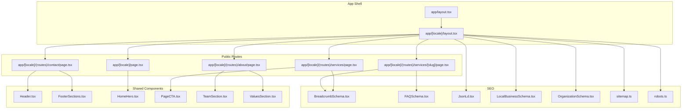
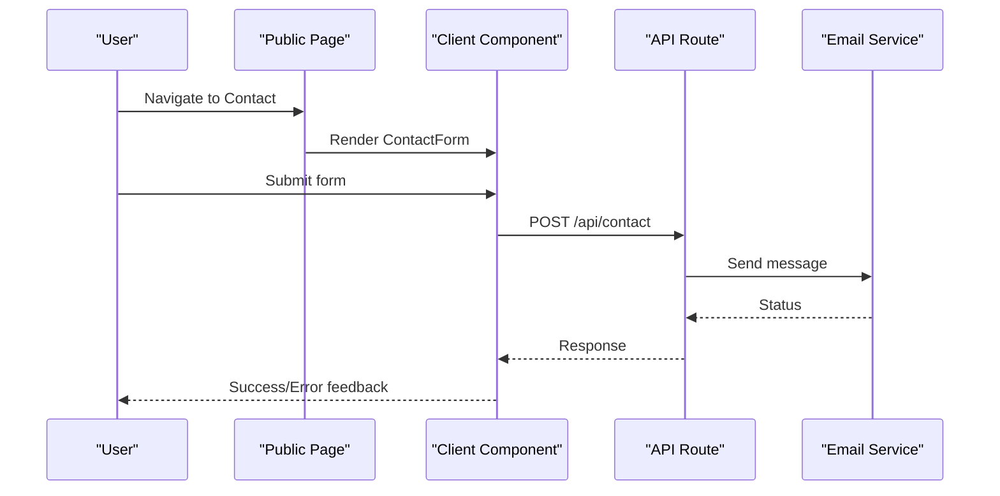
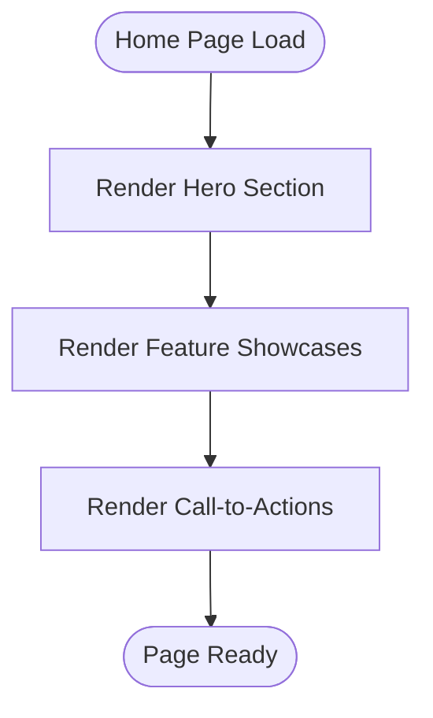
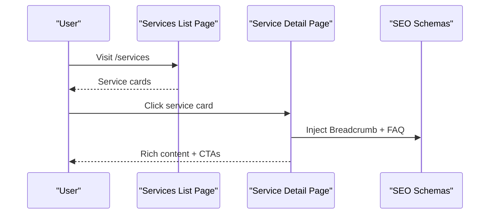
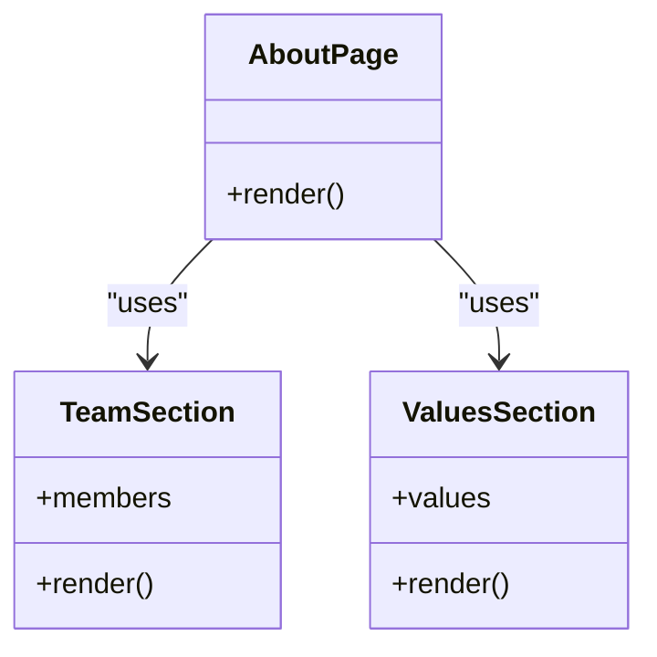
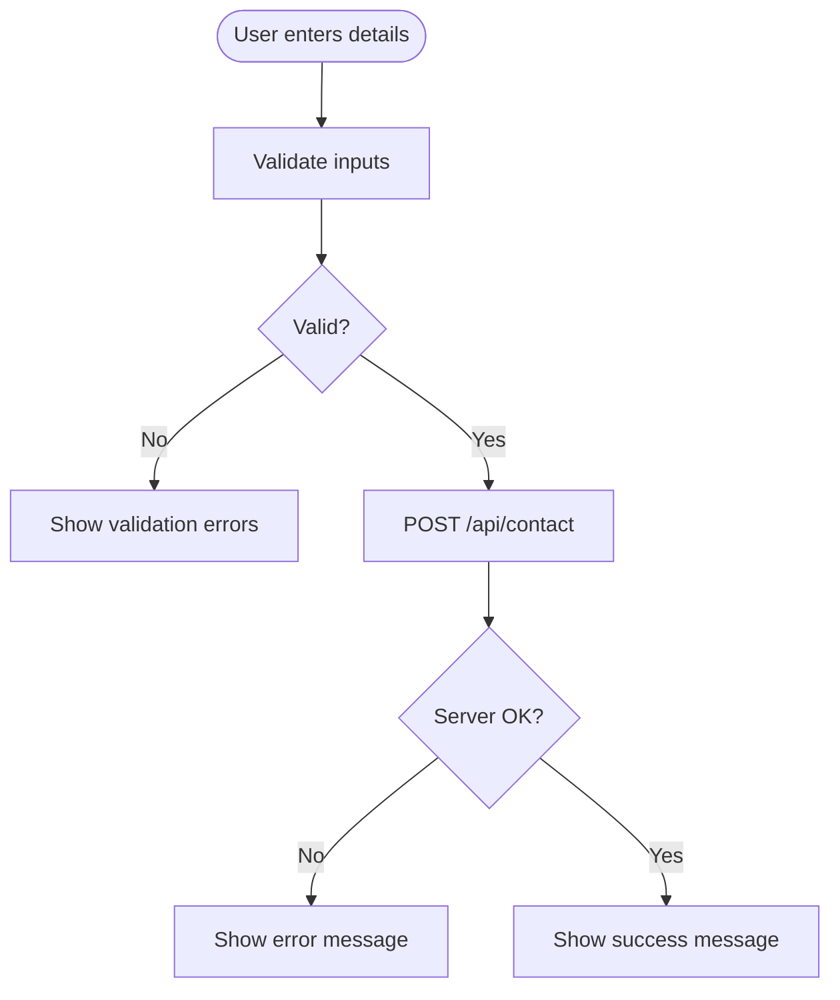
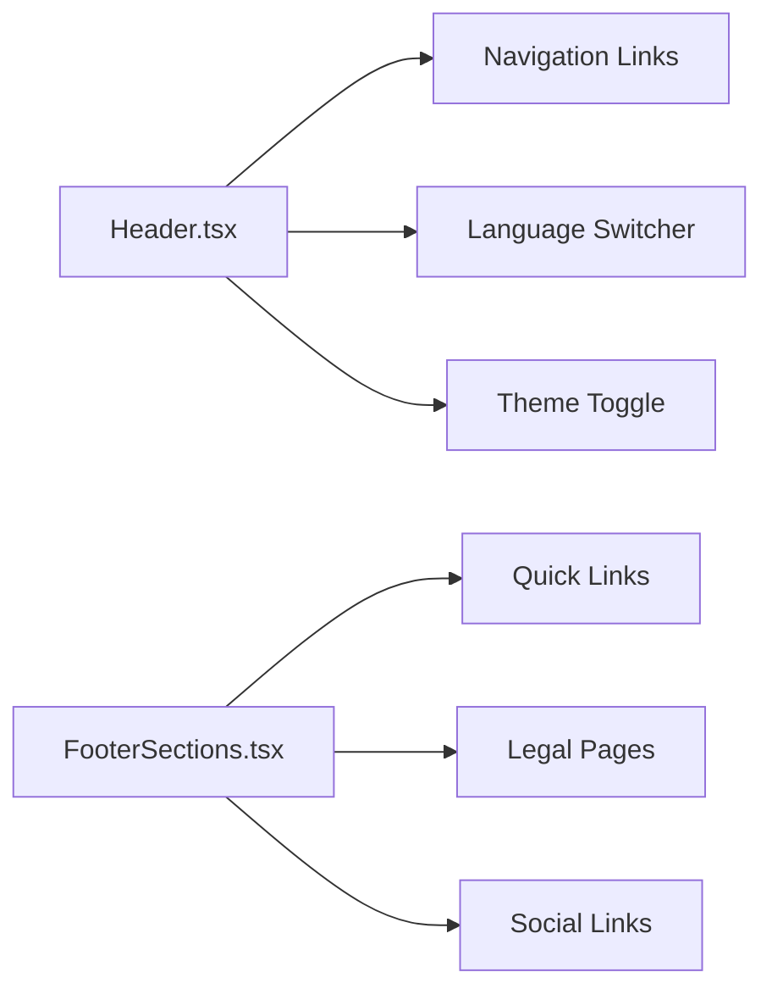
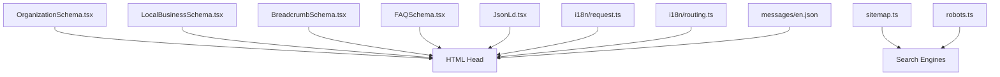
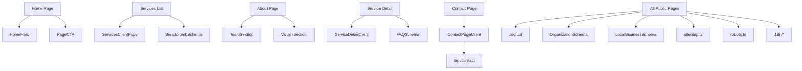

# Public Website

<cite>
**Referenced Files in This Document**
- [app/[locale]/page.tsx](file://app/[locale]/page.tsx)
- [app/[locale]/layout.tsx](file://app/[locale]/layout.tsx)
- [app/layout.tsx](file://app/layout.tsx)
- [app/[locale]/(routes)/services/page.tsx](file://app/[locale]/(routes)/services/page.tsx)
- [app/[locale]/(routes)/services/_components/ServicesClientPage.tsx](file://app/[locale]/(routes)/services/_components/ServicesClientPage.tsx)
- [app/[locale]/(routes)/services/[slug]/page.tsx](file://app/[locale]/(routes)/services/[slug]/page.tsx)
- [app/[locale]/(routes)/services/[slug]/_components/ServiceDetailClient.tsx](file://app/[locale]/(routes)/services/[slug]/_components/ServiceDetailClient.tsx)
- [app/[locale]/(routes)/about/page.tsx](file://app/[locale]/(routes)/about/page.tsx)
- [app/[locale]/(routes)/about/_components/AboutPageClient.tsx](file://app/[locale]/(routes)/about/_components/AboutPageClient.tsx)
- [app/[locale]/(routes)/contact/page.tsx](file://app/[locale]/(routes)/contact/page.tsx)
- [app/[locale]/(routes)/contact/_components/ContactPageClient.tsx](file://app/[locale]/(routes)/contact/_components/ContactPageClient.tsx)
- [app/api/contact/route.ts](file://app/api/contact/route.ts)
- [app/[locale]/_components/Header/Header.tsx](file://app/[locale]/_components/Header/Header.tsx)
- [app/[locale]/_components/Footer/FooterSections.tsx](file://app/[locale]/_components/Footer/FooterSections.tsx)
- [app/[locale]/_components/HomeHero/HomeHero.tsx](file://app/[locale]/_components/HomeHero/HomeHero.tsx)
- [app/[locale]/_components/HomeHero/OrbitalSystem.tsx](file://app/[locale]/_components/HomeHero/OrbitalSystem.tsx)
- [components/shared/PageCTA.tsx](file://components/shared/PageCTA.tsx)
- [components/shared/TeamSection.tsx](file://components/shared/TeamSection.tsx)
- [components/shared/ValuesSection.tsx](file://components/shared/ValuesSection.tsx)
- [components/seo/BreadcrumbSchema.tsx](file://components/seo/BreadcrumbSchema.tsx)
- [components/seo/FAQSchema.tsx](file://components/seo/FAQSchema.tsx)
- [components/seo/JsonLd.tsx](file://components/seo/JsonLd.tsx)
- [components/seo/LocalBusinessSchema.tsx](file://components/seo/LocalBusinessSchema.tsx)
- [components/seo/OrganizationSchema.tsx](file://components/seo/OrganizationSchema.tsx)
- [app/sitemap.ts](file://app/sitemap.ts)
- [app/robots.ts](file://app/robots.ts)
- [i18n/request.ts](file://i18n/request.ts)
- [i18n/routing.ts](file://i18n/routing.ts)
- [messages/en.json](file://messages/en.json)
</cite>

## Table of Contents
1. [Introduction](#introduction)
2. [Project Structure](#project-structure)
3. [Core Components](#core-components)
4. [Architecture Overview](#architecture-overview)
5. [Detailed Component Analysis](#detailed-component-analysis)
6. [Dependency Analysis](#dependency-analysis)
7. [Performance Considerations](#performance-considerations)
8. [Troubleshooting Guide](#troubleshooting-guide)
9. [Conclusion](#conclusion)

## Introduction
This document explains the public-facing website implementation, focusing on the landing page, services system, about and contact pages, header and footer architecture, navigation patterns, responsive design, SEO best practices, meta tag management, and performance optimization. It is intended for developers and content editors who need to understand how these features are structured and extended.

## Project Structure
The public site is built with a Next.js App Router setup under app/[locale], enabling internationalization and route-based organization. Key areas include:
- Root layout and locale-aware layout
- Public routes under (routes): home, services, about, contact
- Shared UI components for hero sections, CTAs, team/values displays, and SEO schemas
- API endpoint for contact form submissions
- Sitemap and robots configuration for SEO

**Diagram sources**
- [app/layout.tsx](file://app/layout.tsx)
- [app/[locale]/layout.tsx](file://app/[locale]/layout.tsx)
- [app/[locale]/page.tsx](file://app/[locale]/page.tsx)
- [app/[locale]/(routes)/services/page.tsx](file://app/[locale]/(routes)/services/page.tsx)
- [app/[locale]/(routes)/services/[slug]/page.tsx](file://app/[locale]/(routes)/services/[slug]/page.tsx)
- [app/[locale]/(routes)/about/page.tsx](file://app/[locale]/(routes)/about/page.tsx)
- [app/[locale]/(routes)/contact/page.tsx](file://app/[locale]/(routes)/contact/page.tsx)
- [app/[locale]/_components/Header/Header.tsx](file://app/[locale]/_components/Header/Header.tsx)
- [app/[locale]/_components/Footer/FooterSections.tsx](file://app/[locale]/_components/Footer/FooterSections.tsx)
- [app/[locale]/_components/HomeHero/HomeHero.tsx](file://app/[locale]/_components/HomeHero/HomeHero.tsx)
- [components/shared/PageCTA.tsx](file://components/shared/PageCTA.tsx)
- [components/shared/TeamSection.tsx](file://components/shared/TeamSection.tsx)
- [components/shared/ValuesSection.tsx](file://components/shared/ValuesSection.tsx)
- [components/seo/BreadcrumbSchema.tsx](file://components/seo/BreadcrumbSchema.tsx)
- [components/seo/FAQSchema.tsx](file://components/seo/FAQSchema.tsx)
- [components/seo/JsonLd.tsx](file://components/seo/JsonLd.tsx)
- [components/seo/LocalBusinessSchema.tsx](file://components/seo/LocalBusinessSchema.tsx)
- [components/seo/OrganizationSchema.tsx](file://components/seo/OrganizationSchema.tsx)
- [app/sitemap.ts](file://app/sitemap.ts)
- [app/robots.ts](file://app/robots.ts)

**Section sources**
- [app/layout.tsx](file://app/layout.tsx)
- [app/[locale]/layout.tsx](file://app/[locale]/layout.tsx)
- [app/[locale]/page.tsx](file://app/[locale]/page.tsx)
- [app/[locale]/(routes)/services/page.tsx](file://app/[locale]/(routes)/services/page.tsx)
- [app/[locale]/(routes)/services/[slug]/page.tsx](file://app/[locale]/(routes)/services/[slug]/page.tsx)
- [app/[locale]/(routes)/about/page.tsx](file://app/[locale]/(routes)/about/page.tsx)
- [app/[locale]/(routes)/contact/page.tsx](file://app/[locale]/(routes)/contact/page.tsx)

## Core Components
- Header and Footer: Provide global navigation, branding, and footer links across all public pages. The header includes locale-aware navigation and theme controls; the footer aggregates sections and links.
- Home Hero: Implements the landing page hero with headline, description, and call-to-action elements. An orbital visual component enhances engagement.
- Services System: A list page renders dynamic service entries and navigates to detail pages per slug. Detail pages render rich content and SEO metadata.
- About Page: Displays company information, team members, and values using reusable shared components.
- Contact Form: Client-side validated form that posts to an API route for email integration.
- SEO Utilities: Reusable JSON-LD schema components and sitemap/robots configuration.

**Section sources**
- [app/[locale]/_components/Header/Header.tsx](file://app/[locale]/_components/Header/Header.tsx)
- [app/[locale]/_components/Footer/FooterSections.tsx](file://app/[locale]/_components/Footer/FooterSections.tsx)
- [app/[locale]/_components/HomeHero/HomeHero.tsx](file://app/[locale]/_components/HomeHero/HomeHero.tsx)
- [app/[locale]/_components/HomeHero/OrbitalSystem.tsx](file://app/[locale]/_components/HomeHero/OrbitalSystem.tsx)
- [app/[locale]/(routes)/services/page.tsx](file://app/[locale]/(routes)/services/page.tsx)
- [app/[locale]/(routes)/services/_components/ServicesClientPage.tsx](file://app/[locale]/(routes)/services/_components/ServicesClientPage.tsx)
- [app/[locale]/(routes)/services/[slug]/page.tsx](file://app/[locale]/(routes)/services/[slug]/page.tsx)
- [app/[locale]/(routes)/services/[slug]/_components/ServiceDetailClient.tsx](file://app/[locale]/(routes)/services/[slug]/_components/ServiceDetailClient.tsx)
- [app/[locale]/(routes)/about/page.tsx](file://app/[locale]/(routes)/about/page.tsx)
- [app/[locale]/(routes)/about/_components/AboutPageClient.tsx](file://app/[locale]/(routes)/about/_components/AboutPageClient.tsx)
- [app/[locale]/(routes)/contact/page.tsx](file://app/[locale]/(routes)/contact/page.tsx)
- [app/[locale]/(routes)/contact/_components/ContactPageClient.tsx](file://app/[locale]/(routes)/contact/_components/ContactPageClient.tsx)
- [components/shared/PageCTA.tsx](file://components/shared/PageCTA.tsx)
- [components/shared/TeamSection.tsx](file://components/shared/TeamSection.tsx)
- [components/shared/ValuesSection.tsx](file://components/shared/ValuesSection.tsx)
- [components/seo/BreadcrumbSchema.tsx](file://components/seo/BreadcrumbSchema.tsx)
- [components/seo/FAQSchema.tsx](file://components/seo/FAQSchema.tsx)
- [components/seo/JsonLd.tsx](file://components/seo/JsonLd.tsx)
- [components/seo/LocalBusinessSchema.tsx](file://components/seo/LocalBusinessSchema.tsx)
- [components/seo/OrganizationSchema.tsx](file://components/seo/OrganizationSchema.tsx)
- [app/sitemap.ts](file://app/sitemap.ts)
- [app/robots.ts](file://app/robots.ts)

## Architecture Overview
The public site follows a layered approach:
- Layouts: Global HTML head, i18n context, and theme provider are set at the root and locale layouts.
- Pages: Each route composes client components and shared sections.
- Data Flow: Client components handle user interactions and submit forms to server routes.
- SEO: Schema components inject structured data; sitemap and robots guide crawlers.

**Diagram sources**
- [app/[locale]/(routes)/contact/page.tsx](file://app/[locale]/(routes)/contact/page.tsx)
- [app/[locale]/(routes)/contact/_components/ContactPageClient.tsx](file://app/[locale]/(routes)/contact/_components/ContactPageClient.tsx)
- [app/api/contact/route.ts](file://app/api/contact/route.ts)

## Detailed Component Analysis

### Landing Page (Home)
- Hero Section: Headline, supporting text, primary and secondary actions. Uses a reusable CTA component for consistent behavior.
- Feature Showcase: Sections highlight key capabilities with icons, descriptions, and optional visuals.
- Call-to-Action Elements: Prominent buttons drive conversions (e.g., “Get Started,” “Book a Call”).

Implementation highlights:
- Hero composition and animations via dedicated components.
- Reusable CTA component ensures consistent UX and accessibility.

**Diagram sources**
- [app/[locale]/page.tsx](file://app/[locale]/page.tsx)
- [app/[locale]/_components/HomeHero/HomeHero.tsx](file://app/[locale]/_components/HomeHero/HomeHero.tsx)
- [app/[locale]/_components/HomeHero/OrbitalSystem.tsx](file://app/[locale]/_components/HomeHero/OrbitalSystem.tsx)
- [components/shared/PageCTA.tsx](file://components/shared/PageCTA.tsx)

**Section sources**
- [app/[locale]/page.tsx](file://app/[locale]/page.tsx)
- [app/[locale]/_components/HomeHero/HomeHero.tsx](file://app/[locale]/_components/HomeHero/HomeHero.tsx)
- [app/[locale]/_components/HomeHero/OrbitalSystem.tsx](file://app/[locale]/_components/HomeHero/OrbitalSystem.tsx)
- [components/shared/PageCTA.tsx](file://components/shared/PageCTA.tsx)

### Services Page System
- List Page: Renders a grid/list of services with titles, summaries, and links to detail pages.
- Dynamic Details: Each service has a slug-based route rendering detailed content, FAQs, and related CTAs.
- SEO Optimization: Breadcrumb and FAQ schemas enhance search visibility.

**Diagram sources**
- [app/[locale]/(routes)/services/page.tsx](file://app/[locale]/(routes)/services/page.tsx)
- [app/[locale]/(routes)/services/_components/ServicesClientPage.tsx](file://app/[locale]/(routes)/services/_components/ServicesClientPage.tsx)
- [app/[locale]/(routes)/services/[slug]/page.tsx](file://app/[locale]/(routes)/services/[slug]/page.tsx)
- [app/[locale]/(routes)/services/[slug]/_components/ServiceDetailClient.tsx](file://app/[locale]/(routes)/services/[slug]/_components/ServiceDetailClient.tsx)
- [components/seo/BreadcrumbSchema.tsx](file://components/seo/BreadcrumbSchema.tsx)
- [components/seo/FAQSchema.tsx](file://components/seo/FAQSchema.tsx)

**Section sources**
- [app/[locale]/(routes)/services/page.tsx](file://app/[locale]/(routes)/services/page.tsx)
- [app/[locale]/(routes)/services/_components/ServicesClientPage.tsx](file://app/[locale]/(routes)/services/_components/ServicesClientPage.tsx)
- [app/[locale]/(routes)/services/[slug]/page.tsx](file://app/[locale]/(routes)/services/[slug]/page.tsx)
- [app/[locale]/(routes)/services/[slug]/_components/ServiceDetailClient.tsx](file://app/[locale]/(routes)/services/[slug]/_components/ServiceDetailClient.tsx)
- [components/seo/BreadcrumbSchema.tsx](file://components/seo/BreadcrumbSchema.tsx)
- [components/seo/FAQSchema.tsx](file://components/seo/FAQSchema.tsx)

### About Page
- Company Information: Overview, mission, and value propositions.
- Team Display: Member profiles and roles using a shared section component.
- Values Presentation: Structured display of core values with concise descriptions.

**Diagram sources**
- [app/[locale]/(routes)/about/page.tsx](file://app/[locale]/(routes)/about/page.tsx)
- [app/[locale]/(routes)/about/_components/AboutPageClient.tsx](file://app/[locale]/(routes)/about/_components/AboutPageClient.tsx)
- [components/shared/TeamSection.tsx](file://components/shared/TeamSection.tsx)
- [components/shared/ValuesSection.tsx](file://components/shared/ValuesSection.tsx)

**Section sources**
- [app/[locale]/(routes)/about/page.tsx](file://app/[locale]/(routes)/about/page.tsx)
- [app/[locale]/(routes)/about/_components/AboutPageClient.tsx](file://app/[locale]/(routes)/about/_components/AboutPageClient.tsx)
- [components/shared/TeamSection.tsx](file://components/shared/TeamSection.tsx)
- [components/shared/ValuesSection.tsx](file://components/shared/ValuesSection.tsx)

### Contact Form and Email Integration
- Client-Side Validation: Enforces required fields and formats before submission.
- Submission Flow: Posts to a server route which sends emails and returns status.
- User Feedback: Displays success or error messages based on response.

**Diagram sources**
- [app/[locale]/(routes)/contact/page.tsx](file://app/[locale]/(routes)/contact/page.tsx)
- [app/[locale]/(routes)/contact/_components/ContactPageClient.tsx](file://app/[locale]/(routes)/contact/_components/ContactPageClient.tsx)
- [app/api/contact/route.ts](file://app/api/contact/route.ts)

**Section sources**
- [app/[locale]/(routes)/contact/page.tsx](file://app/[locale]/(routes)/contact/page.tsx)
- [app/[locale]/(routes)/contact/_components/ContactPageClient.tsx](file://app/[locale]/(routes)/contact/_components/ContactPageClient.tsx)
- [app/api/contact/route.ts](file://app/api/contact/route.ts)

### Header and Footer Architecture
- Header: Contains logo, navigation links, language switcher, and theme toggle. Responsive menu toggles on small screens.
- Footer: Aggregates sections such as quick links, legal pages, and social links.
- Navigation Patterns: Consistent link structure, active state handling, and locale-aware routing.

**Diagram sources**
- [app/[locale]/_components/Header/Header.tsx](file://app/[locale]/_components/Header/Header.tsx)
- [app/[locale]/_components/Footer/FooterSections.tsx](file://app/[locale]/_components/Footer/FooterSections.tsx)

**Section sources**
- [app/[locale]/_components/Header/Header.tsx](file://app/[locale]/_components/Header/Header.tsx)
- [app/[locale]/_components/Footer/FooterSections.tsx](file://app/[locale]/_components/Footer/FooterSections.tsx)

### SEO Best Practices and Meta Tag Management
- Structured Data: Organization, local business, breadcrumb, and FAQ schemas improve SERP appearance.
- Sitemap and Robots: Centralized generation and crawling directives.
- Internationalization: Locale-aware request handling and routing ensure correct hreflang and content delivery.

**Diagram sources**
- [components/seo/OrganizationSchema.tsx](file://components/seo/OrganizationSchema.tsx)
- [components/seo/LocalBusinessSchema.tsx](file://components/seo/LocalBusinessSchema.tsx)
- [components/seo/BreadcrumbSchema.tsx](file://components/seo/BreadcrumbSchema.tsx)
- [components/seo/FAQSchema.tsx](file://components/seo/FAQSchema.tsx)
- [components/seo/JsonLd.tsx](file://components/seo/JsonLd.tsx)
- [app/sitemap.ts](file://app/sitemap.ts)
- [app/robots.ts](file://app/robots.ts)
- [i18n/request.ts](file://i18n/request.ts)
- [i18n/routing.ts](file://i18n/routing.ts)
- [messages/en.json](file://messages/en.json)

**Section sources**
- [components/seo/OrganizationSchema.tsx](file://components/seo/OrganizationSchema.tsx)
- [components/seo/LocalBusinessSchema.tsx](file://components/seo/LocalBusinessSchema.tsx)
- [components/seo/BreadcrumbSchema.tsx](file://components/seo/BreadcrumbSchema.tsx)
- [components/seo/FAQSchema.tsx](file://components/seo/FAQSchema.tsx)
- [components/seo/JsonLd.tsx](file://components/seo/JsonLd.tsx)
- [app/sitemap.ts](file://app/sitemap.ts)
- [app/robots.ts](file://app/robots.ts)
- [i18n/request.ts](file://i18n/request.ts)
- [i18n/routing.ts](file://i18n/routing.ts)
- [messages/en.json](file://messages/en.json)

## Dependency Analysis
Public pages depend on shared components and SEO utilities. The contact flow depends on the API route. Internationalization affects routing and content resolution.

**Diagram sources**
- [app/[locale]/page.tsx](file://app/[locale]/page.tsx)
- [app/[locale]/_components/HomeHero/HomeHero.tsx](file://app/[locale]/_components/HomeHero/HomeHero.tsx)
- [components/shared/PageCTA.tsx](file://components/shared/PageCTA.tsx)
- [app/[locale]/(routes)/services/page.tsx](file://app/[locale]/(routes)/services/page.tsx)
- [app/[locale]/(routes)/services/_components/ServicesClientPage.tsx](file://app/[locale]/(routes)/services/_components/ServicesClientPage.tsx)
- [app/[locale]/(routes)/services/[slug]/page.tsx](file://app/[locale]/(routes)/services/[slug]/page.tsx)
- [app/[locale]/(routes)/services/[slug]/_components/ServiceDetailClient.tsx](file://app/[locale]/(routes)/services/[slug]/_components/ServiceDetailClient.tsx)
- [app/[locale]/(routes)/about/page.tsx](file://app/[locale]/(routes)/about/page.tsx)
- [components/shared/TeamSection.tsx](file://components/shared/TeamSection.tsx)
- [components/shared/ValuesSection.tsx](file://components/shared/ValuesSection.tsx)
- [app/[locale]/(routes)/contact/page.tsx](file://app/[locale]/(routes)/contact/page.tsx)
- [app/[locale]/(routes)/contact/_components/ContactPageClient.tsx](file://app/[locale]/(routes)/contact/_components/ContactPageClient.tsx)
- [app/api/contact/route.ts](file://app/api/contact/route.ts)
- [components/seo/BreadcrumbSchema.tsx](file://components/seo/BreadcrumbSchema.tsx)
- [components/seo/FAQSchema.tsx](file://components/seo/FAQSchema.tsx)
- [components/seo/JsonLd.tsx](file://components/seo/JsonLd.tsx)
- [components/seo/OrganizationSchema.tsx](file://components/seo/OrganizationSchema.tsx)
- [components/seo/LocalBusinessSchema.tsx](file://components/seo/LocalBusinessSchema.tsx)
- [app/sitemap.ts](file://app/sitemap.ts)
- [app/robots.ts](file://app/robots.ts)
- [i18n/request.ts](file://i18n/request.ts)
- [i18n/routing.ts](file://i18n/routing.ts)

**Section sources**
- [app/[locale]/page.tsx](file://app/[locale]/page.tsx)
- [app/[locale]/_components/HomeHero/HomeHero.tsx](file://app/[locale]/_components/HomeHero/HomeHero.tsx)
- [components/shared/PageCTA.tsx](file://components/shared/PageCTA.tsx)
- [app/[locale]/(routes)/services/page.tsx](file://app/[locale]/(routes)/services/page.tsx)
- [app/[locale]/(routes)/services/_components/ServicesClientPage.tsx](file://app/[locale]/(routes)/services/_components/ServicesClientPage.tsx)
- [app/[locale]/(routes)/services/[slug]/page.tsx](file://app/[locale]/(routes)/services/[slug]/page.tsx)
- [app/[locale]/(routes)/services/[slug]/_components/ServiceDetailClient.tsx](file://app/[locale]/(routes)/services/[slug]/_components/ServiceDetailClient.tsx)
- [app/[locale]/(routes)/about/page.tsx](file://app/[locale]/(routes)/about/page.tsx)
- [components/shared/TeamSection.tsx](file://components/shared/TeamSection.tsx)
- [components/shared/ValuesSection.tsx](file://components/shared/ValuesSection.tsx)
- [app/[locale]/(routes)/contact/page.tsx](file://app/[locale]/(routes)/contact/page.tsx)
- [app/[locale]/(routes)/contact/_components/ContactPageClient.tsx](file://app/[locale]/(routes)/contact/_components/ContactPageClient.tsx)
- [app/api/contact/route.ts](file://app/api/contact/route.ts)
- [components/seo/BreadcrumbSchema.tsx](file://components/seo/BreadcrumbSchema.tsx)
- [components/seo/FAQSchema.tsx](file://components/seo/FAQSchema.tsx)
- [components/seo/JsonLd.tsx](file://components/seo/JsonLd.tsx)
- [components/seo/OrganizationSchema.tsx](file://components/seo/OrganizationSchema.tsx)
- [components/seo/LocalBusinessSchema.tsx](file://components/seo/LocalBusinessSchema.tsx)
- [app/sitemap.ts](file://app/sitemap.ts)
- [app/robots.ts](file://app/robots.ts)
- [i18n/request.ts](file://i18n/request.ts)
- [i18n/routing.ts](file://i18n/routing.ts)

## Performance Considerations
- Prefer static generation where possible for public pages to reduce server load and improve Time to First Byte.
- Use lightweight components for hero visuals; defer heavy animations until after initial paint if needed.
- Keep images optimized and use appropriate formats; lazy-load off-screen assets.
- Minimize client-side JavaScript on landing pages; move interactivity to progressive enhancement.
- Leverage caching headers for API responses and static assets.
- Ensure SEO components do not block critical rendering; keep them minimal and declarative.

[No sources needed since this section provides general guidance]

## Troubleshooting Guide
- Contact Form Not Submitting: Verify network requests to the API route and check server logs for errors. Ensure environment variables for email integration are configured.
- Validation Errors Persist: Confirm client-side validation rules match expected input constraints and that error states reset on successful submission.
- Missing SEO Data: Check that schema components are rendered within the page tree and that JSON-LD is present in the final HTML.
- Localization Issues: Ensure locale routing is correctly set and messages files contain required keys.

**Section sources**
- [app/api/contact/route.ts](file://app/api/contact/route.ts)
- [app/[locale]/(routes)/contact/_components/ContactPageClient.tsx](file://app/[locale]/(routes)/contact/_components/ContactPageClient.tsx)
- [components/seo/JsonLd.tsx](file://components/seo/JsonLd.tsx)
- [i18n/routing.ts](file://i18n/routing.ts)
- [messages/en.json](file://messages/en.json)

## Conclusion
The public website leverages a modular, component-driven architecture with strong SEO foundations and internationalization support. The landing page emphasizes conversion through clear hero sections and CTAs. The services system offers dynamic content and rich SEO signals. The about and contact pages provide essential information and lead capture with robust validation and email integration. Header and footer components ensure consistent navigation and presentation across the site. Following the performance and troubleshooting recommendations will help maintain a fast, accessible, and discoverable experience.