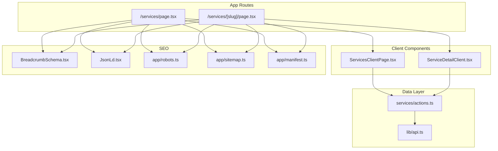
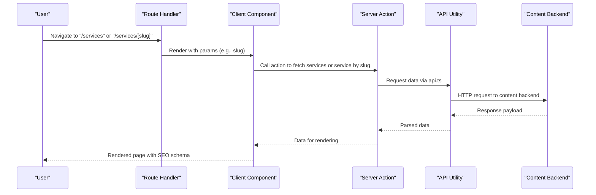
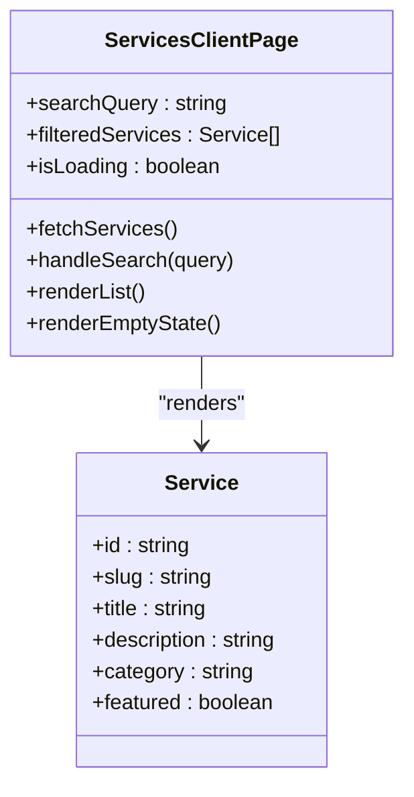
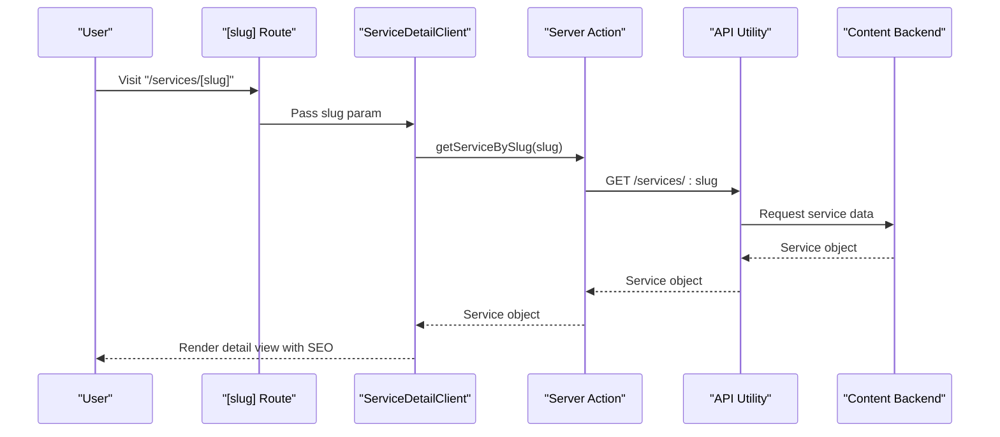
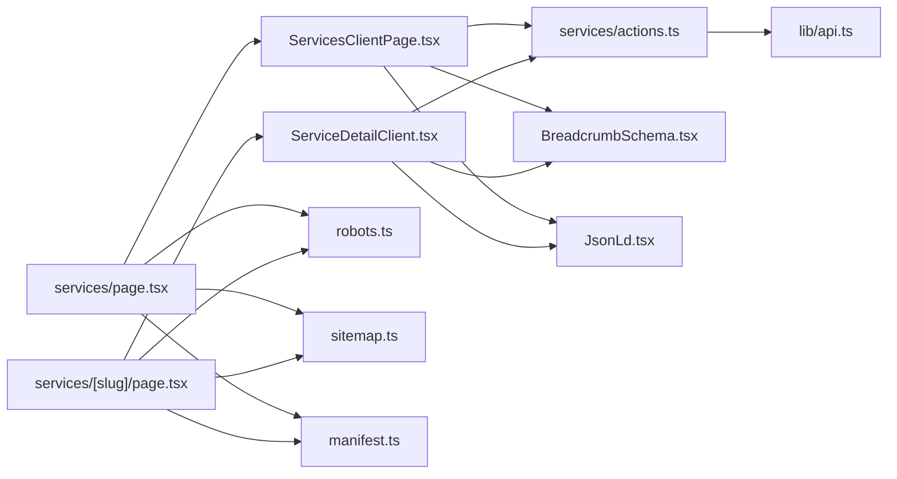

# Services Pages

<cite>
**Referenced Files in This Document**
- [services page.tsx](file://app/[locale]/(routes)/services/page.tsx)
- [ServicesClientPage.tsx](file://app/[locale]/(routes)/services/_components/ServicesClientPage.tsx)
- [service detail page.tsx](file://app/[locale]/(routes)/services/[slug]/page.tsx)
- [ServiceDetailClient.tsx](file://app/[locale]/(routes)/services/[slug]/_components/ServiceDetailClient.tsx)
- [services actions.ts](file://app/[locale]/(routes)/services/actions.ts)
- [api.ts](file://lib/api.ts)
- [robots.ts](file://app/robots.ts)
- [sitemap.ts](file://app/sitemap.ts)
- [manifest.ts](file://app/manifest.ts)
- [BreadcrumbSchema.tsx](file://components/seo/BreadcrumbSchema.tsx)
- [JsonLd.tsx](file://components/seo/JsonLd.tsx)
</cite>

## Table of Contents
1. [Introduction](#introduction)
2. [Project Structure](#project-structure)
3. [Core Components](#core-components)
4. [Architecture Overview](#architecture-overview)
5. [Detailed Component Analysis](#detailed-component-analysis)
6. [Dependency Analysis](#dependency-analysis)
7. [Performance Considerations](#performance-considerations)
8. [Troubleshooting Guide](#troubleshooting-guide)
9. [Conclusion](#conclusion)
10. [Appendices](#appendices)

## Introduction
This document explains the services pages system, including dynamic routing for individual service pages, content management integration points, and SEO optimization strategies. It covers the ServicesClientPage component architecture, how the service listing is displayed, and how individual service details are rendered. It also provides guidance on adding new services, customizing layouts, managing metadata, optimizing performance for large catalogs, and implementing search functionality.

## Project Structure
The services feature is implemented under the Next.js App Router with a locale-aware route group:
- Listing page at /services
- Dynamic detail pages at /services/[slug]
- Client components for rendering lists and details
- Server actions for data operations
- Shared SEO utilities for structured data and metadata

**Diagram sources**
- [services page.tsx](file://app/[locale]/(routes)/services/page.tsx)
- [ServicesClientPage.tsx](file://app/[locale]/(routes)/services/_components/ServicesClientPage.tsx)
- [service detail page.tsx](file://app/[locale]/(routes)/services/[slug]/page.tsx)
- [ServiceDetailClient.tsx](file://app/[locale]/(routes)/services/[slug]/_components/ServiceDetailClient.tsx)
- [services actions.ts](file://app/[locale]/(routes)/services/actions.ts)
- [api.ts](file://lib/api.ts)
- [robots.ts](file://app/robots.ts)
- [sitemap.ts](file://app/sitemap.ts)
- [manifest.ts](file://app/manifest.ts)
- [BreadcrumbSchema.tsx](file://components/seo/BreadcrumbSchema.tsx)
- [JsonLd.tsx](file://components/seo/JsonLd.tsx)

**Section sources**
- [services page.tsx](file://app/[locale]/(routes)/services/page.tsx)
- [ServicesClientPage.tsx](file://app/[locale]/(routes)/services/_components/ServicesClientPage.tsx)
- [service detail page.tsx](file://app/[locale]/(routes)/services/[slug]/page.tsx)
- [ServiceDetailClient.tsx](file://app/[locale]/(routes)/services/[slug]/_components/ServiceDetailClient.tsx)
- [services actions.ts](file://app/[locale]/(routes)/services/actions.ts)
- [api.ts](file://lib/api.ts)
- [robots.ts](file://app/robots.ts)
- [sitemap.ts](file://app/sitemap.ts)
- [manifest.ts](file://app/manifest.ts)
- [BreadcrumbSchema.tsx](file://components/seo/BreadcrumbSchema.tsx)
- [JsonLd.tsx](file://components/seo/JsonLd.tsx)

## Core Components
- ServicesClientPage: Renders the services listing, handles search/filtering state, pagination or infinite scroll (as implemented), and delegates data fetching to server actions.
- ServiceDetailClient: Renders an individual service’s title, description, media, pricing, FAQs, and related services; integrates SEO schema and breadcrumbs.
- Server Actions: Encapsulate data fetching from the content backend via shared API utilities, enabling SSR-friendly data access and caching.
- SEO Utilities: Provide reusable JSON-LD generation and breadcrumb markup for rich results.

Key responsibilities:
- Data loading strategy (server vs client)
- State management for search and filters
- Rendering logic for list and detail views
- Metadata and structured data injection

**Section sources**
- [ServicesClientPage.tsx](file://app/[locale]/(routes)/services/_components/ServicesClientPage.tsx)
- [ServiceDetailClient.tsx](file://app/[locale]/(routes)/services/[slug]/_components/ServiceDetailClient.tsx)
- [services actions.ts](file://app/[locale]/(routes)/services/actions.ts)
- [api.ts](file://lib/api.ts)
- [BreadcrumbSchema.tsx](file://components/seo/BreadcrumbSchema.tsx)
- [JsonLd.tsx](file://components/seo/JsonLd.tsx)

## Architecture Overview
The services feature follows a clear separation between routes, client components, and data layer:
- Route handlers define the URL structure and pass parameters to client components.
- Client components manage UI state and call server actions for data.
- Server actions fetch from the content backend using shared API helpers.
- SEO components inject structured data into the page head.

**Diagram sources**
- [services page.tsx](file://app/[locale]/(routes)/services/page.tsx)
- [service detail page.tsx](file://app/[locale]/(routes)/services/[slug]/page.tsx)
- [ServicesClientPage.tsx](file://app/[locale]/(routes)/services/_components/ServicesClientPage.tsx)
- [ServiceDetailClient.tsx](file://app/[locale]/(routes)/services/[slug]/_components/ServiceDetailClient.tsx)
- [services actions.ts](file://app/[locale]/(routes)/services/actions.ts)
- [api.ts](file://lib/api.ts)

## Detailed Component Analysis

### ServicesClientPage
Responsibilities:
- Fetches the full services catalog via server actions.
- Provides search input and optional category filters.
- Displays paginated or virtualized list items.
- Integrates breadcrumbs and JSON-LD for SEO.

State and behavior:
- Search query state drives filtering on the client side after initial load.
- Debounced search input reduces re-renders.
- Pagination or “load more” pattern improves perceived performance.

Rendering:
- List grid with cards containing title, short description, and link to detail page.
- Empty state when no matches found.
- Accessibility attributes for inputs and links.

SEO:
- Breadcrumbs include Home > Services.
- JSON-LD for WebSite and ItemList where applicable.

**Section sources**
- [ServicesClientPage.tsx](file://app/[locale]/(routes)/services/_components/ServicesClientPage.tsx)
- [services actions.ts](file://app/[locale]/(routes)/services/actions.ts)
- [BreadcrumbSchema.tsx](file://components/seo/BreadcrumbSchema.tsx)
- [JsonLd.tsx](file://components/seo/JsonLd.tsx)

#### Class Diagram: ServicesClientPage

**Diagram sources**
- [ServicesClientPage.tsx](file://app/[locale]/(routes)/services/_components/ServicesClientPage.tsx)

### ServiceDetailClient
Responsibilities:
- Loads a single service by slug via server actions.
- Renders detailed content sections (overview, features, media, pricing, FAQs).
- Injects breadcrumbs and JSON-LD for the specific service.

Behavior:
- Error handling for missing or invalid slugs.
- Conditional rendering based on available fields.
- Related services section with navigation.

SEO:
- Breadcrumbs include Home > Services > Service Title.
- JSON-LD for Service or Article depending on content type.

**Section sources**
- [ServiceDetailClient.tsx](file://app/[locale]/(routes)/services/[slug]/_components/ServiceDetailClient.tsx)
- [services actions.ts](file://app/[locale]/(routes)/services/actions.ts)
- [BreadcrumbSchema.tsx](file://components/seo/BreadcrumbSchema.tsx)
- [JsonLd.tsx](file://components/seo/JsonLd.tsx)

#### Sequence Diagram: Detail Page Load

**Diagram sources**
- [service detail page.tsx](file://app/[locale]/(routes)/services/[slug]/page.tsx)
- [ServiceDetailClient.tsx](file://app/[locale]/(routes)/services/[slug]/_components/ServiceDetailClient.tsx)
- [services actions.ts](file://app/[locale]/(routes)/services/actions.ts)
- [api.ts](file://lib/api.ts)

### Server Actions and API Integration
- Server actions encapsulate data fetching for both listing and detail endpoints.
- The shared API utility centralizes base URLs, headers, and error normalization.
- Errors are surfaced to client components for user feedback.

Best practices:
- Use try/catch around API calls and return consistent result shapes.
- Normalize payloads before passing to components.
- Avoid exposing sensitive configuration in client code.

**Section sources**
- [services actions.ts](file://app/[locale]/(routes)/services/actions.ts)
- [api.ts](file://lib/api.ts)

### SEO and Structured Data
- BreadcrumbSchema: Generates breadcrumb JSON-LD for hierarchical navigation.
- JsonLd: Reusable wrapper to inject JSON-LD scripts safely.
- robots.txt and sitemap: Control crawling and indexing of services pages.
- Manifest: Enhances discoverability and app-like experience.

Implementation notes:
- Include canonical URLs for each service page.
- Ensure meta tags reflect localized titles and descriptions.
- Validate JSON-LD with Google Rich Results tools.

**Section sources**
- [BreadcrumbSchema.tsx](file://components/seo/BreadcrumbSchema.tsx)
- [JsonLd.tsx](file://components/seo/JsonLd.tsx)
- [robots.ts](file://app/robots.ts)
- [sitemap.ts](file://app/sitemap.ts)
- [manifest.ts](file://app/manifest.ts)

## Dependency Analysis
The services module depends on shared utilities and SEO components. The following diagram shows key relationships:

**Diagram sources**
- [services page.tsx](file://app/[locale]/(routes)/services/page.tsx)
- [ServicesClientPage.tsx](file://app/[locale]/(routes)/services/_components/ServicesClientPage.tsx)
- [service detail page.tsx](file://app/[locale]/(routes)/services/[slug]/page.tsx)
- [ServiceDetailClient.tsx](file://app/[locale]/(routes)/services/[slug]/_components/ServiceDetailClient.tsx)
- [services actions.ts](file://app/[locale]/(routes)/services/actions.ts)
- [api.ts](file://lib/api.ts)
- [robots.ts](file://app/robots.ts)
- [sitemap.ts](file://app/sitemap.ts)
- [manifest.ts](file://app/manifest.ts)
- [BreadcrumbSchema.tsx](file://components/seo/BreadcrumbSchema.tsx)
- [JsonLd.tsx](file://components/seo/JsonLd.tsx)

**Section sources**
- [services page.tsx](file://app/[locale]/(routes)/services/page.tsx)
- [ServicesClientPage.tsx](file://app/[locale]/(routes)/services/_components/ServicesClientPage.tsx)
- [service detail page.tsx](file://app/[locale]/(routes)/services/[slug]/page.tsx)
- [ServiceDetailClient.tsx](file://app/[locale]/(routes)/services/[slug]/_components/ServiceDetailClient.tsx)
- [services actions.ts](file://app/[locale]/(routes)/services/actions.ts)
- [api.ts](file://lib/api.ts)
- [robots.ts](file://app/robots.ts)
- [sitemap.ts](file://app/sitemap.ts)
- [manifest.ts](file://app/manifest.ts)
- [BreadcrumbSchema.tsx](file://components/seo/BreadcrumbSchema.tsx)
- [JsonLd.tsx](file://components/seo/JsonLd.tsx)

## Performance Considerations
For large service catalogs:
- Prefer server-side fetching via server actions to leverage SSR and caching.
- Implement pagination or virtualization to limit DOM size.
- Debounce search input to reduce re-renders and network requests.
- Cache responses at the API layer or use Next.js cache options where appropriate.
- Lazy-load images and heavy assets within service cards.
- Minimize re-computation by memoizing derived lists and avoiding unnecessary state updates.

Search implementation tips:
- Keep search client-side after initial load for responsiveness.
- For very large datasets, consider server-side search with incremental queries.
- Normalize text for case-insensitive matching and handle diacritics.

[No sources needed since this section provides general guidance]

## Troubleshooting Guide
Common issues and resolutions:
- Missing service by slug: Ensure the slug exists in the content backend and that the server action returns a valid response shape.
- Empty listing: Verify API connectivity and error handling paths in server actions.
- SEO not appearing: Confirm JSON-LD is injected and validated; check robots.txt and sitemap entries.
- Slow listing load: Introduce pagination/virtualization and debounced search.

Operational checks:
- Inspect network requests to confirm correct endpoints and payloads.
- Validate JSON-LD using Google Rich Results Test.
- Review console errors for failed API calls or malformed data.

**Section sources**
- [services actions.ts](file://app/[locale]/(routes)/services/actions.ts)
- [api.ts](file://lib/api.ts)
- [BreadcrumbSchema.tsx](file://components/seo/BreadcrumbSchema.tsx)
- [JsonLd.tsx](file://components/seo/JsonLd.tsx)
- [robots.ts](file://app/robots.ts)
- [sitemap.ts](file://app/sitemap.ts)

## Conclusion
The services pages system combines Next.js App Router dynamic routes, client components for interactivity, and server actions for robust data access. SEO is addressed through breadcrumbs and JSON-LD, while performance can be optimized with pagination, virtualization, and caching. By following the patterns outlined here, teams can add new services, customize layouts, and maintain high performance even with large catalogs.

[No sources needed since this section summarizes without analyzing specific files]

## Appendices

### Adding a New Service
Steps:
- Create or update the service entry in the content backend.
- Ensure the slug is unique and SEO-friendly.
- Populate required metadata: title, description, category, featured flag.
- Verify the listing and detail pages render correctly.
- Update sitemap if necessary.

**Section sources**
- [services actions.ts](file://app/[locale]/(routes)/services/actions.ts)
- [sitemap.ts](file://app/sitemap.ts)

### Customizing Service Layouts
Approach:
- Extend the client components to support additional sections or variants.
- Use conditional rendering based on service fields.
- Maintain consistent SEO schema across variants.

**Section sources**
- [ServicesClientPage.tsx](file://app/[locale]/(routes)/services/_components/ServicesClientPage.tsx)
- [ServiceDetailClient.tsx](file://app/[locale]/(routes)/services/[slug]/_components/ServiceDetailClient.tsx)
- [BreadcrumbSchema.tsx](file://components/seo/BreadcrumbSchema.tsx)
- [JsonLd.tsx](file://components/seo/JsonLd.tsx)

### Managing Service Metadata
Guidelines:
- Keep titles concise and descriptive.
- Write unique descriptions per service.
- Use categories consistently for filtering.
- Mark featured services for prominence in listings.

**Section sources**
- [ServicesClientPage.tsx](file://app/[locale]/(routes)/services/_components/ServicesClientPage.tsx)
- [ServiceDetailClient.tsx](file://app/[locale]/(routes)/services/[slug]/_components/ServiceDetailClient.tsx)