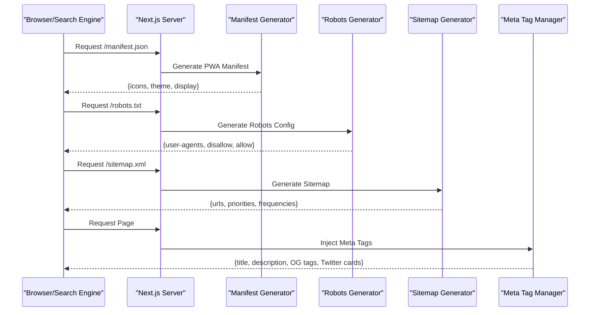
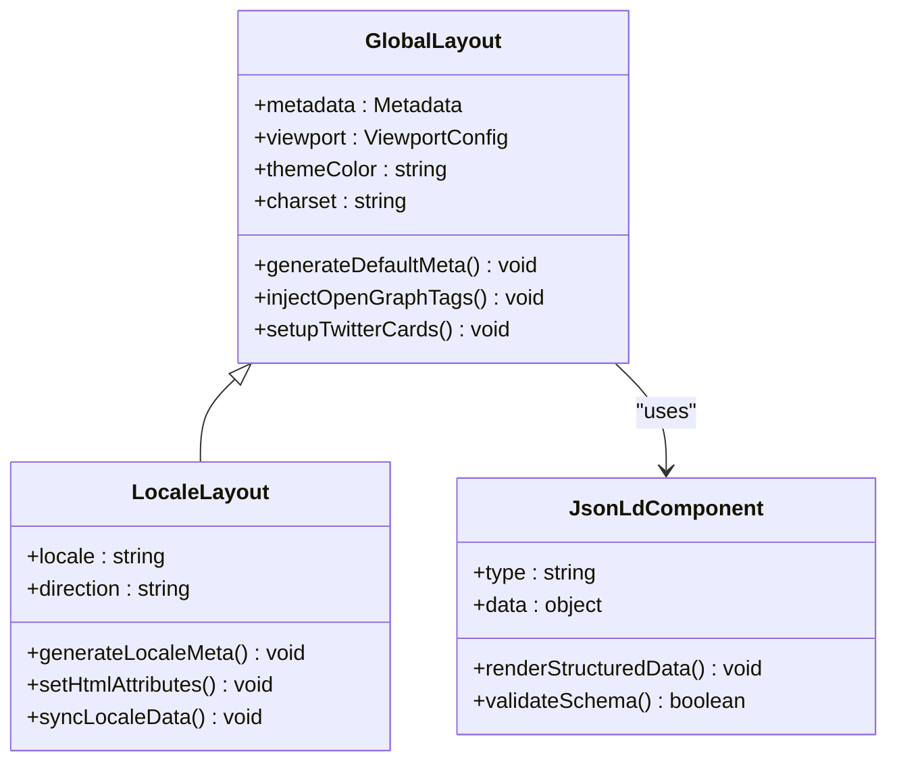
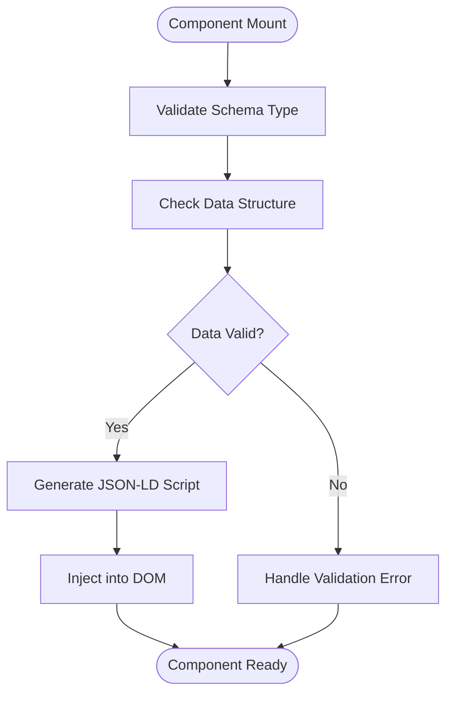
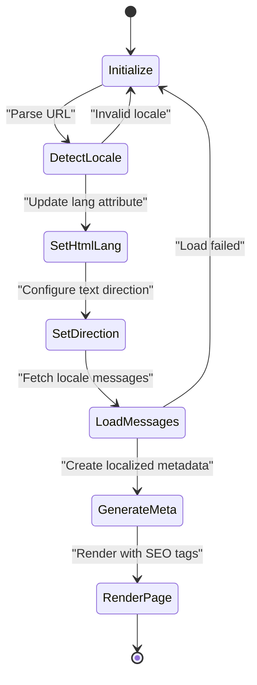
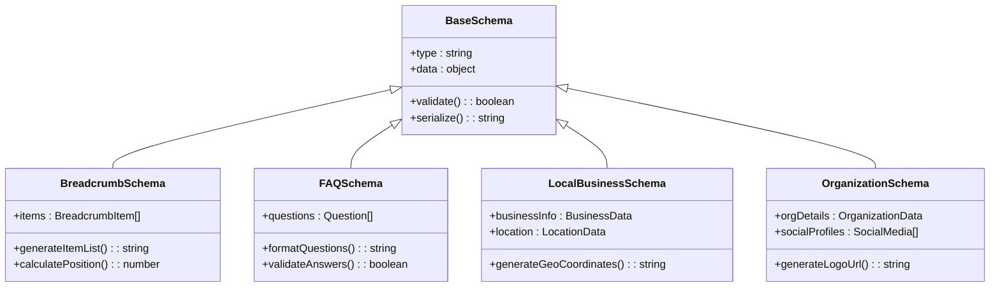

# Metadata and SEO Configuration

<cite>
**Referenced Files in This Document**
- [manifest.ts](file://app/manifest.ts)
- [robots.ts](file://app/robots.ts)
- [sitemap.ts](file://app/sitemap.ts)
- [layout.tsx](file://app/layout.tsx)
- [layout.tsx](file://app/[locale]/layout.tsx)
- [JsonLd.tsx](file://components/seo/JsonLd.tsx)
- [BreadcrumbSchema.tsx](file://components/seo/BreadcrumbSchema.tsx)
- [FAQSchema.tsx](file://components/seo/FAQSchema.tsx)
- [LocalBusinessSchema.tsx](file://components/seo/LocalBusinessSchema.tsx)
- [OrganizationSchema.tsx](file://components/seo/OrganizationSchema.tsx)
- [SetHtmlLangDir.tsx](file://app/[locale]/_components/SetHTML/SetHtmlLangDir.tsx)
- [LocaleSync.tsx](file://app/[locale]/_components/Language/LocaleSync.tsx)
</cite>

## Table of Contents
1. [Introduction](#introduction)
2. [Project Structure](#project-structure)
3. [Core Components](#core-components)
4. [Architecture Overview](#architecture-overview)
5. [Detailed Component Analysis](#detailed-component-analysis)
6. [Dependency Analysis](#dependency-analysis)
7. [Performance Considerations](#performance-considerations)
8. [Troubleshooting Guide](#troubleshooting-guide)
9. [Conclusion](#conclusion)

## Introduction

This document provides comprehensive guidance for implementing metadata management and SEO configuration in a Next.js application using the App Router. It covers PWA manifest setup, robots.txt generation, sitemap creation, meta tag management, Open Graph tags, Twitter Cards, and dynamic SEO improvements through Next.js built-in features.

## Project Structure

The application follows Next.js App Router conventions with internationalization support. Key SEO-related files are organized at the root level of the app directory for optimal discoverability by search engines.

```mermaid
graph TB
subgraph "App Root"
A[app/layout.tsx] --> B[Global Meta Tags]
C[app/manifest.ts] --> D[PWA Manifest]
E[app/robots.ts] --> F[Robots Configuration]
G[app/sitemap.ts] --> H[Sitemap Generation]
end
subgraph "Locale Support"
I[app/[locale]/layout.tsx] --> J[Locale-specific Meta]
K[app/[locale]/_components/SetHTML/SetHtmlLangDir.tsx] --> L[Language Direction]
M[app/[locale]/_components/Language/LocaleSync.tsx] --> N[Locale Synchronization]
end
subgraph "SEO Components"
O[components/seo/JsonLd.tsx] --> P[Structured Data]
Q[components/seo/BreadcrumbSchema.tsx] --> R[Breadcrumb Schema]
S[components/seo/FAQSchema.tsx] --> T[FAQ Schema]
U[components/seo/LocalBusinessSchema.tsx] --> V[Local Business Schema]
W[components/seo/OrganizationSchema.tsx] --> X[Organization Schema]
end
B --> I
D --> I
F --> I
H --> I
P --> I
R --> I
S --> I
V --> I
X --> I
```

**Diagram sources**
- [layout.tsx](file://app/layout.tsx)
- [manifest.ts](file://app/manifest.ts)
- [robots.ts](file://app/robots.ts)
- [sitemap.ts](file://app/sitemap.ts)
- [layout.tsx](file://app/[locale]/layout.tsx)
- [SetHtmlLangDir.tsx](file://app/[locale]/_components/SetHTML/SetHtmlLangDir.tsx)
- [LocaleSync.tsx](file://app/[locale]/_components/Language/LocaleSync.tsx)
- [JsonLd.tsx](file://components/seo/JsonLd.tsx)
- [BreadcrumbSchema.tsx](file://components/seo/BreadcrumbSchema.tsx)
- [FAQSchema.tsx](file://components/seo/FAQSchema.tsx)
- [LocalBusinessSchema.tsx](file://components/seo/LocalBusinessSchema.tsx)
- [OrganizationSchema.tsx](file://components/seo/OrganizationSchema.tsx)

**Section sources**
- [layout.tsx](file://app/layout.tsx)
- [manifest.ts](file://app/manifest.ts)
- [robots.ts](file://app/robots.ts)
- [sitemap.ts](file://app/sitemap.ts)
- [layout.tsx](file://app/[locale]/layout.tsx)

## Core Components

### PWA Manifest Configuration

The manifest file defines Progressive Web App capabilities including app icons, theme colors, display modes, and startup parameters. This enables users to install the web application on their devices.

Key manifest properties include:
- **name**: Full application name displayed to users
- **short_name**: Abbreviated name for space-constrained displays
- **description**: Application description for app stores
- **icons**: Array of icon definitions for various screen densities
- **theme_color**: Primary theme color for the application
- **background_color**: Background color during app launch
- **display**: Display mode (standalone, fullscreen, minimal-ui, browser)
- **start_url**: Entry point URL when launching the app
- **scope**: Navigation scope for the PWA

### Robots.txt Generation

The robots configuration file controls how search engine crawlers interact with your site. It specifies which pages should be crawled and which should be excluded from indexing.

Implementation includes:
- **User-agent directives**: Rules for specific crawlers
- **Disallow paths**: URLs that should not be crawled
- **Allow paths**: Specific URLs that should be accessible
- **Sitemap reference**: Link to XML sitemap location
- **Crawl-delay**: Rate limiting for crawler requests

### Sitemap Creation

The sitemap generator creates XML sitemaps that help search engines discover and index your content efficiently. It supports both static and dynamic page generation.

Features include:
- **Static routes**: Predefined pages with fixed URLs
- **Dynamic routes**: Pages generated from API data
- **Priority settings**: Importance levels for different pages
- **Change frequency**: How often content updates
- **Last modified dates**: Content freshness indicators
- **Locale support**: Multi-language sitemap entries

**Section sources**
- [manifest.ts](file://app/manifest.ts)
- [robots.ts](file://app/robots.ts)
- [sitemap.ts](file://app/sitemap.ts)

## Architecture Overview

The SEO architecture follows a layered approach with global configurations at the root level and locale-specific implementations for internationalization support.



**Diagram sources**
- [manifest.ts](file://app/manifest.ts)
- [robots.ts](file://app/robots.ts)
- [sitemap.ts](file://app/sitemap.ts)
- [layout.tsx](file://app/layout.tsx)

## Detailed Component Analysis

### Global Layout and Meta Tag Management

The root layout component serves as the foundation for all meta tag management, providing default values and global SEO configurations.



**Diagram sources**
- [layout.tsx](file://app/layout.tsx)
- [layout.tsx](file://app/[locale]/layout.tsx)
- [JsonLd.tsx](file://components/seo/JsonLd.tsx)

### Structured Data Implementation

Structured data components provide semantic markup that helps search engines understand page content better. Each schema type serves specific use cases for enhanced search results.

#### JSON-LD Component Architecture



**Diagram sources**
- [JsonLd.tsx](file://components/seo/JsonLd.tsx)

### Internationalization and SEO

The locale-aware implementation ensures proper language attributes, text direction, and localized metadata for each supported language.



**Diagram sources**
- [SetHtmlLangDir.tsx](file://app/[locale]/_components/SetHTML/SetHtmlLangDir.tsx)
- [LocaleSync.tsx](file://app/[locale]/_components/Language/LocaleSync.tsx)

### Advanced Schema Types

Specialized schema components handle complex structured data requirements for different content types.

#### Schema Component Relationships



**Diagram sources**
- [BreadcrumbSchema.tsx](file://components/seo/BreadcrumbSchema.tsx)
- [FAQSchema.tsx](file://components/seo/FAQSchema.tsx)
- [LocalBusinessSchema.tsx](file://components/seo/LocalBusinessSchema.tsx)
- [OrganizationSchema.tsx](file://components/seo/OrganizationSchema.tsx)

## Dependency Analysis

The SEO system maintains loose coupling between components while ensuring proper data flow and validation.

```mermaid
graph LR
subgraph "Core SEO"
A[manifest.ts] --> B[Next.js Runtime]
C[robots.ts] --> B
D[sitemap.ts] --> B
end
subgraph "Layout Layer"
E[app/layout.tsx] --> F[Metadata Provider]
G[app/[locale]/layout.tsx] --> F
end
subgraph "Schema Components"
H[JsonLd.tsx] --> I[Validation Utils]
J[BreadcrumbSchema.tsx] --> I
K[FAQSchema.tsx] --> I
L[LocalBusinessSchema.tsx] --> I
M[OrganizationSchema.tsx] --> I
end
subgraph "Internationalization"
N[SetHtmlLangDir.tsx] --> O[Locale Context]
P[LocaleSync.tsx] --> O
end
B --> E
B --> G
F --> H
F --> J
F --> K
F --> L
F --> M
G --> N
G --> P
```

**Diagram sources**
- [manifest.ts](file://app/manifest.ts)
- [robots.ts](file://app/robots.ts)
- [sitemap.ts](file://app/sitemap.ts)
- [layout.tsx](file://app/layout.tsx)
- [layout.tsx](file://app/[locale]/layout.tsx)
- [JsonLd.tsx](file://components/seo/JsonLd.tsx)
- [BreadcrumbSchema.tsx](file://components/seo/BreadcrumbSchema.tsx)
- [FAQSchema.tsx](file://components/seo/FAQSchema.tsx)
- [LocalBusinessSchema.tsx](file://components/seo/LocalBusinessSchema.tsx)
- [OrganizationSchema.tsx](file://components/seo/OrganizationSchema.tsx)
- [SetHtmlLangDir.tsx](file://app/[locale]/_components/SetHTML/SetHtmlLangDir.tsx)
- [LocaleSync.tsx](file://app/[locale]/_components/Language/LocaleSync.tsx)

## Performance Considerations

### Optimizing SEO Performance

- **Lazy Loading**: Implement lazy loading for heavy schema components
- **Caching Strategy**: Cache generated sitemaps and robots.txt responses
- **Bundle Optimization**: Tree-shake unused schema components
- **Server-Side Rendering**: Leverage SSR for critical meta tags
- **Image Optimization**: Use Next.js image optimization for PWA icons

### Memory Management

- **Component Cleanup**: Properly clean up event listeners and timers
- **Data Validation**: Validate structured data before rendering
- **Error Boundaries**: Implement error boundaries for schema components
- **Fallback Content**: Provide fallbacks for missing data

## Troubleshooting Guide

### Common SEO Issues

#### Manifest Problems
- **Icon Resolution**: Ensure icons meet minimum size requirements (192x192, 512x512)
- **Theme Colors**: Verify contrast ratios meet accessibility standards
- **Display Mode**: Test different display modes across platforms

#### Robots.txt Issues
- **Syntax Errors**: Validate robots.txt syntax using Google's testing tool
- **Path Matching**: Ensure wildcard patterns match intended URLs
- **Crawl Budget**: Monitor crawl stats in Search Console

#### Sitemap Problems
- **URL Validation**: Check all URLs return valid HTTP status codes
- **XML Format**: Validate XML structure against sitemap schema
- **Size Limits**: Split large sitemaps into multiple files

#### Meta Tag Conflicts
- **Duplicate Tags**: Avoid duplicate meta tags across layouts
- **Character Encoding**: Ensure proper UTF-8 encoding for special characters
- **Length Limits**: Keep titles under 60 characters and descriptions under 160

### Debugging Tools

- **Google Search Console**: Monitor indexing status and crawl errors
- **Facebook Debugger**: Validate Open Graph tags
- **Twitter Card Validator**: Test Twitter Card implementation
- **Browser DevTools**: Inspect rendered HTML and network requests
- **SEO Audit Tools**: Use tools like Screaming Frog or Sitebulb

**Section sources**
- [manifest.ts](file://app/manifest.ts)
- [robots.ts](file://app/robots.ts)
- [sitemap.ts](file://app/sitemap.ts)
- [layout.tsx](file://app/layout.tsx)
- [layout.tsx](file://app/[locale]/layout.tsx)

## Conclusion

This comprehensive SEO implementation provides a robust foundation for search engine optimization and progressive web app capabilities. The modular architecture allows for easy maintenance and extension while ensuring optimal performance and cross-platform compatibility. By following these guidelines and leveraging Next.js built-in features, developers can create highly optimized, accessible, and user-friendly web applications that perform well in search engine rankings.

The key benefits of this approach include:
- **Automatic SEO**: Built-in optimizations reduce manual configuration
- **Internationalization Support**: Multi-language SEO out of the box
- **PWA Capabilities**: Installable web application experience
- **Structured Data**: Enhanced search result appearances
- **Performance Optimization**: Efficient resource loading and caching
- **Maintainable Architecture**: Clear separation of concerns and reusable components