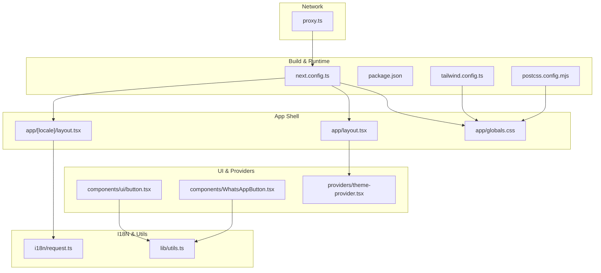
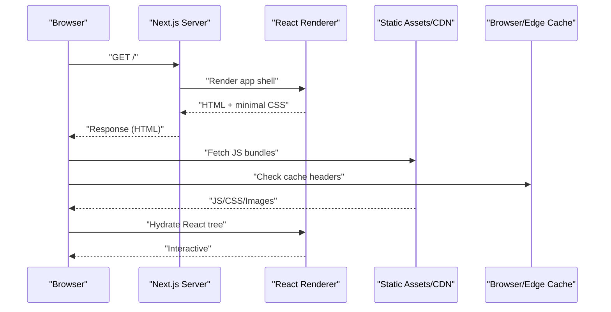
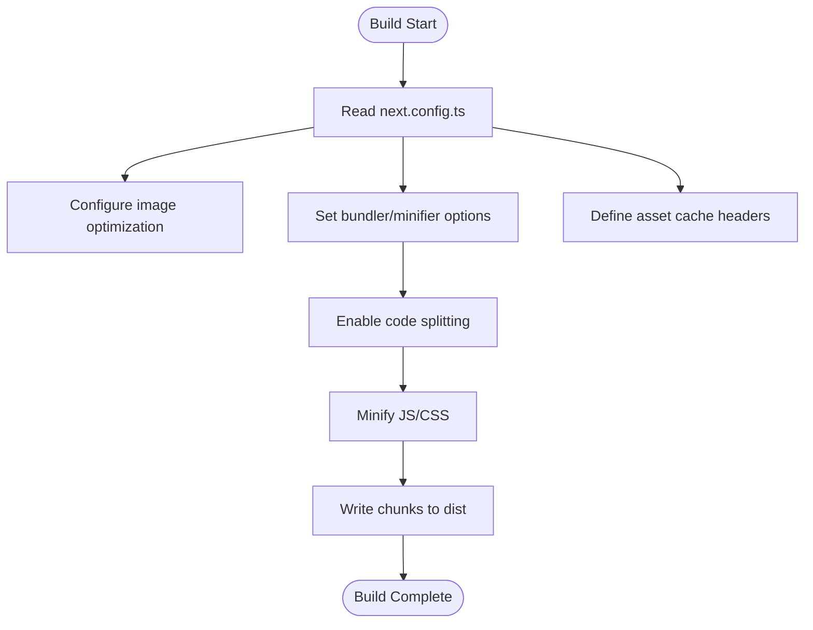
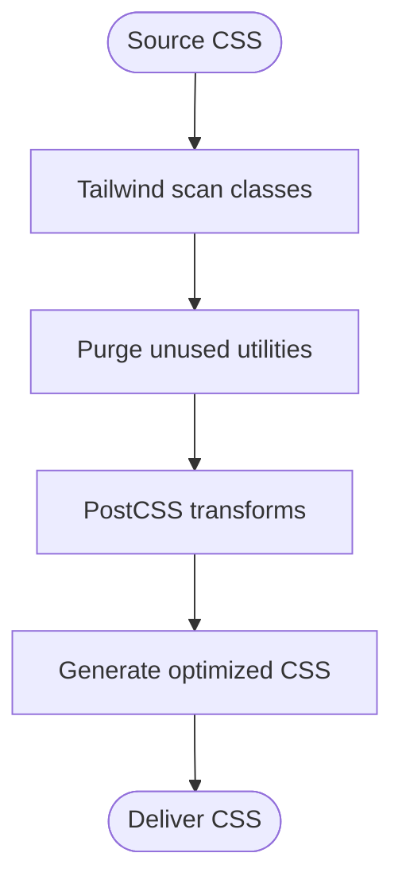
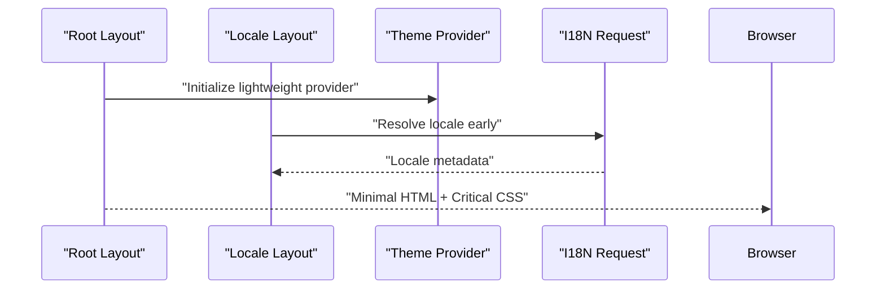
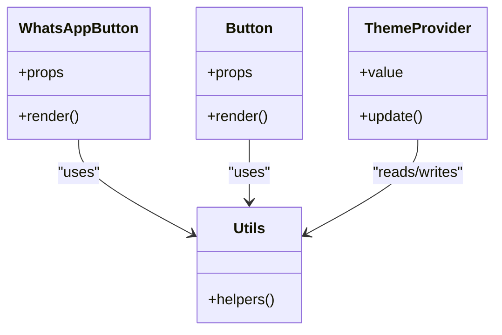
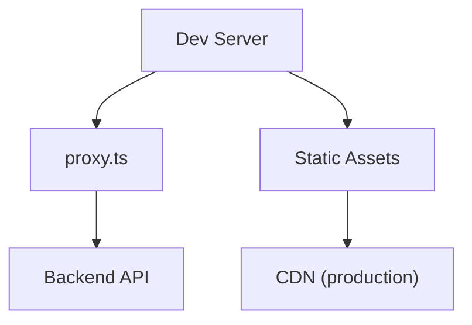
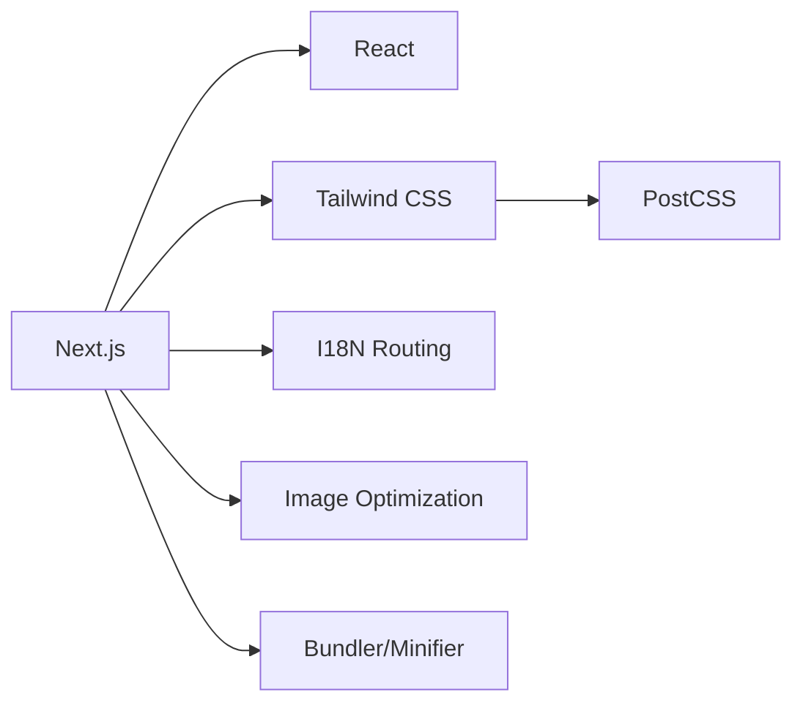

# Performance Optimization Strategies

<cite>
**Referenced Files in This Document**
- [next.config.ts](file://next.config.ts)
- [package.json](file://package.json)
- [app/layout.tsx](file://app/layout.tsx)
- [app/[locale]/layout.tsx](file://app/[locale]/layout.tsx)
- [app/globals.css](file://app/globals.css)
- [components/ui/button.tsx](file://components/ui/button.tsx)
- [components/WhatsAppButton.tsx](file://components/WhatsAppButton.tsx)
- [providers/theme-provider.tsx](file://providers/theme-provider.tsx)
- [i18n/request.ts](file://i18n/request.ts)
- [lib/utils.ts](file://lib/utils.ts)
- [tailwind.config.ts](file://tailwind.config.ts)
- [postcss.config.mjs](file://postcss.config.mjs)
- [proxy.ts](file://proxy.ts)
</cite>

## Table of Contents
1. [Introduction](#introduction)
2. [Project Structure](#project-structure)
3. [Core Components](#core-components)
4. [Architecture Overview](#architecture-overview)
5. [Detailed Component Analysis](#detailed-component-analysis)
6. [Dependency Analysis](#dependency-analysis)
7. [Performance Considerations](#performance-considerations)
8. [Troubleshooting Guide](#troubleshooting-guide)
9. [Conclusion](#conclusion)
10. [Appendices](#appendices)

## Introduction
This document provides a comprehensive guide to performance optimization for the project, focusing on Core Web Vitals (LCP, FID/INP, CLS), image optimization, code splitting, bundle size analysis, caching and CDN strategies, asset delivery, lazy loading, font optimization, critical CSS extraction, monitoring, bottleneck identification, and continuous improvement workflows. It maps recommendations to concrete files in the repository where applicable and includes diagrams to visualize key flows.

## Project Structure
The application is a Next.js app with internationalization, UI components, providers, and configuration files that influence runtime performance. Key areas relevant to performance include:
- Build and runtime configuration (Next.js, Tailwind, PostCSS)
- Global layout and CSS
- Client-side components and providers
- Internationalization routing and request handling
- Utility functions and proxy configuration

**Diagram sources**
- [next.config.ts](file://next.config.ts)
- [package.json](file://package.json)
- [tailwind.config.ts](file://tailwind.config.ts)
- [postcss.config.mjs](file://postcss.config.mjs)
- [app/layout.tsx](file://app/layout.tsx)
- [app/[locale]/layout.tsx](file://app/[locale]/layout.tsx)
- [app/globals.css](file://app/globals.css)
- [components/ui/button.tsx](file://components/ui/button.tsx)
- [components/WhatsAppButton.tsx](file://components/WhatsAppButton.tsx)
- [providers/theme-provider.tsx](file://providers/theme-provider.tsx)
- [i18n/request.ts](file://i18n/request.ts)
- [lib/utils.ts](file://lib/utils.ts)
- [proxy.ts](file://proxy.ts)

**Section sources**
- [next.config.ts](file://next.config.ts)
- [package.json](file://package.json)
- [tailwind.config.ts](file://tailwind.config.ts)
- [postcss.config.mjs](file://postcss.config.mjs)
- [app/layout.tsx](file://app/layout.tsx)
- [app/[locale]/layout.tsx](file://app/[locale]/layout.tsx)
- [app/globals.css](file://app/globals.css)
- [components/ui/button.tsx](file://components/ui/button.tsx)
- [components/WhatsAppButton.tsx](file://components/WhatsAppButton.tsx)
- [providers/theme-provider.tsx](file://providers/theme-provider.tsx)
- [i18n/request.ts](file://i18n/request.ts)
- [lib/utils.ts](file://lib/utils.ts)
- [proxy.ts](file://proxy.ts)

## Core Components
- Next.js build/runtime configuration: Controls bundling, image optimization, experimental features, and output behavior.
- Tailwind and PostCSS: Influence CSS processing, purging, and final stylesheet size.
- App shell layouts: Define global scripts, styles, and provider initialization order.
- UI components: Potential code-splitting boundaries and client-only dependencies.
- I18N request handling: Affects initial payload and hydration overhead.
- Utilities and providers: Shared logic that can be lazily loaded or memoized.

**Section sources**
- [next.config.ts](file://next.config.ts)
- [tailwind.config.ts](file://tailwind.config.ts)
- [postcss.config.mjs](file://postcss.config.mjs)
- [app/layout.tsx](file://app/layout.tsx)
- [app/[locale]/layout.tsx](file://app/[locale]/layout.tsx)
- [components/ui/button.tsx](file://components/ui/button.tsx)
- [components/WhatsAppButton.tsx](file://components/WhatsAppButton.tsx)
- [providers/theme-provider.tsx](file://providers/theme-provider.tsx)
- [i18n/request.ts](file://i18n/request.ts)
- [lib/utils.ts](file://lib/utils.ts)

## Architecture Overview
The performance-critical path starts at the Next.js server rendering the app shell, then hydrates the React tree. CSS is processed via Tailwind and PostCSS. Images are optimized by Next.js Image component pipeline. Client-only heavy components should be dynamically imported to reduce initial bundle.

**Diagram sources**
- [next.config.ts](file://next.config.ts)
- [app/layout.tsx](file://app/layout.tsx)
- [app/globals.css](file://app/globals.css)

## Detailed Component Analysis

### Next.js Configuration and Bundling
- Focus areas:
  - Enable image optimization and configure formats/sizes.
  - Use experimental flags judiciously (e.g., webpack settings, Turbopack).
  - Configure output and caching headers for static assets.
  - Ensure proper chunking and minification.

**Diagram sources**
- [next.config.ts](file://next.config.ts)

**Section sources**
- [next.config.ts](file://next.config.ts)

### Tailwind and PostCSS Processing
- Focus areas:
  - Purge unused CSS to reduce stylesheet size.
  - Avoid large third-party style imports; prefer utility-first patterns.
  - Keep PostCSS plugins minimal and efficient.

**Diagram sources**
- [tailwind.config.ts](file://tailwind.config.ts)
- [postcss.config.mjs](file://postcss.config.mjs)
- [app/globals.css](file://app/globals.css)

**Section sources**
- [tailwind.config.ts](file://tailwind.config.ts)
- [postcss.config.mjs](file://postcss.config.mjs)
- [app/globals.css](file://app/globals.css)

### App Shell Layouts and Hydration
- Focus areas:
  - Defer non-critical scripts and providers.
  - Inline only critical CSS; defer rest.
  - Avoid heavy work during initial render.

**Diagram sources**
- [app/layout.tsx](file://app/layout.tsx)
- [app/[locale]/layout.tsx](file://app/[locale]/layout.tsx)
- [providers/theme-provider.tsx](file://providers/theme-provider.tsx)
- [i18n/request.ts](file://i18n/request.ts)

**Section sources**
- [app/layout.tsx](file://app/layout.tsx)
- [app/[locale]/layout.tsx](file://app/[locale]/layout.tsx)
- [providers/theme-provider.tsx](file://providers/theme-provider.tsx)
- [i18n/request.ts](file://i18n/request.ts)

### UI Components and Code Splitting
- Focus areas:
  - Dynamically import heavy components (e.g., WhatsApp button).
  - Prefer client-only directives when necessary.
  - Memoize expensive computations in shared utilities.

**Diagram sources**
- [components/ui/button.tsx](file://components/ui/button.tsx)
- [components/WhatsAppButton.tsx](file://components/WhatsAppButton.tsx)
- [providers/theme-provider.tsx](file://providers/theme-provider.tsx)
- [lib/utils.ts](file://lib/utils.ts)

**Section sources**
- [components/ui/button.tsx](file://components/ui/button.tsx)
- [components/WhatsAppButton.tsx](file://components/WhatsAppButton.tsx)
- [providers/theme-provider.tsx](file://providers/theme-provider.tsx)
- [lib/utils.ts](file://lib/utils.ts)

### Network Proxy and Asset Delivery
- Focus areas:
  - Use proxy for local development to avoid CORS and speed up API calls.
  - In production, rely on CDN and edge caching for assets.

**Diagram sources**
- [proxy.ts](file://proxy.ts)
- [next.config.ts](file://next.config.ts)

**Section sources**
- [proxy.ts](file://proxy.ts)
- [next.config.ts](file://next.config.ts)

## Dependency Analysis
Key runtime and build-time dependencies influencing performance:
- Next.js core and image optimization pipeline.
- Tailwind CSS and PostCSS plugins.
- React and related libraries used in providers/components.
- I18N routing and message loading.

**Diagram sources**
- [package.json](file://package.json)
- [next.config.ts](file://next.config.ts)
- [tailwind.config.ts](file://tailwind.config.ts)
- [postcss.config.mjs](file://postcss.config.mjs)

**Section sources**
- [package.json](file://package.json)
- [next.config.ts](file://next.config.ts)
- [tailwind.config.ts](file://tailwind.config.ts)
- [postcss.config.mjs](file://postcss.config.mjs)

## Performance Considerations

### Core Web Vitals Optimization
- Largest Contentful Paint (LCP)
  - Prioritize above-the-fold content and preload critical resources.
  - Optimize images (formats, sizes, responsive srcset).
  - Reduce server response time and minimize render-blocking CSS/JS.
  - Use Next.js Image component and appropriate priority hints.
- First Input Delay / Interaction to Next Paint (FID/INP)
  - Defer non-critical JavaScript; split bundles.
  - Avoid long tasks on the main thread; use web workers if needed.
  - Debounce/throttle event handlers; memoize callbacks.
- Cumulative Layout Shift (CLS)
  - Reserve space for images, ads, and dynamic content.
  - Avoid inserting content above existing content without sizing.
  - Use aspect-ratio or explicit dimensions for media.

### Image Optimization Strategies
- Use Next.js Image component with correct width/height and format hints.
- Serve modern formats (WebP/AVIF) and responsive variants.
- Lazy-load offscreen images; prioritize LCP image.
- Preload hero images and fonts to reduce FOIT/FOUT.

### Code Splitting Implementation
- Dynamic imports for heavy components (e.g., WhatsApp button).
- Route-level splitting via Next.js file-based routing.
- Separate client-only code using "use client" where necessary.
- Analyze and remove unused dependencies.

### Bundle Size Analysis
- Use Next.js built-in bundle analyzer or external tools to identify large modules.
- Track growth over time; set budgets and alerts.
- Prefer tree-shakeable libraries and avoid default imports of entire packages.

### Caching Strategies and CDN Configuration
- Set immutable cache headers for hashed static assets.
- Use CDN for images, fonts, and JS/CSS bundles.
- Implement stale-while-revalidate for API responses where appropriate.
- Leverage browser cache and HTTP/2 multiplexing.

### Asset Delivery Optimization
- Minify and compress assets (gzip/Brotli).
- Use HTTP/2 or HTTP/3; enable keep-alive.
- Preconnect to critical origins; prefetch preloads selectively.

### Practical Examples
- Lazy Loading
  - Dynamically import heavy components to reduce initial bundle.
  - Use IntersectionObserver-based lazy loading for below-the-fold media.
- Font Optimization
  - Subset fonts; use display=swap to prevent text invisibility.
  - Preload critical font files; defer non-critical ones.
- Critical CSS Extraction
  - Inline only critical CSS for first paint; load remaining asynchronously.
  - Use tooling to extract critical styles from pages.

### Monitoring Performance Metrics
- Instrument RUM (Real User Monitoring) to collect LCP, INP, CLS.
- Track error rates and slow endpoints.
- Integrate performance budgets into CI to block regressions.

### Identifying Bottlenecks
- Profile network waterfall; identify slow TTFB and large payloads.
- Audit main-thread work; find long tasks and heavy reflows.
- Review memory usage and hydration costs.

### Continuous Performance Improvement Workflows
- Add performance checks to CI (bundle size, metrics thresholds).
- Automate regression detection and alerting.
- Regularly review analytics and user feedback to prioritize improvements.

[No sources needed since this section provides general guidance]

## Troubleshooting Guide
Common issues and resolutions:
- Large initial bundle causing slow TTI
  - Inspect bundle composition; split routes and components.
  - Remove unused dependencies and replace heavy libraries.
- Excessive CSS size
  - Verify Tailwind purge configuration; ensure paths cover all templates.
  - Avoid importing large third-party CSS; prefer utilities.
- Layout shifts due to images/fonts
  - Add explicit dimensions and aspect ratios; preload critical fonts.
- Hydration mismatches
  - Ensure consistent client/server state; avoid window-specific code in SSR.

**Section sources**
- [tailwind.config.ts](file://tailwind.config.ts)
- [postcss.config.mjs](file://postcss.config.mjs)
- [app/globals.css](file://app/globals.css)
- [components/WhatsAppButton.tsx](file://components/WhatsAppButton.tsx)
- [providers/theme-provider.tsx](file://providers/theme-provider.tsx)

## Conclusion
By aligning build and runtime configurations, optimizing images and CSS, implementing strategic code splitting, and establishing robust monitoring and CI checks, the application can achieve strong Core Web Vitals scores and maintain high performance over time. Focus on measurable improvements, automate guardrails, and iterate based on real-user data.

[No sources needed since this section summarizes without analyzing specific files]

## Appendices

### Appendix A: Quick Checklist
- Preload critical resources; optimize LCP image.
- Defer non-critical JS; split bundles.
- Reserve space for dynamic content to fix CLS.
- Enable CDN and immutable caching for static assets.
- Monitor RUM metrics and enforce performance budgets in CI.

[No sources needed since this section provides general guidance]