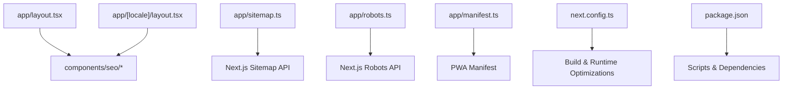
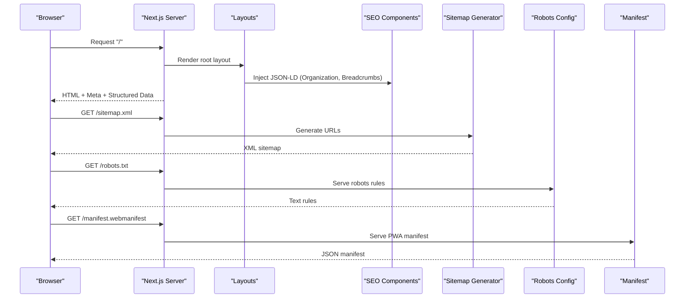
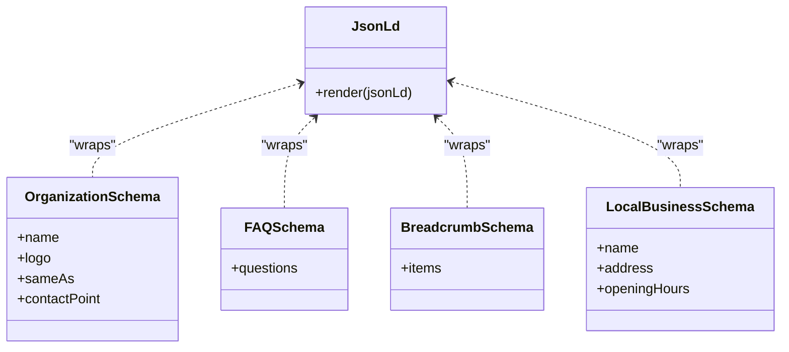
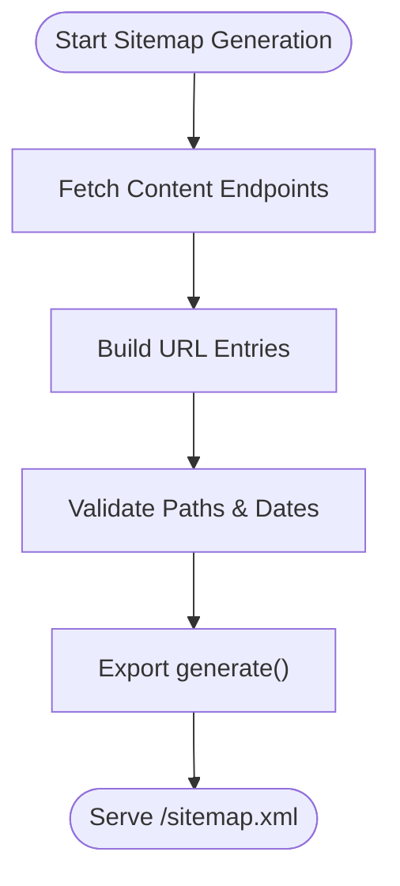
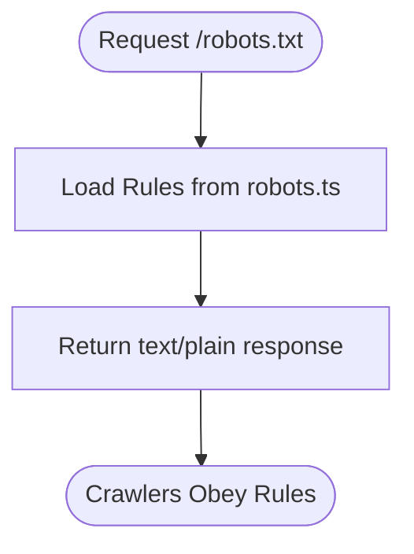
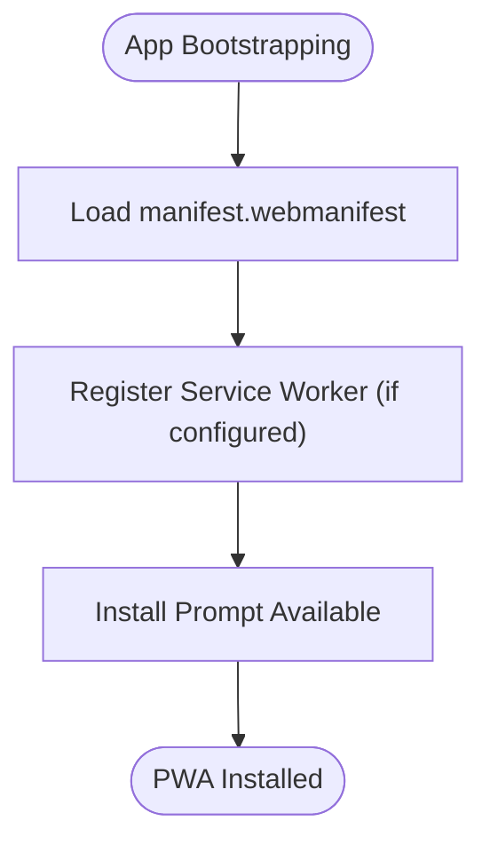
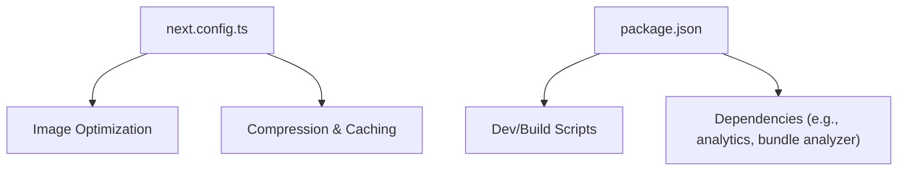

# SEO and Performance

<cite>
**Referenced Files in This Document**
- [app/layout.tsx](file://app/layout.tsx)
- [app/[locale]/layout.tsx](file://app/[locale]/layout.tsx)
- [app/manifest.ts](file://app/manifest.ts)
- [app/robots.ts](file://app/robots.ts)
- [app/sitemap.ts](file://app/sitemap.ts)
- [components/seo/JsonLd.tsx](file://components/seo/JsonLd.tsx)
- [components/seo/OrganizationSchema.tsx](file://components/seo/OrganizationSchema.tsx)
- [components/seo/FAQSchema.tsx](file://components/seo/FAQSchema.tsx)
- [components/seo/BreadcrumbSchema.tsx](file://components/seo/BreadcrumbSchema.tsx)
- [components/seo/LocalBusinessSchema.tsx](file://components/seo/LocalBusinessSchema.tsx)
- [next.config.ts](file://next.config.ts)
- [package.json](file://package.json)
</cite>

## Table of Contents
1. [Introduction](#introduction)
2. [Project Structure](#project-structure)
3. [Core Components](#core-components)
4. [Architecture Overview](#architecture-overview)
5. [Detailed Component Analysis](#detailed-component-analysis)
6. [Dependency Analysis](#dependency-analysis)
7. [Performance Considerations](#performance-considerations)
8. [Troubleshooting Guide](#troubleshooting-guide)
9. [Conclusion](#conclusion)
10. [Appendices](#appendices)

## Introduction
This document explains the SEO implementation and performance optimization strategies for the project. It covers structured data using JSON-LD (Organization, FAQ, Breadcrumb, Local Business), dynamic sitemap generation, robots configuration, PWA manifest setup, meta tag management, Open Graph tags, social media optimization, image and asset optimization, Core Web Vitals tuning, bundle analysis, caching strategies, and CDN configuration. The goal is to provide a clear, actionable guide for building SEO-friendly pages and optimizing performance across the application.

## Project Structure
The project follows Next.js conventions with app router patterns and dedicated SEO components:
- App layout files define global metadata and root structure.
- SEO utilities are encapsulated in reusable components under components/seo.
- Sitemap and robots are generated via Next.js APIs.
- PWA capabilities are configured through a manifest file.
- Build-time optimizations and bundling are controlled by next.config.ts and package scripts.

**Diagram sources**
- [app/layout.tsx](file://app/layout.tsx)
- [app/[locale]/layout.tsx](file://app/[locale]/layout.tsx)
- [components/seo/JsonLd.tsx](file://components/seo/JsonLd.tsx)
- [components/seo/OrganizationSchema.tsx](file://components/seo/OrganizationSchema.tsx)
- [components/seo/FAQSchema.tsx](file://components/seo/FAQSchema.tsx)
- [components/seo/BreadcrumbSchema.tsx](file://components/seo/BreadcrumbSchema.tsx)
- [components/seo/LocalBusinessSchema.tsx](file://components/seo/LocalBusinessSchema.tsx)
- [app/sitemap.ts](file://app/sitemap.ts)
- [app/robots.ts](file://app/robots.ts)
- [app/manifest.ts](file://app/manifest.ts)
- [next.config.ts](file://next.config.ts)
- [package.json](file://package.json)

**Section sources**
- [app/layout.tsx](file://app/layout.tsx)
- [app/[locale]/layout.tsx](file://app/[locale]/layout.tsx)
- [app/sitemap.ts](file://app/sitemap.ts)
- [app/robots.ts](file://app/robots.ts)
- [app/manifest.ts](file://app/manifest.ts)
- [next.config.ts](file://next.config.ts)
- [package.json](file://package.json)

## Core Components
- Structured Data (JSON-LD):
  - JsonLd component renders generic JSON-LD payloads.
  - OrganizationSchema provides Organization schema markup.
  - FAQSchema provides FAQPage schema markup.
  - BreadcrumbSchema provides BreadcrumbList schema markup.
  - LocalBusinessSchema provides LocalBusiness schema markup.
- Sitemap Generation:
  - app/sitemap.ts exports a generate function that returns URL entries for indexing.
- Robots Configuration:
  - app/robots.ts exports rules for crawlers.
- PWA Manifest:
  - app/manifest.ts defines PWA metadata such as name, icons, theme color, and display mode.
- Global Layouts:
  - app/layout.tsx and app/[locale]/layout.tsx set base metadata, language direction, and locale-aware settings.

Practical usage examples:
- Add Organization schema at the site root or within a page layout.
- Inject FAQ schema into pages that contain frequently asked questions.
- Use Breadcrumb schema on detail pages to improve search result rich snippets.
- Configure robots.txt directives to allow or disallow specific routes.
- Generate sitemaps dynamically based on content endpoints.
- Define PWA manifest properties for installability and branding.

**Section sources**
- [components/seo/JsonLd.tsx](file://components/seo/JsonLd.tsx)
- [components/seo/OrganizationSchema.tsx](file://components/seo/OrganizationSchema.tsx)
- [components/seo/FAQSchema.tsx](file://components/seo/FAQSchema.tsx)
- [components/seo/BreadcrumbSchema.tsx](file://components/seo/BreadcrumbSchema.tsx)
- [components/seo/LocalBusinessSchema.tsx](file://components/seo/LocalBusinessSchema.tsx)
- [app/sitemap.ts](file://app/sitemap.ts)
- [app/robots.ts](file://app/robots.ts)
- [app/manifest.ts](file://app/manifest.ts)
- [app/layout.tsx](file://app/layout.tsx)
- [app/[locale]/layout.tsx](file://app/[locale]/layout.tsx)

## Architecture Overview
SEO and performance architecture integrates server-side metadata, structured data injection, and build-time optimizations:
- Metadata and structured data are rendered during server rendering for fast initial paint and better crawlability.
- Sitemap and robots are generated at build time or runtime depending on configuration.
- PWA manifest enables progressive web app features like installation and offline support.
- Next.js config centralizes performance-related settings such as image optimization, compression, and caching headers.

**Diagram sources**
- [app/layout.tsx](file://app/layout.tsx)
- [app/[locale]/layout.tsx](file://app/[locale]/layout.tsx)
- [components/seo/JsonLd.tsx](file://components/seo/JsonLd.tsx)
- [components/seo/OrganizationSchema.tsx](file://components/seo/OrganizationSchema.tsx)
- [components/seo/BreadcrumbSchema.tsx](file://components/seo/BreadcrumbSchema.tsx)
- [app/sitemap.ts](file://app/sitemap.ts)
- [app/robots.ts](file://app/robots.ts)
- [app/manifest.ts](file://app/manifest.ts)

## Detailed Component Analysis

### Structured Data Components
- JsonLd:
  - Purpose: Renders arbitrary JSON-LD payloads into script tags.
  - Usage: Wrap any schema object and inject it into the page head/body.
  - Benefits: Centralized structured data handling; easy composition.
- OrganizationSchema:
  - Purpose: Provides Organization schema with fields like name, logo, sameAs, contactPoint.
  - Usage: Include in root layout or organization-specific pages.
- FAQSchema:
  - Purpose: Provides FAQPage schema with question-answer pairs.
  - Usage: Embed in pages containing FAQs to enable rich results.
- BreadcrumbSchema:
  - Purpose: Provides BreadcrumbList schema for navigation hierarchy.
  - Usage: Add to category or product pages to enhance SERPs.
- LocalBusinessSchema:
  - Purpose: Provides LocalBusiness schema for local SEO signals.
  - Usage: Include on location or service area pages.

**Diagram sources**
- [components/seo/JsonLd.tsx](file://components/seo/JsonLd.tsx)
- [components/seo/OrganizationSchema.tsx](file://components/seo/OrganizationSchema.tsx)
- [components/seo/FAQSchema.tsx](file://components/seo/FAQSchema.tsx)
- [components/seo/BreadcrumbSchema.tsx](file://components/seo/BreadcrumbSchema.tsx)
- [components/seo/LocalBusinessSchema.tsx](file://components/seo/LocalBusinessSchema.tsx)

**Section sources**
- [components/seo/JsonLd.tsx](file://components/seo/JsonLd.tsx)
- [components/seo/OrganizationSchema.tsx](file://components/seo/OrganizationSchema.tsx)
- [components/seo/FAQSchema.tsx](file://components/seo/FAQSchema.tsx)
- [components/seo/BreadcrumbSchema.tsx](file://components/seo/BreadcrumbSchema.tsx)
- [components/seo/LocalBusinessSchema.tsx](file://components/seo/LocalBusinessSchema.tsx)

### Sitemap Generation
- app/sitemap.ts exports a generate function returning an array of URL objects with path, lastModified, changeFrequency, and priority.
- Integrate with content APIs to populate dynamic routes.
- Ensure canonical URLs match your preferred domain and include hreflang variants if applicable.

**Diagram sources**
- [app/sitemap.ts](file://app/sitemap.ts)

**Section sources**
- [app/sitemap.ts](file://app/sitemap.ts)

### Robots Configuration
- app/robots.ts exports rules controlling crawler behavior.
- Common directives: allow, disallow, host, sitemap links.
- Keep rules aligned with sitemap and public routes.

**Diagram sources**
- [app/robots.ts](file://app/robots.ts)

**Section sources**
- [app/robots.ts](file://app/robots.ts)

### PWA Manifest Setup
- app/manifest.ts defines PWA metadata including name, short_name, description, start_url, display, background_color, theme_color, and icons.
- Ensure icons are available and referenced correctly for various sizes.
- Link manifest in layouts for installability and branding.

**Diagram sources**
- [app/manifest.ts](file://app/manifest.ts)

**Section sources**
- [app/manifest.ts](file://app/manifest.ts)

### Meta Tag Management and Social Media Optimization
- Global metadata should be defined in app/layout.tsx and app/[locale]/layout.tsx.
- Include title, description, canonical link, and lang attributes.
- Add Open Graph tags (og:title, og:description, og:image, og:url, og:type) and Twitter Card tags (twitter:card, twitter:title, twitter:description, twitter:image).
- Use consistent canonical URLs and hreflang annotations for multilingual sites.

**Section sources**
- [app/layout.tsx](file://app/layout.tsx)
- [app/[locale]/layout.tsx](file://app/[locale]/layout.tsx)

## Dependency Analysis
Key dependencies and their roles:
- next.config.ts: Controls build-time optimizations, image formats, compression, and caching headers.
- package.json: Contains scripts for development, build, and optional bundle analysis tools.

**Diagram sources**
- [next.config.ts](file://next.config.ts)
- [package.json](file://package.json)

**Section sources**
- [next.config.ts](file://next.config.ts)
- [package.json](file://package.json)

## Performance Considerations
- Core Web Vitals:
  - Largest Contentful Paint (LCP): Optimize hero images, preload critical assets, use modern formats (WebP/AVIF), and leverage CDN caching.
  - First Input Delay (FID)/Interaction to Next Paint (INP): Minimize main-thread work, defer non-critical JS, and split bundles.
  - Cumulative Layout Shift (CLS): Reserve space for images and embeds, avoid injecting content above existing content without sizing.
- Image and Asset Optimization:
  - Use Next.js Image component with proper width/height and format hints.
  - Implement lazy loading for below-the-fold images.
  - Prefer vector graphics where appropriate and compress static assets.
- Bundle Analysis:
  - Use Next.js built-in bundle analysis or third-party tools to identify large dependencies.
  - Tree-shake unused code and prefer dynamic imports for heavy components.
- Caching Strategies:
  - Set appropriate cache-control headers for static assets and API responses.
  - Leverage browser caching and CDN edge caching for long-lived resources.
- CDN Configuration:
  - Enable HTTP/2 or HTTP/3, gzip/brotli compression, and immutable caching for hashed assets.
  - Configure origin shielding and cache key strategies to maximize hit rates.

[No sources needed since this section provides general guidance]

## Troubleshooting Guide
Common issues and resolutions:
- Missing or invalid structured data:
  - Validate JSON-LD using Google Rich Results Test and Schema Markup Validator.
  - Ensure required fields are present and values are accurate.
- Sitemap not updating:
  - Verify generate function logic and endpoint availability.
  - Check lastModified timestamps and changeFrequency values.
- Robots blocking important routes:
  - Review allow/disallow rules and ensure sitemap URL is included.
- PWA not installing:
  - Confirm manifest.webmanifest is served and valid.
  - Ensure HTTPS and service worker registration (if used).
- Poor Core Web Vitals:
  - Audit LCP candidates and optimize largest element.
  - Reduce CLS by reserving dimensions and avoiding late injections.
  - Profile INP with performance tools and defer heavy tasks.

**Section sources**
- [components/seo/JsonLd.tsx](file://components/seo/JsonLd.tsx)
- [app/sitemap.ts](file://app/sitemap.ts)
- [app/robots.ts](file://app/robots.ts)
- [app/manifest.ts](file://app/manifest.ts)

## Conclusion
By integrating robust structured data, dynamic sitemaps, precise robots configuration, and a well-defined PWA manifest, the application achieves strong SEO foundations. Coupled with performance best practices—image optimization, bundle analysis, caching, and CDN tuning—the site delivers fast, accessible, and indexable experiences. Continuous monitoring of Core Web Vitals and structured data validation ensures sustained quality and visibility.

[No sources needed since this section summarizes without analyzing specific files]

## Appendices
- Practical checklist:
  - Add Organization schema at site root.
  - Inject FAQ schema on relevant pages.
  - Use Breadcrumb schema on hierarchical pages.
  - Generate dynamic sitemaps from content APIs.
  - Configure robots.txt to allow crawling and reference sitemap.
  - Define PWA manifest with complete metadata and icons.
  - Set global meta tags and Open Graph/Twitter Card tags.
  - Optimize images and assets; implement lazy loading.
  - Analyze bundles and remove unused dependencies.
  - Apply caching headers and configure CDN for optimal delivery.
  - Monitor Core Web Vitals and iterate on improvements.

[No sources needed since this section provides general guidance]