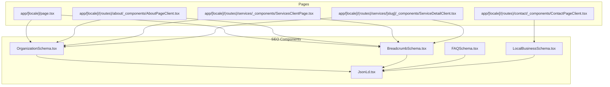
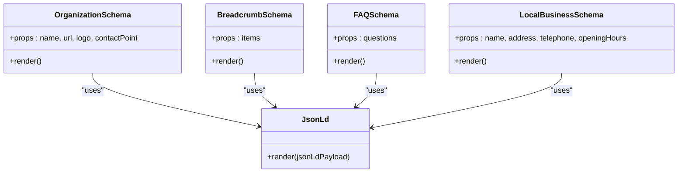
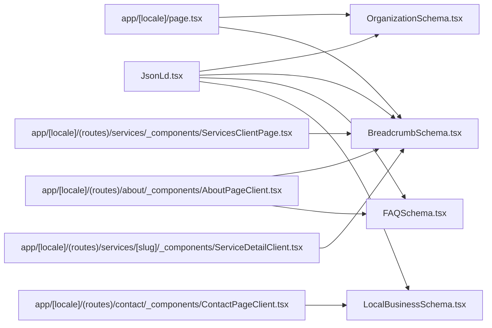

# Structured Data and Schema Markup

<cite>
**Referenced Files in This Document**
- [JsonLd.tsx](file://components/seo/JsonLd.tsx)
- [OrganizationSchema.tsx](file://components/seo/OrganizationSchema.tsx)
- [BreadcrumbSchema.tsx](file://components/seo/BreadcrumbSchema.tsx)
- [FAQSchema.tsx](file://components/seo/FAQSchema.tsx)
- [LocalBusinessSchema.tsx](file://components/seo/LocalBusinessSchema.tsx)
- [layout.tsx](file://app/layout.tsx)
- [page.tsx](file://app/[locale]/page.tsx)
- [AboutPageClient.tsx](file://app/[locale]/(routes)/about/_components/AboutPageClient.tsx)
- [ContactPageClient.tsx](file://app/[locale]/(routes)/contact/_components/ContactPageClient.tsx)
- [ServicesClientPage.tsx](file://app/[locale]/(routes)/services/_components/ServicesClientPage.tsx)
- [ServiceDetailClient.tsx](file://app/[locale]/(routes)/services/[slug]/_components/ServiceDetailClient.tsx)
</cite>

## Table of Contents
1. [Introduction](#introduction)
2. [Project Structure](#project-structure)
3. [Core Components](#core-components)
4. [Architecture Overview](#architecture-overview)
5. [Detailed Component Analysis](#detailed-component-analysis)
6. [Dependency Analysis](#dependency-analysis)
7. [Performance Considerations](#performance-considerations)
8. [Troubleshooting Guide](#troubleshooting-guide)
9. [Conclusion](#conclusion)
10. [Appendices](#appendices)

## Introduction
This document explains how structured data is implemented using JSON-LD schema markup in the project. It covers the JsonLd component architecture, how to implement Organization, Breadcrumb, FAQ, and Local Business schemas, and provides practical guidance for adding schema markup across different page types. It also outlines SEO benefits, configuration patterns, validation strategies, best practices for organization, error handling, and performance considerations when rendering structured data.

## Project Structure
Structured data components are centralized under a dedicated SEO folder and consumed by pages that need rich snippets or enhanced search visibility. The core building block is a reusable JsonLd component that injects script tags with JSON-LD payloads into the rendered HTML. Specialized schema components wrap this base functionality to provide domain-specific structures such as Organization, Breadcrumb, FAQ, and Local Business.

**Diagram sources**
- [JsonLd.tsx](file://components/seo/JsonLd.tsx)
- [OrganizationSchema.tsx](file://components/seo/OrganizationSchema.tsx)
- [BreadcrumbSchema.tsx](file://components/seo/BreadcrumbSchema.tsx)
- [FAQSchema.tsx](file://components/seo/FAQSchema.tsx)
- [LocalBusinessSchema.tsx](file://components/seo/LocalBusinessSchema.tsx)
- [page.tsx](file://app/[locale]/page.tsx)
- [AboutPageClient.tsx](file://app/[locale]/(routes)/about/_components/AboutPageClient.tsx)
- [ContactPageClient.tsx](file://app/[locale]/(routes)/contact/_components/ContactPageClient.tsx)
- [ServicesClientPage.tsx](file://app/[locale]/(routes)/services/_components/ServicesClientPage.tsx)
- [ServiceDetailClient.tsx](file://app/[locale]/(routes)/services/[slug]/_components/ServiceDetailClient.tsx)

**Section sources**
- [JsonLd.tsx](file://components/seo/JsonLd.tsx)
- [OrganizationSchema.tsx](file://components/seo/OrganizationSchema.tsx)
- [BreadcrumbSchema.tsx](file://components/seo/BreadcrumbSchema.tsx)
- [FAQSchema.tsx](file://components/seo/FAQSchema.tsx)
- [LocalBusinessSchema.tsx](file://components/seo/LocalBusinessSchema.tsx)
- [page.tsx](file://app/[locale]/page.tsx)
- [AboutPageClient.tsx](file://app/[locale]/(routes)/about/_components/AboutPageClient.tsx)
- [ContactPageClient.tsx](file://app/[locale]/(routes)/contact/_components/ContactPageClient.tsx)
- [ServicesClientPage.tsx](file://app/[locale]/(routes)/services/_components/ServicesClientPage.tsx)
- [ServiceDetailClient.tsx](file://app/[locale]/(routes)/services/[slug]/_components/ServiceDetailClient.tsx)

## Core Components
The structured data system centers around a reusable JsonLd component that renders JSON-LD script elements. Domain-specific schema components (Organization, Breadcrumb, FAQ, Local Business) compose this base component to produce well-formed structured data for each use case. Pages import and render these schema components where appropriate to enrich their content for search engines.

Key responsibilities:
- Base JsonLd component: Renders JSON-LD payloads safely within the document head/body context.
- OrganizationSchema: Provides organizational identity and contact information.
- BreadcrumbSchema: Encodes navigation hierarchy for improved indexing and rich results.
- FAQSchema: Declares frequently asked questions and answers for potential rich snippets.
- LocalBusinessSchema: Describes local business details including address, hours, and service areas.

Usage pattern:
- Import the relevant schema component in a page or client component.
- Pass required properties (e.g., name, url, breadcrumbs, FAQs).
- Render the component at the top of the page/component tree so it appears early in the DOM.

**Section sources**
- [JsonLd.tsx](file://components/seo/JsonLd.tsx)
- [OrganizationSchema.tsx](file://components/seo/OrganizationSchema.tsx)
- [BreadcrumbSchema.tsx](file://components/seo/BreadcrumbSchema.tsx)
- [FAQSchema.tsx](file://components/seo/FAQSchema.tsx)
- [LocalBusinessSchema.tsx](file://components/seo/LocalBusinessSchema.tsx)

## Architecture Overview
The architecture follows a layered approach:
- Base layer: JsonLd component handles serialization and injection of JSON-LD.
- Schema layer: Specialized components encapsulate schema-specific logic and property mapping.
- Page layer: Pages consume schema components to declare structured data for their content.

**Diagram sources**
- [JsonLd.tsx](file://components/seo/JsonLd.tsx)
- [OrganizationSchema.tsx](file://components/seo/OrganizationSchema.tsx)
- [BreadcrumbSchema.tsx](file://components/seo/BreadcrumbSchema.tsx)
- [FAQSchema.tsx](file://components/seo/FAQSchema.tsx)
- [LocalBusinessSchema.tsx](file://components/seo/LocalBusinessSchema.tsx)

## Detailed Component Analysis

### JsonLd Component
Purpose:
- Centralizes JSON-LD rendering to ensure consistent structure and safe insertion into the document.
- Accepts a payload object and serializes it into a JSON-LD script element.

Implementation highlights:
- Accepts typed props for the JSON-LD payload.
- Produces a script tag with type set to application/ld+json.
- Ensures proper escaping and formatting of the payload.

Best practices:
- Keep payloads minimal and focused on the page’s primary entity.
- Avoid duplicating identical payloads across multiple locations.
- Validate inputs before rendering to prevent malformed JSON-LD.

**Section sources**
- [JsonLd.tsx](file://components/seo/JsonLd.tsx)

### OrganizationSchema
Purpose:
- Declares the organization’s canonical identity and key contact points.

Typical properties:
- Name, URL, logo, email, phone number, sameAs links.

When to use:
- Global site identity; often included on most pages.

Integration example:
- Include on the root layout or high-level pages to establish site-wide identity.

**Section sources**
- [OrganizationSchema.tsx](file://components/seo/OrganizationSchema.tsx)
- [layout.tsx](file://app/layout.tsx)
- [page.tsx](file://app/[locale]/page.tsx)

### BreadcrumbSchema
Purpose:
- Encodes the hierarchical navigation path for a page.

Typical properties:
- Ordered list of breadcrumb items with name and URL.

When to use:
- Any page with a meaningful navigation trail (e.g., services, categories, detail pages).

Integration example:
- Add to service listing and service detail pages to improve indexing and rich results.

**Section sources**
- [BreadcrumbSchema.tsx](file://components/seo/BreadcrumbSchema.tsx)
- [ServicesClientPage.tsx](file://app/[locale]/(routes)/services/_components/ServicesClientPage.tsx)
- [ServiceDetailClient.tsx](file://app/[locale]/(routes)/services/[slug]/_components/ServiceDetailClient.tsx)

### FAQSchema
Purpose:
- Declares frequently asked questions and answers to enable rich snippets.

Typical properties:
- Array of question-answer pairs with text content.

When to use:
- Help centers, product/service pages with common queries.

Integration example:
- Embed on about or contact pages if they contain Q&A content.

**Section sources**
- [FAQSchema.tsx](file://components/seo/FAQSchema.tsx)
- [AboutPageClient.tsx](file://app/[locale]/(routes)/about/_components/AboutPageClient.tsx)
- [ContactPageClient.tsx](file://app/[locale]/(routes)/contact/_components/ContactPageClient.tsx)

### LocalBusinessSchema
Purpose:
- Describes a local business entity including location, contact info, and operating hours.

Typical properties:
- Name, address, telephone, opening hours, geo coordinates, service area.

When to use:
- Contact or location-focused pages to enhance local search visibility.

Integration example:
- Place on contact pages to surface local business rich results.

**Section sources**
- [LocalBusinessSchema.tsx](file://components/seo/LocalBusinessSchema.tsx)
- [ContactPageClient.tsx](file://app/[locale]/(routes)/contact/_components/ContactPageClient.tsx)

### Page-Level Integration Examples
- Root home page: Include Organization and Breadcrumb schemas to establish identity and basic navigation context.
- About page: Optionally include FAQ schema if the page contains Q&A content.
- Contact page: Include Local Business schema to highlight physical presence and contact details.
- Services listing and detail pages: Include Breadcrumb schema to reflect category and item hierarchy.

**Section sources**
- [page.tsx](file://app/[locale]/page.tsx)
- [AboutPageClient.tsx](file://app/[locale]/(routes)/about/_components/AboutPageClient.tsx)
- [ContactPageClient.tsx](file://app/[locale]/(routes)/contact/_components/ContactPageClient.tsx)
- [ServicesClientPage.tsx](file://app/[locale]/(routes)/services/_components/ServicesClientPage.tsx)
- [ServiceDetailClient.tsx](file://app/[locale]/(routes)/services/[slug]/_components/ServiceDetailClient.tsx)

## Dependency Analysis
The schema components depend on the base JsonLd component. Pages depend on specific schema components based on their content needs.

**Diagram sources**
- [JsonLd.tsx](file://components/seo/JsonLd.tsx)
- [OrganizationSchema.tsx](file://components/seo/OrganizationSchema.tsx)
- [BreadcrumbSchema.tsx](file://components/seo/BreadcrumbSchema.tsx)
- [FAQSchema.tsx](file://components/seo/FAQSchema.tsx)
- [LocalBusinessSchema.tsx](file://components/seo/LocalBusinessSchema.tsx)
- [page.tsx](file://app/[locale]/page.tsx)
- [AboutPageClient.tsx](file://app/[locale]/(routes)/about/_components/AboutPageClient.tsx)
- [ContactPageClient.tsx](file://app/[locale]/(routes)/contact/_components/ContactPageClient.tsx)
- [ServicesClientPage.tsx](file://app/[locale]/(routes)/services/_components/ServicesClientPage.tsx)
- [ServiceDetailClient.tsx](file://app/[locale]/(routes)/services/[slug]/_components/ServiceDetailClient.tsx)

**Section sources**
- [JsonLd.tsx](file://components/seo/JsonLd.tsx)
- [OrganizationSchema.tsx](file://components/seo/OrganizationSchema.tsx)
- [BreadcrumbSchema.tsx](file://components/seo/BreadcrumbSchema.tsx)
- [FAQSchema.tsx](file://components/seo/FAQSchema.tsx)
- [LocalBusinessSchema.tsx](file://components/seo/LocalBusinessSchema.tsx)
- [page.tsx](file://app/[locale]/page.tsx)
- [AboutPageClient.tsx](file://app/[locale]/(routes)/about/_components/AboutPageClient.tsx)
- [ContactPageClient.tsx](file://app/[locale]/(routes)/contact/_components/ContactPageClient.tsx)
- [ServicesClientPage.tsx](file://app/[locale]/(routes)/services/_components/ServicesClientPage.tsx)
- [ServiceDetailClient.tsx](file://app/[locale]/(routes)/services/[slug]/_components/ServiceDetailClient.tsx)

## Performance Considerations
- Minimize payload size: Only include necessary fields to reduce HTML size.
- Avoid duplication: Do not repeat identical JSON-LD blocks across multiple components.
- Early rendering: Place schema components near the top of the page/component tree to ensure early availability in the DOM.
- Conditional rendering: Use feature flags or environment checks to skip heavy schemas on low-priority routes.
- Static vs dynamic: Prefer static values for stable identifiers (e.g., organization URL) and compute dynamic values only when needed.

[No sources needed since this section provides general guidance]

## Troubleshooting Guide
Common issues and resolutions:
- Missing required properties: Ensure all mandatory fields for each schema are provided.
- Malformed JSON-LD: Validate payloads before rendering; avoid runtime string interpolation errors.
- Duplicate schemas: Consolidate repeated blocks into shared components or higher-level layouts.
- Incorrect URLs or paths: Verify absolute URLs and canonical references.
- Localization mismatches: Confirm that localized content aligns with schema language attributes.

Validation tools:
- Google Rich Results Test
- Schema Markup Validator
- Browser DevTools Network tab to inspect generated script tags

Error handling recommendations:
- Wrap schema rendering in try/catch blocks where dynamic data is involved.
- Provide fallbacks for missing optional fields.
- Log warnings for invalid or incomplete payloads during development.

**Section sources**
- [JsonLd.tsx](file://components/seo/JsonLd.tsx)
- [OrganizationSchema.tsx](file://components/seo/OrganizationSchema.tsx)
- [BreadcrumbSchema.tsx](file://components/seo/BreadcrumbSchema.tsx)
- [FAQSchema.tsx](file://components/seo/FAQSchema.tsx)
- [LocalBusinessSchema.tsx](file://components/seo/LocalBusinessSchema.tsx)

## Conclusion
By centralizing JSON-LD rendering through a reusable JsonLd component and providing specialized schema components for Organization, Breadcrumb, FAQ, and Local Business, the project achieves a clean, maintainable, and scalable approach to structured data. Pages can easily opt-in to rich snippets by composing these components, while adhering to best practices for performance, validation, and error handling ensures robust SEO outcomes.

[No sources needed since this section summarizes without analyzing specific files]

## Appendices

### Benefits of Structured Data for SEO and Rich Snippets
- Enhanced search visibility with rich results (e.g., breadcrumbs, FAQs, local business cards).
- Improved crawlability and understanding of page content by search engines.
- Higher click-through rates due to richer presentation in SERPs.
- Better indexing accuracy for complex hierarchies and entities.

[No sources needed since this section provides general guidance]

### Practical Implementation Checklist
- Identify page entities and choose appropriate schemas.
- Populate required properties accurately.
- Render schema components early in the page/component tree.
- Validate outputs using official testing tools.
- Monitor performance impact and optimize payloads.

[No sources needed since this section provides general guidance]