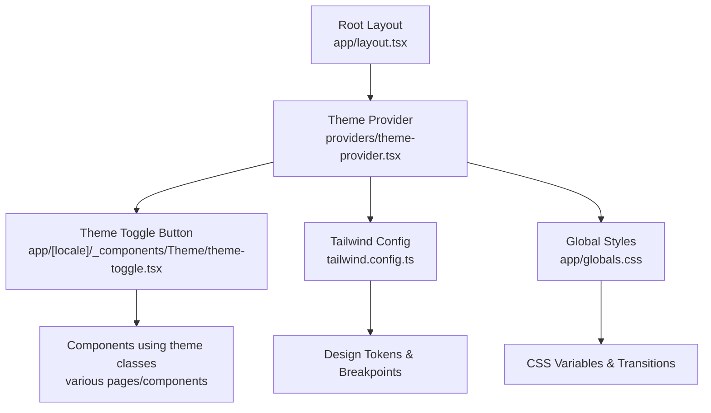
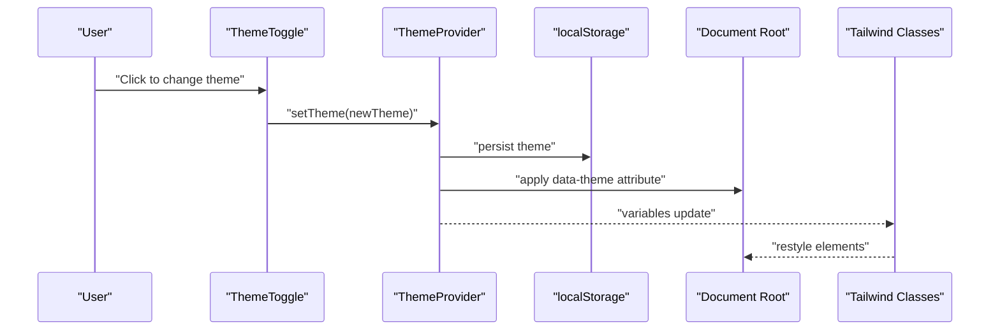
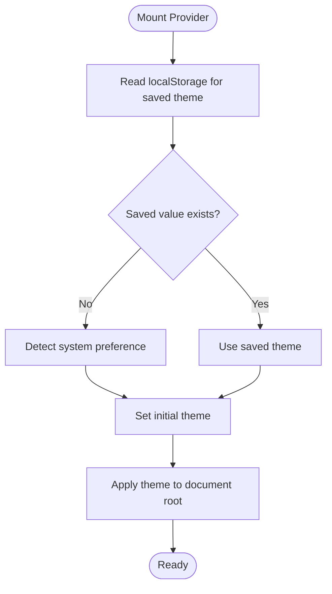
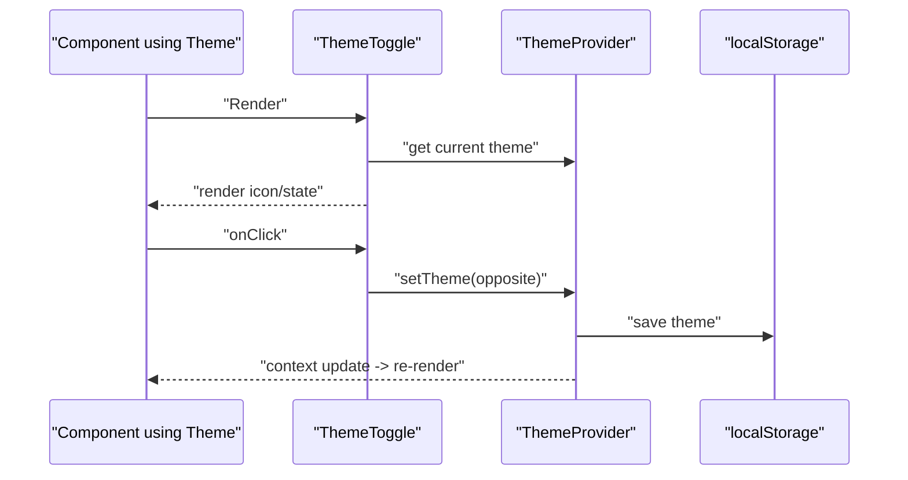
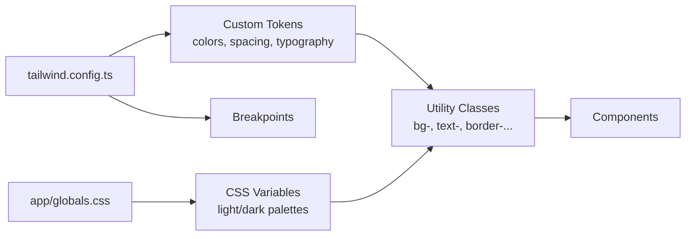
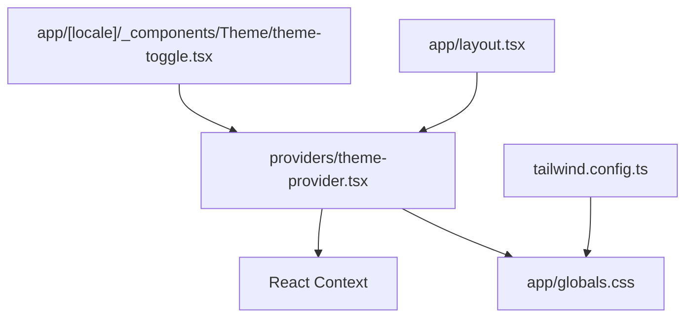

# Theme System

<cite>
**Referenced Files in This Document**
- [theme-provider.tsx](file://providers/theme-provider.tsx)
- [theme-toggle.tsx](file://app/[locale]/_components/Theme/theme-toggle.tsx)
- [tailwind.config.ts](file://tailwind.config.ts)
- [globals.css](file://app/globals.css)
- [layout.tsx](file://app/layout.tsx)
- [package.json](file://package.json)
</cite>

## Table of Contents
1. [Introduction](#introduction)
2. [Project Structure](#project-structure)
3. [Core Components](#core-components)
4. [Architecture Overview](#architecture-overview)
5. [Detailed Component Analysis](#detailed-component-analysis)
6. [Dependency Analysis](#dependency-analysis)
7. [Performance Considerations](#performance-considerations)
8. [Troubleshooting Guide](#troubleshooting-guide)
9. [Conclusion](#conclusion)
10. [Appendices](#appendices)

## Introduction
This document explains the theme system that supports dark and light modes with persistent user preferences, automatic detection from system settings, and Tailwind CSS integration. It covers the provider architecture, context-based state management, theme toggle implementation, color scheme configuration, component theming strategies, and best practices for performance and cross-browser compatibility.

## Project Structure
The theme system is implemented across a small set of focused files:
- Provider and context for theme state and persistence
- UI toggle to switch themes
- Tailwind configuration for design tokens and responsive breakpoints
- Global styles for base variables and transitions
- Root layout to initialize the provider

**Diagram sources**
- [layout.tsx](file://app/layout.tsx)
- [theme-provider.tsx](file://providers/theme-provider.tsx)
- [theme-toggle.tsx](file://app/[locale]/_components/Theme/theme-toggle.tsx)
- [tailwind.config.ts](file://tailwind.config.ts)
- [globals.css](file://app/globals.css)

**Section sources**
- [layout.tsx](file://app/layout.tsx)
- [theme-provider.tsx](file://providers/theme-provider.tsx)
- [theme-toggle.tsx](file://app/[locale]/_components/Theme/theme-toggle.tsx)
- [tailwind.config.ts](file://tailwind.config.ts)
- [globals.css](file://app/globals.css)

## Core Components
- Theme Provider: Supplies current theme value, setter, and persistence logic via React context. It initializes the theme from local storage or system preference and applies it to the document root.
- Theme Toggle: A button that reads the current theme from context and toggles between light and dark modes. It updates persisted preference and triggers re-render across consumers.
- Tailwind Configuration: Defines custom theme tokens (colors, spacing, typography) and extends default breakpoints. Uses CSS variables for dynamic theming.
- Global Styles: Declares CSS custom properties for light/dark palettes and transition utilities to avoid flash-of-wrong-theme.

Key responsibilities:
- Centralized state: single source of truth for theme
- Persistence: stores user choice in local storage
- Auto-detection: falls back to system preference when no stored value exists
- Integration: exposes theme-aware class names through Tailwind and CSS variables

**Section sources**
- [theme-provider.tsx](file://providers/theme-provider.tsx)
- [theme-toggle.tsx](file://app/[locale]/_components/Theme/theme-toggle.tsx)
- [tailwind.config.ts](file://tailwind.config.ts)
- [globals.css](file://app/globals.css)

## Architecture Overview
The theme system follows a provider-consumer pattern:
- The provider wraps the application tree and manages theme state and persistence.
- Consumers (e.g., components, pages) access the theme via context hooks.
- Tailwind uses CSS variables to reflect theme changes without rebuilds.
- The root layout ensures the provider is mounted early to prevent FOUC.

**Diagram sources**
- [theme-toggle.tsx](file://app/[locale]/_components/Theme/theme-toggle.tsx)
- [theme-provider.tsx](file://providers/theme-provider.tsx)
- [tailwind.config.ts](file://tailwind.config.ts)
- [globals.css](file://app/globals.css)

## Detailed Component Analysis

### Theme Provider
Responsibilities:
- Initialize theme from local storage; if absent, detect system preference.
- Provide theme value and setter via context.
- Apply theme to document root to enable CSS variable-driven styling.
- Persist user selection to local storage.

State and behavior:
- State: current theme ("light" | "dark")
- Effects: hydration-safe initialization and applying theme to DOM
- Context API: exposes both value and setter for consumers

**Diagram sources**
- [theme-provider.tsx](file://providers/theme-provider.tsx)

**Section sources**
- [theme-provider.tsx](file://providers/theme-provider.tsx)

### Theme Toggle
Responsibilities:
- Read current theme from context.
- Toggle between light and dark on click.
- Update persisted preference and trigger re-render.

Implementation notes:
- Uses the theme context setter to change mode.
- Persists the new theme immediately.
- Can be placed anywhere in the app tree below the provider.

**Diagram sources**
- [theme-toggle.tsx](file://app/[locale]/_components/Theme/theme-toggle.tsx)
- [theme-provider.tsx](file://providers/theme-provider.tsx)

**Section sources**
- [theme-toggle.tsx](file://app/[locale]/_components/Theme/theme-toggle.tsx)
- [theme-provider.tsx](file://providers/theme-provider.tsx)

### Tailwind Integration and Design Tokens
Configuration highlights:
- Extends default theme with custom colors and tokens mapped to CSS variables.
- Enables responsive breakpoints consistent with design system.
- Uses dark mode strategy compatible with CSS variables and data attributes.

Integration points:
- Tailwind utility classes reference tokens defined in config.
- CSS variables declared in global styles are updated by the provider.
- Components consume tokens via Tailwind classes rather than inline styles.

**Diagram sources**
- [tailwind.config.ts](file://tailwind.config.ts)
- [globals.css](file://app/globals.css)

**Section sources**
- [tailwind.config.ts](file://tailwind.config.ts)
- [globals.css](file://app/globals.css)

### Root Layout Initialization
Purpose:
- Mount the theme provider at the root so all routes inherit theme state.
- Ensure provider runs before rendering content to avoid flash-of-wrong-theme.

Behavior:
- Wraps children with the theme provider.
- Optionally sets HTML attributes for accessibility and SEO.

**Section sources**
- [layout.tsx](file://app/layout.tsx)

## Dependency Analysis
High-level dependencies:
- Providers depend on React context and browser APIs (localStorage).
- Toggle depends on the provider’s context.
- Tailwind config depends on CSS variables defined in global styles.
- Root layout depends on the provider to bootstrap the theme.

**Diagram sources**
- [theme-provider.tsx](file://providers/theme-provider.tsx)
- [theme-toggle.tsx](file://app/[locale]/_components/Theme/theme-toggle.tsx)
- [tailwind.config.ts](file://tailwind.config.ts)
- [globals.css](file://app/globals.css)
- [layout.tsx](file://app/layout.tsx)

**Section sources**
- [theme-provider.tsx](file://providers/theme-provider.tsx)
- [theme-toggle.tsx](file://app/[locale]/_components/Theme/theme-toggle.tsx)
- [tailwind.config.ts](file://tailwind.config.ts)
- [globals.css](file://app/globals.css)
- [layout.tsx](file://app/layout.tsx)

## Performance Considerations
- Avoid FOUC: apply theme synchronously during provider initialization and use minimal CSS transitions.
- Prefer CSS variables over heavy CSS-in-JS for runtime theme switching.
- Keep provider effects lightweight; persist only necessary values.
- Debounce expensive operations triggered by theme changes if any.
- Use Tailwind’s built-in dark mode strategy to minimize style recalculation.
- Minimize re-renders by memoizing theme consumers where appropriate.

[No sources needed since this section provides general guidance]

## Troubleshooting Guide
Common issues and resolutions:
- Flash of wrong theme on first load: ensure provider mounts before content and applies theme immediately.
- Theme not persisting: verify local storage availability and error handling around read/write.
- Tailwind classes not updating: confirm CSS variables are correctly bound and Tailwind config references them.
- Inconsistent dark mode: check data attribute usage and selector scoping in global styles.

Operational checks:
- Confirm provider is wrapped around the app in the root layout.
- Validate that the toggle calls the context setter and persists the new theme.
- Ensure global styles define variables for both light and dark palettes.

**Section sources**
- [theme-provider.tsx](file://providers/theme-provider.tsx)
- [theme-toggle.tsx](file://app/[locale]/_components/Theme/theme-toggle.tsx)
- [globals.css](file://app/globals.css)
- [tailwind.config.ts](file://tailwind.config.ts)
- [layout.tsx](file://app/layout.tsx)

## Conclusion
The theme system combines a lightweight provider, a simple toggle, and Tailwind-driven CSS variables to deliver a robust dark/light mode experience with persistence and system preference detection. By centralizing theme state, leveraging CSS variables, and initializing early in the layout, the system remains performant, maintainable, and extensible for brand-specific styling and additional themes.

[No sources needed since this section summarizes without analyzing specific files]

## Appendices

### Adding a New Theme
Steps:
- Define new palette tokens in Tailwind configuration mapped to CSS variables.
- Add corresponding CSS variables in global styles for the new theme.
- Extend the provider’s theme type and persistence keys if needed.
- Update the toggle to include the new option and persist the selection.

**Section sources**
- [tailwind.config.ts](file://tailwind.config.ts)
- [globals.css](file://app/globals.css)
- [theme-provider.tsx](file://providers/theme-provider.tsx)
- [theme-toggle.tsx](file://app/[locale]/_components/Theme/theme-toggle.tsx)

### Customizing Component Appearances
Guidelines:
- Use Tailwind tokens instead of hardcoded colors.
- Leverage dark mode variants for component-specific overrides.
- Prefer CSS variables for dynamic adjustments within components.

**Section sources**
- [tailwind.config.ts](file://tailwind.config.ts)
- [globals.css](file://app/globals.css)

### Implementing Brand-Specific Styling
Approach:
- Create brand tokens in Tailwind config (e.g., primary, secondary, accent).
- Map tokens to CSS variables and provide light/dark variants.
- Reference tokens in components via Tailwind utilities.

**Section sources**
- [tailwind.config.ts](file://tailwind.config.ts)
- [globals.css](file://app/globals.css)

### Cross-Browser Compatibility Notes
Recommendations:
- Test CSS variable support and dark mode selectors across target browsers.
- Provide graceful fallbacks for older environments.
- Validate local storage availability and handle errors safely.

**Section sources**
- [theme-provider.tsx](file://providers/theme-provider.tsx)
- [globals.css](file://app/globals.css)

### Package Dependencies
Relevant packages typically used for theme systems:
- React for context and hooks
- Tailwind CSS for utility-first styling
- Optional libraries for icons and animations

Verify installed versions and ensure compatibility with your framework setup.

**Section sources**
- [package.json](file://package.json)